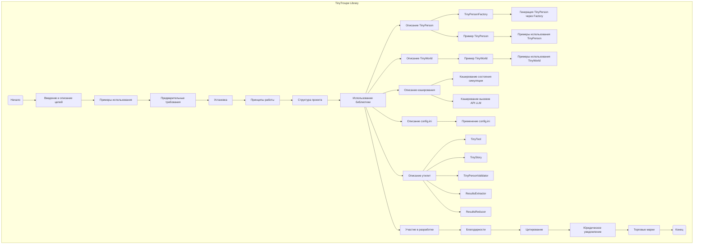

## ИНСТРУКЦИЯ:

Анализируй предоставленный код подробно и объясни его функциональность. Ответ должен включать три раздела:

1. **<алгоритм>**: Опиши рабочий процесс в виде пошаговой блок-схемы, включая примеры для каждого логического блока, и проиллюстрируй поток данных между функциями, классами или методами.
2. **<mermaid>**: Напиши код для диаграммы в формате `mermaid`, проанализируй и объясни все зависимости,
   которые импортируются при создании диаграммы.
   **ВАЖНО!** Убедитесь, что все имена переменных, используемые в диаграмме `mermaid`,
   имеют осмысленные и описательные имена. Имена переменных вроде `A`, `B`, `C`, и т.д., не допускаются!

   **Дополнительно**: Если в коде есть импорт `import header`, добавьте блок `mermaid` flowchart, объясняющий `header.py`:
   ```mermaid
   flowchart TD
       Start --> Header[<code>header.py</code><br> Determine Project Root]

       Header --> import[Import Global Settings: <br><code>from src import gs</code>]
   ```

3. **<объяснение>**: Предоставьте подробные объяснения:
   - **Импорты**: Их назначение и взаимосвязь с другими пакетами `src.`.
   - **Классы**: Их роль, атрибуты, методы и взаимодействие с другими компонентами проекта.
   - **Функции**: Их аргументы, возвращаемые значения, назначение и примеры.
   - **Переменные**: Их типы и использование.
   - Выделите потенциальные ошибки или области для улучшения.

Дополнительно, постройте цепочку взаимосвязей с другими частями проекта (если применимо).

Это обеспечивает всесторонний и структурированный анализ кода.
## Формат ответа: `.md` (markdown)
**КОНЕЦ ИНСТРУКЦИИ**

## <алгоритм>

Представленный текст является `README.md` файлом, описывающим библиотеку `TinyTroupe`. Алгоритмически, он представляет собой последовательность разделов, каждый из которых описывает определенный аспект библиотеки. Вот пошаговая блок-схема:

1. **Введение**:
   - Описание `TinyTroupe` как инструмента для симуляции персонажей с использованием LLM.
   - Определение целей проекта: понимание человеческого поведения, а не его поддержка напрямую.
   - Примеры применения: оценка рекламы, тестирование ПО, генерация данных, управление проектами, мозговой штурм.
   - Указание на раннюю стадию разработки и необходимость обратной связи.
   - Предупреждение о юридической ответственности за использование библиотеки.

   *Пример: "TinyTroupe - это экспериментальная библиотека Python, которая позволяет симулировать людей с определенными характерами, интересами и целями."*

2. **Содержание**:
   - Перечисление разделов документа для навигации.

3. **Примеры**:
   - Демонстрация работы библиотеки на примерах: интервью с клиентом, оценка рекламы, мозговой штурм.
   - Иллюстрации примеров в виде скриншотов.
   - Показ интерактивности экспериментов в Jupyter Notebook.

   *Пример: "Давайте начнем с простого сценария интервью с клиентом, где бизнес-консультант обращается к банкиру."*

4. **Предварительные требования**:
    - Описание необходимого ПО: Python 3.10+, Anaconda (или другая Python-дистрибуция).
    - Описание требований к API: Azure OpenAI или OpenAI GPT-4, необходимость установки переменных среды.
    - Описание необходимости использования `config.ini` файла для настройки параметров.
    - Акцент на важность использования фильтров контента.

   *Пример: "Для запуска библиотеки вам потребуется: Python 3.10 или выше... Access to Azure OpenAI Service or Open AI GPT-4 APIs."*

5. **Установка**:
   - Описание процесса установки библиотеки из репозитория (не из PyPI):
     - Создание виртуального окружения, клонирование репозитория, установка через `pip`.
   - Описание установки в режиме разработки.

   *Пример: "Клонируйте репозиторий... установите библиотеку из этого репозитория, а не из PyPI"*

6. **Принципы**:
   - Описание основных принципов работы `TinyTroupe`:
     - Программируемость, аналитичность, персона-ориентированность, мультиагентность, ориентированность на утилиты, ориентация на эксперименты.
   - Сравнение симуляторов с AI-ассистентами.

   *Пример: "TinyTroupe следует этим принципам: Программируемость, аналитичность, персона-ориентированность..."*

7. **Структура проекта**:
   - Описание организации папок проекта: `/tinytroupe` (библиотека), `/tests`, `/examples`, `/data`, `/docs`.
     *Пример: "/tinytroupe: содержит саму библиотеку Python, в частности /tinytroupe/prompts, которые содержат prompts, используемые для вызова LLM."*

8. **Использование библиотеки**:
    - Описание основных абстракций: `TinyPerson` (агенты) и `TinyWorld` (окружения).
    - Примеры работы с `TinyPerson`: создание через `create_lisa_the_data_scientist`, определение параметров, использование `TinyPersonFactory`.
    - Примеры работы с `TinyWorld`: создание окружения и запуск симуляции.
    - Описание вспомогательных утилит: `TinyPersonFactory`, `TinyTool`, `TinyStory`, `TinyPersonValidator`, `ResultsExtractor`, `ResultsReducer`.
    - Описание механизмов кэширования: кэширование состояния симуляции и кэширование вызовов API.
    - Объяснение настроек в `config.ini`.
        *Пример: "TinyPerson - это имитируемый человек с определенными чертами личности, интересами и целями."*

9. **Участие в разработке**:
   - Приглашение к участию в проекте.
   - Описание процесса принятия лицензионного соглашения (CLA).
   - Ссылка на Кодекс поведения Microsoft.
   - Описание того, что и как можно внести в проект.

   *Пример: "Этот проект приветствует вклады и предложения. Большинство вкладов требует, чтобы вы согласились с Соглашением о лицензии участника (CLA)..."*

10. **Благодарности**:
    - Упоминание команды разработчиков, консультантов и тех, кто внес вклад.

11. **Цитирование**:
    - Рекомендации по цитированию TinyTroupe, включая пример BibTex.

12. **Юридическое уведомление**:
    - Предупреждение об использовании библиотеки исключительно для исследовательских целей.
    - Ограничение ответственности за результаты работы библиотеки.
    - Запрещенные виды использования.

13. **Торговые марки**:
    - Упоминание о торговых марках Microsoft и сторонних организаций.
    - Условия использования торговых марок.

## <mermaid>



**Разбор `mermaid` диаграммы:**

-   `flowchart TD`: Определяет тип диаграммы как "flowchart" (блок-схема) с направлением сверху вниз.
-   `subgraph TinyTroupe Library`: Создает подграф, охватывающий весь процесс, и даёт ему название "TinyTroupe Library".
-   `Start(Начало)`: Начальная точка диаграммы.
-   `End(Конец)`: Конечная точка диаграммы.
-   Стрелки `-->`: Показывают последовательность шагов в описании библиотеки.
-   Квадратные блоки, например `Introduction[Введение и описание целей]`, представляют собой разделы документа и основные этапы.
-   Внутри подграфа `TinyTroupe Library` стрелками обозначен поток информации и последовательность разделов, описанных в `README.md`.
-   Вложенные блоки `TinyPersonDesc`, `TinyWorldDesc` и другие, являются более детальным описанием разделов.
-   Осмысленные имена переменных делают диаграмму понятной и отражают содержание каждого блока.
- Диаграмма демонстрирует поток чтения README.md, порядок разделов и их взаимосвязи.

## <объяснение>

**Объяснение структуры `README.md`:**

Данный `README.md` файл является введением и руководством по использованию библиотеки `TinyTroupe`. Он не содержит исполняемого кода, а представляет собой документацию, предназначенную для ознакомления пользователей с функциональностью и структурой проекта.

**Основные разделы и их назначение:**

*   **Введение**: Описывает общую цель библиотеки, её особенности и возможности. Подчеркивает, что `TinyTroupe` - это исследовательский инструмент, а не готовый продукт.

*   **Содержание**: Предоставляет оглавление для легкой навигации по документу.

*   **Примеры**: Показывает конкретные сценарии использования библиотеки в виде примеров кода и скриншотов. Это помогает понять практическое применение `TinyTroupe`.

*   **Предварительные требования**: Перечисляет необходимое программное обеспечение и API для работы библиотеки, а также настройки.
*   **Установка**: Описывает, как установить библиотеку из репозитория (не из PyPI), а также как настроить окружение. Это важно для пользователей, начинающих работу с библиотекой.

*   **Принципы**: Описывает основные принципы, которыми руководствуются разработчики `TinyTroupe`. Это помогает понять идеологию проекта и его отличия от других подобных инструментов.
*  **Структура проекта**: Описывает организацию файлов и папок в репозитории. Это полезно для тех, кто планирует вносить изменения в код.

*   **Использование библиотеки**: Подробно описывает основные абстракции (`TinyPerson` и `TinyWorld`), утилиты, механизмы кэширования и файл `config.ini`. Это ключевой раздел для понимания, как использовать `TinyTroupe` на практике.

*   **Участие в разработке**: Приглашает сообщество к участию в проекте, объясняет условия участия.
*   **Благодарности**: Отмечает вклад разработчиков, консультантов и других участников проекта.

*   **Цитирование**: Предоставляет информацию о том, как правильно цитировать `TinyTroupe` в научных работах.

*   **Юридическое уведомление**: Содержит важные юридические ограничения и отказ от ответственности при использовании библиотеки.

*   **Торговые марки**: Описывает правила использования торговых марок Microsoft и сторонних организаций.

**Взаимосвязь с другими частями проекта:**

Этот `README.md` файл является точкой входа для понимания всего проекта. Он ссылается на другие части проекта, такие как:

*   `/tinytroupe`:  сама библиотека с модулями и классами.
*   `/tests`: тесты для проверки функциональности библиотеки.
*   `/examples`: примеры использования, которые демонстрируют возможности библиотеки.
*   `/data`: данные, используемые в примерах.
*   `/docs`: дополнительная документация.

**Области для улучшения:**

*   **Более подробные примеры**: Добавление более сложных и разнообразных примеров использования библиотеки.
*   **Подробное описание утилит**: Более детальное описание каждой утилиты и её параметров.
*   **FAQ**: Добавление раздела "Часто задаваемые вопросы" (FAQ) для решения типичных проблем.

Этот `README.md` файл хорошо структурирован и содержит много полезной информации. Он является важной частью проекта, так как позволяет новым пользователям быстро понять, как использовать `TinyTroupe` и как внести свой вклад в его развитие.