## <алгоритм>

1.  **`compose_initial_LLM_messages_with_templates(system_template_name, user_template_name, rendering_configs)`**:
    *   Принимает имена файлов шаблонов (`system_template_name`, `user_template_name`) и словарь конфигураций (`rendering_configs`).
    *   Формирует полные пути к файлам шаблонов, используя `os.path.join()` и `os.path.dirname(__file__)`.
        *   Пример: `system_template_name` = "system_prompt.md", путь станет `<путь_к_файлу>/prompts/system_prompt.md`.
    *   Создает пустой список `messages`.
    *   Читает содержимое файла системного шаблона, применяет к нему `chevron.render()` с `rendering_configs` и добавляет в `messages` в виде словаря с ключами `role` = "system" и `content`.
        *   Пример: `rendering_configs` = `{"agent_name": "Agent1"}`, `system_prompt.md` = "Привет, {{agent_name}}!", результат `content` будет "Привет, Agent1!".
    *   Если `user_template_name` не `None`, читает содержимое файла пользовательского шаблона, применяет `chevron.render()` с `rendering_configs` и добавляет в `messages` как словарь с `role` = "user" и отрендеренным `content`.
    *   Возвращает список `messages`, готовый для передачи в LLM.

2.  **`extract_json(text)`**:
    *   Принимает строку `text`.
    *   Использует регулярные выражения (`re.sub`) для удаления текста до первой открывающей фигурной или квадратной скобки и после последней закрывающей фигурной или квадратной скобки.
        *   Пример: вход `text` = "some text { \"key\": \"value\" } more text", после первого удаления: "{ \"key\": \"value\" } more text", после второго: "{ \"key\": \"value\" }".
    *   Удаляет недопустимые escape-последовательности (заменяет `\\\'` на `\'`).
    *   Парсит оставшийся текст как JSON (`json.loads(text)`) и возвращает словарь.
    *   Если возникает исключение, возвращает пустой словарь.

3.  **`extract_code_block(text)`**:
    *   Аналогично `extract_json(text)`, но извлекает текст между тройными обратными кавычками (```), которые часто используются для оформления блоков кода в Markdown.
    *   Возвращает извлеченный блок кода или пустую строку при ошибке.

4.  **`repeat_on_error(retries, exceptions)`**:
    *   Декоратор для функций, выполняющий повторный вызов функции при возникновении определенных исключений.
    *   Принимает количество попыток `retries` и список исключений `exceptions`.
    *   Внутри декоратора, функция `wrapper` оборачивает исходную функцию `func`.
    *   В цикле `for` вызывается `func`, если выбрасывается исключение, которое есть в списке `exceptions`, то происходит повторный вызов `func` до тех пор, пока количество итераций не будет равно `retries`.
        *   Пример: если `retries`=3 и исключение возникает два раза, то функция будет вызвана 3 раза.
    *   Если число попыток истекло, исключение передается выше, иначе - возвращается результат работы `func`.

5.  **`check_valid_fields(obj, valid_fields)`**:
    *   Принимает словарь `obj` и список допустимых ключей `valid_fields`.
    *   Проверяет наличие каждого ключа в `obj` в списке `valid_fields`.
    *   Если ключ не найден в `valid_fields`, выбрасывает `ValueError`.

6.  **`sanitize_raw_string(value)`**:
    *   Принимает строку `value`.
    *   Кодирует строку в UTF-8 с игнорированием ошибок, затем декодирует обратно в UTF-8.
    *   Обрезает строку до максимальной длины Python (`sys.maxsize`) и возвращает.

7.  **`sanitize_dict(value)`**:
    *   Принимает словарь `value`.
    *   Преобразует словарь в JSON строку с помощью `json.dumps` (без escape-последовательностей ASCII).
    *   Вызывает `sanitize_raw_string` для очистки строки.
    *   Разбирает очищенную JSON строку обратно в словарь с помощью `json.loads`.
    *   Возвращает очищенный словарь.

8.  **`add_rai_template_variables_if_enabled(template_variables)`**:
    *   Импортирует модуль `config`.
    *   Считывает из конфигурационного файла `config.ini` значения `RAI_HARMFUL_CONTENT_PREVENTION` и `RAI_COPYRIGHT_INFRINGEMENT_PREVENTION`.
    *   Читает содержимое файлов `rai_harmful_content_prevention.md` и `rai_copyright_infringement_prevention.md`.
    *   Если соответствующие параметры в `config.ini` включены, то добавляет в словарь `template_variables` новые ключи `rai_harmful_content_prevention` и `rai_copyright_infringement_prevention` с содержимым файлов в качестве значений. Иначе значения становятся `None`.
    *   Возвращает измененный словарь `template_variables`.

9.  **`inject_html_css_style_prefix(html, style_prefix_attributes)`**:
    *   Принимает HTML-строку `html` и строку с CSS-атрибутами `style_prefix_attributes`.
    *   Заменяет все вхождения `style="` на `style="{style_prefix_attributes};`.
    *   Возвращает измененную HTML-строку.

10. **`break_text_at_length(text, max_length)`**:
    *   Принимает текст `text` (строку или словарь) и максимальную длину `max_length`.
    *   Если `text` - это словарь, преобразует его в JSON-строку.
    *   Если `max_length` равен `None` или длина `text` меньше или равна `max_length`, то возвращает `text` как есть.
    *   Иначе обрезает `text` до `max_length` и добавляет в конце `(...)`.
    *   Возвращает обрезанную строку.

11. **`pretty_datetime(dt)`**:
    *   Принимает объект `datetime`.
    *   Форматирует его в строку вида "YYYY-MM-DD HH:MM".

12. **`dedent(text)`**:
    *   Принимает строку `text`.
    *   Удаляет общие отступы и начальные пробелы с помощью `textwrap.dedent` и `strip` и возвращает результат.

13. **`read_config_file(use_cache, verbose)`**:
    *   Читает конфигурационный файл `config.ini` из директории модуля и из текущей рабочей директории (если есть).
    *   Использует кэш (`_config`) для хранения результатов.
    *   Ищет файл `config.ini` сначала в директории модуля, а затем в рабочей директории.
    *   Применяет значения из файла в рабочей директории, перезаписывая значения из файла в директории модуля.
    *   Возвращает объект `configparser.ConfigParser`.

14. **`pretty_print_config(config)`**:
    *   Принимает объект конфигурации.
    *   Печатает содержимое конфигурации в консоль в читаемом формате.

15. **`start_logger(config)`**:
    *   Настраивает логгер `tinytroupe` с уровнем логирования из конфигурационного файла.
    *   Создает обработчик вывода в консоль.
    *   Устанавливает форматтер для сообщений лога.

16. **`JsonSerializableRegistry`**:
    *   Класс-миксин, предоставляющий возможность сериализации и десериализации объектов в JSON.
    *   Содержит метод `to_json` для преобразования объекта в JSON-представление, включая сериализацию вложенных объектов.
    *   Содержит метод `from_json` для создания экземпляра класса из JSON-представления.
    *   Метод `__init_subclass__` регистрирует все подклассы и расширяет `serializable_attributes` и `custom_serialization_initializers` из родительских классов.
    *   Метод `_post_deserialization_init` выполняет постобработку после десериализации.

17. **`post_init(cls)`**:
    *   Декоратор для классов.
    *   Выполняет метод `_post_init` после стандартной инициализации объекта (если такой метод существует).

18. **`name_or_empty(named_entity)`**:
    *   Принимает экземпляр `AgentOrWorld`.
    *   Возвращает имя объекта (если оно существует) или пустую строку, если объект равен `None`.

19. **`custom_hash(obj)`**:
    *   Принимает объект `obj`.
    *   Преобразует объект в строку и генерирует SHA256-хеш.
    *   Возвращает HEX-представление хеша.

20. **`fresh_id()`**:
    *   Генерирует уникальный ID путем инкрементирования счетчика `_fresh_id_counter`.
    *   Возвращает сгенерированный ID.

```mermaid
flowchart TD
    subgraph "utils.py"
        Start[Start]
        Start --> ComposeMessages[compose_initial_LLM_messages_with_templates]
        ComposeMessages --> SystemTemplatePath[Create System Prompt Template Path]
        ComposeMessages --> UserTemplatePath[Create User Prompt Template Path]
        SystemTemplatePath --> ReadSystemTemplate[Read System Template]
        UserTemplatePath --> ReadUserTemplate[Read User Template]
        ReadSystemTemplate --> RenderSystemTemplate[Render System Template with Chevron]
        ReadUserTemplate --> RenderUserTemplate[Render User Template with Chevron]
        RenderSystemTemplate --> AddSystemMessage[Add System Message to messages]
        RenderUserTemplate --> AddUserMessage[Add User Message to messages]
        AddSystemMessage --> ReturnMessages[Return List of Messages]
        AddUserMessage --> ReturnMessages
        Start --> ExtractJSON[extract_json]
        ExtractJSON --> RemoveBeforeBrace[Remove Text Before First Brace]
        RemoveBeforeBrace --> RemoveAfterBrace[Remove Text After Last Brace]
        RemoveAfterBrace --> RemoveInvalidEscape[Remove Invalid Escape Sequences]
        RemoveInvalidEscape --> ParseJSON[Parse JSON]
        ParseJSON --> ReturnDict[Return Parsed Dictionary]
        ParseJSON --> ReturnEmptyDict[Return Empty Dict on Error]
        ReturnEmptyDict --> ReturnDict
        Start --> ExtractCodeBlock[extract_code_block]
        ExtractCodeBlock --> RemoveBeforeCodeBlock[Remove Text Before First Code Block]
        RemoveBeforeCodeBlock --> RemoveAfterCodeBlock[Remove Text After Last Code Block]
        RemoveAfterCodeBlock --> ReturnCodeBlock[Return Code Block]
        ReturnCodeBlock --> ReturnCodeBlock[Return Code Block]
        ReturnCodeBlock --> ReturnEmptyString[Return Empty String on Error]
         ReturnEmptyString --> ReturnCodeBlock
        Start --> RepeatOnError[repeat_on_error]
        RepeatOnError --> DecoratorFunc[Define Decorator Function]
        DecoratorFunc --> WrapperFunc[Define Wrapper Function]
        WrapperFunc --> TryCallFunc[Try to call the original function]
        TryCallFunc --> CheckExceptions[Check if an exception is in the exception list]
        CheckExceptions -- Yes --> RetryCall[Retry the original function if retries are available]
        RetryCall -->  TryCallFunc
        CheckExceptions -- No -->ReturnFunctionResult[Return result of function]
        TryCallFunc -- No Exception-->ReturnFunctionResult
        CheckExceptions -- No More Retries-->RaiseException[Raise the exception]
        ReturnFunctionResult --> End[End]
        RaiseException --> End

        Start --> CheckValidFields[check_valid_fields]
        CheckValidFields --> ValidateKeys[Check if keys in dict are valid]
        ValidateKeys -- Invalid Key--> RaiseValueError[Raise ValueError for invalid key]
        ValidateKeys -- Valid Key--> End
         Start --> SanitizeRawString[sanitize_raw_string]
        SanitizeRawString --> EncodeUTF8[Encode string to UTF-8 with error ignore]
        EncodeUTF8 --> DecodeUTF8[Decode string from UTF-8]
        DecodeUTF8 --> TruncateString[Truncate to max string length]
        TruncateString --> ReturnSanitizedString[Return Sanitized String]
        Start --> SanitizeDict[sanitize_dict]
        SanitizeDict --> SerializeDict[Serialize Dictionary to JSON]
        SerializeDict --> SanitizeString[Sanitize the string representation of dict]
        SanitizeString --> DeserializeDict[Deserialize JSON string back to dict]
        DeserializeDict --> ReturnSanitizedDict[Return Sanitized Dictionary]

        Start --> AddRAIVariables[add_rai_template_variables_if_enabled]
        AddRAIVariables --> ImportConfig[Import the configuration]
        ImportConfig --> ReadRAIConfig[Read RAI disclaimers config]
        ReadRAIConfig --> ReadHarmfulContentFile[Read Harmful Content File]
        ReadRAIConfig --> ReadCopyrightFile[Read Copyright File]
        ReadHarmfulContentFile --> AddHarmfulContentVariable[Add Harmful Content Variables to template_variables]
        ReadCopyrightFile --> AddCopyrightVariable[Add Copyright Variables to template_variables]
         AddHarmfulContentVariable --> ReturnTemplateVariables[Return updated template variables]
         AddCopyrightVariable --> ReturnTemplateVariables

        Start --> InjectHTMLStyle[inject_html_css_style_prefix]
        InjectHTMLStyle --> ReplaceStyleAttributes[Replace style attributes]
        ReplaceStyleAttributes --> ReturnModifiedHTML[Return Modified HTML]
        Start --> BreakTextAtLength[break_text_at_length]
        BreakTextAtLength --> ConvertDictToJson[Convert dict to JSON string]
        ConvertDictToJson --> CheckMaxLength[Check if max length is None]
         CheckMaxLength -- Yes--> ReturnText[Return text as is]
         CheckMaxLength -- No--> TruncateAndAddEllipsis[Truncate text and add ellipsis]
         TruncateAndAddEllipsis --> ReturnText
        Start --> PrettyDateTime[pretty_datetime]
        PrettyDateTime --> FormatDateTime[Format datetime to string]
        FormatDateTime --> ReturnFormattedDateTime[Return Formatted DateTime]
        Start --> DedentText[dedent]
        DedentText --> RemoveIdentation[Remove Identation and Whitespace]
        RemoveIdentation --> ReturnDedentText[Return Dedented Text]

         Start --> ReadConfigFile[read_config_file]
        ReadConfigFile --> CheckCache[Check if configuration is cached]
        CheckCache -- Yes--> ReturnCachedConfig[Return Cached Configuration]
        CheckCache -- No --> LoadDefaultConfig[Load Default Configuration]
        LoadDefaultConfig --> CheckDefaultConfigExists[Check if default config file exists]
        CheckDefaultConfigExists -- No--> RaiseValueErrorConfig[Raise ValueError if no default config]
        CheckDefaultConfigExists -- Yes --> ReadDefaultConfig[Read Default Config file]
        ReadDefaultConfig --> CheckCustomConfigExists[Check if custom config file exists]
         CheckCustomConfigExists -- Yes --> ReadCustomConfig[Read Custom Config file]
        ReadCustomConfig --> ReturnConfig[Return Configuration]
        CheckCustomConfigExists -- No --> ReturnConfig
        ReadDefaultConfig--> ReturnConfig
         ReturnCachedConfig --> ReturnConfig
        RaiseValueErrorConfig --> End
        Start --> PrettyPrintConfig[pretty_print_config]
        PrettyPrintConfig --> PrintConfig[Print config to console]
        PrintConfig --> End
         Start --> StartLogger[start_logger]
        StartLogger --> InitLogger[Initialize logger]
        InitLogger --> SetLogLevel[Set the logger level]
        SetLogLevel --> CreateStreamHandler[Create Stream Handler]
        CreateStreamHandler --> SetHandlerLevel[Set Stream Handler level]
         SetHandlerLevel --> CreateFormatter[Create Formatter]
         CreateFormatter --> AddFormatterToHandler[Add formatter to the Stream Handler]
        AddFormatterToHandler --> AddHandlerToLogger[Add Handler to Logger]
         AddHandlerToLogger --> End
        subgraph JsonSerializableRegistry
        Start -->  ToJson[JsonSerializableRegistry.to_json]
        ToJson --> GetSerializableAttributes[Gather all serializable attributes]
         GetSerializableAttributes --> IterateAttributes[Iterate through serializable attributes]
            IterateAttributes --> CheckValueType[Check type of the attribute value]
        CheckValueType -- Is JsonSerializableRegistry --> RecursivelySerializeObject[Recursively serialize the object]
         RecursivelySerializeObject --> AddSerializedAttribute[Add serialized attribute to the result]
        CheckValueType -- Is List --> SerializeListItems[Serialize elements of the list]
        SerializeListItems --> AddSerializedAttribute
         CheckValueType -- Is Dict --> SerializeDictItems[Serialize elements of the dict]
         SerializeDictItems --> AddSerializedAttribute
        CheckValueType -- Else -->  AddSerializedAttribute[Add attribute to the result]
         AddSerializedAttribute-->CheckIfFilePath[Check if the path is provided]
        CheckIfFilePath -- Yes --> WriteJsonFile[Write result to file]
        CheckIfFilePath -- No --> ReturnSerializedObject[Return Serialized Object]
        WriteJsonFile --> ReturnSerializedObject

        Start --> FromJson[JsonSerializableRegistry.from_json]
        FromJson --> LoadJson[Load json from dict or file]
        LoadJson --> GetSubclassName[Get sublass name]
        GetSubclassName --> CreateInstanceOfClass[Create an instance of the target class]
         CreateInstanceOfClass --> GetAttributesFromClass[Gather all serializable and initializer attributes]
        GetAttributesFromClass --> IterateJsonData[Iterate through keys of the json data]
        IterateJsonData --> CheckKey[Check if Key is in JSON and not Suppressed]
        CheckKey -- Yes --> GetValue[Get value for the key]
        GetValue --> CheckForInitializer[Check if there is custom initializer for the key]
         CheckForInitializer -- Yes --> ApplyCustomInitializer[Apply the custom initializer]
        ApplyCustomInitializer --> AddDeserializedAttribute[Add deserialized attributes to the object]
        CheckForInitializer -- No --> CheckValueTypeDeserialize[Check type of value for deserialization]
         CheckValueTypeDeserialize -- Is json_serializable_class_name --> RecursivelyDeserializeObject[Recursively deserialize the object]
         RecursivelyDeserializeObject --> AddDeserializedAttribute
         CheckValueTypeDeserialize -- Is List --> DeserializeListItems[Deserialize elements of the list]
           DeserializeListItems --> AddDeserializedAttribute
         CheckValueTypeDeserialize -- Else --> AddDeserializedAttribute
        AddDeserializedAttribute--> CheckPostDeserialization[Check if there is post deserialization available]
          CheckPostDeserialization -- Yes --> PerformPostDeserialization[Perform Post-Deserialization Initialization]
         PerformPostDeserialization --> ReturnInstance[Return Instance]
          CheckPostDeserialization -- No -->ReturnInstance
        CheckKey -- No --> ReturnInstance
       ReturnInstance --> End
       end
       Start --> PostInitDecorator[post_init decorator]
        PostInitDecorator --> ModifyClassInit[Modify class __init__ method]
         ModifyClassInit --> CallOriginalInit[Call original __init__]
          CallOriginalInit --> CheckPostInitMethod[Check for the _post_init method]
        CheckPostInitMethod -- Yes--> CallPostInitMethod[Call _post_init method]
        CallPostInitMethod --> End
         CheckPostInitMethod -- No--> End
    
        Start --> NameOrEmpty[name_or_empty]
         NameOrEmpty --> CheckNamedEntity[Check if the named entity is none]
         CheckNamedEntity -- Yes--> ReturnEmptyStringName[Return Empty String]
          CheckNamedEntity -- No--> ReturnNamedEntityName[Return the name of the entity]
          ReturnEmptyStringName --> End
         ReturnNamedEntityName --> End

         Start --> CustomHash[custom_hash]
        CustomHash --> ConvertToString[Convert object to string]
        ConvertToString --> GenerateSHA256[Generate SHA256 hash of string]
        GenerateSHA256 --> ReturnHexString[Return Hex representation of hash]
         ReturnHexString --> End

          Start --> FreshID[fresh_id]
        FreshID --> IncrementCounter[Increment the counter]
         IncrementCounter --> ReturnFreshID[Return the Fresh ID]
    end

     
```

## <mermaid>



## <объяснение>

### Импорты:

*   `re`:  Используется для работы с регулярными выражениями (например, в функциях `extract_json` и `extract_code_block`).
*   `json`: Используется для сериализации и десериализации JSON (например, в `extract_json`, `sanitize_dict`, `JsonSerializableRegistry`).
*   `os`: Предоставляет функции для взаимодействия с операционной системой, например, для работы с путями к файлам (используется для доступа к файлам шаблонов в `compose_initial_LLM_messages_with_templates`).
*   `sys`: Предоставляет доступ к некоторым переменным и функциям, которые взаимодействуют с интерпретатором Python. В данном случае, используется `sys.maxsize` для получения максимальной длины строки в `sanitize_raw_string`.
*   `hashlib`: Используется для генерации хешей (например, `custom_hash`).
*   `textwrap`: Используется для работы с текстом, например, для удаления отступов в функции `dedent`.
*   `logging`: Используется для логирования сообщений в процессе работы программы (например, в `repeat_on_error` и `start_logger`).
*   `chevron`: Используется для рендеринга шаблонов (например, в `compose_initial_LLM_messages_with_templates`).
*   `copy`: Используется для создания глубоких копий объектов (например, в `JsonSerializableRegistry`).
*   `typing.Collection`, `typing.Any`, `typing.TypeVar`, `typing.Union`: Используются для статической типизации.
*   `datetime`: Используется для работы с датой и временем (например, в `pretty_datetime`).
*   `pathlib.Path`:  Предоставляет удобный способ работы с путями к файлам (используется в `read_config_file`).
*   `configparser`:  Используется для парсинга конфигурационных файлов (например, в `read_config_file` и `start_logger`).
*   `AgentOrWorld`: Объединение типов `TinyPerson` и `TinyWorld`, используется для типизации аргумента в `name_or_empty`.

### Функции:

*   **`compose_initial_LLM_messages_with_templates(system_template_name: str, user_template_name: str = None, rendering_configs: dict = {}) -> list`**:
    *   **Аргументы**:
        *   `system_template_name`: Имя файла шаблона системного сообщения (строка).
        *   `user_template_name`: Имя файла шаблона пользовательского сообщения (строка, опционально, по умолчанию `None`).
        *   `rendering_configs`: Словарь с переменными для рендеринга шаблона (словарь, опционально, по умолчанию пустой).
    *   **Возвращаемое значение**: Список словарей, представляющих сообщения для LLM, где каждый словарь содержит ключи `role` ("system" или "user") и `content`.
    *   **Назначение**: Составляет сообщения для языковой модели (LLM) на основе шаблонов.
    *   **Пример**:
        ```python
        messages = compose_initial_LLM_messages_with_templates(
            "system_prompt.md",
            "user_prompt.md",
            {"agent_name": "Agent1"}
        )
        # Результат:
        # [
        #   {"role": "system", "content": "Сообщение из system_prompt.md с Agent1"},
        #   {"role": "user", "content": "Сообщение из user_prompt.md с Agent1"}
        # ]
        ```
*   **`extract_json(text: str) -> dict`**:
    *   **Аргументы**: `text`: Строка для извлечения JSON.
    *   **Возвращаемое значение**: Словарь, представляющий извлеченный JSON, или пустой словарь, если JSON не найден.
    *   **Назначение**: Извлекает JSON из строки.
    *   **Пример**:
        ```python
        text = "some text { \"key\": \"value\" } more text"
        json_data = extract_json(text)
        # Результат: {'key': 'value'}
        ```
*   **`extract_code_block(text: str) -> str`**:
    *   **Аргументы**: `text`: Строка для извлечения блока кода.
    *   **Возвращаемое значение**: Извлеченный блок кода или пустая строка, если блок кода не найден.
    *   **Назначение**: Извлекает блок кода из строки, обрамленный ```.
    *   **Пример**:
        ```python
        text = "some text ```python\nprint('Hello')\n``` more text"
        code = extract_code_block(text)
        # Результат: "```python\nprint('Hello')\n```"
        ```
*   **`repeat_on_error(retries: int, exceptions: list)`**:
    *   **Аргументы**:
        *   `retries`: Количество повторных попыток вызова функции (целое число).
        *   `exceptions`: Список исключений, при возникновении которых функция должна быть вызвана повторно (список).
    *   **Возвращаемое значение**: Декоратор функции.
    *   **Назначение**: Декоратор для повторного вызова функции в случае ошибок.
    *   **Пример**:
        ```python
        @repeat_on_error(retries=3, exceptions=[ValueError, TypeError])
        def my_function():
            #...
            pass
        ```
*   **`check_valid_fields(obj: dict, valid_fields: list) -> None`**:
    *   **Аргументы**:
        *   `obj`: Словарь, ключи которого нужно проверить (словарь).
        *   `valid_fields`: Список допустимых ключей (список).
    *   **Возвращаемое значение**: `None`.
    *   **Назначение**: Проверяет, что все ключи словаря есть в списке допустимых ключей.
    *   **Пример**:
        ```python
        my_dict = {"key1": "value1", "key2": "value2"}
        valid_keys = ["key1", "key2"]
        check_valid_fields(my_dict, valid_keys) # Не вызовет исключения

        invalid_dict = {"key1": "value1", "key3": "value3"}
        check_valid_fields(invalid_dict, valid_keys) # Вызовет ValueError
        ```
*   **`sanitize_raw_string(value: str) -> str`**:
    *   **Аргументы**: `value`: Строка для очистки (строка).
    *   **Возвращаемое значение**: Очищенная строка (строка).
    *   **Назначение**: Очищает строку от недопустимых символов.
    *   **Пример**:
        ```python
        text = "some invalid chars \ud83d\ude00"
        sanitized_text = sanitize_raw_string(text)
        # Результат: "some invalid chars "
        ```
*   **`sanitize_dict(value: dict) -> dict`**:
    *   **Аргументы**: `value`: Словарь для очистки (словарь).
    *   **Возвращаемое значение**: Очищенный словарь (словарь).
    *   **Назначение**: Очищает словарь от недопустимых символов.
    *   **Пример**:
        ```python
        my_dict = {"key": "value\ud83d\ude00"}
        sanitized_dict = sanitize_dict(my_dict)
        # Результат: {"key": "value"}
        ```
*   **`add_rai_template_variables_if_enabled(template_variables: dict) -> dict`**:
    *   **Аргументы**: `template_variables`: Словарь для добавления RAI-переменных (словарь).
    *   **Возвращаемое значение**: Обновленный словарь с RAI-переменными.
    *   **Назначение**: Добавляет RAI-переменные в словарь, если они включены в конфигурационном файле.
    *   **Пример**:
        ```python
        template_vars = {"other_var": "value"}
        updated_vars = add_rai_template_variables_if_enabled(template_vars)
        # Результат: template_vars с добавленными или None rai_harmful_content_prevention и rai_copyright_infringement_prevention
        ```
*   **`inject_html_css_style_prefix(html: str, style_prefix_attributes: str) -> str`**:
    *   **Аргументы**:
        *   `html`: HTML-строка (строка).
        *   `style_prefix_attributes`: Строка с CSS-атрибутами (строка).
    *   **Возвращаемое значение**: Модифицированная HTML-строка (строка).
    *   **Назначение**: Добавляет CSS-атрибуты ко всем атрибутам `style` в HTML.
    *   **Пример**:
        ```python
        html = '<div style="color: red;">Hello</div>'
        prefixed_html = inject_html_css_style_prefix(html, 'font-size: 20px;')
        # Результат: '<div style="font-size: 20px;;color: red;">Hello</div>'
        ```
*   **`break_text_at_length(text: Union[str, dict], max_length: int = None) -> str`**:
    *   **Аргументы**:
        *   `text`: Строка или словарь (строка или словарь).
        *   `max_length`: Максимальная длина текста (целое число, опционально).
    *   **Возвращаемое значение**: Сокращенная строка (строка).
    *   **Назначение**: Сокращает текст до заданной длины.
    *   **Пример**:
        ```python
        text = "This is a very long string"
        truncated_text = break_text_at_length(text, 10)
        # Результат: "This is a (...)"
        ```
*   **`pretty_datetime(dt: datetime) -> str`**:
    *   **Аргументы**: `dt`: Объект datetime (объект datetime).
    *   **Возвращаемое значение**: Строка, представляющая дату и время (строка).
    *   **Назначение**: Форматирует дату и время.
    *   **Пример**:
        ```python
        dt = datetime.datetime(2023, 10, 26, 12, 30)
        formatted_dt = pretty_datetime(dt)
        # Результат: "2023-10-26 12:30"
        ```
*   **`dedent(text: str) -> str`**:
    *   **Аргументы**: `text`: Строка (строка).
    *   **Возвращаемое значение**: Строка без отступов (строка).
    *   **Назначение**: Удаляет отступы из текста.
    *   **Пример**:
        ```python
        text = "  \n    This is a text \n  with some indents"
        dedented_text = dedent(text)
        # Результат: "This is a text\nwith some indents"
        ```
*    **`read_config_file(use_cache: bool = True, verbose: bool = True) -> configparser.ConfigParser`**:
    *   **Аргументы**:
        *   `use_cache`:  Флаг, указывающий, использовать ли кэш (логическое значение, по умолчанию `True`).
        *    `verbose`: Флаг, указывающий, выводить ли отладочные сообщения (логическое значение, по умолчанию `True`).
    *   **Возвращаемое значение**: объект `configparser.ConfigParser`, представляющий загруженную конфигурацию.
    *    **Назначение**:  Читает конфигурационный файл `config.ini`. Загружает сначала значения по умолчанию из файла в директории модуля, а затем переопределяет их значениями из файла в текущей рабочей директории.
*  **`pretty_print_config(config)`**:
    *   **Аргументы**: `config`: объект `configparser.ConfigParser`, представляющий конфигурацию.
    *   **Возвращаемое значение**: `None`
    *   **Назначение**: Выводит на печать текущие значения конфигурации в читаемом формате
*   **`start_logger(config: configparser.ConfigParser)`**:
    *    **Аргументы**: `config`: объект `configparser.ConfigParser`, представляющий конфигурацию.
    *   **Возвращаемое значение**: `None`
    *   **Назначение**: Настраивает логгер `tinytroupe` и устанавливает уровень логирования из конфигурационного файла.
*   **`JsonSerializableRegistry`**:
    *   **Назначение**: Класс-миксин, предоставляющий механизмы сериализации и десериализации JSON.
    *   **Атрибуты**:
        *   `class_mapping`: Словарь, где ключом является имя класса, а значением – сам класс.
    *    **Методы**:
        *    `to_json(self, include: list = None, suppress: list = None, file_path: str = None) -> dict`: Возвращает JSON-представление объекта.
        *   `from_json(cls, json_dict_or_path, suppress: list = None, post_init_params: dict = None)`: Создает объект из JSON-представления.
        *   `__init_subclass__(cls, **kwargs)`: Регистрирует подклассы и расширяет `serializable_attributes` и `custom_serialization_initializers` из родительских классов.
        *    `_post_deserialization_init(self, **kwargs)`: Метод для постобработки после десериализации.
*   **`post_init(cls)`**:
    *   **Аргументы**: `cls`: Класс, для которого применяется декоратор (класс).
    *   **Возвращаемое значение**: Модифицированный класс (класс).
    *   **Назначение**: Декоратор для принудительного вызова метода `_post_init` после инициализации класса.
*    **`name_or_empty(named_entity: AgentOrWorld)`**:
    *   **Аргументы**: `named_entity`: Объект `AgentOrWorld`
    *    **Возвращаемое значение**: Имя объекта или пустая строка (строка)
    *   **Назначение**: Возвращает имя агента или мира, или пустую строку, если объекта нет.
*   **`custom