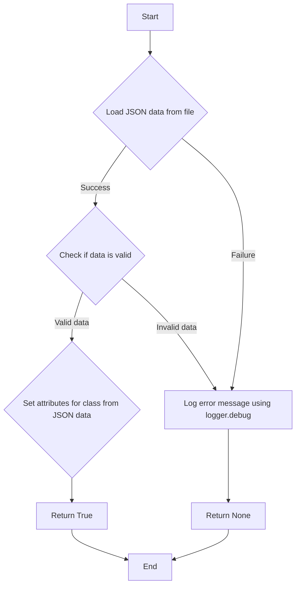

### **Анализ кода `facebook_fields.py`**

#### **1. <алгоритм>**:

1.  **Инициализация класса `FacebookFields`**:
    *   При создании экземпляра класса `FacebookFields` вызывается метод `self._payload()`.

2.  **Метод `_payload`**:
    *   **Загрузка данных из JSON**:
        *   Формируется путь к файлу `facebook_feilds.json` с использованием `gs.path.src`.
        *   JSON-данные загружаются из файла с использованием функции `j_loads`.
        *   Пример:

        ```python
        data = j_loads(Path(gs.path.src, 'advertisement', 'facebok', 'facebook_feilds.json'))
        ```

    *   **Обработка ошибок загрузки**:
        *   Если `data` равно `None` (ошибка загрузки), в лог записывается сообщение об ошибке с использованием `logger.debug`.
        *   Функция завершается, возвращая `None`.
        *   Пример:

        ```python
        if not data:
            logger.debug(f"Ошибка загрузки полей из файла {gs.path.src}/advertisement/facebok/facebook_feilds.json")
            return
        ```

    *   **Установка атрибутов класса**:
        *   Перебираются пары ключ-значение в словаре `data`.
        *   Для каждой пары устанавливается атрибут класса с именем `name` и значением `value` с использованием `setattr`.
        *   Пример:

        ```python
        for name, value in data.items():
            setattr(self, f'{name}', value)
        ```

    *   **Завершение**:
        *   Функция возвращает `True` после успешной установки атрибутов.
        *   Пример:

        ```python
        return True
        ```

#### **2. <mermaid>**:



**Объяснение зависимостей в `mermaid`**:

*   `pathlib.Path`: Используется для создания путей к файлам.
*   `src.gs`: Предполагается, что это модуль глобальных настроек, который содержит информацию о путях в проекте.
*   `src.utils.jjson.j_loads`: Функция для загрузки JSON-данных из файла.
*   `src.logger.logger.logger`: Модуль для логирования событий и ошибок.

#### **3. <объяснение>**:

*   **Расположение файла**: `hypotez/src/endpoints/advertisement/facebook/facebook_fields.py` - указывает на то, что файл содержит логику, связанную с полями, используемыми в Facebook-рекламе.
*   **Импорты**:
    *   `from pathlib import Path`: Используется для работы с путями к файлам и директориям.
    *   `from src import gs`: Импортирует глобальные настройки проекта, предположительно содержащие пути к различным директориям.
    *   `from src.utils.jjson import j_loads, j_loads_ns`: Импортирует функции `j_loads` и `j_loads_ns` для загрузки JSON-данных.
    *   `from src.logger.logger import logger`: Импортирует модуль `logger` для логирования событий и ошибок.
*   **Класс `FacebookFields`**:
    *   Роль: Представляет поля, используемые в рекламных объявлениях и событиях Facebook.
    *   Атрибуты: Атрибуты класса устанавливаются динамически из JSON-файла в методе `_payload`.
    *   Методы:
        *   `__init__(self)`: Конструктор класса, который вызывает метод `self._payload()`.
        *   `_payload(self)`: Загружает JSON-данные из файла и устанавливает атрибуты класса на основе этих данных.
*   **Функции**:
    *   `j_loads(file_path: str | Path) -> Any`: Загружает JSON-данные из файла, расположенного по указанному пути.
*   **Переменные**:
    *   `data`: Содержит загруженные JSON-данные из файла.
    *   `name`: Ключ из словаря JSON-данных.
    *   `value`: Значение, соответствующее ключу `name` из словаря JSON-данных.
*   **Потенциальные ошибки и области для улучшения**:
    *   Обработка исключений при загрузке JSON-данных.
    *   Проверка структуры JSON-данных на соответствие ожидаемой.
    *   Добавление документации к методам и классам.

**Взаимосвязи с другими частями проекта**:

*   Класс `FacebookFields` использует глобальные настройки (`gs`) для определения пути к JSON-файлу, что указывает на зависимость от конфигурации проекта.
*   Использование модуля `logger` позволяет записывать сообщения об ошибках и отладочную информацию, что полезно для мониторинга и отладки приложения.