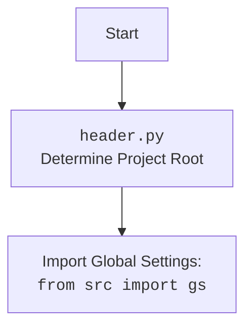

## Анализ кода `hypotez/src/endpoints/advertisement/facebook/start_posting.py`

### 1. <алгоритм>

#### Блок-схема рабочего процесса

1.  **Инициализация**:
    *   Импортируются необходимые модули и классы, включая `header`, `time`, `copy`, `Driver`, `Chrome`, `FacebookPromoter`, `logger`.
    *   Инициализируется драйвер Chrome через класс `Driver`.
    *   Устанавливается URL для доступа к Facebook.
    *   Определяются списки файлов (`filenames`) и исключенных файлов (`excluded_filenames`), а также список кампаний (`campaigns`).
    *   Создается экземпляр `FacebookPromoter` с указанием драйвера, путей к файлам групп и флага `no_video`.

    ```python
    from math import log
    import header
    import time
    import copy
    from src.webdriver.driver import Driver, Chrome
    from src.endpoints.advertisement.facebook import FacebookPromoter
    from src.logger.logger import logger

    d = Driver(Chrome)
    d.get_url(r"https://facebook.com")

    filenames:list[str] = [...]
    excluded_filenames:list[str] = [...]
    campaigns:list = [...]

    promoter:FacebookPromoter = FacebookPromoter(d, group_file_paths=filenames, no_video = True)
    ```

2.  **Запуск цикла**:
    *   Запускается бесконечный цикл `while True`, который выполняет следующие действия:
        *   Запускает кампании продвижения через метод `run_campaigns` класса `FacebookPromoter`.
        *   Выводит текущее локальное время.
        *   Приостанавливает выполнение программы на 180 секунд.

    ```python
    try:
        while True:
            promoter.run_campaigns(campaigns = copy.copy(campaigns), group_file_paths = filenames)
            print(f"Going sleep {time.localtime}")
            time.sleep(180)
            ...
    ```

3.  **Обработка прерывания**:
    *   При возникновении исключения `KeyboardInterrupt` (например, при нажатии Ctrl+C) цикл прерывается и в лог записывается сообщение "Campaign promotion interrupted."

    ```python
    except KeyboardInterrupt:
        logger.info("Campaign promotion interrupted.")
    ```

### 2. <mermaid>

```mermaid
flowchart TD
    Start --> Init[Инициализация драйвера и промоутера Facebook]
    Init --> LoopStart[Запуск бесконечного цикла]
    LoopStart --> RunCampaigns[Запуск кампаний продвижения: <br/>`promoter.run_campaigns()`]
    RunCampaigns --> PrintTime[Вывод текущего времени]
    PrintTime --> Sleep[Пауза на 180 секунд: <br/>`time.sleep(180)`]
    Sleep --> LoopStart
    LoopStart --> InterruptCheck{Прерывание?}
    InterruptCheck -- Да --> Interrupted[Обработка прерывания: <br/>`KeyboardInterrupt`]
    InterruptCheck -- Нет --> RunCampaigns
    Interrupted --> End[Завершение]
```

**Объяснение зависимостей:**

*   `math`: Используется для математических операций, хотя в данном коде не видно явного использования `math.log`. Возможно, используется внутри `FacebookPromoter`.
*   `header`: Импортируется для определения корневого каталога проекта и загрузки глобальных настроек.
*   `time`: Используется для приостановки выполнения программы на заданное количество секунд (`time.sleep`).
*   `copy`: Используется для создания копии списка кампаний (`copy.copy(campaigns)`) перед передачей в метод `run_campaigns`, чтобы избежать изменения исходного списка.
*   `src.webdriver.driver.Driver`, `src.webdriver.driver.Chrome`: Используются для управления браузером Chrome через WebDriver.
*   `src.endpoints.advertisement.facebook.FacebookPromoter`: Класс, отвечающий за продвижение рекламных кампаний в Facebook.
*   `src.logger.logger.logger`: Используется для логирования информации о процессе выполнения программы, включая сообщения об ошибках и прерываниях.



### 3. <объяснение>

#### Импорты:

*   `math`: Этот модуль используется для выполнения математических операций. В данном коде конкретно используется функция `log`.
*   `header`: Этот модуль, вероятно, содержит функции для определения корневого каталога проекта и загрузки глобальных настроек. Он может быть связан с инициализацией путей или конфигураций, необходимых для работы скрипта.
*   `time`: Этот модуль используется для работы со временем, в частности, для приостановки выполнения скрипта на определенное количество секунд с помощью функции `time.sleep()`.
*   `copy`: Этот модуль используется для создания копий объектов. В данном случае используется `copy.copy()` для создания поверхностной копии списка `campaigns`, чтобы избежать изменения исходного списка при его передаче в функцию `promoter.run_campaigns()`.
*   `src.webdriver.driver.Driver`, `src.webdriver.driver.Chrome`: Эти классы используются для управления веб-браузером Chrome через WebDriver. `Driver` - это, вероятно, базовый класс для управления драйвером браузера, а `Chrome` - это его конкретная реализация для Chrome.
*   `src.endpoints.advertisement.facebook.FacebookPromoter`: Этот класс отвечает за продвижение рекламных кампаний в Facebook. Он содержит методы для взаимодействия с Facebook, такие как публикация объявлений в группах.
*   `src.logger.logger.logger`: Этот модуль используется для логирования событий, происходящих в скрипте. Он позволяет записывать сообщения разного уровня важности (например, INFO, ERROR) в лог-файл или другое место назначения.

#### Переменные:

*   `d`: Экземпляр класса `Driver`, используемый для управления браузером Chrome.
*   `filenames`: Список строк, содержащих имена файлов с данными о группах Facebook.
*   `excluded_filenames`: Список строк, содержащих имена файлов, которые следует исключить из обработки.
*   `campaigns`: Список строк, содержащих названия рекламных кампаний.
*   `promoter`: Экземпляр класса `FacebookPromoter`, используемый для запуска рекламных кампаний.

#### Классы:

*   `Driver`: Класс для управления веб-браузером.
    *   Атрибуты: Вероятно, содержит атрибуты для хранения экземпляра драйвера браузера и других настроек.
    *   Методы: `get_url()` - открывает указанный URL в браузере.
*   `Chrome`: Класс, представляющий драйвер для браузера Chrome.
    *   Наследуется от `Driver`.
    *   Используется для создания экземпляра драйвера Chrome.
*   `FacebookPromoter`: Класс, отвечающий за продвижение рекламных кампаний в Facebook.
    *   Атрибуты:
        *   `d`: Экземпляр класса `Driver` для управления браузером.
        *   `group_file_paths`: Список путей к файлам с данными о группах Facebook.
        *   `no_video`: Флаг, указывающий, нужно ли исключать видео из рекламных кампаний.
    *   Методы:
        *   `run_campaigns()`: Запускает рекламные кампании.

#### Функции:

*   `time.sleep(seconds)`: Приостанавливает выполнение скрипта на указанное количество секунд.
*   `copy.copy(object)`: Создает поверхностную копию объекта.

#### Потенциальные ошибки и области для улучшения:

*   Обработка исключений: В коде есть только обработка `KeyboardInterrupt`. Следует добавить обработку других возможных исключений, таких как ошибки при подключении к Facebook, ошибки при чтении файлов и т.д.
*   Логирование: Следует добавить больше логирования, чтобы отслеживать ход выполнения программы и выявлять возможные проблемы. Например, можно логировать начало и окончание каждой кампании, ошибки при публикации объявлений и т.д.
*   Конфигурация: Параметры, такие как URL Facebook, время ожидания и пути к файлам, можно вынести в конфигурационный файл, чтобы их можно было легко изменять без необходимости редактирования кода.
*   Обработка `...`: В коде есть `...`, что указывает на пропущенный код. Следует добавить этот код или удалить `...`.