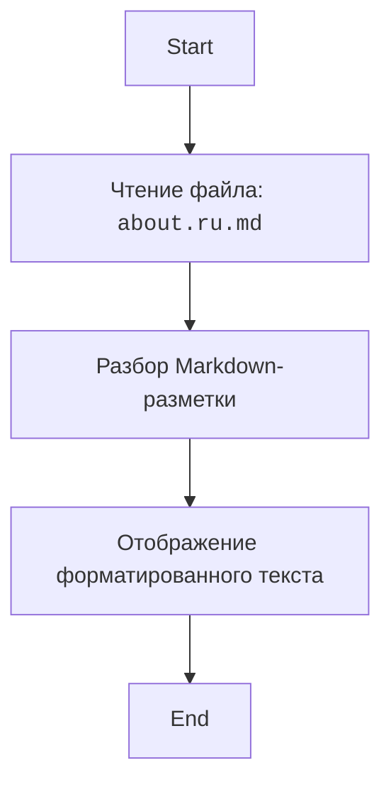

## Анализ файла `hypotez/src/endpoints/bookmaker/about.ru.md`

### 1. **<алгоритм>**

Данный файл представляет собой markdown-документ (`about.ru.md`), содержащий текстовое описание букмекерской деятельности на русском языке. Алгоритм обработки этого файла очень прост:

1.  **Чтение файла:** Файл `about.ru.md` считывается как текстовый файл.
2.  **Трансформация:** Markdown-разметка в файле интерпретируется для форматирования текста (заголовки, списки, выделение).
3.  **Отображение:** Результат форматирования отображается пользователю в виде HTML-страницы или в другом виде, поддерживающем markdown.

**Пример:**

```
Входные данные: Текст в формате .md
Выходные данные: Отформатированный текст с заголовками и списками.
```

Файл не содержит логических блоков или вычислений. Его основная функция – предоставление информации.

### 2. **<mermaid>**



**Объяснение:**

*   **Start:** Начало процесса обработки.
*   **ReadFile:** Этап чтения содержимого файла `about.ru.md`. Содержимое файла считывается в память.
*   **ParseMarkdown:** На этом этапе markdown-разметка (заголовки, списки, выделения) преобразуется в HTML или другой формат, поддерживающий markdown.
*   **DisplayOutput:** Результат преобразования отображается пользователю.
*   **End:** Конец процесса.

**Зависимости:**

Диаграмма не импортирует внешние зависимости, поскольку это просто визуализация процесса обработки файла markdown.

### 3. **<объяснение>**

**Импорты**:

В данном файле отсутствуют импорты, так как это статический текстовый файл формата `markdown`. Он не зависит от других частей проекта, поскольку является простым файлом с текстом.

**Классы**:

В данном файле отсутствуют классы.

**Функции**:

В данном файле отсутствуют функции. Он содержит только текст.

**Переменные**:

В данном файле отсутствуют переменные.

**Подробное объяснение:**

Файл `about.ru.md` предназначен для предоставления информации о букмекерской деятельности на русском языке. Он объясняет, что такое букмекер, как это работает, почему букмекеры занимаются этой деятельностью, а также дает важные рекомендации пользователям. Файл имеет следующую структуру:

*   **Заголовок** "Букмекер: Простыми словами".
*   **Объяснение**, кто такой букмекер и чем он занимается.
*   **Раздел "Как это работает?"**, описывающий процесс совершения ставок.
*   **Раздел "Почему букмекеры это делают?"**, объясняющий принципы работы букмекерских контор.
*   **Раздел "Важно помнить:"**, содержащий напоминания о рисках, законности и ответственности при ставках.
*   **Предложение "Хотите узнать больше о ставках?"**, приглашающее к дальнейшему взаимодействию.
*   **Перечень возможных вопросов**, на которые можно получить ответы.
*   **Предупреждение об ответственности** при азартных играх.

**Потенциальные улучшения:**

*   Файл может быть расширен за счет добавления более подробной информации о конкретных типах ставок, стратегиях и других аспектах букмекерской деятельности.
*   В документ можно встроить интерактивные элементы, например, ссылки на другие части проекта или сторонние ресурсы.
*   Можно добавить динамические данные, которые обновляются автоматически.

**Цепочка взаимосвязей:**

Файл `about.ru.md` скорее всего будет использован как часть веб-страницы или раздела сайта, предназначенного для предоставления информации о букмекерских услугах. Он может быть подключен через систему управления контентом (CMS) или путем прямой загрузки в HTML-страницу.