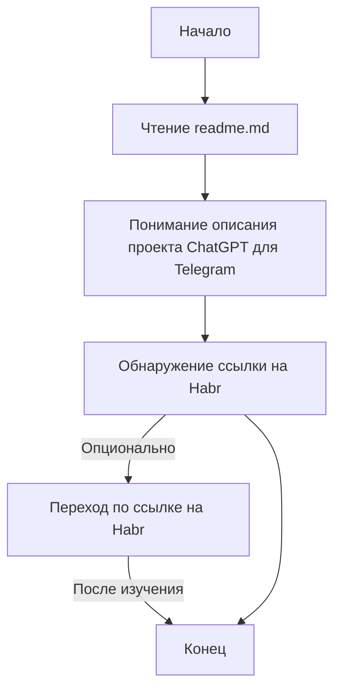

## АНАЛИЗ КОДА: `readme.md`

### <алгоритм>

1.  **Начало**: Пользователь открывает файл `readme.md`.
2.  **Чтение**: Пользователь читает текст в файле `readme.md`.
3.  **Понимание**: Пользователь понимает, что `readme.md` описывает голосового помощника ChatGPT, реализованного для Telegram.
4.  **Ссылка**: Пользователь видит ссылку на статью на Habr: `https://habr.com/ru/companies/selectel/articles/731692/`.
5.  **Переход (опционально)**: Пользователь может перейти по ссылке, чтобы получить более подробную информацию о проекте.
6.  **Конец**: Пользователь заканчивает изучение `readme.md`.

### <mermaid>

**Объяснение диаграммы `mermaid`**:

-   `Start`: Начальная точка процесса.
-   `ReadFile`: Представляет действие чтения файла `readme.md`.
-   `Understand`: Пользователь понимает описание проекта голосового помощника ChatGPT для Telegram.
-   `SeeLink`: Пользователь находит ссылку на статью на Habr.
-   `OpenLink`: Пользователь переходит по ссылке на статью. Этот шаг является опциональным.
-   `End`: Конечная точка процесса.

Диаграмма показывает простой поток пользовательского взаимодействия с файлом `readme.md`.

### <объяснение>

**Объяснение файла `readme.md`**:

-   **Назначение**: Файл `readme.md` служит вводной информацией о проекте. В данном случае, он описывает голосового помощника ChatGPT, интегрированного с Telegram.
-   **Содержание**: Файл содержит:
    -   Заголовок: "Голосовой помощник chatgpt - telegram".
    -   Краткое описание: Описание проекта.
    -   Ссылка: Ссылка на статью на Habr, где, вероятно, есть более подробная информация о проекте.
-   **Формат**: `.md` (Markdown).
-   **Использование**: Обычно `readme.md` используют для предоставления быстрой информации о проекте, инструкций по установке, или других важных данных.

**Особенности:**

1.  **Простота**: Файл `readme.md` очень простой и не содержит сложной логики. Его основная задача - предоставить базовую информацию.
2.  **Ссылка на Habr**: Ссылка на Habr позволяет пользователю получить более глубокое понимание проекта, перейдя на соответствующую статью.
3.  **Цель**: Цель файла - сообщить пользователю о существовании проекта голосового помощника ChatGPT для Telegram и направить его на дополнительные ресурсы.

**Взаимосвязи с другими частями проекта:**

-   `readme.md` является начальной точкой ознакомления с проектом. Это **связующее звено** с остальной частью проекта, так как позволяет пользователю получить общее представление о его функциональности.
-   Статья на Habr, на которую ссылается `readme.md`, может содержать более подробное описание архитектуры, кода и особенностей реализации проекта.

**Потенциальные ошибки и области для улучшения:**

-   **Недостаточно подробное описание**: Файл `readme.md` очень краткий, и может не содержать всю необходимую информацию.
-   **Отсутствие инструкций**: В файле отсутствуют инструкции по установке, запуску или использованию проекта.

**Улучшения:**

-   Добавить более подробное описание возможностей голосового помощника.
-   Включить пошаговые инструкции по установке и запуску проекта.
-   Добавить информацию о необходимых зависимостях и требованиях.
-   Добавить примеры использования.