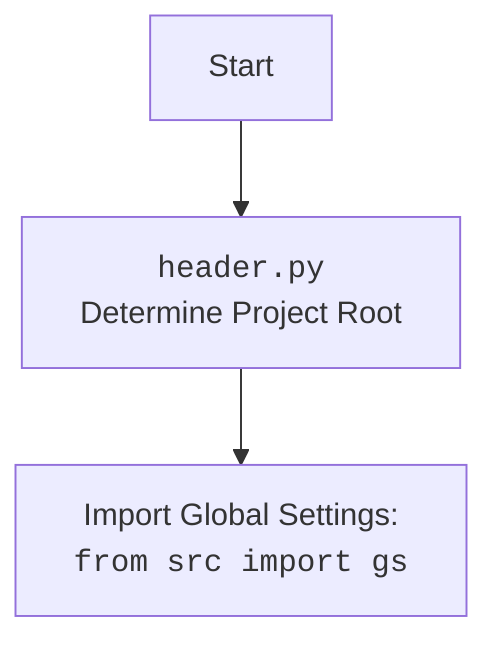

## Анализ кода `telegram_bot_trainger.py`

### 1. <алгоритм>

**Блок-схема работы Telegram-бота:**

1.  **Запуск бота:**
    *   Инициализация приложения `Application` с использованием токена Telegram.
    *   Регистрация обработчиков команд `/start` и `/help`.
    *   Регистрация обработчиков текстовых сообщений, голосовых сообщений и документов.
    *   Запуск процесса `polling` для прослушивания обновлений от Telegram.

2.  **Обработка команды `/start`:**
    *   Пользователь отправляет команду `/start`.
    *   Функция `start` отправляет ответное сообщение "Hello! I am your simple bot. Type /help to see available commands."

3.  **Обработка команды `/help`:**
    *   Пользователь отправляет команду `/help`.
    *   Функция `help_command` отправляет ответное сообщение со списком доступных команд.

4.  **Обработка текстового сообщения:**
    *   Пользователь отправляет текстовое сообщение.
    *   Функция `handle_message` получает текст сообщения.
    *   Функция `model.send_message` отправляет полученное сообщение в OpenAI для получения ответа.
    *   Полученный ответ отправляется пользователю в Telegram.
    *   (Закомментировано) ответ преобразуется в речь и отправляется пользователю.

5. **Обработка голосового сообщения:**
    * Пользователь отправляет голосовое сообщение.
    * Функция `handle_voice` получает голосовое сообщение.
    * Функция `recognizer` конвертирует голосовое сообщение в текст.
    * Полученный текст отправляется в OpenAI для получения ответа.
    * Полученный ответ отправляется пользователю в Telegram.
    * Ответ преобразуется в речь и отправляется пользователю.

6. **Обработка документа:**
    * Пользователь отправляет документ.
    * Функция `handle_document` получает документ.
    * Функция скачивает файл на локальный диск.
    * Содержимое файла считывается.
    * Функция `model.send_message` отправляет содержимое файла в OpenAI для обучения модели.
    * Полученный ответ отправляется пользователю в Telegram.
    *   (Закомментировано) ответ преобразуется в речь и отправляется пользователю.

**Пример потока данных:**

*   **Текст:**
    Пользователь -> `Telegram` -> `handle_message` -> `model.send_message` -> `OpenAI` -> `response` -> `handle_message` -> `Telegram` -> Пользователь
*   **Голос:**
     Пользователь -> `Telegram` -> `handle_voice` -> `recognizer` -> `text_message` -> `model.send_message` -> `OpenAI` -> `response` -> `text_to_speech`-> `Telegram` -> Пользователь
*   **Документ:**
    Пользователь -> `Telegram` -> `handle_document` -> `file_content`-> `model.send_message` -> `OpenAI` -> `response` ->  `Telegram` -> Пользователь

### 2. <mermaid>

```mermaid
flowchart TD
    Start[Start Bot] --> InitializeApplication[Initialize Telegram Application]
    InitializeApplication --> RegisterHandlers[Register Handlers: /start, /help, text, voice, document]
    RegisterHandlers --> RunPolling[Start Bot Polling]

    RunPolling --> ReceiveUpdate[Receive Telegram Update]
    ReceiveUpdate -- "/start command" --> HandleStart[Handle /start Command]
    ReceiveUpdate -- "/help command" --> HandleHelp[Handle /help Command]
    ReceiveUpdate -- "text message" --> HandleTextMessage[Handle Text Message]
    ReceiveUpdate -- "voice message" --> HandleVoiceMessage[Handle Voice Message]
    ReceiveUpdate -- "document" --> HandleDocument[Handle Document]

    HandleStart --> SendStartReply[Send "Hello" Message]
    HandleHelp --> SendHelpReply[Send Help Message]

    HandleTextMessage --> GetTextMessage[Get Text Message Content]
    GetTextMessage --> SendMessageToModelText[Send Message to Model]
    SendMessageToModelText --> GetModelResponseText[Get Model Response]
    GetModelResponseText --> SendTextReply[Send Response via Telegram]

    HandleVoiceMessage --> GetVoiceFile[Get Voice File]
    GetVoiceFile --> RecognizeSpeech[Convert Voice to Text]
    RecognizeSpeech --> SendMessageToModelVoice[Send Message to Model]
    SendMessageToModelVoice --> GetModelResponseVoice[Get Model Response]
    GetModelResponseVoice --> TextToSpeech[Convert text to speech]
    TextToSpeech --> SendAudioReply[Send Audio Response via Telegram]


    HandleDocument --> GetDocumentFile[Get Document File]
    GetDocumentFile --> ReadDocumentContent[Read Document Content]
    ReadDocumentContent --> SendDocumentToModel[Send Message to Model for training]
    SendDocumentToModel --> GetModelResponseDocument[Get Model Response]
    GetModelResponseDocument --> SendDocumentReply[Send Response via Telegram]

    SendStartReply --> End[End]
    SendHelpReply --> End
    SendTextReply --> End
     SendAudioReply --> End
    SendDocumentReply --> End

    classDef telegram fill:#f9f,stroke:#333,stroke-width:2px
    class ReceiveUpdate, SendTextReply, SendAudioReply, SendStartReply, SendHelpReply, SendDocumentReply  telegram
    
```

**Объяснение диаграммы:**

*   Диаграмма показывает поток управления и данных в телеграм-боте.
*   `Start Bot`: Начальная точка запуска бота.
*   `Initialize Telegram Application`: Инициализирует приложение Telegram с использованием токена.
*   `Register Handlers`: Регистрирует обработчики команд и сообщений (текстовых, голосовых и документов).
*   `Start Bot Polling`: Запускает процесс опроса обновлений от Telegram.
*   `Receive Telegram Update`: Получает обновления от Telegram.
*   Далее, в зависимости от типа обновления, оно направляется на соответствующий обработчик:
    *   `/start command` -> `Handle /start Command`
    *   `/help command` -> `Handle /help Command`
    *   `text message` -> `Handle Text Message`
    *    `voice message` -> `Handle Voice Message`
    *   `document` -> `Handle Document`
*   Каждый обработчик выполняет свои действия и, при необходимости, взаимодействует с OpenAI через модель и отправляет ответ пользователю.
*   `End`: Конечная точка выполнения каждого потока обработки.

**Дополнительно**: `header.py` импортируется, добавляем его flowchart:



### 3. <объяснение>

**Импорты:**

*   `pathlib.Path`: Работа с файловыми путями.
*  `tempfile`: Для создания временных файлов.
*   `asyncio`: Для асинхронного программирования.
*   `telegram`: Основная библиотека для работы с Telegram ботами.
    *   `Update`: Класс для представления обновлений, получаемых от Telegram.
    *   `Application`: Класс для создания и управления ботом.
    *   `CommandHandler`: Обработчик команд (например, `/start`).
    *  `MessageHandler`: Обработчик сообщений различных типов (текст, голос, документы).
    *   `filters`: Фильтры для обработки сообщений.
    *   `CallbackContext`: Контекст для обработчика, содержащий данные о боте и обновлении.
*   `header`: Локальный файл, определяет корень проекта и устанавливает глобальные переменные.
*   `src.gs`: Глобальные настройки проекта.
*   `src.ai.openai.model.training.Model`: Класс для работы с моделью OpenAI.
*   `src.utils.jjson`: Функции для работы с JSON.
*   `src.logger.logger`: Логгер для записи событий.
*   `speech_recognition as sr`: Библиотека для распознавания речи.
*   `requests`: Библиотека для скачивания файлов.
*   `pydub`: Библиотека для конвертации аудио.
*   `gtts`: Библиотека для преобразования текста в речь.
* `src.utils.convertors.tts`: Модуль, содержащий функции `recognizer` и `text_to_speech`.

**Классы:**

*   `Model` из `src.ai.openai.model.training`: Класс, отвечающий за взаимодействие с моделью OpenAI, для отправки сообщений и получения ответов.
*   `Application` из `telegram.ext`: Класс, представляющий Telegram-бота, обрабатывает входящие сообщения.

**Функции:**

*   `start(update: Update, context: CallbackContext) -> None`: Обработчик команды `/start`.
    *   **Аргументы:**
        *   `update`: Объект `Update`, содержащий информацию о входящем сообщении.
        *   `context`: Объект `CallbackContext`, содержащий контекст обработки.
    *   **Возвращаемое значение:** `None`.
    *   **Назначение:** Отправляет приветственное сообщение пользователю.
*   `help_command(update: Update, context: CallbackContext) -> None`: Обработчик команды `/help`.
    *   **Аргументы:**
        *   `update`: Объект `Update`, содержащий информацию о входящем сообщении.
        *   `context`: Объект `CallbackContext`, содержащий контекст обработки.
    *   **Возвращаемое значение:** `None`.
    *   **Назначение:** Отправляет справочное сообщение со списком доступных команд.
*    `handle_document(update: Update, context: CallbackContext)`: Обработчик для документов
    *   **Аргументы:**
        *   `update`: Объект `Update`, содержащий информацию о входящем сообщении.
        *   `context`: Объект `CallbackContext`, содержащий контекст обработки.
    *   **Возвращаемое значение:** `None`.
    *   **Назначение:** Скачивает файл, считывает содержимое, обучает модель и отвечает.
*   `handle_message(update: Update, context: CallbackContext) -> None`: Обработчик текстовых сообщений.
    *   **Аргументы:**
        *   `update`: Объект `Update`, содержащий информацию о входящем сообщении.
        *   `context`: Объект `CallbackContext`, содержащий контекст обработки.
    *   **Возвращаемое значение:** `None`.
    *   **Назначение:** Отправляет полученный текст в модель OpenAI и отправляет ответ.
*   `handle_voice(update: Update, context: CallbackContext) -> None`: Обработчик голосовых сообщений.
    *   **Аргументы:**
        *   `update`: Объект `Update`, содержащий информацию о входящем сообщении.
        *   `context`: Объект `CallbackContext`, содержащий контекст обработки.
    *   **Возвращаемое значение:** `None`.
    *   **Назначение:** Распознает речь, отправляет текст в модель OpenAI, отправляет ответ пользователю в виде текста и голосового сообщения.
*   `main() -> None`: Основная функция для запуска бота.
    *   **Аргументы:** Нет.
    *   **Возвращаемое значение:** `None`.
    *   **Назначение:** Создает объект `Application`, регистрирует обработчики, запускает polling.

**Переменные:**

*   `TELEGRAM_TOKEN`: Токен для доступа к Telegram Bot API (берется из `gs.credentials.telegram.bot_token`).
*   `model`: Экземпляр класса `Model` для взаимодействия с моделью OpenAI.
*   `application`: Экземпляр класса `Application` - основное приложение для бота.

**Потенциальные ошибки и области для улучшения:**

*   **Обработка ошибок:** В коде не предусмотрена обработка ошибок при работе с моделью OpenAI, при скачивании файлов, распознавании речи.
*   **Безопасность:** Токен телеграм-бота не должен храниться в открытом виде, рекомендуется использовать переменные окружения или другие способы безопасного хранения.
*   **Текст-в-речь:** Сейчас преобразование текста в речь закомментировано, если это необходимо, нужно раскомментировать и проверить код.
*   **Асинхронность:** Вся обработка должна быть асинхронной для улучшения производительности.
*   **Логирование**: Не реализовано логирование ошибок и действий пользователя.

**Взаимосвязь с другими частями проекта:**

*   **`src.gs`**: Используется для получения токена Telegram из настроек проекта.
*   **`src.ai.openai.model.training.Model`**: Используется для отправки сообщений в OpenAI.
*   **`src.utils.jjson`**: Используется для работы с JSON-данными (в данном коде напрямую не используется, но может быть полезен в будущем).
*   **`src.logger.logger`**: Используется для логирования событий.
*   **`header.py`**: Определяет корень проекта и импортирует глобальные настройки проекта.
*   **`src.utils.convertors.tts`**: Используется для преобразования речи в текст и текста в речь.