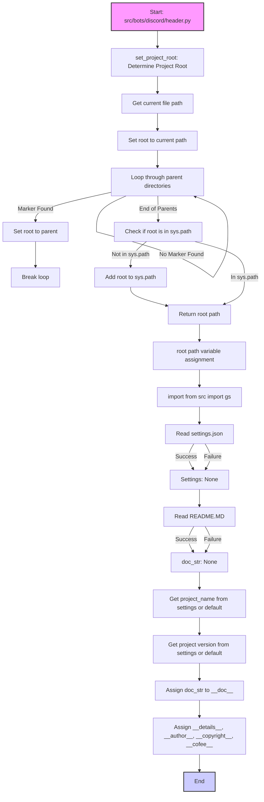

## ИНСТРУКЦИЯ:

Анализируй предоставленный код подробно и объясни его функциональность. Ответ должен включать три раздела:

1.  **<алгоритм>**: Опиши рабочий процесс в виде пошаговой блок-схемы, включая примеры для каждого логического блока, и проиллюстрируй поток данных между функциями, классами или методами.
2.  **<mermaid>**: Напиши код для диаграммы в формате `mermaid`, проанализируй и объясни все зависимости,
    которые импортируются при создании диаграммы.
    **ВАЖНО!** Убедитесь, что все имена переменных, используемые в диаграмме `mermaid`,
    имеют осмысленные и описательные имена. Имена переменных вроде `A`, `B`, `C`, и т.д., не допускаются!

    **Дополнительно**: Если в коде есть импорт `import header`, добавьте блок `mermaid` flowchart, объясняющий `header.py`:
    ```mermaid
    flowchart TD
        Start --> Header[<code>header.py</code><br> Determine Project Root]

        Header --> import[Import Global Settings: <br><code>from src import gs</code>]
    ```

3.  **<объяснение>**: Предоставьте подробные объяснения:
    -   **Импорты**: Их назначение и взаимосвязь с другими пакетами `src.`.
    -   **Классы**: Их роль, атрибуты, методы и взаимодействие с другими компонентами проекта.
    -   **Функции**: Их аргументы, возвращаемые значения, назначение и примеры.
    -   **Переменные**: Их типы и использование.
    -   Выделите потенциальные ошибки или области для улучшения.

Дополнительно, постройте цепочку взаимосвязей с другими частями проекта (если применимо).

Это обеспечивает всесторонний и структурированный анализ кода.
## Формат ответа: `.md` (markdown)
**КОНЕЦ ИНСТРУКЦИИ**

## <алгоритм>

```mermaid
graph TD
    A[Начало] --> B{Определение `current_path`};
    B --> C{`__root__ = current_path`};
    C --> D{Цикл по родительским директориям};
    D -- Найдена --> E{Проверка на маркерные файлы};
    E -- Да --> F{`__root__ = parent`};
    F --> G{Выход из цикла};
    E -- Нет --> D;
    D -- Завершен --> H{Проверка `__root__` в `sys.path`};
    H -- Нет --> I{Добавление `__root__` в `sys.path`};
    I --> J{Возврат `__root__`};
    H -- Да --> J;
    J --> K[Конец функции `set_project_root`];
    K --> L{Запуск `set_project_root()`};
    L --> M{`__root__ = результат `set_project_root()`};
    M --> N{Импорт `from src import gs`};
    N --> O{Чтение `settings.json`};
    O -- Успех --> P{Загрузка `settings`};
    O -- Ошибка --> P;
    P --> Q{Чтение `README.MD`};
     Q -- Успех --> R{Загрузка `doc_str`};
    Q -- Ошибка --> R;
    R --> S{Получение `project_name` из `settings`};
    S --> T{Получение `version` из `settings`};
    T --> U{Присвоение `doc_str` в `__doc__`};
    U --> V{Установка констант `__details__`, `__author__`, `__copyright__`, `__cofee__`};
    V --> W[Конец];
    
    style A fill:#f9f,stroke:#333,stroke-width:2px
    style K fill:#ccf,stroke:#333,stroke-width:2px
    style W fill:#ccf,stroke:#333,stroke-width:2px

```
**Примеры:**

1.  **Определение `current_path`**:
    -   Если файл `header.py` находится в директории `/home/user/project/src/bots/discord/`, то `current_path` будет `/home/user/project/src/bots/discord`.
2.  **Цикл по родительским директориям**:
    -   Начальное значение `parent` будет `/home/user/project/src/bots/discord`, потом `/home/user/project/src/bots`, затем `/home/user/project/src`, затем `/home/user/project` и так далее.
3.  **Проверка на маркерные файлы**:
    -   Если в `/home/user/project` есть файл `__root__` или папка `.git`, то цикл завершится и `__root__` будет установлено в `/home/user/project`.
4.  **Добавление `__root__` в `sys.path`**:
    -   Если `__root__` (например, `/home/user/project`) еще нет в списке путей поиска модулей `sys.path`, то этот путь добавляется в начало списка.
5. **Чтение `settings.json`**:
    - Файл `settings.json` должен находиться по пути `gs.path.root / 'src' /  'settings.json'`, например `/home/user/project/src/settings.json`

## <mermaid>


**Анализ зависимостей:**

*   `import sys`: Модуль `sys` используется для работы с системными параметрами и функциями, в частности, для добавления пути к проекту в `sys.path`, что позволяет импортировать модули из корневой директории проекта.
*   `import json`: Модуль `json` используется для загрузки настроек из файла `settings.json`, который должен быть в корне проекта.
*   `from packaging.version import Version`: Модуль `packaging.version` используется для работы с версиями пакетов, но в данном коде не используется. Возможно это заготовка на будущее.
*   `from pathlib import Path`: Модуль `pathlib` используется для работы с путями к файлам и директориям в объектно-ориентированном стиле.
*   `from src import gs`:  Импортирует модуль `gs` (предположительно "global settings" или что-то подобное) из пакета `src`. Это указывает на зависимость от конфигурации проекта, определенной в `gs`, где содержится информация о путях проекта, что позволяет получить доступ к файлу настроек `settings.json` и `README.MD`.

## <объяснение>

**Импорты:**

*   `sys`: Модуль `sys` предоставляет доступ к некоторым переменным и функциям, взаимодействующим с интерпретатором Python. В данном коде используется для модификации списка путей поиска модулей (`sys.path`), что позволяет импортировать модули из корневой директории проекта.
*   `json`: Модуль `json` используется для работы с данными в формате JSON, в частности для загрузки настроек из файла `settings.json`.
*   `packaging.version.Version`: Из модуля `packaging.version` импортируется класс `Version` для сравнения версий, но фактически он не используется. Возможно, это импорт для будущей функциональности.
*   `pathlib.Path`: Класс `Path` из модуля `pathlib` предоставляет объектно-ориентированный способ работы с путями к файлам и директориям, что упрощает манипуляции с путями.
*  `src.gs`: `gs` предположительно является модулем в пакете `src` и предоставляет доступ к глобальным настройкам проекта, например, к путям к файлам и другим параметрам. Это позволяет коду получить путь к корневой директории проекта и другим важным директориям, а также к файлам настроек.

**Функции:**

*   `set_project_root(marker_files=('__root__', '.git')) -> Path`:
    *   **Аргументы**: `marker_files` - это кортеж строк, представляющих имена файлов или директорий, которые используются для определения корневой директории проекта. По умолчанию это `__root__` и `.git`.
    *   **Возвращаемое значение**: `Path` - объект, представляющий путь к корневой директории проекта.
    *   **Назначение**: Функция находит корневую директорию проекта, ища вверх по иерархии каталогов, начиная с директории, где находится текущий файл, пока не найдет директорию с одним из заданных маркерных файлов. Если маркерный файл не найден, возвращается текущий каталог файла. Также добавляет корневой каталог в `sys.path`, если его там нет, чтобы обеспечить корректный импорт модулей из проекта.
    *   **Пример**: Если файл `header.py` находится в `/home/user/project/src/bots/discord/`, а маркерный файл `.git` находится в `/home/user/project/`, то функция вернет `Path('/home/user/project/')`.

**Переменные:**

*   `__root__`: `Path` - хранит путь к корневой директории проекта, найденный с помощью функции `set_project_root()`.
*   `settings`: `dict` - хранит словарь с настройками проекта, загруженными из файла `settings.json`. Значение `None`, если файл не найден или имеет неверный формат.
*  `doc_str`: `str` - хранит содержимое файла `README.MD`. Значение `None`, если файл не найден или имеет неверный формат.
*   `__project_name__`: `str` - имя проекта, извлекается из настроек или установлено значение по умолчанию.
*   `__version__`: `str` - версия проекта, извлекается из настроек.
*   `__doc__`: `str` -  документация проекта, загружается из `README.MD`.
*   `__details__`: `str` -  детали проекта, временно пустая строка.
*   `__author__`: `str` - автор проекта, извлекается из настроек.
*   `__copyright__`: `str` - копирайт проекта, извлекается из настроек.
*   `__cofee__`: `str` - сообщение с предложением поддержать автора проекта, извлекается из настроек или задается по умолчанию.

**Объяснение:**

Файл `header.py` предназначен для определения корневой директории проекта и загрузки основных настроек, таких как имя проекта, версия и документация из файлов `settings.json` и `README.MD`.

1.  **Определение корневой директории**: Функция `set_project_root()` определяет корень проекта путем поиска специальных файлов (`__root__` или `.git`) в родительских каталогах. Это гарантирует, что код будет корректно работать независимо от того, где он запущен.
2.  **Загрузка настроек**: После определения корневой директории код загружает настройки проекта из файла `settings.json` и `README.MD`, которые находятся в директории `src` относительно корня проекта.
3.  **Инициализация переменных проекта**: Значения из настроек, а так же документация из `README.MD` используются для инициализации переменных проекта, таких как имя проекта, версия, автор, копирайт и т.д. Эти переменные предоставляют информацию о проекте и могут быть использованы другими модулями в рамках проекта.

**Потенциальные ошибки и области для улучшения:**

1.  **Обработка исключений**: Исключения `FileNotFoundError` и `json.JSONDecodeError` при загрузке настроек обрабатываются с помощью `try...except`, но не происходит логирования ошибки, что может затруднить отладку. Стоит добавить логирование ошибок.
2.  **Дублирование логики**: Логика чтения `settings.json` и `README.MD` почти идентична. Ее можно вынести в отдельную функцию для уменьшения дублирования кода.
3.  **Настройка по умолчанию:** Значения по умолчанию для `__project_name__`, `__version__`, `__author__` и `__copyright__` заданы как пустые строки. Возможно стоит задать более информативные значения, как это сделано для `__cofee__`.

**Взаимосвязь с другими частями проекта:**

*   Этот файл служит "точкой входа" для многих модулей проекта. Он определяет корень проекта и загружает базовые настройки, предоставляя эту информацию другим модулям через глобальные переменные и модуль `gs`.
*   Он используется как часть процесса загрузки других модулей, особенно тех, которым требуется знать корень проекта и другие метаданные.
*   `src.gs` используется для доступа к путям и другим настройкам проекта, что делает `header.py` зависимым от конфигурации `gs`.

Этот анализ предоставляет полное понимание того, как работает этот файл, его зависимости и потенциальные улучшения.