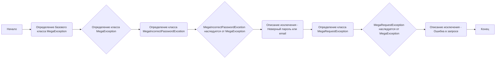
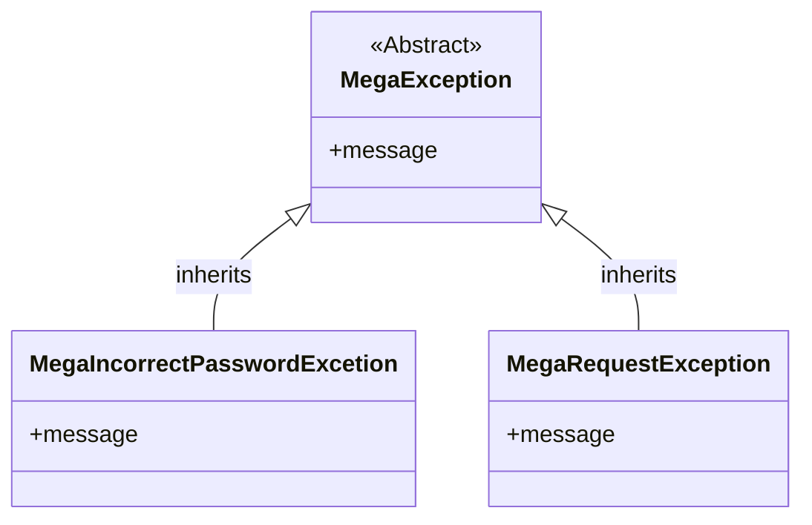

# Анализ кода `hypotez/src/endpoints/bots/google_dirve/mega/exceptions.py`

## 1. <алгоритм>

**Блок-схема:**



**Примеры:**

1.  **`MegaException`**: Это базовое исключение для всех ошибок, связанных с Mega. Он ничего конкретного не делает, но служит основой для более специализированных исключений.
    ```python
    try:
        raise MegaException("Произошла общая ошибка Mega.")
    except MegaException as e:
        print(f"Поймано исключение Mega: {e}")
    ```

2.  **`MegaIncorrectPasswordExcetion`**: Исключение, которое возникает, когда предоставлен неверный пароль или email.
    ```python
    try:
        raise MegaIncorrectPasswordExcetion("Неверный пароль или email.")
    except MegaIncorrectPasswordExcetion as e:
        print(f"Ошибка аутентификации Mega: {e}")
    ```

3.  **`MegaRequestException`**: Исключение, возникающее, когда есть проблема с отправленным запросом к Mega API.
     ```python
    try:
        raise MegaRequestException("Ошибка при отправке запроса к Mega.")
    except MegaRequestException as e:
        print(f"Ошибка запроса Mega: {e}")
    ```

**Поток данных:**
Исключения создаются внутри кода, который взаимодействует с Mega API. После создания, исключение может быть поймано с помощью блоков `try...except`.

## 2. <mermaid>



**Зависимости `mermaid`:**
*   **`classDiagram`**: определяет, что мы создаем диаграмму классов.
*   **`MegaException`**, **`MegaIncorrectPasswordExcetion`**, **`MegaRequestException`**:  Имена классов.
*   **`<|--`**: обозначает наследование между классами,  например, `MegaIncorrectPasswordExcetion` наследуется от `MegaException`.
*   **`<<Abstract>>`**:  показывает, что `MegaException` - абстрактный класс.
*   **`+message`**: показывает открытый атрибут `message` для каждого класса исключения (фактически не описан в коде, но предполагается).

## 3. <объяснение>

### Импорты

*   В данном файле импортов нет. Код не зависит от других модулей.

### Классы

1.  **`MegaException`**:
    *   **Роль**: Базовый класс исключений для всех исключений, специфичных для операций с Mega. Служит родительским классом для других, более конкретных исключений.
    *   **Атрибуты**: Отсутствуют явные атрибуты, но может быть реализован атрибут `message`,  чтобы содержать сообщение об ошибке.
    *   **Методы**: Отсутствуют явно определенные методы.
    *   **Взаимодействие**: Используется в качестве базового класса для `MegaIncorrectPasswordExcetion` и `MegaRequestException`.

2.  **`MegaIncorrectPasswordExcetion`**:
    *   **Роль**: Представляет исключение, которое возникает, когда при попытке аутентификации в Mega предоставляется неверный пароль или email.
    *   **Атрибуты**: Может содержать атрибут `message`, но он не объявлен явно в коде.
    *   **Методы**: Отсутствуют явно определенные методы.
    *   **Взаимодействие**: Наследуется от `MegaException`, что позволяет легко обрабатывать это исключение вместе с другими исключениями, специфичными для Mega.

3.  **`MegaRequestException`**:
    *   **Роль**: Представляет исключение, которое возникает, когда есть проблемы при выполнении запроса к Mega API.
    *   **Атрибуты**: Может содержать атрибут `message`, но он не объявлен явно в коде.
    *   **Методы**: Отсутствуют явно определенные методы.
    *   **Взаимодействие**: Наследуется от `MegaException`, что позволяет легко обрабатывать это исключение вместе с другими исключениями, специфичными для Mega.

### Функции

*   В данном файле функции отсутствуют.

### Переменные

*   В данном файле переменные отсутствуют.

### Потенциальные ошибки и улучшения

*   **Отсутствие атрибута `message`**:  У всех исключений может быть полезный атрибут `message`, который содержит подробное сообщение об ошибке. В текущем коде это не реализовано, поэтому можно добавить  конструктор `__init__` для каждого класса исключений, чтобы инициализировать атрибут `message`.

    Пример:

   ```python
    class MegaException(Exception):
        def __init__(self, message):
             self.message = message
             super().__init__(message)

    class MegaIncorrectPasswordExcetion(MegaException):
        """
        A incorrect password or email was given.
        """
        def __init__(self, message):
            super().__init__(message)


    class MegaRequestException(MegaException):
        """
        There was an error in the request.
        """
        def __init__(self, message):
            super().__init__(message)
   ```
*   **Нет документации**: Добавить документацию, где это необходимо.

### Взаимосвязь с другими частями проекта

Эти исключения вероятно будут использоваться в модулях, которые отвечают за взаимодействие с Mega API, например, в файлах, которые отправляют запросы к API Mega и обрабатывают ответы. Эти исключения позволяют структурировать обработку ошибок, специфичных для Mega, в рамках проекта.