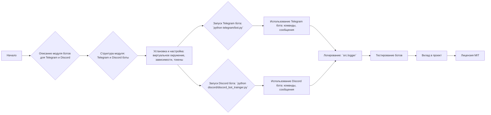

## АНАЛИЗ КОДА: `hypotez/src/endpoints/bots/readme.ru.md`

### <алгоритм>

**Общая структура:**

1.  **Описание модуля:** Модуль предназначен для создания и управления ботами для Telegram и Discord.
2.  **Структура модуля:** Состоит из двух основных частей: бот для Telegram (`telegram/bot.py`) и бот для Discord (`discord/discord_bot_trainger.py`).
3.  **Установка и настройка:**
    *   Установка: клонирование репозитория, создание виртуального окружения, установка зависимостей из `requirements.txt`.
    *   Настройка: получение токенов для Telegram и Discord ботов и их добавление в базу данных паролей `credentials.kdbx`.
4.  **Запуск ботов:**
    *   Запуск Telegram-бота: `python hypotez/src/endpoints/bots/telegram/bot.py`.
    *   Запуск Discord-бота: `python hypotez/src/bots/discord/discord_bot_trainger.py`.
5.  **Использование:**
    *   Telegram-бот: обработка команд `/start`, `/help`, `/sendpdf`, распознавание голосовых сообщений и обработка документов.
    *   Discord-бот: обработка команд `!hi`, `!join`, `!leave`, `!train`, `!test`, `!archive`, `!select_dataset`, `!instruction`, `!correct`, `!feedback`, `!getfile`, распознавание голосовых сообщений и обработка документов.
6.  **Логирование:** Используется модуль `src.logger`.
7.  **Тестирование:** Рекомендации по тестированию ботов.
8.  **Вклад в проект:** Инструкции для желающих внести изменения в проект.
9.  **Лицензия:** Проект лицензирован под MIT License.

**Блок-схема:**



### <mermaid>
```mermaid
graph LR
    A[<code>readme.ru.md</code><br>Описание модуля ботов] --> B{Структура модуля<br>(Telegram и Discord боты)};
    B --> C[Telegram Bot<br>(<code>telegram/bot.py</code>)<br>Обработка команд:<br> /start, /help, /sendpdf<br>Голосовые и текстовые сообщения,<br> документы];
    B --> D[Discord Bot<br>(<code>discord/discord_bot_trainger.py</code>)<br>Обработка команд:<br> !hi, !join, !leave, !train, !test,<br> !archive, !select_dataset, !instruction, <br>!correct, !feedback, !getfile<br>Голосовые и текстовые сообщения,<br>документы];
    C --> E[Настройка: <br>Получение токена Telegram<br>Из <code>credentials.kdbx</code>];
    D --> F[Настройка: <br>Получение токена Discord<br>Из <code>credentials.kdbx</code>];
     E --> G[Запуск: <code>python telegram/bot.py</code>]
     F --> H[Запуск: <code>python discord/discord_bot_trainger.py</code>]
    G --> I[Использование: <br>команды, сообщения];
    H --> I
    I --> J[Логирование: <br><code>src.logger</code>]
    J --> K[Тестирование];
```

**Разбор диаграммы `mermaid`:**

*   `A`: Начальная точка - описание модуля ботов, представленное в файле `readme.ru.md`.
*   `B`: Указывает на структуру модуля, разделенного на Telegram и Discord ботов.
*   `C`: Описывает Telegram бота, включая файл реализации `telegram/bot.py`, поддерживаемые команды и типы обрабатываемых сообщений.
*   `D`: Описывает Discord бота, включая файл реализации `discord/discord_bot_trainger.py`, поддерживаемые команды и типы обрабатываемых сообщений.
*   `E`: Показывает, что для работы Telegram-бота требуется токен, который получается из базы данных `credentials.kdbx`.
*    `F`: Показывает, что для работы Discord-бота требуется токен, который получается из базы данных `credentials.kdbx`.
*   `G`: Описывает запуск Telegram-бота с помощью команды `python telegram/bot.py`.
*   `H`: Описывает запуск Discord-бота с помощью команды `python discord/discord_bot_trainger.py`.
*   `I`: Показывает, как используются боты: обработка команд и сообщений.
*   `J`: Указывает на использование модуля логирования `src.logger`.
*   `K`: Указывает на процесс тестирования ботов.

### <объяснение>

**1. Импорты:**

*   В предоставленном тексте нет явных импортов Python. Однако упоминается использование модуля `src.logger`. Это означает, что в коде ботов используются функции логирования, определенные в модуле `src.logger`.
*   Также упоминается использование `credentials.kdbx`. Этот файл, вероятно, обрабатывается через отдельную библиотеку (не указанную явно), для чтения токенов.

**2. Классы:**

*   В тексте `readme.ru.md` классы явно не определены, но подразумевается, что боты реализованы как классы, содержащие логику обработки команд и сообщений. Telegram и Discord боты являются примерами классов.

**3. Функции:**

*   Функции в `readme.ru.md` не перечислены, но можно предположить, что в `telegram/bot.py` и `discord/discord_bot_trainger.py` присутствуют функции для:
    *   Обработки команд (например, `/start`, `!hi`).
    *   Распознавания голосовых сообщений.
    *   Обработки текстовых сообщений и документов.
    *   Управления голосовыми каналами (для Discord).
    *   Отправки сообщений, файлов, и т.д.
    *   Обучение и тестирование моделей машинного обучения (для Discord).

**4. Переменные:**

*   `requirements.txt` : Файл со списком зависимостей, необходимых для работы проекта.
*   `credentials.kdbx` : База данных паролей, где хранятся токены для Telegram и Discord ботов.
*   Переменные, вероятно, присутствующие в коде ботов (но не упомянутые в `readme.ru.md`):
    *   `telegram_bot_token`: Токен для доступа к Telegram боту.
    *   `discord_bot_token`: Токен для доступа к Discord боту.
    *   Логические переменные, для работы бота.

**5. Потенциальные ошибки и области для улучшения:**

*   **Управление секретами**: `credentials.kdbx` - это хорошо, но стоит убедится в безопасности его использования.
*   **Обработка ошибок**: Не указано явно, как обрабатываются ошибки при работе ботов, стоит учесть возможные сбои в работе.
*   **Масштабируемость**: Если предполагается дальнейшее расширение функциональности ботов, стоит заранее продумать архитектуру для упрощения поддержки и расширения.
*   **Тестирование**: Нужно добавить больше информации и описания по тестированию.
*   **Описание кода:** В `readme.ru.md` приведено описание функционала, но не дано информации по коду.

**Взаимосвязи с другими частями проекта:**

*   **`src.logger`**: Модуль логирования используется для записи событий и ошибок, и таким образом связан со всеми компонентами.
*   **`credentials.kdbx`**: База данных паролей обеспечивает хранение секретных данных (токенов), необходимых для работы ботов.
*   **Остальные модули `src`**: Не указаны, но можно предположить наличие связей с другими модулями, такими как модули обработки данных, модели машинного обучения и т.д.

**Дополнительные замечания:**

*   `readme.ru.md` предоставляет общее описание ботов, но не раскрывает детали реализации. Для более полного анализа нужно изучать код файлов `telegram/bot.py` и `discord/discord_bot_trainger.py`.
*   Важно обратить внимание на безопасность и надежность хранения и использования токенов ботов.
*   Рекомендации по тестированию стоит расширить.