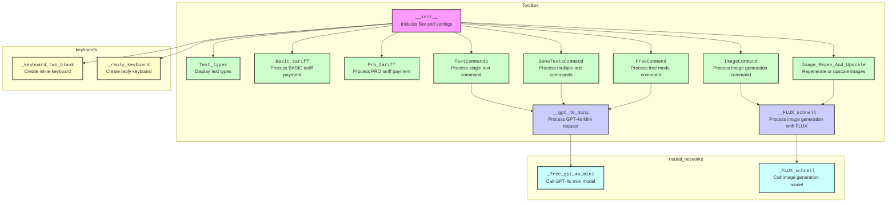

## <алгоритм>

### `ToolBox` Class Initialization
1. **Инициализация атрибутов:**
    - Создаются списки `self.name` и `self.data` для кнопок главного меню.
    - Загружаются текстовые подсказки из `prompts.json` в `self.prompts_text`.
    - Инициализируется Telegram бот с токеном из переменных окружения.
    - Создаются lambda-функции для генерации клавиатур:
        - `self.keyboard_blank`: для inline-клавиатур.
        - `self.reply_keyboard`: для reply-клавиатур.
    - Создаются lambda-функции для различных запросов и ответов бота:
        - `self.__delay`: отправляет сообщение "Подождите...".
        - `self.start_request`: отправляет приветственное сообщение с клавиатурой.
        - `self.restart`: отправляет сообщение с просьбой выбрать задачу.
        - `self.restart_markup`: изменяет сообщение с просьбой выбрать задачу.
        - `self.OneTextArea`: отправляет сообщение с одной текстовой подсказкой.
        - `self.SomeTextsArea`: отправляет сообщение с несколькими текстовыми подсказками.
        - `self.ImageSize`: отправляет сообщение с выбором разрешения изображения.
        - `self.ImageArea`: отправляет сообщение с просьбой ввести запрос для изображения.
        - `self.ImageChange`: отправляет сообщение с выбором действий после генерации изображения.
        - `self.BeforeUpscale`: отправляет сообщение с выбором действий перед улучшением изображения.
        - `self.FreeArea`: отправляет сообщение с просьбой ввести запрос в свободном режиме.
        - `self.TariffArea`: отправляет сообщение с выбором тарифов.
        - `self.TariffExit`:  отправляет сообщение с тарифами и кнопками.
        - `self.TarrifEnd`: отправляет сообщение об окончании запросов.
        - `self.FreeTariffEnd`: отправляет сообщение об окончании бесплатных запросов.
        - `self.SomeTexts`: отправляет сообщение с выбором количества текстов.
        
    **Пример**:
    ```python
    # Пример вызова self.start_request
    self.start_request(message) # Отправляет приветствие и начальную клавиатуру
    ```

### Private Methods

1. **`__gpt_4o_mini`**:
   - Отправляет сообщение "Подождите...".
   - Вызывает метод `_free_gpt_4o_mini` из родительского класса `neural_networks` для обработки запроса к модели GPT-4o mini.
   - Редактирует сообщение с результатом от GPT-4o mini, вставляя HTML-теги.
   - Возвращает ответ, количество входящих и исходящих токенов.
    
     **Пример**:
    ```python
    prompt = [{"role": "user", "content": "Пример запроса"}]
    response, incoming_tokens, outgoing_tokens = self.__gpt_4o_mini(prompt=prompt, message=message)
    ```

2. **`__FLUX_schnell`**:
   - Отправляет сообщение "Подождите...".
   - Вызывает метод `_FLUX_schnell` из родительского класса `neural_networks` для генерации изображения.
   - Отправляет сгенерированное изображение пользователю.
   - Удаляет сообщение "Подождите...".
     **Пример**:
    ```python
    prompt = "Запрос на картинку"
    size = [1024, 1024]
    seed = 12345
    num_inference_steps = 4
    self.__FLUX_schnell(prompt=prompt, size=size, message=message, seed=seed, num_inference_steps=num_inference_steps)
    ```
 
### Public Methods

1. **`Text_types`**:
   - Отправляет сообщение с типами текста и inline-клавиатурой.
   **Пример**:
    ```python
    self.Text_types(message) # Запрос на выбор типа текста
    ```
2. **`Basic_tariff`**:
    - Создает inline-клавиатуру с кнопкой для подключения тарифа BASIC.
    - Удаляет текущее сообщение и отправляет запрос на оплату тарифа.
    **Пример**:
    ```python
    self.Basic_tariff(message) # Запрос на оплату basic-тарифа
    ```
3. **`Pro_tariff`**:
    - Создает inline-клавиатуру с кнопкой для подключения тарифа PRO.
    - Удаляет текущее сообщение и отправляет запрос на оплату тарифа.
    **Пример**:
    ```python
    self.Pro_tariff(message) # Запрос на оплату pro-тарифа
    ```
4. **`TextCommands`**:
    - Обрабатывает текстовые команды на основе выбранного типа текста.
    - Собирает необходимую информацию от пользователя.
    - Формирует prompt с помощью `pc.get_prompt` и вызывает `__gpt_4o_mini`.
    - Возвращает количество входящих и исходящих токенов.
    - Перезапускает меню.
   
   **Пример**:
    ```python
    ind = 0
    incoming_tokens, outgoing_tokens, status = self.TextCommands(message, ind=ind)
    ```
5.  **`SomeTextsCommand`**:
    - Обрабатывает команду генерации нескольких текстов.
    - Запрашивает у пользователя количество необходимых текстов.
    - Собирает необходимые параметры для каждого текста.
    - Формирует prompt с помощью `pc.get_prompt` и вызывает `__gpt_4o_mini` в многопоточном режиме.
    - Возвращает количество входящих и исходящих токенов.
    - Перезапускает меню.
    
     **Пример**:
    ```python
    ind = 1
    tokens = {"incoming_tokens": 1000, "outgoing_tokens": 1000, "free_requests": 10}
    incoming_tokens, outgoing_tokens, count = self.SomeTextsCommand(message, ind=ind, tokens=tokens)
    ```

6.  **`ImageCommand`**:
    - Генерирует изображения на основе введенного запроса.
    - Вызывает метод `__FLUX_schnell` для генерации изображения.
    - Возвращает seed для последующей регенерации.
    **Пример**:
    ```python
    prompt = "картинка с котиком"
    size = [1024, 1024]
    seed = self.ImageCommand(message, prompt=prompt, size=size)
    ```

7.  **`Image_Regen_And_Upscale`**:
    - Регенерирует или улучшает изображение.
    - Вызывает `__FLUX_schnell` для регенерации или улучшения изображения.
    **Пример**:
    ```python
    prompt = "картинка с котиком"
    size = [1024, 1024]
    seed = 12345
    self.Image_Regen_And_Upscale(message, prompt=prompt, size=size, seed=seed)
    ```

8.  **`FreeCommand`**:
    - Обрабатывает запросы в свободном режиме.
    - Вызывает `__gpt_4o_mini` для обработки запроса.
    - Сохраняет контекст диалога для последующих запросов.
    - Возвращает ответ, количество входящих и исходящих токенов, а так же контекст диалога.
     **Пример**:
    ```python
    prompts = []
    incoming_tokens, outgoing_tokens, prompts = self.FreeCommand(message, prompts=prompts)
    ```
    
### Поток Данных

1.  Пользователь отправляет команду боту.
2.  `ToolBox` обрабатывает команду.
3.  При текстовых запросах `TextCommands`, `SomeTextsCommand` или `FreeCommand`:
    - Запрос пользователя обрабатывается.
    - Формируется prompt.
    - Данные передаются в `__gpt_4o_mini`.
    - Полученный ответ от GPT-4o mini возвращается пользователю.
4. При запросах на изображение `ImageCommand`, `Image_Regen_And_Upscale`:
    - Запрос пользователя обрабатывается.
    - Данные передаются в `__FLUX_schnell`.
    - Полученное изображение отправляется пользователю.
5. Класс взаимодействует с `PromptsCompressor` для получения prompt-ов.
6. Класс взаимодействует с родительским классом `neural_networks` для вызова моделей нейросетей.

## <mermaid>


**Объяснение `mermaid`:**

-   **`ToolBox`**: Основной класс, включающий методы для обработки запросов от пользователя.
    -   `A`: `__init__` - инициализация бота и настроек.
    -   `B`: `__gpt_4o_mini` - обработка запросов к модели GPT-4o mini.
    -   `C`: `__FLUX_schnell` - обработка запросов на генерацию изображений с помощью FLUX.
    -   `D`: `Text_types` - отображение типов текста.
    -   `E`: `Basic_tariff` - обработка оплаты тарифа BASIC.
    -   `F`: `Pro_tariff` - обработка оплаты тарифа PRO.
    -  `G`: `TextCommands` - обработка текстовых команд.
    -  `H`: `SomeTextsCommand` - обработка команд для генерации нескольких текстов.
    -   `I`: `ImageCommand` - обработка команд для генерации изображений.
    -   `J`: `Image_Regen_And_Upscale` - обработка команд для регенерации и улучшения изображений.
    -   `K`: `FreeCommand` - обработка запросов в свободном режиме.
-   **`keyboards`**: Класс, отвечающий за создание клавиатур.
    -  `L`: `_keyboard_two_blank` - метод для создания inline-клавиатуры.
    -  `M`: `_reply_keyboard` - метод для создания reply-клавиатуры.
-   **`neural_networks`**: Класс для работы с нейронными сетями.
    -  `N`: `_free_gpt_4o_mini` - метод для вызова модели GPT-4o mini.
    - `O`: `_FLUX_schnell` - метод для вызова модели генерации изображений FLUX.

**Зависимости:**
-   Класс `ToolBox` использует методы из классов `keyboards` и `neural_networks`.
-   Методы `__gpt_4o_mini` и `__FLUX_schnell` из `ToolBox` используют методы `_free_gpt_4o_mini` и `_FLUX_schnell` из `neural_networks`.
-   Методы `TextCommands`, `SomeTextsCommand`, `FreeCommand` вызывают `__gpt_4o_mini`.
-   Методы `ImageCommand`, `Image_Regen_And_Upscale` вызывают `__FLUX_schnell`.
-   Методы `Text_types`, `Basic_tariff`, `Pro_tariff`, `TextCommands`, `SomeTextsCommand`, `ImageCommand`, `Image_Regen_And_Upscale`, `FreeCommand` используют методы `_keyboard_two_blank` и `_reply_keyboard` из класса `keyboards`.

## <объяснение>

### Импорты

-   `telebot`: Библиотека для работы с Telegram Bot API. Позволяет создавать ботов, отправлять и получать сообщения, работать с клавиатурами и т.д.
-   `os`: Модуль для взаимодействия с операционной системой. Используется для получения переменных окружения, например, токена бота и провайдера платежей.
-   `json`: Модуль для работы с JSON-данными. Используется для загрузки текстовых подсказок из файла `prompts.json`.
-   `concurrent.futures`: Модуль для параллельного выполнения задач. Используется для многопоточной обработки запросов к GPT-4o mini в методе `SomeTextsCommand`.
-   `time`: Модуль для работы со временем. Используется для создания задержек в коде при ожидании ответа от GPT-4o mini.
-   `base64`: Модуль для кодирования и декодирования данных в формате Base64.
-   `random`: Модуль для генерации случайных чисел, используется для генерации `seed` при генерации изображений.
-   `telebot.types`: Модуль, содержащий типы данных для работы с Telegram Bot API, такие как типы клавиатур и т.д.
-   `BaseSettings.AuxiliaryClasses.PromptsCompressor`: Класс для управления текстовыми подсказками.
-   `BaseSettings.AuxiliaryClasses.keyboards`: Класс для создания клавиатур для бота.
-   `ToolBox_n_networks.neural_networks`: Класс для работы с нейронными сетями, от которого наследуется класс `ToolBox`.

**Взаимосвязь с пакетами `src`:**
-   `telebot` - внешняя библиотека, не относится к `src`.
-   `os`, `json`, `concurrent.futures`, `time`, `base64`, `random` - стандартные библиотеки Python, не относятся к `src`.
-   `BaseSettings.AuxiliaryClasses` - собственные модули проекта в `src`, которые содержат классы для вспомогательных функций.
-   `ToolBox_n_networks` - собственный модуль проекта в `src`, который содержит классы для работы с нейронными сетями.

### Классы

-   **`ToolBox(keyboards, neural_networks)`**:
    -   **Роль**: Основной класс, который управляет логикой работы бота. Он обрабатывает запросы от пользователей, вызывает необходимые методы для работы с нейронными сетями и формирует ответы.
    -   **Атрибуты**:
        -   `self.name` (list): Список названий кнопок для стартовой клавиатуры.
        -   `self.data` (list): Список данных для стартовой клавиатуры.
        -   `self.prompts_text` (dict): Словарь с текстовыми подсказками, загруженный из `prompts.json`.
        -   `self.bot` (telebot.TeleBot): Экземпляр Telegram бота.
        -   `self.keyboard_blank` (lambda): Лямбда-функция для создания inline-клавиатуры.
        -   `self.reply_keyboard` (lambda): Лямбда-функция для создания reply-клавиатуры.
        -   `self.__delay` (lambda): Лямбда-функция для отправки сообщения "Подождите...".
        -   `self.start_request` (lambda): Лямбда-функция для отправки приветственного сообщения.
        -   `self.restart` (lambda): Лямбда-функция для отправки сообщения с выбором задачи.
        -   `self.restart_markup` (lambda): Лямбда-функция для изменения сообщения с выбором задачи.
        -   `self.OneTextArea` (lambda): Лямбда-функция для отправки сообщения с одной текстовой подсказкой.
        -   `self.SomeTextsArea` (lambda): Лямбда-функция для отправки сообщения с несколькими текстовыми подсказками.
        -   `self.ImageSize` (lambda): Лямбда-функция для отправки сообщения с выбором размера изображения.
        -   `self.ImageArea` (lambda): Лямбда-функция для отправки сообщения с просьбой ввести запрос для изображения.
        -   `self.ImageChange` (lambda): Лямбда-функция для отправки сообщения с выбором действий после генерации изображения.
        -   `self.BeforeUpscale` (lambda): Лямбда-функция для отправки сообщения с выбором действий перед улучшением изображения.
        -   `self.FreeArea` (lambda): Лямбда-функция для отправки сообщения с просьбой ввести запрос в свободном режиме.
        -   `self.TariffArea` (lambda): Лямбда-функция для отправки сообщения с выбором тарифов.
        -   `self.TariffExit` (lambda): Лямбда-функция для отправки сообщения с тарифами и кнопками.
        -   `self.TarrifEnd` (lambda): Лямбда-функция для отправки сообщения об окончании запросов.
        -   `self.FreeTariffEnd` (lambda): Лямбда-функция для отправки сообщения об окончании бесплатных запросов.
        -   `self.SomeTexts` (lambda): Лямбда-функция для отправки сообщения с выбором количества текстов.

    -   **Методы**:
        -   `__init__`: Конструктор класса, инициализирует атрибуты.
        -   `__gpt_4o_mini`: Приватный метод для обработки запросов к GPT-4o mini.
        -   `__FLUX_schnell`: Приватный метод для генерации изображений с помощью FLUX.
        -   `Text_types`: Метод для отображения типов текста.
        -   `Basic_tariff`: Метод для обработки оплаты тарифа BASIC.
        -   `Pro_tariff`: Метод для обработки оплаты тарифа PRO.
        -   `TextCommands`: Метод для обработки текстовых команд.
        -   `SomeTextsCommand`: Метод для обработки команд генерации нескольких текстов.
        -   `ImageCommand`: Метод для обработки команд генерации изображений.
        -   `Image_Regen_And_Upscale`: Метод для регенерации и улучшения изображений.
        -   `FreeCommand`: Метод для обработки запросов в свободном режиме.

    -   **Взаимодействие**:
        -   Использует методы класса `PromptsCompressor` для получения prompt-ов.
        -   Использует методы классов `keyboards` для создания клавиатур.
        -   Использует методы класса `neural_networks` для работы с нейронными сетями.
        -   Взаимодействует с Telegram Bot API через `telebot`.

### Функции

-   `__init__`:
    -   **Аргументы**: `self`.
    -   **Возвращаемое значение**: None.
    -   **Назначение**: Инициализирует атрибуты класса `ToolBox`, загружает настройки, создает экземпляры клавиатур и лямбда-функции.
    -   **Пример**: `toolbox = ToolBox()`

-   `__gpt_4o_mini`:
    -   **Аргументы**:
        -   `prompt` (list[dict]): Список словарей с ролями и текстом для запроса.
        -   `message` (telebot.types.Message): Объект сообщения от пользователя.
    -   **Возвращаемое значение**: `tuple[dict[str, str], int, int]`: Кортеж из ответа модели, количества входящих и исходящих токенов.
    -   **Назначение**: Отправляет запрос к модели GPT-4o mini, получает и форматирует ответ.
    -   **Пример**: `response, in_tokens, out_tokens = self.__gpt_4o_mini(prompt, message)`

-    `__FLUX_schnell`:
    -   **Аргументы**:
        -   `prompt` (str): Текст запроса для генерации изображения.
        -    `size` (list[int]): Список с размерами изображения.
        -   `message` (telebot.types.Message): Объект сообщения от пользователя.
        -   `seed` (int): Seed для генерации изображения.
        -   `num_inference_steps` (int): Количество шагов для генерации изображения.
    -   **Возвращаемое значение**: None
    -   **Назначение**: Генерирует изображение с помощью модели FLUX и отправляет его пользователю.
    -   **Пример**: `self.__FLUX_schnell(prompt, size, message, seed, num_inference_steps)`

-   `Text_types`:
    -   **Аргументы**: `message` (telebot.types.Message): Объект сообщения от пользователя.
    -   **Возвращаемое значение**: telebot.types.Message: Объект отредактированного сообщения.
    -   **Назначение**: Выводит inline-клавиатуру с типами текста.
    -   **Пример**: `self.Text_types(message)`

-   `Basic_tariff`:
    -   **Аргументы**: `message` (telebot.types.Message): Объект сообщения от пользователя.
    -   **Возвращаемое значение**: None.
    -   **Назначение**: Отправляет запрос на оплату тарифа BASIC.
    -   **Пример**: `self.Basic_tariff(message)`

-   `Pro_tariff`:
    -   **Аргументы**: `message` (telebot.types.Message): Объект сообщения от пользователя.
    -   **Возвращаемое значение**: None.
    -   **Назначение**: Отправляет запрос на оплату тарифа PRO.
    -   **Пример**: `self.Pro_tariff(message)`

-   `TextCommands`:
    -   **Аргументы**:
        -   `message` (telebot.types.Message): Объект сообщения от пользователя.
        -   `ind` (int): Индекс текстовой команды.
    -   **Возвращаемое значение**: `tuple[int, int, int]`: Кортеж из количества входящих токенов, исходящих токенов и статуса операции (1).
    -   **Назначение**: Обрабатывает текстовую команду, собирает необходимые параметры, вызывает `__gpt_4o_mini` и возвращает результаты.
    -    **Пример**: `incoming_tokens, outgoing_tokens, status = self.TextCommands(message, ind)`

-   `SomeTextsCommand`:
    -   **Аргументы**:
        -   `message` (telebot.types.Message): Объект сообщения от пользователя.
        -   `ind` (int): Индекс текстовой команды.
        -   `tokens` (dict[str, int]): Словарь с токенами пользователя.
    -   **Возвращаемое значение**: `tuple[int, int, int]`: Кортеж из количества входящих токенов, исходящих токенов и количества сгенерированных текстов.
    -   **Назначение**: Обрабатывает команду генерации нескольких текстов, вызывает `__gpt_4o_mini` в многопоточном режиме и возвращает результаты.
     -   **Пример**: `incoming_tokens, outgoing_tokens, count = self.SomeTextsCommand(message, ind, tokens)`

-   `ImageCommand`:
    -   **Аргументы**:
        -   `message` (telebot.types.Message): Объект сообщения от пользователя.
        -   `prompt` (str): Запрос на генерацию изображения.
        -   `size` (list[int]): Список с размерами изображения.
    -   **Возвращаемое значение**: `int`: seed для регенерации изображения.
    -   **Назначение**: Обрабатывает команду генерации изображения, вызывает `__FLUX_schnell` и возвращает seed.
    -    **Пример**: `seed = self.ImageCommand(message, prompt, size)`

-   `Image_Regen_And_Upscale`:
    -   **Аргументы**:
        -   `message` (telebot.types.Message): Объект сообщения от пользователя.
        -   `prompt` (str): Запрос на генерацию изображения.
        -   `size` (list[int]): Список с размерами изображения.
        -   `seed` (int): Seed для генерации изображения.
        - `num_inference_steps` (int): Количество шагов для генерации изображения.
    -   **Возвращаемое значение**: None
    -   **Назначение**: Обрабатывает команду регенерации или улучшения изображения, вызывает `__FLUX_schnell`.
     -    **Пример**: `self.Image_Regen_And_Upscale(message, prompt, size, seed)`

-    `FreeCommand`:
    -   **Аргументы**:
        -   `message` (telebot.types.Message): Объект сообщения от пользователя.
        -   `prompts` (list[str]): Список словарей с ролями и текстом для запроса.
    -   **Возвращаемое значение**: `tuple[int, int, list[str]]`: Кортеж из количества входящих токенов, исходящих токенов и контекста диалога.
    -   **Назначение**: Обрабатывает запрос в свободном режиме, вызывает `__gpt_4o_mini` и возвращает результаты.
     -    **Пример**: `incoming_tokens, outgoing_tokens, prompts = self.FreeCommand(message, prompts)`

### Переменные

-   `self.name` (list): Список названий кнопок. Тип: `list[str]`.
-   `self.data` (list): Список данных кнопок. Тип: `list[str]`.
-   `self.prompts_text` (dict): Словарь с текстовыми подсказками. Тип: `dict`.
-   `self.bot` (telebot.TeleBot): Экземпляр Telegram бота. Тип: `telebot.TeleBot`.
-   `self.keyboard_blank` (lambda): Лямбда-функция для создания inline-клавиатур. Тип: `function`.
-   `self.reply_keyboard` (lambda): Лямбда-функция для создания reply-клавиатур. Тип: `function`.
-   `self.__delay` (lambda): Лямбда-функция для отправки сообщения "Подождите...". Тип: `function`.
-   `self.start_request` (lambda): Лямбда-функция для отправки приветственного сообщения. Тип: `function`.
-   `self.restart` (lambda): Лямбда-функция для отправки сообщения с выбором задачи. Тип: `function`.
-   `self.restart_markup` (lambda): Лямбда-функция для изменения сообщения с выбором задачи. Тип: `function`.
-   `self.OneTextArea` (lambda): Лямбда-функция для отправки сообщения с одной текстовой подсказкой. Тип: `function`.
-   `self.SomeTextsArea` (lambda): Лямбда-функция для отправки сообщения с несколькими текстовыми подсказками. Тип: `function`.
-   `self.ImageSize` (lambda): Лямбда-функция для отправки сообщения с выбором размера изображения. Тип: `function`.
-   `self.ImageArea` (lambda): Лямбда-функция для отправки сообщения с просьбой ввести запрос для изображения. Тип: `function`.
-   `self.ImageChange` (lambda): Лямбда-функция для отправки сообщения с выбором действий после генерации изображения. Тип: `function`.
-   `self.BeforeUpscale` (lambda): Лямбда-функция для отправки сообщения с выбором действий перед улучшением изображения. Тип: `function`.
-   `self.FreeArea` (lambda): Лямбда-функция для отправки сообщения с просьбой ввести запрос в свободном режиме. Тип: `function`.
-   `self.TariffArea` (lambda): Лямбда-функция для отправки сообщения с выбором тарифов. Тип: `function`.
-    `self.TariffExit` (lambda): Лямбда-функция для отправки сообщения с тарифами и кнопками. Тип: `function`.
-   `self.TarrifEnd` (lambda): Лямбда-функция для отправки сообщения об окончании запросов. Тип: `function`.
-   `self.FreeTariffEnd` (lambda): Лямбда-функция для отправки сообщения об окончании бесплатных запросов. Тип: `function`.
-    `self.SomeTexts` (lambda): Лямбда-функция для отправки сообщения с выбором количества текстов. Тип: `function`.
-   `pc` (PromptsCompressor): Экземпляр класса `PromptsCompressor`. Тип: `PromptsCompressor`.

### Потенциальные ошибки и области для улучшения

-   **Обработка ошибок:**
    -   Не хватает более детальной обработки ошибок при запросах к нейросетям.
    -   Необходимо добавить обработку ошибок при чтении файла `prompts.json`.
    -   Слабая обработка ошибок в `__FLUX_schnell` (простой `try-except`).
-   **Многопоточность:**
    -   Использование `concurrent.futures` только в `SomeTextsCommand`. Можно рассмотреть использование в других частях кода для ускорения работы.
-   **Улучшение читаемости кода:**
    -   Слишком много lambda-функций для отправки сообщений. Можно вынести в отдельные методы для улучшения читаемости.
-   **Масштабируемость**:
     -   Код не очень масштабируемый, так как все запросы и ответы обрабатываются в одном классе. Возможно стоит разбить на отдельные классы для каждого типа запросов (текст, изображение, тарифы).
-   **Безопасность**:
     -   Токены и другие секретные данные хранятся в переменных окружения, что является хорошей практикой, но можно рассмотреть использование более безопасных способов хранения, например, HashiCorp Vault.
-    **Дублирование кода:**
     -  Много дублирования при отправке сообщений, например, в методах `__gpt_4o_mini`,  `__FLUX_schnell`. Можно создать отдельную функцию для отправки сообщений с задержкой и повторным использованием.
-   **Контекст в FreeCommand:**
     -  Контекст диалога в `FreeCommand` хранится в списке, что может быть не очень эффективно. Можно использовать другие структуры данных или базы данных для хранения контекста.
-   **Зависимости:**
     -   Использование лямбда функций для вызова клавиатур может усложнить понимание кода. Лучше вынести эти функции в отдельные методы.

### Цепочка взаимосвязей

1.  **Пользовательский интерфейс (Telegram)**: Пользователь взаимодействует с ботом через Telegram, отправляя команды и сообщения.
2.  **`ToolBox`**: Получает команды пользователя, обрабатывает их, вызывает необходимые методы для работы с нейронными сетями и формирует ответы.
3.  **`PromptsCompressor`**: Используется для получения текстовых подсказок для формирования prompt-ов.
4.  **`keyboards`**: Используется для создания различных клавиатур для взаимодействия с пользователем.
5.  **`neural_networks`**: Предоставляет методы для работы с нейронными сетями, такими как GPT-4o mini и FLUX.
6.  **Telegram Bot API**: Используется для отправки и получения сообщений, а также для работы с клавиатурами.
7.  **Файл `prompts.json`**: Содержит текстовые подсказки для бота.
8. **Операционная система:** Используется для получения переменных окружения, таких как токен бота и провайдера платежей.

Таким образом, `ToolBox` является центральным компонентом, который связывает все остальные части проекта. Он обрабатывает запросы пользователя, взаимодействует с различными классами и API, и возвращает результат пользователю.