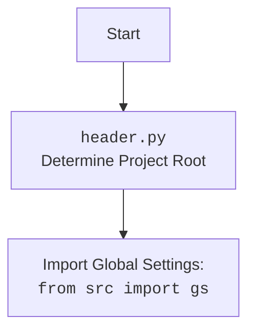

## <алгоритм>

**1. Инициализация бота:**
   - Функция `main()` запускает процесс.
   - Получает токен Telegram бота из глобальных настроек (`gs.credentials.telegram.bot.kazarinov`).
   - Создает экземпляр класса `TelegramBot`, передавая токен в конструктор.
   - `TelegramBot.__init__` создает объект `Application` из `python-telegram-bot`, используя полученный токен.
   - Вызывает метод `register_handlers()` для регистрации обработчиков команд и сообщений.

**2. Регистрация обработчиков:**
   - `TelegramBot.register_handlers()` добавляет следующие обработчики в `application`:
     - `CommandHandler('start', self.start)`: Обработчик команды `/start`, вызывающий метод `self.start`.
     - `CommandHandler('help', self.help_command)`: Обработчик команды `/help`, вызывающий метод `self.help_command`.
     - `CommandHandler('sendpdf', self.send_pdf)`: Обработчик команды `/sendpdf`, вызывающий метод `self.send_pdf`.
     - `MessageHandler(filters.TEXT & ~filters.COMMAND, self.handle_message)`: Обработчик текстовых сообщений (не команд), вызывающий метод `self.handle_message`.
     - `MessageHandler(filters.VOICE, self.handle_voice)`: Обработчик голосовых сообщений, вызывающий метод `self.handle_voice`.
     - `MessageHandler(filters.Document.ALL, self.handle_document)`: Обработчик всех типов документов, вызывающий метод `self.handle_document`.
     - `MessageHandler(filters.TEXT & ~filters.COMMAND, self.handle_log)`:  Обработчик текстовых сообщений, вызывающий метод `self.handle_log`.
   - В функции `main()` также добавляются обработчики для `bot.application` аналогичным образом.
   - `bot.application.run_polling()`: Запускает бота в режиме long-polling.

**3. Обработка команд:**
   - **`/start`:**
     - Метод `TelegramBot.start()` получает объект `Update` и `CallbackContext`.
     - Отправляет приветственное сообщение пользователю.
   - **`/help`:**
     - Метод `TelegramBot.help_command()` получает объект `Update` и `CallbackContext`.
     - Отправляет сообщение со списком доступных команд.
   - **`/sendpdf`:**
     - Метод `TelegramBot.send_pdf()` получает имя файла PDF.
     - Открывает файл PDF на чтение в бинарном режиме.
     - Отправляет PDF файл пользователю в виде документа.

**4. Обработка сообщений:**
   - **Текстовые сообщения:**
      - Метод `TelegramBot.handle_message()` получает объект `Update` и `CallbackContext`.
      - Возвращает текст сообщения пользователя.
   - **Голосовые сообщения:**
      - Метод `TelegramBot.handle_voice()` получает объект `Update` и `CallbackContext`.
      - Получает файл голосового сообщения.
      - Скачивает голосовое сообщение во временный файл.
      - Вызывает метод `TelegramBot.transcribe_voice()` для распознавания речи (заглушка).
      - Отправляет распознанный текст пользователю.
    -  **Документы:**
       - Метод `TelegramBot.handle_document` получает объект `Update` и `CallbackContext`.
       - Получает файл документа.
       - Скачивает файл на локальную машину.
       - Читает содержимое файла как текст и возвращает его.
   - **Логи:**
      - Метод `TelegramBot.handle_log()` получает текст сообщения.
      - Выводит сообщение в лог.
      - Отправляет ответ пользователю.

**Примеры:**

   - **Команда `/start`**: Пользователь отправляет `/start`. Бот отвечает: "Hello! I am your simple bot. Type /help to see available commands."
   - **Команда `/help`**: Пользователь отправляет `/help`. Бот отвечает списком доступных команд.
   - **Команда `/sendpdf`**: Пользователь отправляет `/sendpdf`. Бот пытается отправить PDF файл. Если файл недоступен или ошибка, отправляет сообщение об ошибке.
   - **Текстовое сообщение**: Пользователь отправляет "Привет!". Бот возвращает "Привет!"
   - **Голосовое сообщение**: Пользователь отправляет голосовое сообщение. Бот скачивает файл и отвечает: "Распознанный текст: Распознавание голоса ещё не реализовано."
   - **Документ**: Пользователь отправляет текстовый файл. Бот скачивает файл, читает содержимое и возвращает текст.

## <mermaid>

```mermaid
flowchart TD
    Start[Start Application] --> InitBot[Initialize TelegramBot]
    InitBot --> RegisterHandlers[Register Handlers]
    RegisterHandlers --> RunPolling[Start Bot Polling]
    RunPolling --> WaitForUpdate[Wait for Telegram Update]

    WaitForUpdate --> CommandStart{Command: /start?}
    CommandStart -- Yes --> StartHandler[TelegramBot.start()]
    StartHandler --> ReplyStart[Reply with Start Message]
    ReplyStart --> WaitForUpdate
    
    CommandStart -- No --> CommandHelp{Command: /help?}
    CommandHelp -- Yes --> HelpHandler[TelegramBot.help_command()]
    HelpHandler --> ReplyHelp[Reply with Help Message]
    ReplyHelp --> WaitForUpdate
    
    CommandHelp -- No --> CommandSendPdf{Command: /sendpdf?}
    CommandSendPdf -- Yes --> SendPdfHandler[TelegramBot.send_pdf()]
    SendPdfHandler --> SendPdf[Send PDF File]
    SendPdf --> WaitForUpdate
   
    CommandSendPdf -- No --> MessageText{Message is Text?}
    MessageText -- Yes --> HandleTextMessage[TelegramBot.handle_message()]
    HandleTextMessage --> ReturnText[Return Text]
    ReturnText --> WaitForUpdate
  
    MessageText -- No --> MessageVoice{Message is Voice?}
    MessageVoice -- Yes --> HandleVoiceMessage[TelegramBot.handle_voice()]
    HandleVoiceMessage --> DownloadVoice[Download Voice File]
    DownloadVoice --> TranscribeVoice[TelegramBot.transcribe_voice()]
    TranscribeVoice --> ReplyTranscribed[Reply with Transcribed Text]
    ReplyTranscribed --> WaitForUpdate
    
     MessageVoice -- No --> MessageDocument{Message is Document?}
    MessageDocument -- Yes --> HandleDocumentMessage[TelegramBot.handle_document()]
    HandleDocumentMessage --> DownloadDocument[Download Document File]
    DownloadDocument --> ReadDocument[Read Document Text Content]
    ReadDocument --> ReturnDocumentContent[Return Text Content]
    ReturnDocumentContent --> WaitForUpdate
    
    MessageDocument -- No --> LogMessage{Message is Log?}
    LogMessage -- Yes --> HandleLogMessage[TelegramBot.handle_log()]
    HandleLogMessage --> SendLogMessage[Send Log Message]
    SendLogMessage --> WaitForUpdate
     
    LogMessage -- No --> WaitForUpdate
    
    classDef commandFill fill:#f9f,stroke:#333,stroke-width:2px
    class CommandStart,CommandHelp,CommandSendPdf commandFill
```

**Разбор `mermaid` диаграммы:**

1.  **`Start[Start Application]`**:  Начало программы.
2.  **`InitBot[Initialize TelegramBot]`**: Создание экземпляра класса `TelegramBot`.
3.  **`RegisterHandlers[Register Handlers]`**: Регистрация всех обработчиков команд и сообщений.
4.  **`RunPolling[Start Bot Polling]`**: Запуск режима long-polling для ожидания обновлений от Telegram.
5.  **`WaitForUpdate[Wait for Telegram Update]`**: Ожидание новых сообщений или команд от Telegram.
6.  **`CommandStart{Command: /start?}`**: Проверка, является ли сообщение командой `/start`.
    -   **`StartHandler[TelegramBot.start()]`**: Обработчик команды `/start`, вызывает метод `start` класса `TelegramBot`.
    -   **`ReplyStart[Reply with Start Message]`**: Отправка приветственного сообщения.
7.  **`CommandHelp{Command: /help?}`**: Проверка, является ли сообщение командой `/help`.
    -   **`HelpHandler[TelegramBot.help_command()]`**: Обработчик команды `/help`, вызывает метод `help_command` класса `TelegramBot`.
    -   **`ReplyHelp[Reply with Help Message]`**: Отправка сообщения со списком доступных команд.
8.  **`CommandSendPdf{Command: /sendpdf?}`**: Проверка, является ли сообщение командой `/sendpdf`.
    -   **`SendPdfHandler[TelegramBot.send_pdf()]`**: Обработчик команды `/sendpdf`, вызывает метод `send_pdf` класса `TelegramBot`.
    -  **`SendPdf[Send PDF File]`**: Отправка PDF файла пользователю.
9.  **`MessageText{Message is Text?}`**: Проверка, является ли сообщение текстовым (не командой).
    -   **`HandleTextMessage[TelegramBot.handle_message()]`**: Обработчик текстового сообщения, вызывает метод `handle_message` класса `TelegramBot`.
    -  **`ReturnText[Return Text]`**: Возвращает текст сообщения.
10. **`MessageVoice{Message is Voice?}`**: Проверка, является ли сообщение голосовым.
    -   **`HandleVoiceMessage[TelegramBot.handle_voice()]`**: Обработчик голосового сообщения, вызывает метод `handle_voice` класса `TelegramBot`.
    -   **`DownloadVoice[Download Voice File]`**: Скачивание файла голосового сообщения.
    -   **`TranscribeVoice[TelegramBot.transcribe_voice()]`**: Вызов метода для распознавания речи (заглушка).
    -   **`ReplyTranscribed[Reply with Transcribed Text]`**: Отправка распознанного текста.
11. **`MessageDocument{Message is Document?}`**: Проверка, является ли сообщение документом.
    -   **`HandleDocumentMessage[TelegramBot.handle_document()]`**: Обработчик документа, вызывает метод `handle_document` класса `TelegramBot`.
     -   **`DownloadDocument[Download Document File]`**: Скачивание файла документа.
     -   **`ReadDocument[Read Document Text Content]`**: Чтение текстового содержимого документа.
     -   **`ReturnDocumentContent[Return Text Content]`**: Возвращает текстовое содержимое документа.
12.  **`LogMessage{Message is Log?}`**: Проверка, является ли сообщение текстовым для логирования.
     -   **`HandleLogMessage[TelegramBot.handle_log()]`**: Обработчик текстового сообщения для логирования, вызывает метод `handle_log` класса `TelegramBot`.
     -   **`SendLogMessage[Send Log Message]`**: Отправка подтверждения обработки сообщения.

**Зависимости `mermaid`:**

-   **`telegram`**: Библиотека `python-telegram-bot` используется для создания и управления Telegram ботом. Классы `Application`, `Update`, `CallbackContext` и фильтры являются частями этой библиотеки.
-   **`TelegramBot`**:  Основной класс, который управляет логикой бота, обрабатывает команды и сообщения.
-   **Методы `TelegramBot`**:  `start`, `help_command`, `send_pdf`, `handle_message`, `handle_voice`, `handle_document`, `handle_log`, `transcribe_voice` - это методы класса `TelegramBot`, которые реализуют функциональность бота.



## <объяснение>

**Импорты:**

-   **`pathlib`**: Используется для работы с путями к файлам и каталогам в кроссплатформенном режиме.
-   **`tempfile`**: Используется для создания временных файлов и директорий (не используется напрямую в этом коде, но может быть задействован через `gs.path.temp`).
-   **`asyncio`**:  Используется для реализации асинхронного программирования, что позволяет боту эффективно обрабатывать несколько запросов одновременно.
-   **`logging`**: Используется для записи сообщений в лог.
-   **`telegram`**:
    -   `Update`: Представляет входящие обновления от Telegram (сообщения, команды и т.д.).
    -   `Application`: Основной класс для создания и запуска бота.
    -   `CommandHandler`: Класс для обработки команд (сообщений, начинающихся с `/`).
    -   `MessageHandler`: Класс для обработки сообщений определенного типа (текст, голос, документы).
    -   `filters`: Модуль для определения фильтров для обработчиков сообщений (например, текстовые сообщения, голосовые сообщения).
    -   `CallbackContext`: Контекст текущего разговора, который содержит информацию о состоянии бота и пользователя.
-   **`header`**:  Импортирует модуль `header.py`, который, вероятно, определяет корневую директорию проекта.
-   **`src`**:
    -   `gs`: Модуль `src.gs` содержит глобальные настройки, включая credentials, paths и т.д.
    -   `jjson`: Используется для сериализации и десериализации JSON данных.
    -   `logger.logger`: Модуль для логирования событий приложения.
-   **`requests`**: Используется для скачивания файлов по URL.
-  **`src.utils.convertors.tts`**:
    - `speech_recognizer`: Модуль для распознавания речи (заглушка в данном случае).
    - `text2speech`: Модуль для преобразования текста в речь (не используется в коде).
-   **`src.utils.file`**:
    -   `read_text_file`: Функция для чтения содержимого текстового файла.

**Класс `TelegramBot`:**

-   **`application`**: Атрибут типа `Application` (из `python-telegram-bot`), хранящий экземпляр приложения бота.
-   **`__init__(self, token: str)`**:
    -   Конструктор класса, принимает токен Telegram бота.
    -   Создает экземпляр `Application` с использованием переданного токена.
    -   Вызывает `self.register_handlers()` для регистрации обработчиков.
-   **`register_handlers(self)`**:
    -   Регистрирует обработчики команд (`start`, `help`, `sendpdf`) и сообщений (`handle_message`, `handle_voice`, `handle_document`, `handle_log`).
-   **`start(self, update: Update, context: CallbackContext)`**:
    -   Обработчик команды `/start`.
    -   Отправляет приветственное сообщение.
-   **`help_command(self, update: Update, context: CallbackContext)`**:
    -   Обработчик команды `/help`.
    -   Отправляет список доступных команд.
-   **`send_pdf(self, pdf_file: str | Path)`**:
    -   Обработчик команды `/sendpdf`, отправляет PDF файл пользователю.
    -   Принимает путь к файлу в виде строки или объекта `Path`.
-   **`handle_voice(self, update: Update, context: CallbackContext)`**:
    -   Обработчик голосовых сообщений.
    -   Скачивает голосовое сообщение.
    -   Вызывает `self.transcribe_voice()` (заглушка).
    -   Отправляет распознанный текст пользователю.
-   **`transcribe_voice(self, file_path: Path) -> str`**:
    -   **Заглушка** для распознавания речи. В данном коде всегда возвращает "Распознавание голоса ещё не реализовано."
-   **`handle_document(self, update: Update, context: CallbackContext) -> str`**:
    -   Обработчик полученных документов.
    -   Скачивает документ и читает его текстовое содержимое.
    -   Возвращает текстовое содержимое документа.
-   **`handle_message(self, update: Update, context: CallbackContext) -> str`**:
    -   Обработчик текстовых сообщений (не команд).
    -   Возвращает текст сообщения.
-    **`handle_log(self, update: Update, context: CallbackContext) -> None`**:
    -   Обработчик текстовых сообщений для логирования
    -  Выводит полученное сообщение в лог
    - Отправляет ответ пользователю.

**Функции:**

-   **`main() -> None`**:
    -   Главная функция, которая запускает бота.
    -   Получает токен бота из `gs.credentials.telegram.bot.kazarinov`.
    -   Создает экземпляр `TelegramBot`.
    -   Регистрирует обработчики в приложении бота.
    -   Запускает бота в режиме long-polling.

**Переменные:**

-   `token` (str): Токен для авторизации бота в Telegram API.
-   `application` (Application): Экземпляр класса `Application`, управляющий ботом.
-   `update` (Update): Представляет входящие обновления от Telegram.
-  `context` (CallbackContext): Контекст текущего разговора.
- `file_path` (Path): Путь к скачанному файлу.
- `tmp_file_path` (str): Путь к временному файлу.
- `log_message` (str): Текст полученного логирования.

**Потенциальные ошибки и области для улучшения:**

1.  **Заглушка для распознавания речи:** Функция `transcribe_voice` является заглушкой и не выполняет реального распознавания речи. Необходимо интегрировать реальный сервис распознавания речи.
2.  **Обработка ошибок:** В методе `send_pdf` есть общая обработка ошибок (через `except Exception`), было бы лучше более точечно обрабатывать определенные типы ошибок.
3.  **Отсутствие обработки нетекстовых документов**:  Если пользователь отправит не текстовый документ метод `handle_document` приведет к ошибке.
4.  **Обработка ошибок при скачивании файлов**: Необходимо добавить проверку на корректность скачивания файлов.
5.  **Логирование**: Стоит добавить логирование на каждый этап работы.

**Взаимосвязи с другими частями проекта:**

-   **`header.py`**: Определяет корень проекта, что нужно для корректной работы с путями к файлам.
-   **`src.gs`**: Глобальные настройки, включая токен бота, пути к файлам.
-   **`src.logger.logger`**: Логирование всех событий и ошибок.
-   **`src.utils.convertors.tts`**: Используется для распознавания речи (в данном случае заглушка).
-    **`src.utils.file`**: Используется для чтения текстовых файлов.

**Цепочка взаимосвязей:**

1.  `main()` -> `TelegramBot.__init__()` -> `TelegramBot.register_handlers()`.
2.  Получение токена из `gs`.
3.  Логирование через `logger`.
4.  Чтение файлов через `read_text_file`.
5.  Распознавание речи через `speech_recognizer` (заглушка).
6.  Использование библиотек `telegram`, `asyncio`, `requests`, `pathlib` и `tempfile`.

Этот анализ обеспечивает полное понимание работы кода, включая его структуру, зависимости и потенциальные улучшения.