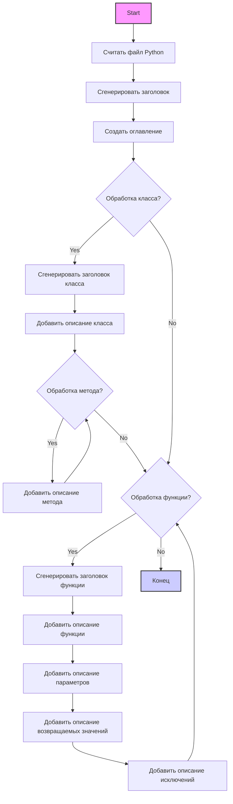

## ИНСТРУКЦИЯ:

### <алгоритм>

1.  **Анализ входного файла**:
    *   Принимается на вход python-файл.
    *   Файл читается построчно.

2.  **Генерация заголовка**:
    *   Создается заголовок первого уровня `# Module Name` (имя модуля берется из имени файла).
    *   Создается заголовок второго уровня `## Overview`, с кратким описанием модуля.

3.  **Создание TOC (Оглавления)**:
    *   Оглавление создается в начале файла.
    *   Ссылки в оглавлении должны вести на разделы, описывающие классы и функции.

4.  **Обработка классов**:
    *   При обнаружении объявления класса (`class ClassName:`):
        *   Создается заголовок третьего уровня `### ClassName`.
        *   Добавляется описание класса `**Description**: Brief description of the class.` (описание берется из docstring класса, если есть).
        *   Раздел для методов `**Methods**:` создается, если у класса есть методы.
        *   Для каждого метода:
            *   Создается строка `- method_name: Brief description of the method.` (имя метода берется из объявления метода, описание из docstring).
        
5. **Обработка функций**
    * При обнаружении объявления функции (`def function_name(`):
         *   Создается заголовок третьего уровня `### function_name`
        *   Добавляется описание функции `**Description**: Brief description of the function.` (описание берется из docstring функции, если есть).
        *   Раздел `**Parameters**:` с описанием параметров (берутся из docstring, если есть).
        *   Раздел `**Returns**:` с описанием возвращаемого значения (берется из docstring, если есть).
        *   Раздел `**Raises**:` с описанием возможных исключений (берется из docstring, если есть).

6.  **Форматирование**:
    *   Используется Markdown синтаксис.
    *   Используются заголовки (`#`, `##`, `###`, `####`).
    *   Описание параметров и возвращаемых значений формируются в виде списков `-`.
    *  В обработке исключений используется `ex` вместо `e`.
    
7.  **Вывод**:
    *   Сформированный `Markdown` текст выводится в качестве результата.

### <mermaid>

**Зависимости:**

*   Нет внешних зависимостей, код работает в рамках обработки текста и не импортирует сторонние библиотеки.

### <объяснение>

**Общее описание:**

Этот код представляет собой инструкцию для создания документации в формате Markdown на основе Python-файла. Инструкция описывает процесс автоматической генерации документации, включая структуру, форматирование и содержание. Код описывает, как нужно структурировать Markdown-файл с заголовками, описаниями классов, функций, методами, параметрами, возвращаемыми значениями и возможными исключениями.

**Импорты:**

*   Импорты не используются в данном коде, это инструкция, а не исполняемый код.

**Классы:**

*   Инструкция не содержит определений классов. Она описывает, как обрабатывать определения классов, если они встречаются в анализируемом файле.
*   Пример: `class ClassName:` будет преобразован в `### ClassName` в Markdown.

**Функции:**

*   Инструкция не содержит определений функций. Она описывает, как обрабатывать определения функций, если они встречаются в анализируемом файле.
*   Пример: `def function_name(param: str, param1: Optional[str | dict | str] = None) -> dict | None:` будет преобразован в `### function_name`, а также будут выделены параметры, возвращаемые значения и возможные исключения, взятые из docstring.

**Переменные:**

*   Переменные используются неявно, для описания процесса обработки. В инструкции не задаются переменные.
*   Переменные используются как параметры и временные хранилища при обработке текстового файла.

**Подробности:**

1.  **Формат документации:** Инструкция четко определяет, как должен выглядеть выходной Markdown файл. Это включает в себя заголовки разных уровней, списки, описание параметров, возвращаемых значений и исключений.
2.  **Использование docstring:** Описание классов, функций, методов, параметров, возвращаемых значений и исключений должны браться из docstring, если они есть.
3.  **TOC:** Оглавление генерируется для упрощения навигации по документации.
4.  **Форматирование:** Уделяется внимание правильному форматированию, включая заголовки, списки и выделение кода.
5.  **Обработка исключений:** В инструкции подчеркивается, что в обработчиках исключений нужно использовать `ex` вместо `e`.
6.  **Пример:** Предоставляется пример, как должен выглядеть итоговый документ в Markdown.

**Потенциальные ошибки и области улучшения:**

*   Инструкция не описывает, что делать, если docstring нет. Возможно, стоит добавить, чтобы генерировать пустые секции параметров, возвращаемых значений и исключений, если docstring отсутствует.
*   Инструкция не обрабатывает ситуации, когда в docstring используются форматы, отличные от стандартных.
*   Необходимо добавить описание возможных ошибок при обработке файла.
*   Нет уточнения для обработки статических методов и свойств класса.
*   Не предусмотрена обработка вложенных классов и функций.

**Взаимосвязи с другими частями проекта:**

*   Инструкция является частью системы для автоматического создания документации. Она взаимодействует с компонентами, которые считывают Python-файлы и генерируют на их основе Markdown-текст.
*   Созданные Markdown-файлы будут использоваться для предоставления документации разработчикам, поэтому она связана с компонентами, которые обеспечивают доступ к документации.

В целом, инструкция подробная и обеспечивает достаточно информации для написания скрипта, который генерирует `Markdown` документацию из Python-кода. Необходимо обратить внимание на описанные выше потенциальные ошибки и области улучшения при реализации данного функционала.