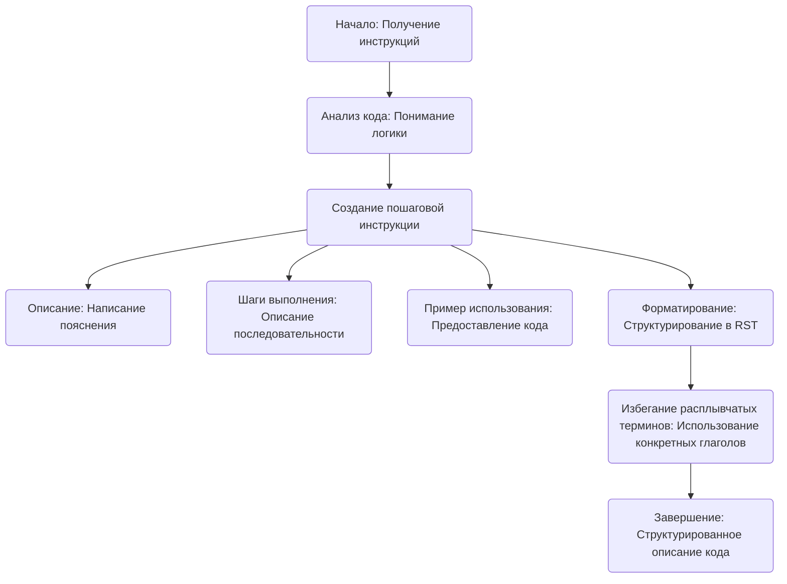

## ИНСТРУКЦИЯ:

Анализируй предоставленный код подробно и объясни его функциональность. Ответ должен включать три раздела:  

1. **<алгоритм>**: Опиши рабочий процесс в виде пошаговой блок-схемы, включая примеры для каждого логического блока, и проиллюстрируй поток данных между функциями, классами или методами.  
2. **<mermaid>**: Напиши код для диаграммы в формате `mermaid`, проанализируй и объясни все зависимости, 
    которые импортируются при создании диаграммы. 
    **ВАЖНО!** Убедитесь, что все имена переменных, используемые в диаграмме `mermaid`, 
    имеют осмысленные и описательные имена. Имена переменных вроде `A`, `B`, `C`, и т.д., не допускаются!  
    
    **Дополнительно**: Если в коде есть импорт `import header`, добавьте блок `mermaid` flowchart, объясняющий `header.py`:\
    ```mermaid
    flowchart TD
        Start --> Header[<code>header.py</code><br> Determine Project Root]
    
        Header --> import[Import Global Settings: <br><code>from src import gs</code>] 
    ```

3. **<объяснение>**: Предоставьте подробные объяснения:  
   - **Импорты**: Их назначение и взаимосвязь с другими пакетами `src.`.  
   - **Классы**: Их роль, атрибуты, методы и взаимодействие с другими компонентами проекта.  
   - **Функции**: Их аргументы, возвращаемые значения, назначение и примеры.  
   - **Переменные**: Их типы и использование.  
   - Выделите потенциальные ошибки или области для улучшения.  

Дополнительно, постройте цепочку взаимосвязей с другими частями проекта (если применимо).  

Это обеспечивает всесторонний и структурированный анализ кода.
## Формат ответа: `.md` (markdown)
**КОНЕЦ ИНСТРУКЦИИ**

### <алгоритм>

1. **Начало**: Получение инструкций для генерации документации к коду.
2. **Анализ кода**: Понимание логики и действий, выполняемых кодом.
    * **Пример**: Изучение, что код генерирует документацию на основе инструкций.
3. **Создание пошаговой инструкции**: Формирование структуры для объяснения кода.
    * **Описание**: Написание пояснения о назначении блока кода.
        * **Пример**: "Данный блок кода генерирует документацию в формате reStructuredText".
    * **Шаги выполнения**: Описание последовательности действий в коде.
        * **Пример**: "1. Описание, что делает код, 2. Описание последовательности шагов, 3. Пример использования".
    * **Пример использования**: Предоставление примера, как применять этот фрагмент кода.
        * **Пример**: Блок кода на языке python, как использовать эту инструкцию в реальном проекте.
4. **Форматирование**: Следование структуре `reStructuredText (RST)` для представления документации.
    * **Пример**: Использование заголовков, подразделов, code-block для корректного отображения.
5. **Избегание расплывчатых терминов**: Использование конкретных глаголов для описания действий.
    * **Пример**: Вместо "получаем", использовать "валидирует", "проверяет", "отправляет".
6. **Завершение**: Подготовка структурированного описания кода в формате `RST`.

### <mermaid>



**Объяснение `mermaid` диаграммы:**

Диаграмма описывает процесс обработки инструкций для генерации документации к коду. Начинается с получения инструкций (`Start`). Далее, следует анализ кода (`AnalyzeCode`), чтобы понять его логику. После этого формируется пошаговая инструкция (`CreateStepByStepInstruction`), которая состоит из трех основных частей: `Description` (описание блока кода), `Steps` (последовательность действий) и `ExampleUsage` (пример использования). Далее идет этап `Formatting`, который предполагает форматирование в соответствии со структурой RST. На последнем шаге `AvoidVagueTerms`, проверяется отсутствие расплывчатых терминов. Наконец, процесс завершается `End`, когда сформировано структурированное описание кода.
### <объяснение>

**Описание:**

Предоставленный код представляет собой набор инструкций для генерации документации к коду. Он не является исполняемым кодом в обычном понимании, а скорее методическим руководством для разработчиков. Цель этих инструкций — обеспечить создание ясной и структурированной документации, которая легко воспринимается и понимается.

**Импорты:**

В данном коде нет явных импортов. Это набор инструкций, а не программный код, поэтому необходимости в импортах нет.

**Классы:**

Классы отсутствуют, так как код представляет собой инструкцию по написанию документации, а не реализацию классов.

**Функции:**

Функции отсутствуют, так как код представляет собой инструкцию по написанию документации, а не реализацию функций.

**Переменные:**

В коде используются переменные в виде строк, которые описывают шаги и требования к генерации документации. Например, используются строки для описания заголовков разделов ("Описание", "Шаги выполнения", "Пример использования"), а также для пояснений ("Объяснение, что делает код").

**Подробности и потенциальные улучшения:**

1.  **Детализация шагов:** Инструкции достаточно детализированы, но можно добавить примеры для более четкого понимания каждого шага.
2.  **Автоматизация:** Для упрощения процесса, можно предусмотреть автоматизацию на основе этих инструкций.
3.  **Проверка результата:** Можно добавить пункт про проверку качества сгенерированной документации.
4.  **Расширение форматов:** Возможность добавления поддержки других форматов документации, помимо `reStructuredText`.
5. **Цепочка взаимосвязей с другими частями проекта:** Этот код представляет собой инструкцию по оформлению кода, и он может быть использован в любом проекте, где необходима документация.  Фактически, он является гайдом для разработчиков при написании документации к коду. 

**Заключение:**

Представленный фрагмент кода является инструкцией по написанию документации. Он содержит четкие шаги и рекомендации для создания структурированного и понятного описания кода. Соблюдение этих инструкций поможет создать качественную и полезную документацию к проекту.