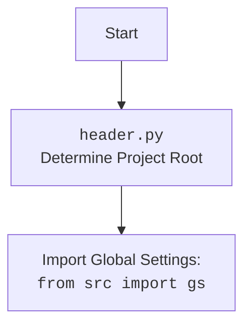

## ИНСТРУКЦИЯ:

Анализируй предоставленный код подробно и объясни его функциональность. Ответ должен включать три раздела:  

1. **<алгоритм>**: Опиши рабочий процесс в виде пошаговой блок-схемы, включая примеры для каждого логического блока, и проиллюстрируй поток данных между функциями, классами или методами.  
2. **<mermaid>**: Напиши код для диаграммы в формате `mermaid`, проанализируй и объясни все зависимости, 
    которые импортируются при создании диаграммы. 
    **ВАЖНО!** Убедитесь, что все имена переменных, используемые в диаграмме `mermaid`, 
    имеют осмысленные и описательные имена. Имена переменных вроде `A`, `B`, `C`, и т.д., не допускаются!  
    
    **Дополнительно**: Если в коде есть импорт `import header`, добавьте блок `mermaid` flowchart, объясняющий `header.py`:\
    ```mermaid
    flowchart TD
        Start --> Header[<code>header.py</code><br> Determine Project Root]
    
        Header --> import[Import Global Settings: <br><code>from src import gs</code>] 
    ```

3. **<объяснение>**: Предоставьте подробные объяснения:  
   - **Импорты**: Их назначение и взаимосвязь с другими пакетами `src.`.  
   - **Классы**: Их роль, атрибуты, методы и взаимодействие с другими компонентами проекта.  
   - **Функции**: Их аргументы, возвращаемые значения, назначение и примеры.  
   - **Переменные**: Их типы и использование.  
   - Выделите потенциальные ошибки или области для улучшения.  

Дополнительно, постройте цепочку взаимосвязей с другими частями проекта (если применимо).  

Это обеспечивает всесторонний и структурированный анализ кода.
## Формат ответа: `.md` (markdown)
**КОНЕЦ ИНСТРУКЦИИ**

## <алгоритм>

1.  **Начало**: Скрипт запускается, принимая на вход директорию `src` (или другую директорию с `.md` файлами) и опциональный аргумент `--lang`, определяющий язык (`ru` или `en`).
2.  **Инициализация**:
    *   Определяется корневая директория проекта.
    *   Создается (или очищается) директория `docs` для хранения `SUMMARY.md`.
    *   Устанавливается язык фильтрации (`ru` или `en`).
3.  **Рекурсивный обход директории**:
    *   Начинается рекурсивный обход указанной директории (например, `src`).
    *   Для каждого файла проверяется его расширение (`.md`).
4.  **Фильтрация файлов (если применимо)**:
    *   Если выбран язык `ru`:
        *   Файлы с суффиксом `.ru.md` включаются в `SUMMARY.md`.
        *   Файлы без суффикса `.ru.md` также включаются.
        *   Файлы с суффиксом `.en.md` игнорируются.
    *   Если выбран язык `en`:
        *   Файлы с суффиксом `.ru.md` исключаются из `SUMMARY.md`.
        *   Файлы без суффикса `.ru.md` включаются.
5. **Формирование записей SUMMARY.md**:
    * Для каждого отфильтрованного `.md` файла формируется строка для `SUMMARY.md` в виде `- [file_name](file_path)`.
    * Например:
      -  `[module_name](module_name.md)`
      -  `[module_name_ru](module_name.ru.md)`
6.  **Запись в `SUMMARY.md`**:
    *   Собранные строки `SUMMARY.md` записываются в файл `docs/SUMMARY.md`.
    *   Пример:
    ```
    # Summary
    
    - [readme](readme.md)
    - [readme_ru](readme.ru.md)
    - [file1](file1.md)
    - [file2](file2.ru.md)
    ```
7.  **Завершение**: Скрипт завершает работу.

## <mermaid>

```mermaid
flowchart TD
    Start[Start] --> Input[Input: Directory, Language]
    Input --> Init[Initialize: Project Root, Docs Directory, Language Filter]
    Init --> Traverse[Traverse Directory Recursively]
    Traverse --> FileCheck{Is File a .md?}
    FileCheck -- Yes --> LangCheck{Language Filter Required?}
    LangCheck -- Yes --> FilterFiles{Filter Files by Language}
    FilterFiles --> FormatEntry[Format SUMMARY.md Entry]
    LangCheck -- No --> FormatEntry
    FileCheck -- No --> Traverse
    FormatEntry --> AggregateEntries[Aggregate SUMMARY.md Entries]
     AggregateEntries --> WriteSummary[Write SUMMARY.md to File]
    WriteSummary --> End[End]


    subgraph FilterFiles
        direction TB
        FilterStart[Start Filter] --> CheckRuSuffix{Has .ru.md Suffix?}
        CheckRuSuffix -- Yes --> RuLangFilter{Language is "ru"?}
        CheckRuSuffix -- No --> EnLangFilter{Language is "en"?}
        RuLangFilter -- Yes --> IncludeFileRu[Include File]
        RuLangFilter -- No --> IncludeFile[Include File]
        EnLangFilter -- Yes --> ExcludeFile[Exclude File]
        EnLangFilter -- No --> IncludeFile
        IncludeFile --> FilterEnd[End Filter]
        ExcludeFile --> FilterEnd
        IncludeFileRu --> FilterEnd
    end
```

**Описание зависимостей:**

*   `Start` - Начало выполнения скрипта.
*   `Input` - Ввод директории с `.md` файлами и опционального параметра языка фильтрации.
*   `Init` - Инициализация необходимых переменных и директорий.
*   `Traverse` - Рекурсивный обход файловой системы, начиная с указанной директории.
*    `FileCheck` - Проверка, является ли текущий элемент файловой системы файлом с расширением `.md`.
*   `LangCheck` - Проверка, нужно ли применять фильтр по языку.
*   `FilterFiles` - Фильтрация файлов по языку (вложенный подграф).
    *   `FilterStart` - Начало блока фильтрации файлов.
    *   `CheckRuSuffix` - Проверяется наличие у файла суффикса `.ru.md`.
    *   `RuLangFilter` - Проверяется, является ли выбранный язык `ru`.
    *   `EnLangFilter` - Проверяется, является ли выбранный язык `en`.
    *   `IncludeFileRu` - Включение файла для языка `ru`.
    *   `IncludeFile` - Включение файла (без суффикса `.ru.md`).
    *   `ExcludeFile` - Исключение файла (с суффиксом `.ru.md` при выборе языка `en`).
    *   `FilterEnd` - Конец блока фильтрации файлов.
*   `FormatEntry` - Форматирование пути и имени файла для записи в `SUMMARY.md`.
*   `AggregateEntries` - Добавление форматированной записи в общий список записей `SUMMARY.md`.
*   `WriteSummary` - Запись списка собранных записей в файл `SUMMARY.md`.
*   `End` - Конец выполнения скрипта.

## <объяснение>

**Импорты:**

*   `os`: Модуль для работы с операционной системой, используется для:
    *   `os.path.join`: Объединение путей.
    *   `os.path.abspath`: Получение абсолютного пути.
    *   `os.path.dirname`: Получение директории родительского каталога.
    *  `os.path.isdir`: Проверка, является ли путь директорией.
    *   `os.makedirs`: Создание директорий.
    *   `os.walk`: Рекурсивный обход директорий.
*   `argparse`: Модуль для разбора аргументов командной строки.
    *  Используется для разбора аргументов: `lang` и `src_dir`.
*   `typing`: Модуль для аннотаций типов.
    *  Используется для аннотации типа возвращаемого значения функции `build_summary`.
*  `src.header`: Это пользовательский модуль для определения корня проекта.

**Функции:**

1.  `build_summary(src_dir: str, lang: Optional[str] = None) -> str:`
    *   **Аргументы:**
        *   `src_dir` (str): Путь к директории с исходными `.md` файлами.
        *   `lang` (Optional[str]): Язык для фильтрации (`ru` или `en`). Если не указан, фильтрация не применяется.
    *   **Возвращаемое значение:** `str` Строка, содержащая сформированное содержимое `SUMMARY.md`.
    *   **Назначение:**  Формирует строку с оглавлением для `SUMMARY.md` файла.
    *   **Пример:** 
        ```python
            build_summary("src", "ru")
        ```
    *  Поток данных:
        * `src_dir`  --> `build_summary`
        * `lang` -->  `build_summary`
        *  `build_summary` --> `summary_content`

2.  `main():`
    *   **Аргументы:** Нет.
    *   **Возвращаемое значение:** Нет.
    *   **Назначение:** Основная функция, запускающая скрипт.
    *   **Пример:** 
       ```bash
        python src/endpoints/hypo69/code_assistant/make_summary.py -lang ru src
       ```
    *   **Поток данных:**
        * Аргументы командной строки --> `main`
        * `main` --> `build_summary`
        * `build_summary` -->  `SUMMARY.md`

**Переменные:**

*   `project_root_dir` (str): Абсолютный путь к корневой директории проекта, определяется с помощью `header.get_project_root()`.
*   `docs_dir` (str): Путь к директории `docs`, где будет храниться файл `SUMMARY.md`.
*   `summary_content` (str): Накапливаемая строка с содержимым `SUMMARY.md`.
*   `lang` (str, optional): Язык фильтрации, принимается через аргументы командной строки.
*   `src_dir` (str):  Путь к директории с исходными `.md` файлами, принимается через аргументы командной строки.
*   `file_path` (str): Полный путь к текущему обрабатываемому `.md` файлу.
*   `relative_path` (str): Путь к текущему обрабатываемому `.md` файлу относительно корня проекта.
*  `file_name` (str): Имя текущего обрабатываемого файла (без расширения).
*  `summary_entry` (str): Строка для записи в `SUMMARY.md` в формате `- [file_name](file_path)`.

**Дополнительно:**

*   **Взаимосвязи с другими частями проекта:**
    *   Модуль `make_summary.py` использует `header.py` для определения корня проекта, что обеспечивает переносимость скрипта между разными окружениями.
*   **Потенциальные ошибки и области для улучшения:**
    *   Отсутствует обработка ошибок при чтении и записи файлов.
    *   Жестко заданный путь к директории `docs`. Можно сделать настраиваемым.
    *   Можно добавить поддержку других расширений файлов.

