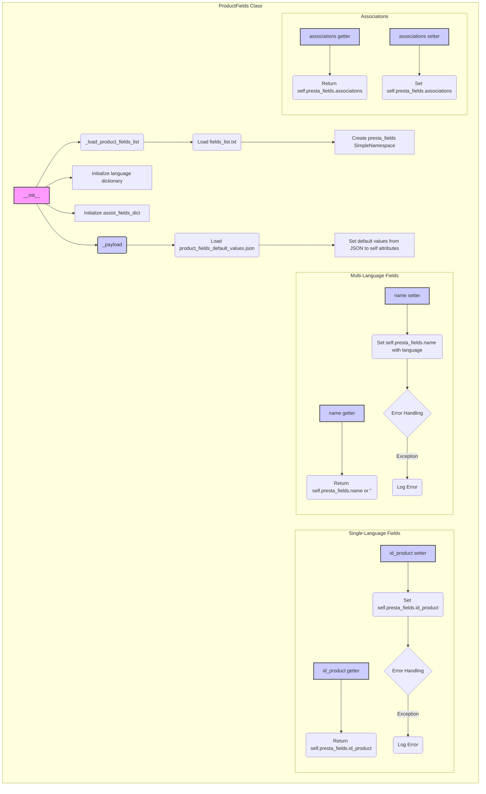

## АНАЛИЗ КОДА:

### <алгоритм>
1.  **Инициализация класса `ProductFields` (`__init__`)**:
    *   Загружает список полей продукта из файла (`fields_list.txt`) с помощью `_load_product_fields_list()`.
        *   Пример: Файл `fields_list.txt` содержит: `id_product`, `name`, `description`, и т.д.
    *   Инициализирует словарь языков (`language`) с кодами и ID. Например, `{'en': 1, 'he': 2, 'ru': 3}`.
    *   Создает объект `SimpleNamespace` (`presta_fields`) для хранения полей продукта, инициализируя их значением `None`.
    *   Создает словарь `assist_fields_dict` для дополнительных полей, таких как URL-адрес изображения по умолчанию и списки URL-адресов изображений.
    *   Загружает значения по умолчанию для полей из JSON-файла (`product_fields_default_values.json`) с помощью `_payload()`.

2.  **Загрузка списка полей продукта (`_load_product_fields_list`)**:
    *   Читает текстовый файл, содержащий список полей продукта (по одному на строку).
        *   Пример: Читает файл `fields_list.txt`, возвращая список строк.

3.  **Загрузка значений по умолчанию (`_payload`)**:
    *   Загружает данные из JSON-файла.
        *   Пример: JSON-файл содержит значения по умолчанию для полей: `{"id_product": 0, "name": {"language": []}, ...}`.
    *   Если файл не найден или не может быть загружен, регистрирует сообщение об ошибке и возвращает `False`.
    *   Присваивает значения из JSON-файла в качестве атрибутов объекта `self`.
        *   Пример: `self.id_product` получает значение `0` из JSON.

4.  **Работа с полями продукта (геттеры/сеттеры)**:
    *   **Одноязычные поля (например, `id_product`)**:
        *   **Геттер**: Возвращает значение поля из `self.presta_fields`.
            *   Пример: `product.id_product` возвращает значение `self.presta_fields.id_product`.
        *   **Сеттер**: Устанавливает значение поля в `self.presta_fields`. Если возникает исключение, регистрирует ошибку.
            *   Пример: `product.id_product = 123` устанавливает значение `123` в `self.presta_fields.id_product`.
    *   **Многоязычные поля (например, `name`)**:
        *   **Геттер**: Возвращает значение поля из `self.presta_fields` или пустую строку, если значение отсутствует.
            *   Пример: `product.name` возвращает значение `self.presta_fields.name`.
        *   **Сеттер**: Устанавливает значение поля в `self.presta_fields` в формате словаря для определенного языка.
            *   Пример: `product.name = "Product Name", lang='en'` устанавливает значение `{"language": [{"attrs": {"id": 1}, "value": "Product Name"}]}` в `self.presta_fields.name`.
    *   **Ассоциации (`associations`)**:
        *   **Геттер**: Возвращает значение поля `self.presta_fields.associations`.
        *   **Сеттер**: Устанавливает значение поля `self.presta_fields.associations`.

5.  **Примеры использования**:
    *   Создание экземпляра класса `ProductFields`.
        *   Пример: `product = ProductFields()`.
    *   Установка и получение значений одноязычных полей.
    *   Установка и получение значений многоязычных полей.
    *   Установка ассоциаций.

### <mermaid>

### <объяснение>

**Импорты**:
*   `from pathlib import Path`: Импортирует класс `Path` из модуля `pathlib` для работы с путями к файлам и каталогам.
*   `from typing import List, Optional, Dict`: Импортирует типы для аннотации типов переменных, упрощая чтение и отладку кода.
*   `from types import SimpleNamespace`: Импортирует класс `SimpleNamespace` из модуля `types`. Это простой способ создания объектов, у которых атрибуты могут быть доступны как через точку, так и через словарь.
*   `from src.utils.file_utils import read_text_file`: Импортирует функцию `read_text_file` из `src.utils.file_utils`, которая используется для чтения текстовых файлов.
*   `from src.utils.json_utils import j_loads`: Импортирует функцию `j_loads` из `src.utils.json_utils`, которая используется для загрузки JSON данных.
*   `from src import gs`: Импортирует глобальные настройки `gs` из пакета `src`, предоставляя доступ к конфигурационным путям проекта.
*   `from src.utils.logger import logger`: Импортирует объект `logger` из `src.utils.logger` для логирования ошибок и отладочных сообщений.

**Класс `ProductFields`**:
*   **Роль**: Управляет и структурирует данные продукта в формате, требуемом PrestaShop API.
*   **Атрибуты**:
    *   `product_fields_list`: Список полей продукта, загруженный из текстового файла.
    *   `language`: Словарь, содержащий соответствия между языковыми кодами и их идентификаторами.
    *   `presta_fields`: Объект `SimpleNamespace` для хранения полей продукта.
    *   `assist_fields_dict`: Словарь для хранения дополнительных полей.
*   **Методы**:
    *   `__init__(self)`: Инициализирует класс, загружая поля продукта и устанавливая значения по умолчанию.
    *   `_load_product_fields_list(self) -> List[str]`: Загружает список полей продукта из текстового файла.
    *   `_payload(self) -> bool`: Загружает значения по умолчанию для полей из JSON-файла.
    *   Геттеры и сеттеры для полей продукта (например, `id_product`, `name`, `associations`).

**Функции**:
*   `_load_product_fields_list(self) -> List[str]`: Функция загружает список полей продукта из текстового файла и возвращает список строк.
    *   Пример: Вызывает `read_text_file` с путем к файлу `fields_list.txt` и получает список строк.
*   `_payload(self) -> bool`: Функция загружает значения по умолчанию для полей продукта из JSON-файла.
    *   Аргументы: нет.
    *   Возвращаемое значение: `True` если загрузка прошла успешно, иначе `False`.
    *   Пример: Вызывает `j_loads` с путем к файлу `product_fields_default_values.json`.
*   Геттеры и сеттеры для полей продукта:
    *   Геттеры возвращают текущие значения соответствующих полей.
    *   Сеттеры устанавливают или обновляют значения соответствующих полей. Если происходит ошибка, регистрируют ее в логе.

**Переменные**:
*   `self.product_fields_list`: Список строк (полей продукта), загруженных из файла.
*   `self.language`: Словарь, который ставит в соответствие языковые коды с id.
*   `self.presta_fields`: Экземпляр `SimpleNamespace`, который хранит поля продукта.
*   `self.assist_fields_dict`: Словарь для дополнительных полей, таких как `default_image_url` и `images_urls`.
*   `value`: Представляет значение, которое устанавливается в поля продукта.
*   `data`: Словарь, содержащий значения по умолчанию, загруженные из JSON-файла.

**Потенциальные ошибки и улучшения**:

1.  **Отсутствие обработки ошибок при работе с файлами**: В методах `_load_product_fields_list` и `_payload` не предусмотрена полная обработка исключений (например, `FileNotFoundError`, `JSONDecodeError`), кроме простого логгирования.
2.  **Жестко заданные пути к файлам**: Пути к файлам (`fields_list.txt`, `product_fields_default_values.json`) жестко закодированы. Возможно, стоит сделать их более гибкими, используя конфигурационные параметры.
3.  **Сложный формат многоязычных полей**: Структура данных для многоязычных полей (например, `name`) достаточно сложна. Возможно, имеет смысл рассмотреть вариант упрощения.
4.  **Отсутствие проверок типов**: Сеттеры для полей продукта принимают значения без явных проверок типов, что может привести к ошибкам.
5.  **Обработка ошибок в сеттерах**: Сеттеры для полей продукта обрабатывают исключения, но не возвращают их вызывающей стороне.

**Взаимосвязь с другими частями проекта**:
*   Класс `ProductFields` зависит от `src.utils.file_utils` для чтения текстовых файлов.
*   Класс `ProductFields` зависит от `src.utils.json_utils` для загрузки данных JSON.
*   Класс `ProductFields` зависит от `src.gs` для доступа к путям файлов.
*   Класс `ProductFields` зависит от `src.utils.logger` для логирования.
*   `ProductFields` является частью системы работы с продуктами PrestaShop и используется для формирования данных, отправляемых в API.

Этот анализ предоставляет подробное объяснение кода, включая его функциональность, структуру, взаимосвязи, а также возможные улучшения.