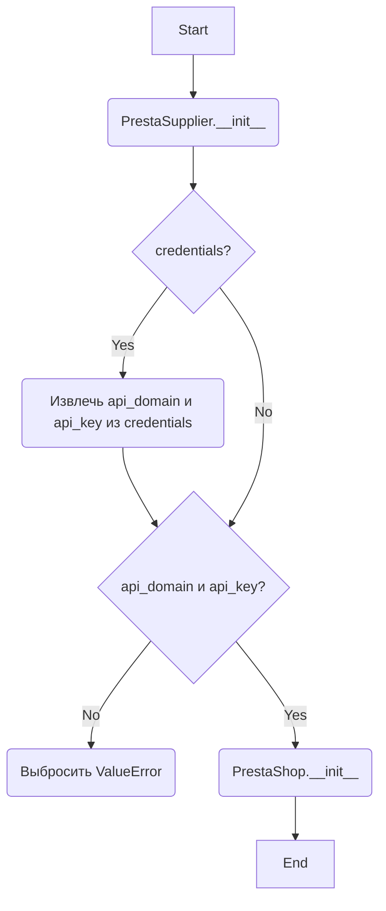
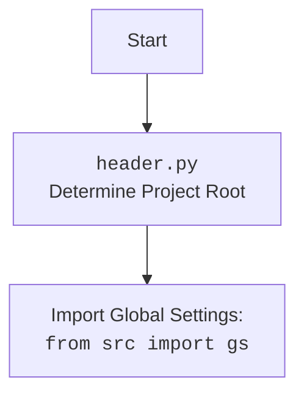

## Анализ кода `hypotez/src/endpoints/prestashop/supplier.py`

### 1. Алгоритм

1.  **Инициализация**:
    *   Начинается с инициализации класса `PrestaSupplier`.
    *   Принимает параметры `credentials`, `api_domain` и `api_key`. Если `credentials` предоставлены, из них извлекаются `api_domain` и `api_key`.
    *   Проверяет, что `api_domain` и `api_key` не `None`. Если они отсутствуют, выбрасывается исключение `ValueError`.
    *   Вызывает конструктор родительского класса `PrestaShop` с `api_domain` и `api_key`.

2.  **Работа с API**:
    *   Класс `PrestaSupplier` наследует функциональность от класса `PrestaShop`, который, предположительно, предоставляет методы для взаимодействия с API PrestaShop.
    *   Методы класса `PrestaShop` (не показаны в данном коде) используются для выполнения операций, связанных с поставщиками (например, получение, создание, обновление, удаление).

Пример для блока инициализации:

```python
supplier = PrestaSupplier(api_domain='https://your-prestashop.com/api', api_key='YOUR_API_KEY')
```

Здесь создается экземпляр класса `PrestaSupplier` с указанием домена API и ключа API.

### 2. Mermaid



**Объяснение зависимостей `mermaid`**:

*   `PrestaSupplier.__init__`: Конструктор класса `PrestaSupplier`. Отвечает за инициализацию объекта поставщика.
*   `credentials`: Проверка наличия параметра `credentials`.
*   `api_domain` и `api_key`: Извлечение `api_domain` и `api_key` из `credentials`.
*   `PrestaShop.__init__`: Конструктор базового класса `PrestaShop`.



### 3. Объяснение

**Импорты**:

*   `types.SimpleNamespace`: Используется для создания объектов, к атрибутам которых можно обращаться как к обычным атрибутам объектов.
*   `typing.Optional`: Используется для указания, что переменная может иметь значение определенного типа или `None`.
*   `header`: Используется для определения корневого каталога проекта.
*   `src`: Ссылка на корневой каталог проекта.
*   `src.gs`:  Глобальные настройки проекта.
*   `src.logger.logger`: Модуль логирования для записи информации о работе программы.
*   `src.utils.jjson`:  Модуль, содержащий функции для работы с JSON, такие как `j_loads_ns`.
*   `.api.PrestaShop`:  Базовый класс для работы с API PrestaShop.

**Класс `PrestaSupplier`**:

*   **Роль**: Предоставляет интерфейс для работы с поставщиками PrestaShop через API.
*   **Атрибуты**:
    *   `api_domain` (str): Домен API PrestaShop.
    *   `api_key` (str): Ключ API для доступа к PrestaShop.
*   **Методы**:
    *   `__init__(self, credentials=None, api_domain=None, api_key=None, *args, **kwards)`: Конструктор класса. Инициализирует объект `PrestaSupplier`, проверяет наличие необходимых параметров и вызывает конструктор родительского класса `PrestaShop`.
*   **Взаимодействие**:
    *   Наследует от класса `PrestaShop`, который предоставляет базовую функциональность для взаимодействия с API PrestaShop.
    *   Использует модуль `src.logger.logger` для логирования ошибок и другой информации.

**Функции**:

*   `__init__(self, credentials=None, api_domain=None, api_key=None, *args, **kwards)`:
    *   **Аргументы**:
        *   `credentials` (Optional[dict | SimpleNamespace]): Словарь или объект `SimpleNamespace`, содержащий `api_domain` и `api_key`.
        *   `api_domain` (Optional[str]): Домен API PrestaShop.
        *   `api_key` (Optional[str]): Ключ API для доступа к PrestaShop.
        *   `*args`: Произвольные позиционные аргументы, передаваемые в конструктор родительского класса.
        *   `**kwards`: Произвольные именованные аргументы, передаваемые в конструктор родительского класса.
    *   **Возвращаемое значение**: `None`.
    *   **Назначение**: Инициализация объекта `PrestaSupplier`, проверка наличия необходимых параметров и вызов конструктора родительского класса `PrestaShop`.
    *   **Примеры**:

```python
supplier = PrestaSupplier(api_domain='https://your-prestashop.com/api', api_key='YOUR_API_KEY')
supplier = PrestaSupplier(credentials={'api_domain': 'https://your-prestashop.com/api', 'api_key': 'YOUR_API_KEY'})
```

**Переменные**:

*   `credentials` (Optional[dict | SimpleNamespace]): Данные для аутентификации.
*   `api_domain` (Optional[str]): Домен API PrestaShop.
*   `api_key` (Optional[str]): Ключ API для доступа к PrestaShop.

**Потенциальные ошибки и области для улучшения**:

*   Отсутствует обработка исключений при извлечении `api_domain` и `api_key` из `credentials`.
*   Не хватает документации о том, какие методы предоставляет класс `PrestaShop`.
*   Не указаны возможные типы исключений, которые могут быть выброшены.

**Взаимосвязи с другими частями проекта**:

*   Использует модуль `src.logger.logger` для логирования, что позволяет отслеживать работу класса `PrestaSupplier`.
*   Зависит от класса `PrestaShop` из модуля `.api`, который, вероятно, предоставляет базовую функциональность для взаимодействия с API PrestaShop.
*   Использует `j_loads_ns` для загрузки конфигурации из JSON.