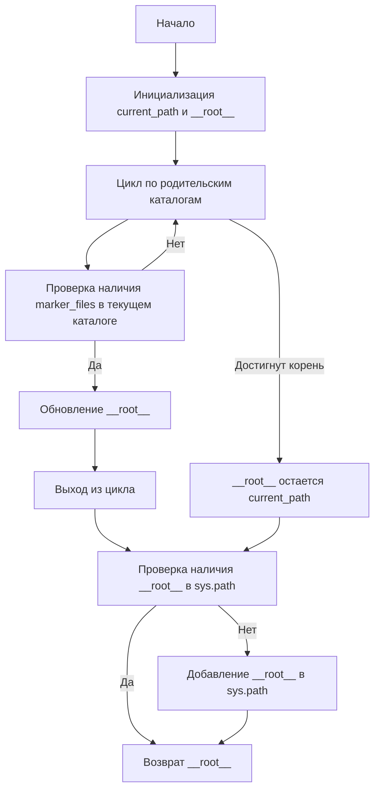
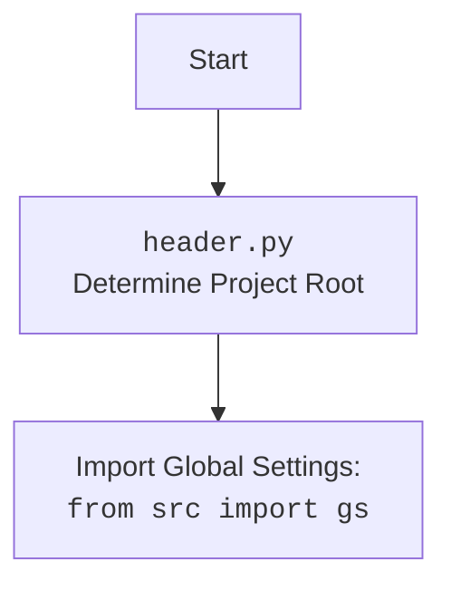

# Анализ кода `hypotez/src/fast_api/header.py`

## 1. <алгоритм>

### Пошаговая блок-схема:

1.  **Начало**: Функция `set_project_root` вызывается с параметром `marker_files`, по умолчанию равным `('__root__', '.git')`.

    *Пример*: `set_project_root()`
2.  **Инициализация**:
    *   `current_path` инициализируется как абсолютный путь к родительскому каталогу текущего файла (`__file__`).
    *   `__root__` инициализируется значением `current_path`.

    *Пример*: Если `__file__` это `/path/to/hypotez/src/fast_api/header.py`, то `current_path` будет `/path/to/hypotez/src/fast_api`.
3.  **Поиск корневого каталога**:
    *   Цикл `for` перебирает текущий каталог и все его родительские каталоги до корня файловой системы.
    *   Внутри цикла проверяется, существует ли в текущем родительском каталоге какой-либо из файлов или каталогов, указанных в `marker_files`.

        *Пример*: Если `marker_files` содержит `'.git'`, то проверяется наличие каталога `/path/to/hypotez/.git`, `/path/to/.git` и т.д.
    *   Если один из `marker_files` найден, `__root__` обновляется до текущего родительского каталога, и цикл прерывается.

        *Пример*: Если `'/path/to/hypotez/.git'` существует, то `__root__` становится `/path/to/hypotez`.
4.  **Обновление `sys.path`**:
    *   Если `__root__` отсутствует в `sys.path`, он добавляется в начало списка путей поиска модулей.

        *Пример*: Если `__root__` это `/path/to/hypotez`, то `/path/to/hypotez` добавляется в `sys.path`.
5.  **Возврат**: Функция возвращает значение переменной `__root__`.

    *Пример*: Возвращается `/path/to/hypotez` как объект `Path`.

### Поток данных:

*   Функция `set_project_root` принимает кортеж имен файлов/каталогов (`marker_files`).
*   Функция использует `__file__` для определения текущего местоположения файла.
*   Функция возвращает объект `Path`, представляющий корень проекта.
*   Переменная `__root__` сохраняет возвращенное значение `set_project_root()`.

## 2. <mermaid>



### Объяснение `mermaid`:

Диаграмма показывает процесс поиска корневого каталога проекта.

1.  Начинается с инициализации текущего пути и корневого пути.
2.  Перебирает родительские каталоги, проверяя наличие файлов-маркеров (например, `.git`, `__root__`).
3.  Если маркер найден, корень проекта обновляется.
4.  Если маркер не найден, и достигнут корень файловой системы, используется текущий путь.
5.  Проверяется, добавлен ли корень проекта в `sys.path`, и если нет, то добавляется.
6.  Функция возвращает путь к корню проекта.

## 3. <объяснение>

### Импорты:

*   `sys`: Используется для работы с системными параметрами и функциями, такими как `sys.path`.
*   `pathlib.Path`: Используется для представления путей к файлам и каталогам в файловой системе.

### Функции:

*   `set_project_root(marker_files: tuple[str] = ('__root__', '.git')) -> Path`:
    *   **Аргументы**:
        *   `marker_files` (tuple): Кортеж имен файлов или каталогов, которые используются для определения корневого каталога проекта. По умолчанию `('__root__', '.git')`.
    *   **Возвращаемое значение**:
        *   `Path`: Объект `Path`, представляющий корневой каталог проекта.
    *   **Назначение**:
        *   Функция определяет корневой каталог проекта, начиная с каталога, в котором находится текущий файл, и двигаясь вверх по иерархии каталогов. Она останавливается, когда находит каталог, содержащий один из `marker_files`. Если ни один из `marker_files` не найден, возвращается каталог, в котором находится текущий файл.

            *Пример*:
            ```python
            from pathlib import Path
            
            # Предположим, что файл находится в /path/to/project/src/module.py
            # и в /path/to/project/ есть каталог .git
            
            root_path = set_project_root()
            print(root_path)  # Вывод: /path/to/project
            ```
    *   **Потенциальные ошибки и области для улучшения**:
        *   Если ни один из `marker_files` не найден, функция вернет каталог, в котором находится текущий файл, что может быть не всегда желаемым поведением.

### Переменные:

*   `__root__`:
    *   **Тип**: `Path`
    *   **Использование**: Хранит путь к корневому каталогу проекта. Инициализируется как каталог, содержащий текущий файл, и обновляется при обнаружении одного из `marker_files` в родительском каталоге.
*   `current_path`:
    *   **Тип**: `Path`
    *   **Использование**: Хранит абсолютный путь к каталогу, содержащему текущий файл.
*   `marker_files`:
    *   **Тип**: `tuple[str]`
    *   **Использование**: Кортеж, содержащий имена файлов или каталогов, используемых для определения корневого каталога проекта.

### Взаимосвязи с другими частями проекта:

*   Эта функция используется для определения корневого каталога проекта, что необходимо для правильной работы импортов и других операций, зависящих от структуры проекта.  Определение `__root__` важно для разрешения путей к другим модулям и файлам конфигурации в проекте.

