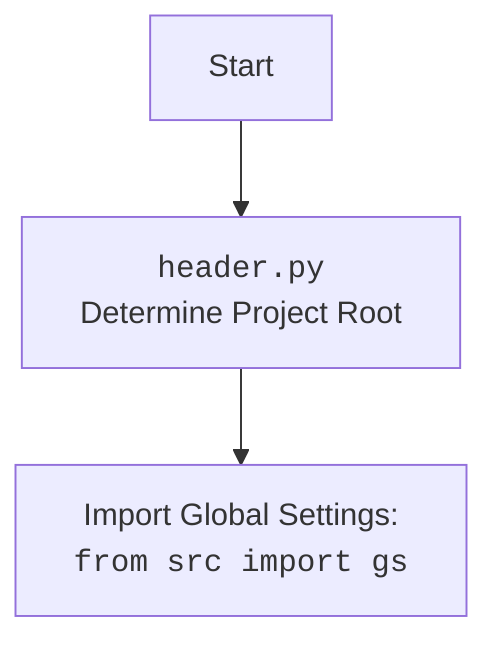

## <алгоритм>

1.  **Импорт модулей**: Импортируются необходимые модули: `json` для работы с JSON файлами, `sys` для доступа к системным переменным и путям, и `pathlib.Path` для работы с путями файловой системы.
    *   _Пример_: `import json`, `import sys`, `from pathlib import Path`
2.  **Загрузка настроек**: Загрузка настроек из файла `settings.json`. По умолчанию имя проекта устанавливается как "hypotez", если настройка `project_name` отсутствует в `settings.json`.
    *   _Пример_: Если `settings.json` содержит `{"project_name": "my_project"}`, то `project_name` будет равно "my_project". Если поле отсутствует, то `project_name` будет равно "hypotez".
3.  **Определение корневого пути проекта**: Вычисляется абсолютный путь к корневой директории проекта, используя текущую рабочую директорию и имя проекта из `settings.json`.
    *   _Пример_: Если текущая рабочая директория `/home/user/hypotez/src/gui/context_menu`, а `project_name` равно `hypotez`, то `__root__` будет равно `/home/user/hypotez`.
4.  **Добавление корневого пути проекта в `sys.path`**: Корневой путь проекта добавляется в `sys.path`, что позволяет импортировать модули из этого пути.
    *   _Пример_: После выполнения этого шага, можно импортировать модули из `/home/user/hypotez`, например, `from src import gs`.
5.  **Определение путей к бинарным файлам**: Создаются переменные `gtk_bin_path`, `ffmpeg_bin_path` и `graphviz_bin_path`, которые содержат пути к каталогам с исполняемыми файлами GTK, FFmpeg и Graphviz соответственно.
    *   _Пример_: Если `__root__` равно `/home/user/hypotez`, то `gtk_bin_path` будет `/home/user/hypotez/bin/gtk/gtk-nsis-pack/bin`.
6.  **Добавление путей к бинарным файлам в `sys.path`**: Проверяется наличие путей к бинарным файлам в `sys.path`, и если их нет, то они добавляются.
    *   _Пример_: Если путь `/home/user/hypotez/bin/gtk/gtk-nsis-pack/bin` отсутствует в `sys.path`, то он будет добавлен.
7.  **Настройка переменной окружения для WeasyPrint**: Устанавливается переменная окружения `WEASYPRINT_DLL_DIRECTORIES`, если она не задана, для того чтобы WeasyPrint мог найти DLL библиотеки.
8.  **Подавление предупреждений GTK**: Отключаются предупреждения GTK в консоли.
    *   _Пример_: `warnings.filterwarnings("ignore", category=UserWarning)`

## <mermaid>

```mermaid
flowchart TD
    Start --> LoadSettings[Load settings from settings.json]
    LoadSettings --> GetProjectName[Get project_name from settings or set default "hypotez"]
    GetProjectName --> DetermineRootPath[Determine project root path]
    DetermineRootPath --> AddRootPathToSysPath[Add project root path to sys.path]
    AddRootPathToSysPath --> DefineBinPaths[Define paths to GTK, FFmpeg, Graphviz bins]
    DefineBinPaths --> CheckBinPathsInSysPath[Check if bin paths are in sys.path]
    CheckBinPathsInSysPath -- "Bin paths not in sys.path" --> AddBinPathsToSysPath[Add bin paths to sys.path]
    CheckBinPathsInSysPath -- "Bin paths in sys.path" --> SetWeasyPrintEnvVar[Set WEASYPRINT_DLL_DIRECTORIES env var]
    AddBinPathsToSysPath --> SetWeasyPrintEnvVar
    SetWeasyPrintEnvVar --> SuppressGTKWarnings[Suppress GTK warnings]
    SuppressGTKWarnings --> End
    
     subgraph settings.json
        style settings.json fill:#f9f,stroke:#333,stroke-width:2px
        SettingsData(settings.json<br>{"project_name": "my_project"})
     end
    
     LoadSettings --> SettingsData
```



## <объяснение>

**Импорты:**

*   `import json`: Используется для чтения данных из JSON файла `settings.json`.
*   `import sys`: Предоставляет доступ к системным переменным и функциям, таким как `sys.path` (пути поиска модулей), `sys.argv` (аргументы командной строки).
*   `from pathlib import Path`: Используется для работы с путями файлов и директорий в кроссплатформенном стиле.

**Переменные:**

*   `settings_file`: файловый объект, представляющий открытый для чтения файл `settings.json`.
*   `settings`: словарь, содержащий данные, загруженные из файла `settings.json`.
*   `project_name`: имя проекта, извлеченное из настроек (или "hypotez" по умолчанию).
*   `__root__`: объект `Path`, представляющий абсолютный путь к корневой директории проекта.
*   `gtk_bin_path`, `ffmpeg_bin_path`, `graphviz_bin_path`: объекты `Path`, представляющие пути к директориям с бинарными файлами.
*    `paths_to_add`: список путей для добавления в `sys.path`.
*    `current_paths`: множество текущих путей в `sys.path`
*    `bin_path`: переменная итератора по `paths_to_add`
*    `sys_path_env_var`: строка, содержащая название системной переменной для WeasyPrint.

**Функции:**

*   Отсутствуют функции, код выполняется как скрипт.

**Объяснение кода:**

Файл `header.py` предназначен для определения корневого пути проекта и добавления необходимых путей в `sys.path`, что позволяет правильно импортировать модули и запускать исполняемые файлы.

1.  **Загрузка настроек:**
    *   Скрипт открывает файл `settings.json` и загружает его содержимое в словарь `settings`.
    *   Извлекается имя проекта из `settings` по ключу `project_name`, если такой ключ есть. Если ключа нет, используется значение по умолчанию `"hypotez"`.
2.  **Определение корневого пути:**
    *   Используется `Path.cwd()` для получения текущей рабочей директории.
    *   `Path.cwd().parts` возвращает кортеж с компонентами пути, и метод `.index(project_name)` находит индекс вхождения имени проекта в кортеже компонентов.
    *   `parents[index]` выбирает родительскую директорию по индексу. Таким образом, получаем путь на уровень директории, в которой находится директория с именем проекта (`hypotez`).
    *   Метод `.resolve()` преобразует относительный путь в абсолютный, и результат записывается в переменную `__root__`.
3.  **Добавление путей в `sys.path`**:
    *   Корневой путь проекта, пути к GTK, FFmpeg и Graphviz добавляются в список путей, где Python ищет модули. Это позволяет импортировать модули, расположенные в этих директориях.
    *   Переменная окружения `WEASYPRINT_DLL_DIRECTORIES` также добавляется в `sys.path` для корректной работы библиотеки `WeasyPrint` (поиск `dll` библиотек).

**Потенциальные ошибки и области для улучшения:**

*   **Обработка ошибок:** В коде отсутствует обработка ошибок при открытии файла `settings.json`. Если файл не существует или не является валидным JSON файлом, возникнет исключение. Необходимо добавить блок `try...except` для обработки таких ситуаций.
*   **Проверка существования бинарных файлов:** Код не проверяет, существуют ли указанные директории с бинарными файлами. Было бы полезно добавить проверку существования путей перед их добавлением в `sys.path`.
*   **Управление переменными окружения:** Вместо изменения `sys.path`, можно использовать переменные окружения для указания путей к бинарным файлам. Это было бы более гибким и настраиваемым решением.
*   **Разные уровни вложенности:** Алгоритм находит проект только на одном уровне вложенности. Если директория проекта будет лежать не рядом с `src` , а, например, `../../`, то скрипт отработает неправильно.

**Взаимосвязь с другими частями проекта:**

*   Файл `header.py` является критически важным для всего проекта, поскольку он настраивает пути для импорта модулей и запуска исполняемых файлов.
*   Многие модули и скрипты в проекте будут зависеть от настроек, установленных в этом файле.
*   Он используется как импортируемый модуль, из которого необходимо забрать переменную `__root__`, как переменную определяющую корень проекта.

**Цепочка взаимосвязей:**

1.  `settings.json` (конфигурационный файл) → `header.py` (определение путей)
2.  `header.py` → `sys.path` (изменения в путях поиска модулей)
3.  `header.py` →  `src.gui.context_menu.*` (другие модули пакета могут импортировать `__root__` из `header.py`)
4.  `header.py` → `src.module_name` (другие модули проекта)
5.  `header.py` → `bin/gtk`, `bin/ffmpeg`, `bin/graphviz` (каталоги исполняемых файлов)

Этот файл является точкой входа для настройки среды проекта. Он определяет корневой каталог, добавляет необходимые пути в sys.path, настраивает переменные окружения для корректной работы с другими библиотеками.