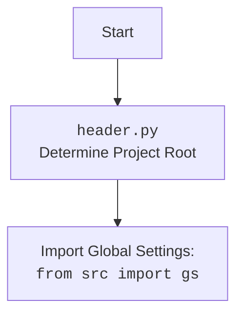

## <алгоритм>

1. **Начало**: Запускается скрипт `main.py`.
2. **Импорт библиотек**: Импортируются необходимые модули:
   - `winreg` для работы с реестром Windows.
   - `os` для работы с путями файлов и операционной системой.
   - `PyQt6.QtWidgets` для создания графического интерфейса.
   - `header` - пользовательский модуль, вероятно, для инициализации настроек.
   - `src.gs` - пользовательский модуль, вероятно, содержащий общие настройки проекта, такие как пути.
3. **Функция `add_context_menu_item`**:
    -   Определяется путь в реестре (`key_path`) для создания нового пункта контекстного меню.
    -   Создается ключ в реестре `HKEY_CLASSES_ROOT\Directory\Background\shell\hypo_AI_assistant`.
    -   Устанавливается значение ключа (имя пункта меню) "hypo AI assistant".
    -   Создается подраздел `command` в реестре.
    -   Определяется путь к Python скрипту, который будет выполняться при выборе пункта меню.
    -   Проверяется, существует ли файл скрипта по указанному пути. Если файл не найден, выводится сообщение об ошибке.
    -   Устанавливается значение `command` ключа, команда для запуска скрипта `python "путь_к_скрипту" "%1"`.
    -   Выводится сообщение об успешном добавлении пункта меню.
    -   Если происходит ошибка, выводится сообщение об ошибке.
4. **Функция `remove_context_menu_item`**:
    -   Определяется путь в реестре (`key_path`) для удаления пункта контекстного меню.
    -   Удаляется ключ в реестре `HKEY_CLASSES_ROOT\Directory\Background\shell\hypo_AI_assistant`.
    -   Выводится сообщение об успешном удалении пункта меню.
    -   Если пункт меню не найден, выводится сообщение с предупреждением.
    -   Если происходит ошибка при удалении, выводится сообщение об ошибке.
5. **Класс `ContextMenuManager`**:
   -   Инициализируется окно приложения с заголовком "Управление контекстным меню".
   -   Создается вертикальный макет (`QVBoxLayout`) для расположения кнопок.
   -   Создается кнопка "Добавить пункт меню", при нажатии на которую вызывается функция `add_context_menu_item`.
   -   Создается кнопка "Удалить пункт меню", при нажатии на которую вызывается функция `remove_context_menu_item`.
   -   Создается кнопка "Выход", при нажатии на которую окно закрывается.
   -   Устанавливается макет для окна.
6. **Основной блок (`if __name__ == "__main__":`)**:
    -   Создается экземпляр приложения `QApplication`.
    -   Создается и отображается окно `ContextMenuManager`.
    -   Запускается цикл обработки событий приложения.
7. **Конец**: Приложение завершает работу после закрытия окна.

Пример работы функции `add_context_menu_item`:

```
    Начало add_context_menu_item
    -> Определить key_path: "Directory\\Background\\shell\\hypo_AI_assistant"
    -> Создать key в реестре по key_path
    -> Установить значение key (имя пункта меню): "hypo AI assistant"
    -> Создать подраздел command
    -> Определить command_path: путь к файлу main.py в каталоге context_menu
    -> Проверка, существует ли файл по command_path
    -> Если существует
        -> Установить значение подраздела command: python "путь_к_скрипту" "%1"
        -> Сообщение об успехе
    -> Иначе
        -> Сообщение об ошибке
    -> Конец add_context_menu_item
```
## <mermaid>
```mermaid
flowchart TD
    Start --> ImportModules[Импорт модулей: winreg, os, QtWidgets, header, src.gs]
    ImportModules --> addContextMenu[Функция add_context_menu_item]
    ImportModules --> removeContextMenu[Функция remove_context_menu_item]
    ImportModules --> ContextMenuClass[Класс ContextMenuManager]
    
    addContextMenu --> GetRegistryPathAdd[Определить путь в реестре]
    GetRegistryPathAdd --> CreateRegistryKeyAdd[Создать ключ реестра]
    CreateRegistryKeyAdd --> SetMenuName[Установить имя пункта меню]
    SetMenuName --> CreateCommandKey[Создать подраздел command]
    CreateCommandKey --> GetScriptPath[Определить путь к скрипту]
    GetScriptPath --> CheckScriptExists[Проверка существования скрипта]
    CheckScriptExists -- Да --> SetCommandValue[Установить команду для запуска скрипта]
    SetCommandValue --> SuccessMessageAdd[Сообщение об успешном добавлении]
     CheckScriptExists -- Нет --> ErrorMessageScriptNotFound[Сообщение об ошибке, скрипт не найден]
     ErrorMessageScriptNotFound --> End
    SuccessMessageAdd --> End
    CreateRegistryKeyAdd -- Ошибка --> ErrorMessageRegistryAdd[Сообщение об ошибке, реестр]
    ErrorMessageRegistryAdd --> End

    removeContextMenu --> GetRegistryPathRemove[Определить путь в реестре]
    GetRegistryPathRemove --> DeleteRegistryKey[Удалить ключ реестра]
     DeleteRegistryKey --> SuccessMessageRemove[Сообщение об успешном удалении]
    DeleteRegistryKey -- FileNotFoundError --> WarningMessageMenuNotFound[Сообщение с предупреждением, пункт меню не найден]
     DeleteRegistryKey -- Ошибка --> ErrorMessageRegistryRemove[Сообщение об ошибке, реестр]
    SuccessMessageRemove --> End
    WarningMessageMenuNotFound --> End
    ErrorMessageRegistryRemove --> End
    
    ContextMenuClass --> InitUI[Инициализация UI]
    InitUI --> AddButton[Создать кнопку "Добавить"]
    AddButton --> ConnectAddAction[Связать с add_context_menu_item]
    InitUI --> RemoveButton[Создать кнопку "Удалить"]
    RemoveButton --> ConnectRemoveAction[Связать с remove_context_menu_item]
    InitUI --> ExitButton[Создать кнопку "Выход"]
    ExitButton --> ConnectExitAction[Связать с закрытием окна]
    ConnectExitAction --> End

    Start --> MainBlock[Основной блок if __name__ == "__main__":]
    MainBlock --> CreateAppInstance[Создать экземпляр QApplication]
    CreateAppInstance --> CreateMainWindow[Создать главное окно ContextMenuManager]
    CreateMainWindow --> ShowMainWindow[Отобразить главное окно]
    ShowMainWindow --> RunEventLoop[Запустить цикл обработки событий]
    RunEventLoop --> End
        
    End[Конец]

```


## <объяснение>

### Импорты

-   `winreg`: Модуль предоставляет интерфейс для взаимодействия с реестром Windows. Он используется для создания, удаления и изменения ключей и значений реестра, что необходимо для добавления и удаления пунктов контекстного меню.
-   `os`: Модуль `os` используется для выполнения операций, связанных с операционной системой, включая проверку существования файлов. В данном случае, он используется для проверки, существует ли файл скрипта перед попыткой его запуска.
-   `PyQt6.QtWidgets`: Модуль используется для создания графического интерфейса. Здесь он используется для создания окна, кнопок и отображения сообщений.
-   `header`: Это пользовательский модуль, который, вероятно, содержит общие настройки или константы для проекта. Он может использоваться для инициализации проекта или определения путей к файлам.
-   `src.gs`: Этот импорт относится к пользовательскому модулю, который, вероятно, хранит глобальные настройки и константы проекта, например, корневые пути, настройки приложения и другие общие параметры. Он используется для получения пути к скрипту, который должен быть запущен из контекстного меню.

### Классы

-   `ContextMenuManager(QtWidgets.QWidget)`:
    -   **Роль**: Главный класс для управления контекстным меню. Он наследуется от `QtWidgets.QWidget`, что делает его основой для создания пользовательского интерфейса.
    -   **Атрибуты**: Класс не имеет явных атрибутов, кроме унаследованных от `QWidget`.
    -   **Методы**:
        -   `__init__(self)`: Инициализирует класс, вызывая конструктор родительского класса и метод `initUI`.
        -   `initUI(self)`: Создает и настраивает пользовательский интерфейс, включая заголовок окна, макет, кнопки и их обработчики событий.
    -   **Взаимодействие**: Взаимодействует с функциями `add_context_menu_item` и `remove_context_menu_item` через обработчики нажатий кнопок.

### Функции

-   `add_context_menu_item()`:
    -   **Аргументы**: Нет.
    -   **Возвращаемое значение**: Нет.
    -   **Назначение**: Добавляет пункт контекстного меню "hypo AI assistant" для фона директорий и рабочего стола. Функция создает необходимые ключи в реестре Windows и устанавливает команду для запуска скрипта при выборе пункта меню.
        -  **Пример**: При нажатии кнопки "Добавить пункт меню" функция `add_context_menu_item` вызывается для создания ключей реестра, определяющих отображение и запуск скрипта.
-   `remove_context_menu_item()`:
    -   **Аргументы**: Нет.
    -   **Возвращаемое значение**: Нет.
    -   **Назначение**: Удаляет пункт контекстного меню "hypo AI assistant". Функция удаляет соответствующие ключи из реестра Windows.
        - **Пример**: При нажатии кнопки "Удалить пункт меню" функция `remove_context_menu_item` вызывается для удаления ключей реестра, определяющих пункт меню.

### Переменные

-   `key_path` (str): Путь к ключу в реестре, где хранится информация о пункте контекстного меню. Используется в функциях `add_context_menu_item` и `remove_context_menu_item`.
-   `command_key` (str): Путь к подразделу в реестре, где хранится команда для запуска скрипта. Используется в `add_context_menu_item`.
-   `command_path` (str): Путь к скрипту Python, который будет выполняться при выборе пункта меню. Используется в `add_context_menu_item`.
-   `layout` (QtWidgets.QVBoxLayout): Объект для вертикального расположения виджетов. Используется в `ContextMenuManager.initUI`.
-   `add_button`, `remove_button`, `exit_button` (QtWidgets.QPushButton): Кнопки пользовательского интерфейса. Используются в `ContextMenuManager.initUI`.
-   `app` (QtWidgets.QApplication): Экземпляр приложения PyQt6. Используется в основном блоке.
-   `window` (ContextMenuManager): Экземпляр главного окна приложения. Используется в основном блоке.

### Потенциальные ошибки или области для улучшения

-   **Путь к скрипту**: Зависимость от `gs.path.src` может быть проблематичной, если структура проекта изменится.
-   **Отсутствие обработки ошибок при создании кнопок**:  Не предусмотрена обработка возможных ошибок при создании кнопок.
-   **Негибкая логика реестра**: Путь к реестру жестко закодирован, что может быть не удобно, если понадобится добавить новый пункт меню.
-   **Недостаток проверки прав**: При работе с реестром необходима проверка прав, в случае отсутствия прав для записи может быть выведена не самая подходящая ошибка.
-   **Запуск скрипта**: Запуск скрипта через команду `python "{command_path}" "%1"` может быть проблематичным в зависимости от настроек системы.
-   **Отсутствие документации**: Не хватает документации по работе с модулями `header` и `gs`.

### Цепочка взаимосвязей

1.  **Пользовательский интерфейс**: `ContextMenuManager` создает GUI и управляет кнопками.
2.  **Реестр**: Функции `add_context_menu_item` и `remove_context_menu_item` напрямую взаимодействуют с реестром Windows через модуль `winreg`.
3.  **Файловая система**: Функция `add_context_menu_item` проверяет существование скрипта через модуль `os`.
4.  **Глобальные настройки**: Модуль `src.gs` предоставляет пути к файлам, которые используются в `add_context_menu_item`.
5.  **Взаимодействие пользователя**: Пользователь взаимодействует с GUI, нажимая кнопки для вызова функций управления контекстным меню.

Эта структура обеспечивает модульную и функциональную организацию кода, который позволяет управлять пунктами контекстного меню с помощью графического интерфейса, взаимодействуя с реестром Windows и файловой системой.