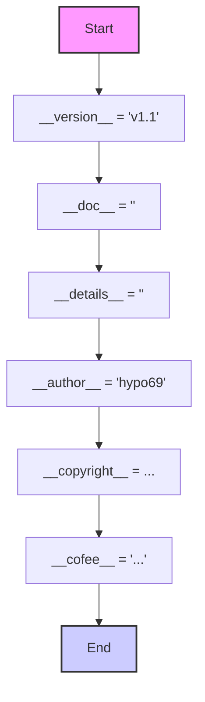
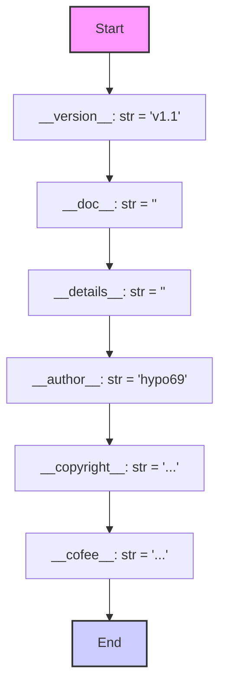

## Анализ кода `hypotez/src/gui/openai_trаigner/version.py`

### 1. <алгоритм>

Код представляет собой файл `version.py`, который содержит метаданные о версии проекта, его авторстве и лицензии. Алгоритм заключается в последовательном присваивании строковых значений глобальным переменным, которые описывают проект. 

**Примеры:**

*   `__version__ = 'v1.1'` - присваивает строковое значение 'v1.1' переменной `__version__`, указывающей на текущую версию проекта.
*   `__doc__ = ''` - присваивает пустую строку переменной `__doc__`, которая должна содержать основную документацию.
*   `__author__ = 'hypo69'` - присваивает имя автора проекта.
*   `__copyright__ = ...` - присваивает многострочную строку, содержащую информацию об авторских правах и лицензии.
*   `__cofee__ = ...` - присваивает строку, содержащую ссылку на сервис для поддержки разработчика.

### 2. <mermaid>

**Объяснение диаграммы:**

1.  `Start`: Начало процесса.
2.  `DefineVersion`: Определение переменной `__version__` как строки со значением `'v1.1'`.
3.  `DefineDocstring`: Определение переменной `__doc__` как пустой строки.
4.  `DefineDetails`: Определение переменной `__details__` как пустой строки.
5.  `DefineAuthor`: Определение переменной `__author__` как строки со значением `'hypo69'`.
6.  `DefineCopyright`: Определение переменной `__copyright__` как многострочной строки с текстом об авторских правах.
7.  `DefineCoffee`: Определение переменной `__cofee__` как строки со ссылкой на сервис для поддержки разработчика.
8.  `End`: Конец процесса.

**Зависимости:**
Диаграмма показывает последовательное присваивание значений различным переменным, которые не зависят друг от друга в плане выполнения.

### 3. <объяснение>

**Импорты**:
В данном файле нет импортов. Он не зависит от других модулей `src` напрямую.

**Классы**:
В этом файле нет классов. Он содержит только глобальные переменные.

**Функции**:
В данном файле нет функций.

**Переменные**:

*   `__version__`: `str` -  строка, представляющая текущую версию проекта (например, 'v1.1').
*   `__doc__`: `str` - строка, которая должна содержать основную документацию модуля, в данном случае пустая строка.
*   `__details__`: `str` - строка, предназначенная для хранения дополнительных сведений о модуле, в данном случае пустая строка.
*   `__author__`: `str` - строка, содержащая имя автора проекта ('hypo69').
*   `__copyright__`: `str` - многострочная строка, содержащая информацию об авторских правах, лицензии (MIT), и запрете коммерческого использования без разрешения.
*   `__cofee__`: `str` - строка с ссылкой на сервис поддержки разработчика.

**Потенциальные ошибки и области для улучшения**:
*   `__doc__` и `__details__` в настоящее время не используются. Следует добавить в них документацию к модулю для улучшения понимания кода другими разработчиками. 
*   Информация об авторском праве и лицензии дублируется в строке, а не хранится в отдельном файле license.

**Взаимосвязь с другими частями проекта**:

Этот файл является частью пакета `src.gui.openai_trаigner` и предназначен для хранения метаданных о версии. Его переменные могут использоваться в других частях проекта для отображения информации о версии приложения или его компонентах, а также для соблюдения требований лицензии. 
Например, при запуске приложения эти данные могут быть выведены на экран.