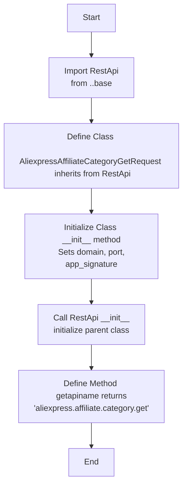

## АНАЛИЗ КОДА: `AliexpressAffiliateCategoryGetRequest.py`

### 1. <алгоритм>
1. **Начало:** Запуск скрипта `AliexpressAffiliateCategoryGetRequest.py`.
2. **Импорт:** Импортируется класс `RestApi` из модуля `..base`.
    *  Пример: `from ..base import RestApi` - импорт класса, предоставляющего базовую функциональность для работы с REST API.
3. **Определение класса:** Объявляется класс `AliexpressAffiliateCategoryGetRequest`, наследуемый от `RestApi`.
    *  Пример: `class AliexpressAffiliateCategoryGetRequest(RestApi):` - создается класс для запроса категорий товаров Aliexpress.
4. **Инициализация класса:** Метод `__init__` инициализирует экземпляр класса `AliexpressAffiliateCategoryGetRequest`.
    *   Пример: `def __init__(self, domain="api-sg.aliexpress.com", port=80):` - задаются значения по умолчанию для домена и порта.
    *   Вызов конструктора родительского класса: `RestApi.__init__(self,domain, port)` - инициализируются атрибуты базового класса.
    *   Установка атрибута `app_signature`: `self.app_signature = None` - инициализируется атрибут для подписи приложения.
5. **Получение имени API:** Метод `getapiname` возвращает строку `'aliexpress.affiliate.category.get'`, которая является именем API-метода, который этот класс будет использовать.
    *   Пример: `def getapiname(self): return 'aliexpress.affiliate.category.get'` - метод, определяющий имя вызываемого API.
6. **Конец:** Завершение работы скрипта.

### 2. <mermaid>

**Объяснение зависимостей:**
*   `Start`: Начало выполнения скрипта.
*   `ImportRestApi`: Импорт класса `RestApi` из родительского модуля `base`. `RestApi` предоставляет базовую функциональность для взаимодействия с API, такую как установка домена и порта.
*   `DefineClass`: Объявление класса `AliexpressAffiliateCategoryGetRequest`, который наследует функциональность от `RestApi`. Это означает, что `AliexpressAffiliateCategoryGetRequest` может использовать методы и атрибуты `RestApi`.
*   `InitClass`: Инициализация объекта класса `AliexpressAffiliateCategoryGetRequest`. Задается домен и порт по умолчанию для API запросов и инициализируется атрибут `app_signature`.
*   `CallRestApiInit`: Вызов конструктора родительского класса `RestApi` для инициализации общих атрибутов API.
*   `DefineGetApiName`: Определение метода `getapiname`, который возвращает имя API-метода, которое используется для получения списка категорий товаров.
*   `End`: Завершение выполнения скрипта.

### 3. <объяснение>
**Импорты:**
*   `from ..base import RestApi`: Импортирует класс `RestApi` из модуля `base`, который находится на уровень выше в структуре пакетов (т.е. `src/suppliers/aliexpress/api/base.py`). `RestApi`, вероятно, содержит общую логику для выполнения запросов к API AliExpress, такую как установку домена, порта, подписи и т.д.

**Классы:**
*   `AliexpressAffiliateCategoryGetRequest(RestApi)`:
    *   **Роль:** Класс предназначен для формирования запроса на получение списка категорий товаров через API AliExpress. Он наследуется от `RestApi`, что позволяет ему использовать функциональность базового класса.
    *   **Атрибуты:**
        *   `self.app_signature`: Атрибут для хранения подписи приложения (по умолчанию None). Вероятно, этот атрибут используется для аутентификации запросов.
    *   **Методы:**
        *   `__init__(self, domain="api-sg.aliexpress.com", port=80)`:
            *   **Аргументы:**
                *   `domain`: Строка, представляющая доменное имя API (по умолчанию "api-sg.aliexpress.com").
                *   `port`: Целое число, представляющее порт API (по умолчанию 80).
            *   **Назначение:** Конструктор класса, инициализирует атрибуты объекта, в том числе вызывает конструктор родительского класса `RestApi`.
            *   **Пример:** `instance = AliexpressAffiliateCategoryGetRequest(domain="my.api.com", port=443)` - создается экземпляр класса с нестандартными параметрами.
        *   `getapiname(self)`:
            *   **Аргументы:** Отсутствуют.
            *   **Назначение:** Возвращает имя API-метода, который будет вызван при запросе категорий товаров (`aliexpress.affiliate.category.get`).
            *   **Возвращаемое значение:** Строка "aliexpress.affiliate.category.get".

**Переменные:**
*   `domain`: Строка, представляющая доменное имя API (по умолчанию "api-sg.aliexpress.com").
*   `port`: Целое число, представляющее порт API (по умолчанию 80).
*   `self.app_signature`: Атрибут экземпляра класса для хранения подписи приложения.

**Потенциальные ошибки и области для улучшения:**
*   Отсутствует обработка исключений. Например, если при инициализации возникают проблемы (например, неверный домен), это не обрабатывается.
*   Класс только подготавливает запрос, но не отправляет его. Не хватает реализации отправки запроса и обработки ответа.
*   Не определена логика использования `app_signature`.

**Цепочка взаимосвязей с другими частями проекта:**
*   Этот класс зависит от `RestApi` из `src.suppliers.aliexpress.api.base`.
*   Этот класс, вероятно, будет использоваться в другом модуле для фактического получения данных о категориях товаров.
*   Возможно, потребуется интеграция с модулями для обработки ответов API и сохранения данных.