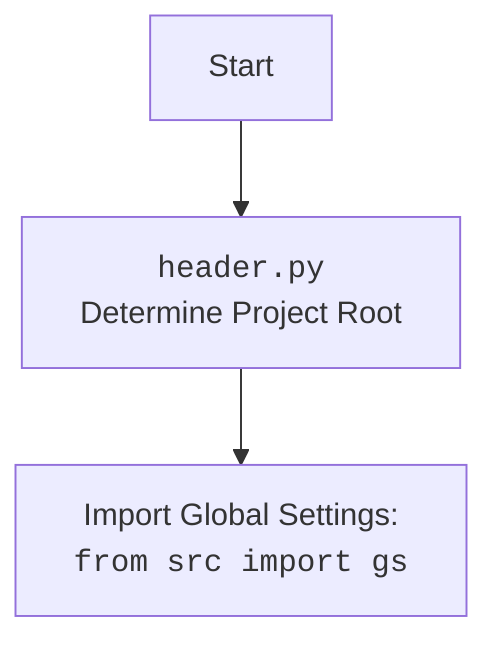

# Проект `hypotez`
# Роль `code explainer`
## АНАЛИЗ КОДА: `ali_promo_campaign.py`

### 1. **<алгоритм>**

#### `AliPromoCampaign` Класс:
1.  **Инициализация `AliPromoCampaign`**:
    *   Получает имя кампании, язык и валюту.
    *   Определяет базовый путь к файлам кампании.
    *   Загружает данные кампании из JSON-файла, если он существует.
    *   Если JSON-файл не найден, запускает процесс создания новой кампании.
    *   Инициализирует модели AI (Google Gemini и OpenAI).
2.  **Создание новой кампании `process_new_campaign`**:
    *   Если язык и валюта не указаны, использует значения по умолчанию из `locales`.
    *   Создает объект `SimpleNamespace` для кампании.
    *   Устанавливает категории кампании из названий директорий.
    *   Копирует данные кампании для AI.
    *   Обрабатывает товары и AI данные для каждой категории.
3.  **Обработка кампании `process_campaign`**:
    *   Итерируется по категориям кампании.
    *   Обрабатывает товары в каждой категории.
    *   Обрабатывает AI данные для каждой категории.
4.  **Обработка товаров категории `process_category_products`**:
    *   Читает ID товаров из HTML файлов и `sources.txt`.
    *   Использует `AliAffiliatedProducts` для получения партнерских товаров.
    *   Возвращает список объектов `SimpleNamespace` с информацией о товарах.
5.  **Обработка AI для категории `process_ai_category`**:
    *   Загружает системные инструкции для AI.
    *   Инициализирует AI модель.
    *   Обрабатывает AI данные для указанной категории или всех категорий.
    *   Обновляет данные кампании AI и сохраняет их в файл.
6.  **Генерация вывода `generate_output`**:
    *   Генерирует HTML файлы для категорий и индексный файл кампании.
    *   Сохраняет данные о товарах в JSON файлы.
    *   Сохраняет ссылки на товары в текстовый файл.
7.  **Сохранение товаров в JSON файлы `dump_category_products_files`**:
    *   Сохраняет данные о товарах в отдельные JSON файлы.
8.  **Установка категорий из директорий `set_categories_from_directories`**:
    *   Устанавливает категории кампании на основе названий директорий.
9.  **Генерация HTML для кампании `generate_html_for_campaign`**:
    *   Генерирует HTML страницы для каждой категории и кампании.

#### Пример:
*   **Инициализация**:

```python
campaign = AliPromoCampaign("new_campaign", "EN", "USD")
```

*   **Обработка кампании**:

```python
campaign.process_campaign()
```

*   **Обработка товаров категории**:

```python
products = campaign.process_category_products("electronics")
```

*   **Обработка AI категории**:

```python
campaign.process_ai_category("Electronics")
```

### 2. **<mermaid>**

```mermaid
flowchart TD
    Start --> AliPromoCampaignInit[AliPromoCampaign <br> __init__]
    AliPromoCampaignInit --> BasePath[base_path = gs.path.google_drive / "aliexpress" / "campaigns" / campaign_name]
    AliPromoCampaignInit --> CampaignFilePath[campaign_file_path = self.base_path / f"{language}_{currency}.json"]
    CampaignFilePath --> JLoadsNS[self.campaign = j_loads_ns(campaign_file_path, exc_info=False)]
    JLoadsNS -- Campaign File Exists --> LanguageCurrency[self.language, self.currency = self.campaign.language, self.campaign.currency]
    JLoadsNS -- Campaign File Not Exists --> ProcessNewCampaign[self.process_new_campaign(campaign_name, language, currency)]
    ProcessNewCampaign --> End
    LanguageCurrency --> ModelsPayload[self._models_payload()]
    ModelsPayload --> End
    Start --> End
```

**Объяснение зависимостей:**

*   **`gs`**: Глобальные настройки проекта. Используется для определения базового пути.
*   **`j_loads_ns`**: Функция для загрузки данных из JSON файла в объект `SimpleNamespace`.



### 3. **<объяснение>**

*   **Импорты**:
    *   `header`: Предположительно, содержит общие настройки и объявления.
    *   `asyncio`: Для асинхронного программирования.
    *   `time`: Для работы со временем.
    *   `copy`: Для создания копий объектов.
    *   `html`: Для работы с HTML-кодом, например, для экранирования специальных символов.
    *   `pathlib.Path`: Для работы с путями к файлам и директориям.
    *   `typing`: Для аннотации типов.
    *   `src.gs`: Глобальные настройки проекта.
    *   `src.suppliers.aliexpress.campaign`: Текущий модуль.
    *   `src.suppliers.aliexpress.affiliated_products_generator.AliAffiliatedProducts`: Класс для генерации партнерских ссылок.
    *   `src.suppliers.aliexpress.utils.locales`: Утилиты для работы с локалями.
    *   `src.ai.gemini.GoogleGenerativeAI`: Класс для работы с AI Gemini.
    *   `src.ai.openai.OpenAIModel`: Класс для работы с AI OpenAI.
    *   `src.suppliers.aliexpress.campaign.html_generators`: HTML генераторы.
    *   `src.logger.logger`: Модуль для логирования.
    *   `src.utils.file`: Утилиты для работы с файлами.
    *   `src.utils.jjson`: Утилиты для работы с JSON.
    *   `src.utils.convertors.csv`: Утилиты для работы с CSV.
    *   `src.utils.printer.pprint`: Для красивой печати.
    *   `src.suppliers.aliexpress.utils.extract_product_id`: Утилиты для извлечения ID продуктов.
*   **Класс `AliPromoCampaign`**:
    *   **Назначение**: Управление рекламной кампанией на AliExpress.
    *   **Атрибуты**:
        *   `language` (str): Язык кампании.
        *   `currency` (str): Валюта кампании.
        *   `base_path` (Path): Базовый путь к файлам кампании.
        *   `campaign_name` (str): Название кампании.
        *   `campaign` (SimpleNamespace): Объект, представляющий данные кампании.
        *   `campaign_ai` (SimpleNamespace): Объект, представляющий данные кампании для AI.
        *   `gemini` (GoogleGenerativeAI): Объект для работы с AI Gemini.
        *   `openai` (OpenAIModel): Объект для работы с AI OpenAI.
    *   **Методы**:
        *   `__init__`: Инициализация объекта кампании.
        *   `_models_payload`: Инициализация моделей AI.
        *   `process_campaign`: Обработка кампании.
        *   `process_new_campaign`: Создание новой кампании.
        *   `process_ai_category`: Обработка AI данных для категории.
        *   `process_category_products`: Обработка товаров в категории.
        *   `dump_category_products_files`: Сохранение данных о товарах в JSON файлы.
        *   `set_categories_from_directories`: Установка категорий кампании из названий директорий.
        *   `generate_output`: Генерация HTML и JSON файлов для кампании.
        *   `generate_html`: Генерация HTML страницы для категории.
        *   `generate_html_for_campaign`: Генерация HTML страниц для кампании.
*   **Функции**:
    *   `__init__`: Инициализирует объект `AliPromoCampaign`, загружает данные кампании из JSON файла или создает новую кампанию, если файл не найден.
    *   `_models_payload`: Инициализирует модели AI (`GoogleGenerativeAI` и `OpenAIModel`) для использования в процессе обработки кампании.
    *   `process_campaign`: Итерируется по категориям рекламной кампании и обрабатывает товары и AI данные для каждой категории.
    *   `process_new_campaign`: Создает новую рекламную кампанию, устанавливает категории, копирует данные для AI и обрабатывает товары и AI данные для каждой категории.
    *   `process_ai_category`: Обрабатывает AI данные для указанной категории или всех категорий, обновляет данные кампании и сохраняет их в файл.
    *   `process_category_products`: Обрабатывает товары в указанной категории, извлекает ID товаров, получает партнерские товары и возвращает список объектов `SimpleNamespace` с информацией о товарах.
    *   `dump_category_products_files`: Сохраняет данные о товарах в отдельные JSON файлы.
    *   `set_categories_from_directories`: Устанавливает категории кампании на основе названий директорий в директории `category`.
    *   `generate_output`: Генерирует HTML и JSON файлы для кампании, сохраняет данные о товарах и ссылки на товары в файлы.
    *   `generate_html`: Создает HTML файл для категории, включая информацию о товарах, и генерирует главный индексный файл для кампании.
    *   `generate_html_for_campaign`: Генерирует HTML страницы для рекламной кампании, включая страницы для каждой категории и страницу кампании.
*   **Переменные**:
    *   `language` (str): Язык кампании.
    *   `currency` (str): Валюта кампании.
    *   `base_path` (Path): Базовый путь к файлам кампании.
    *   `campaign_name` (str): Название кампании.
    *   `campaign` (SimpleNamespace): Объект, представляющий данные кампании.
    *   `campaign_ai` (SimpleNamespace): Объект, представляющий данные кампании для AI.
    *   `gemini` (GoogleGenerativeAI): Объект для работы с AI Gemini.
    *   `openai` (OpenAIModel): Объект для работы с AI OpenAI.

**Потенциальные ошибки и области для улучшения**:

*   Обработка ошибок: В некоторых методах обработка ошибок отсутствует или является минимальной. Следует добавить больше обработки исключений и логирования для обеспечения стабильности.
*   Использование AI: Методы, связанные с AI, могут быть улучшены путем добавления большего количества параметров конфигурации и стратегий обработки ошибок.
*   Код, закомментированный: Есть закомментированный код, который следует удалить или пересмотреть.
*   Документация: Добавить больше примеров использования и подробностей в документацию.
*   Асинхронность: Не все операции, которые могут быть асинхронными, выполняются асинхронно. Рассмотрение возможности использования `asyncio` для большего количества операций может повысить производительность.
*   Использовать `j_loads` для чтения JSON или конфигурационных файлов

```python
# Неправильно:
with open('config.json', 'r', encoding='utf-8') as f:
    data = json.load(f)

# Правильно:
data = j_loads('config.json')
```

**Взаимосвязи с другими частями проекта**:

*   `src.gs`: Используется для доступа к глобальным настройкам проекта, таким как пути к директориям и учетные данные.
*   `src.ai.gemini` и `src.ai.openai`: Используются для интеграции AI моделей в процесс обработки кампании.
*   `src.suppliers.aliexpress.affiliated_products_generator`: Используется для генерации партнерских ссылок на товары AliExpress.
*   `src.utils.file` и `src.utils.jjson`: Используются для работы с файлами и JSON данными.