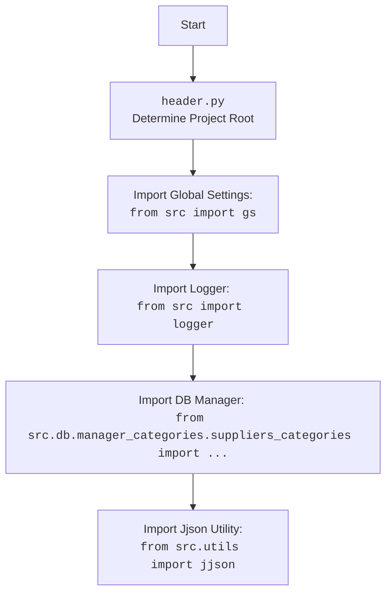

## Анализ кода модуля управления категориями Aliexpress

### 1. <алгоритм>

**Блок-схема работы модуля:**

```mermaid
flowchart TD
    Start[Начало работы] --> GetData[Получение данных о категориях от поставщика]
    GetData --> CheckCategory{Есть ли категория в базе данных?}
    CheckCategory -- Да --> GetProducts[Получение списка товаров из категории]
    CheckCategory -- Нет --> UpdateCategories[Обновление категорий в файле сценария]
    GetProducts --> SaveToDB[Сохранение данных в базу данных]
    UpdateCategories --> SaveToDB
    SaveToDB --> End[Завершение]

    subgraph "Пример 'Получение списка товаров из категории'"
    style GetProducts fill:#f9f,stroke:#333,stroke-width:2px
        GPStart[Начало] --> GPGetURL[Получение URL товаров со страницы категории]
        GPGetURL --> GPCheckPages{Есть ли еще страницы?}
        GPCheckPages -- Да --> GPNextPage[Переход на следующую страницу]
        GPNextPage --> GPGetURL
        GPCheckPages -- Нет --> GPResult[Возвращение списка URL]
        GPResult --> GPEnd[Конец]
    end

    subgraph "Пример 'Обновление категорий в файле сценария'"
    style UpdateCategories fill:#ccf,stroke:#333,stroke-width:2px
        UCStart[Начало] --> UCGetSiteData[Получение данных категорий с сайта]
        UCGetSiteData --> UCCompare{Есть ли изменения?}
        UCCompare -- Да --> UCUpdateFile[Обновление файла сценария]
        UCUpdateFile --> UCResult[Возврат True]
        UCCompare -- Нет --> UCResult[Возврат True]
        UCResult --> UCEnd[Конец]
    end
    
    subgraph "Пример 'Работа с базой данных (DBAdaptor)'"
    style SaveToDB fill:#afa,stroke:#333,stroke-width:2px
        DBStart[Начало] --> DBSelect[Выбор записей (select)]
        DBSelect --> DBInsert[Вставка новых записей (insert)]
        DBInsert --> DBUpdate[Обновление записей (update)]
        DBUpdate --> DBDelete[Удаление записей (delete)]
        DBDelete --> DBEnd[Конец]
    end
```

**Поток данных:**

1.  **Начало**: Модуль начинает свою работу.
2.  **Получение данных о категориях от поставщика**: Функция `get_list_products_in_category` или `update_categories_in_scenario_file` получает экземпляр поставщика (`Supplier`).
3.  **Проверка наличия категории**: В зависимости от вызванной функции (например, `get_list_products_in_category` пытается получить товары из категории, значит категория должна быть, если вызывается `update_categories_in_scenario_file` то она может быть как создана так и обновлена).
4.  **Получение списка товаров из категории**: Если категория существует, функция `get_prod_urls_from_pagination` извлекает URL товаров с каждой страницы категории.
5.  **Обновление категорий в файле сценария**: Если категория не найдена или если вызывается `update_categories_in_scenario_file`,  функция `get_list_categories_from_site` получает новые данные о категориях и обновляет файл сценария (`scenario_filename`).
6.  **Сохранение данных в базу данных**: Полученные данные сохраняются или обновляются в базе данных с помощью методов класса `DBAdaptor` (`select`, `insert`, `update`, `delete`).
7.  **Завершение**: Модуль завершает работу.

### 2. <mermaid>

```mermaid
flowchart TD
    Start(Начало) --> GetData(Получить данные о категориях: <br/>`get_list_products_in_category` или `update_categories_in_scenario_file`)
    GetData --> CheckCategory{Существует категория?}
    CheckCategory -- Да --> GetProducts(Получить URL товаров: <br/>`get_prod_urls_from_pagination`)
    CheckCategory -- Нет --> UpdateCategories(Обновить категории: <br/>`get_list_categories_from_site`)
    GetProducts --> DBAdaptorOps(Операции с БД: <br/>`DBAdaptor`)
    UpdateCategories --> DBAdaptorOps
    DBAdaptorOps --> End(Завершение)

    subgraph DBAdaptor
    style DBAdaptorOps fill:#ccf,stroke:#333,stroke-width:2px
        DBSelect(Выбрать записи: <br/>`select(cat_id, parent_id, project_cat_id)`) --> DBInsert(Вставить записи: <br/>`insert()`)
        DBInsert --> DBUpdate(Обновить записи: <br/>`update()`)
        DBUpdate --> DBDelete(Удалить записи: <br/>`delete()`)
    end

    subgraph Поток получения URL товаров
    style GetProducts fill:#f9f,stroke:#333,stroke-width:2px
        GetURL(Получить URL товаров с текущей страницы) --> CheckPages{Есть еще страницы?}
        CheckPages -- Да --> NextPage(Перейти на следующую страницу)
        NextPage --> GetURL
        CheckPages -- Нет --> ReturnURLs(Вернуть список URL товаров)
    end

    subgraph Поток обновления категорий
    style UpdateCategories fill:#ccf,stroke:#333,stroke-width:2px
       GetSiteCategories(Получить категории с сайта) --> CompareCategories{Есть изменения?}
       CompareCategories -- Да --> UpdateScenarioFile(Обновить файл сценария)
       CompareCategories -- Нет --> ReturnTrue(Вернуть True)
       UpdateScenarioFile --> ReturnTrue
    end
```


### 3. <объяснение>

#### Импорты:

*   **`requests`**: Используется для выполнения HTTP-запросов к сайту Aliexpress для получения данных о категориях и товарах.
*   **`src.utils.jjson`**: Модуль `jjson`, вероятно, предоставляет утилиты для работы с JSON-данными, включая чтение и запись файлов, что используется для работы с файлами сценариев.
*   **`src.db.manager_categories.suppliers_categories`**: Модуль отвечает за взаимодействие с базой данных, предоставляя методы для работы с категориями. Он используется для сохранения, обновления и запросов к базе данных.
*   **`src.logger`**:  Модуль предоставляет функциональность для логирования событий, ошибок и другой информации, что помогает отслеживать выполнение программы и диагностировать проблемы.
*   `src import gs` - импорт глобальных настроек проекта. Используется для доступа к общим параметрам конфигурации, включая учетные данные для базы данных, которые определены в `gs.db_translations_credentials`.

#### Классы:

*   **`DBAdaptor`**:
    *   **Роль**: Предоставляет интерфейс для выполнения операций с базой данных.
    *   **Атрибуты**: Не имеет явно указанных атрибутов в представленном коде, но предположительно имеет атрибуты для подключения к базе данных.
    *   **Методы**:
        *   `select(cat_id, parent_id, project_cat_id)`: Выбирает записи из базы данных на основе переданных идентификаторов категорий.
        *   `insert()`: Добавляет новые записи в базу данных.
        *   `update()`: Обновляет существующие записи в базе данных.
        *   `delete()`: Удаляет записи из базы данных.
    *   **Взаимодействие**: Взаимодействует с модулем `src.db.manager_categories.suppliers_categories` для выполнения операций с базой данных.

#### Функции:

*   **`get_list_products_in_category(s)`**:
    *   **Аргументы**: `s` (экземпляр `Supplier`).
    *   **Возвращаемое значение**: Список URL продуктов в категории.
    *   **Назначение**: Получает список ссылок на товары из указанной категории, перелистывая страницы.
    *   **Пример**: `products = get_list_products_in_category(supplier)`
*   **`get_prod_urls_from_pagination(s)`**:
    *   **Аргументы**: `s` (экземпляр `Supplier`).
    *   **Возвращаемое значение**: Список ссылок на товары.
    *   **Назначение**: Собирает ссылки на товары с текущей страницы категории и переходит на следующие страницы.
*   **`update_categories_in_scenario_file(s, scenario_filename)`**:
    *   **Аргументы**: `s` (экземпляр `Supplier`), `scenario_filename` (имя файла сценария).
    *   **Возвращаемое значение**: `True` при успешном обновлении.
    *   **Назначение**: Обновляет информацию о категориях в файле сценария, проверяя изменения на сайте.
    *   **Пример**: `updated = update_categories_in_scenario_file(supplier, "scenario_file.json")`
*    **`get_list_categories_from_site(s, scenario_file, brand='')`**:
    *   **Аргументы**: `s` (экземпляр `Supplier`), `scenario_file` (имя файла сценария), `brand` (опциональная строка с именем бренда).
    *   **Возвращаемое значение**: Список категорий.
    *   **Назначение**: Получает список категорий с сайта на основе данных из файла сценария.

#### Переменные:

*   **`s` (Supplier)**: Экземпляр класса `Supplier`, представляющий поставщика (например, Aliexpress), и содержащий методы для доступа к данным поставщика.
*   **`scenario_filename` (str)**: Имя файла сценария в формате JSON, который используется для хранения информации о категориях.
*    `brand` (str): Опциональное имя бренда для фильтрации категорий.
*   **`products` (list)**: Список URL товаров, полученных из категории.
*   **`db` (DBAdaptor)**: Экземпляр класса `DBAdaptor`, используемый для взаимодействия с базой данных.
*   **`cat_id`, `parent_id`, `project_cat_id`**: Идентификаторы, используемые при выборке данных из базы данных.

#### Потенциальные ошибки и области для улучшения:

*   **Обработка ошибок**: Код не включает детальной обработки ошибок при запросах к сайту или операциях с базой данных. Необходимо добавить блоки `try-except` для корректной обработки исключений и логирования ошибок.
*   **Пагинация**: Обработка пагинации может быть улучшена путем более динамичного определения количества страниц, а не полагаться на фиксированный перебор.
*   **Валидация данных**: Перед сохранением данных в базу данных и перед обновлением файла сценария необходима валидация входных данных.
*   **Логирование**:  Следует более детально логировать все действия, особенно при возникновении ошибок или исключений.
*   **Конфигурация**: Параметры подключения к базе данных и другие настройки должны храниться в файле конфигурации, а не быть жестко закодированными.
*   **Supplier**: Код предполагает наличие класса `Supplier`, который не описан. Необходимо добавить описание или ссылку на его определение.
*   **Зависимости**: Модуль полагается на наличие модулей `jjson`, `logger`, и `DBManager` из проекта `src`. Необходима четкая документация по установке и настройке этих модулей.

#### Взаимосвязи с другими частями проекта:

*   **`src.utils.jjson`**: Модуль используется для работы с файлами сценария в формате JSON.
*   **`src.db.manager_categories.suppliers_categories`**:  Модуль обеспечивает взаимодействие с базой данных для хранения и обновления информации о категориях.
*   **`src.logger`**: Используется для логирования событий и ошибок.
*   **`src` (global settings)**:  Используется для доступа к глобальным настройкам и учетным данным.
*   **`header.py`**: Определяет путь до корня проекта и используется для импорта глобальных настроек.
*   Модуль также взаимодействует с веб-сайтом Aliexpress через HTTP-запросы.

Этот анализ предоставляет исчерпывающее понимание функциональности модуля, его структуры, зависимостей и потенциальных областей для улучшения.