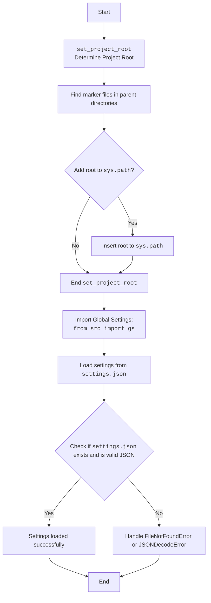

## Анализ кода `hypotez/src/suppliers/aliexpress/gui/header.py`

### 1. <алгоритм>

#### `set_project_root`
1.  **Начало**: Функция `set_project_root` принимает необязательный аргумент `marker_files` (кортеж строк), который содержит имена файлов или каталогов, используемых для определения корневого каталога проекта.
2.  **Определение начального пути**: Определяется текущий путь (`current_path`) как родительский каталог файла, в котором находится функция `set_project_root`.
3.  **Поиск корневого каталога**:
    *   Перебираются каталоги, начиная с текущего и поднимаясь по иерархии родительских каталогов.
    *   Для каждого каталога проверяется наличие хотя бы одного из файлов или каталогов, указанных в `marker_files`.
    *   Если маркерный файл найден, текущий каталог устанавливается как корневой (`__root__`) и цикл прерывается.
4.  **Добавление корневого каталога в `sys.path`**: Если корневой каталог не содержится в `sys.path`, он добавляется в начало списка путей поиска модулей.
5.  **Возврат**: Функция возвращает путь к корневому каталогу.

Пример:

Допустим, структура проекта следующая:

```
project_root/
├── .git/
├── src/
│   ├── suppliers/
│   │   ├── aliexpress/
│   │   │   ├── gui/
│   │   │   │   ├── header.py
```

В этом случае, при вызове `set_project_root()`, функция начнет поиск с каталога `project_root/src/suppliers/aliexpress/gui`. Она поднимется на один уровень вверх и найдет каталог `project_root`, содержащий каталог `.git`. Функция установит `project_root` как корневой и добавит его в `sys.path`.

#### Загрузка настроек из `settings.json`
1.  **Попытка загрузки настроек**: Блок `try` пытается открыть файл `settings.json`, расположенный в каталоге `src` относительно корневого каталога проекта.
2.  **Чтение файла**: Если файл успешно открыт, его содержимое читается и преобразуется в словарь `settings` с использованием `json.load`.
3.  **Обработка исключений**: Если файл не найден (`FileNotFoundError`) или содержит некорректный JSON (`json.JSONDecodeError`), блок `except` перехватывает исключение. В данном случае, вместо обработки исключения стоит `...`, что подразумевает пропуск обработки ошибки.

### 2. <mermaid>



#### Зависимости:

*   `sys`: Используется для работы с системными параметрами и функциями, такими как `sys.path`.
*   `json`: Используется для работы с данными в формате JSON, в частности для чтения файла настроек `settings.json`.
*   `packaging.version.Version`: Определяет класс для сравнения версий
*   `pathlib.Path`: Используется для представления путей к файлам и каталогам в файловой системе.
*   `src.gs`: Импортируется для доступа к глобальным настройкам проекта.

### 3. <объяснение>

#### Импорты:

*   `sys`: Предоставляет доступ к некоторым переменным и функциям, взаимодействующим с интерпретатором Python. Здесь используется для добавления корневого каталога проекта в `sys.path`, чтобы обеспечить возможность импорта модулей из этого каталога.
*   `json`: Используется для кодирования и декодирования данных в формате JSON. В данном случае применяется для чтения данных из файла `settings.json`.
*   `packaging.version.Version`: Данный модуль предназначен для работы с версиями программного обеспечения, позволяет сравнивать версии.
*   `pathlib.Path`: Предоставляет объектно-ориентированный способ работы с путями к файлам и каталогам.
*   `from src import gs`: Импортирует модуль `gs` из пакета `src`. Вероятно, `gs` содержит глобальные настройки и константы проекта.

#### Классы:

В данном коде нет определения классов.

#### Функции:

*   `set_project_root(marker_files: tuple[str, ...]=('.git', '__root__')) -> Path`:
    *   Аргументы:
        *   `marker_files` (tuple[str, ...], optional): Кортеж имен файлов или каталогов, наличие которых в каталоге указывает на то, что это корневой каталог проекта. По умолчанию `('.git', '__root__')`.
    *   Возвращаемое значение:
        *   `Path`: Путь к корневому каталогу проекта.
    *   Назначение:
        *   Функция определяет корневой каталог проекта путем поиска каталога, содержащего хотя бы один из `marker_files`.
        *   Добавляет корневой каталог в `sys.path`, чтобы обеспечить возможность импорта модулей из этого каталога.
    *   Пример:

    ```python
    root_path = set_project_root()
    print(root_path)  # Вывод: /path/to/project_root
    ```

#### Переменные:

*   `__root__: Path`: Содержит путь к корневому каталогу проекта. Инициализируется результатом работы функции `set_project_root()`.
*   `settings: dict`: Словарь, содержащий настройки, загруженные из файла `settings.json`. Инициализируется значением `None`.
*   `settings_file`: Файловый объект, представляющий открытый файл `settings.json`.
*   `current_path: Path`: Объект `Path`, содержащий путь к текущему файлу.

#### Потенциальные ошибки и области для улучшения:

1.  **Обработка исключений при загрузке настроек**: В блоке `except` отсутствует явная обработка исключений `FileNotFoundError` и `json.JSONDecodeError`. Рекомендуется добавить логирование ошибки, чтобы можно было отследить причину сбоя загрузки настроек.
2.  **Отсутствие обработки, если `__root__` не найден**: В случае, если ни один из маркерных файлов не найден, `__root__` останется равным каталогу, где находится скрипт. Возможно, стоит добавить явную обработку этой ситуации, например, выбросить исключение или вернуть `None`.
3. **Использование `j_loads` или `j_loads_ns`**: Для чтения JSON или конфигурационных файлов замените стандартное использование `open` и `json.load` на `j_loads` или `j_loads_ns`.

#### Взаимосвязи с другими частями проекта:

*   `src.gs`: Модуль `gs` используется для доступа к глобальным настройкам проекта. Это позволяет различным модулям проекта получать доступ к общим параметрам конфигурации.
*   `settings.json`: Файл `settings.json` содержит настройки проекта, которые могут использоваться различными модулями для конфигурирования своего поведения.

```mermaid
flowchart TD
    Start[<code>header.py</code>] --> SetProjectRoot[<code>set_project_root</code><br> Determine Project Root]

    SetProjectRoot --> ImportGS[Import Global Settings: <br><code>from src import gs</code>]
    ImportGS --> LoadSettings[Load settings from <code>settings.json</code>]

    LoadSettings --> End[End]