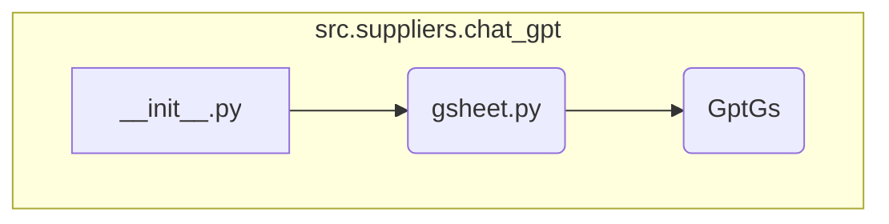

## Анализ кода `hypotez/src/suppliers/chat_gpt/__init__.py`

### 1. <алгоритм>

Файл `__init__.py` в пакете `src.suppliers.chat_gpt` служит для инициализации пакета и импорта необходимых модулей, чтобы сделать их доступными при импорте пакета. В данном случае, он импортирует класс `GptGs` из модуля `gsheet.py`.

1.  **Импорт `GptGs`**:
    *   Импортирует класс `GptGs` из `src.suppliers.chat_gpt.gsheet`.
    *   Теперь класс `GptGs` доступен через `src.suppliers.chat_gpt.GptGs`.

### 2. <mermaid>

**Объяснение:**

*   `A[__init__.py]` представляет файл `__init__.py`, который инициализирует пакет `src.suppliers.chat_gpt`.
*   `B(gsheet.py)` представляет модуль `gsheet.py`, который содержит класс `GptGs`.
*   `C(GptGs)` представляет класс `GptGs`, который импортируется в `__init__.py`.

### 3. <объяснение>

**Импорты:**

*   `.gsheet`: Импортирует модуль `gsheet` из текущего пакета (`src.suppliers.chat_gpt`). Этот модуль, вероятно, содержит классы и функции, связанные с интеграцией ChatGPT и Google Sheets.

**Классы:**

*   `GptGs`: Класс, который, вероятно, предназначен для работы с Google Sheets через ChatGPT.  Импортируется из модуля `gsheet`.  Ожидается, что класс содержит методы для чтения, записи или обработки данных в Google Sheets с использованием ChatGPT.

**Функции:**

*   В данном файле функции отсутствуют, но класс `GptGs` предполагает наличие методов для взаимодействия с Google Sheets и ChatGPT.

**Переменные:**

*   В данном файле переменные отсутствуют, но при использовании `GptGs` могут быть созданы экземпляры этого класса, содержащие свои атрибуты.

**Потенциальные ошибки и области для улучшения:**

*   Отсутствие документации внутри `__init__.py`.  Рекомендуется добавить docstring для описания назначения пакета и импортируемых элементов.

**Взаимосвязи с другими частями проекта:**

*   `src.suppliers`:  Пакет `src.suppliers` предполагает наличие других поставщиков (например, других моделей ИИ или сервисов).  `chat_gpt` — один из таких поставщиков.
*   `gsheet`:  Этот модуль, вероятно, зависит от библиотек для работы с Google Sheets (например, `google-api-python-client`) и, возможно, от API ChatGPT.