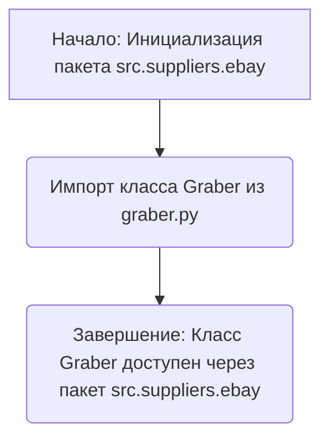

### **Анализ кода `hypotez/src/suppliers/ebay/__init__.py`**

#### **1. <алгоритм>**:

Файл `__init__.py` в пакете `src.suppliers.ebay` предназначен для определения структуры и содержимого пакета `ebay`. В данном случае он импортирует класс `Graber` из модуля `graber.py`, делая его доступным при импорте пакета `src.suppliers.ebay`.

**Блок-схема:**

1.  **Начало**: Инициализация пакета `src.suppliers.ebay`.
2.  **Импорт**: Импорт класса `Graber` из модуля `graber.py`.
3.  **Завершение**: Класс `Graber` доступен через пакет `src.suppliers.ebay`.

**Пример:**

```python
from src.suppliers import ebay

# Теперь можно использовать класс Graber через ebay.Graber
graber_instance = ebay.Graber()
```

#### **2. <mermaid>**:



**Объяснение зависимостей:**

*   Импортируется класс `Graber` из модуля `graber.py`. Это означает, что пакет `src.suppliers.ebay` зависит от функциональности, предоставляемой классом `Graber`. Класс `Graber`, вероятно, содержит логику для взаимодействия с eBay API или парсинга данных с eBay.

#### **3. <объяснение>**:

*   **Импорты**:
    *   `from .graber import Graber`: Импортирует класс `Graber` из модуля `graber.py`, находящегося в том же пакете. Это позволяет использовать класс `Graber` при работе с пакетом `src.suppliers.ebay`.
*   **Классы**:
    *   `Graber`: Класс, вероятно, предназначен для выполнения задач, связанных с получением данных с eBay (например, парсинг страниц, взаимодействие с API).
*   **Функции**:
    *   В данном файле функций нет, но класс `Graber` предполагает наличие методов для выполнения конкретных задач.
*   **Переменные**:
    *   В данном файле переменных нет.

**Потенциальные области для улучшения**:

*   Добавить документацию к пакету `src.suppliers.ebay` и классу `Graber` для лучшего понимания их функциональности и использования.
*   Рассмотреть возможность добавления других классов или функций, связанных с работой с eBay, в этот пакет.

**Взаимосвязи с другими частями проекта**:

Пакет `src.suppliers.ebay` является частью более широкой системы поставщиков (`suppliers`). Он предоставляет функциональность для работы с eBay, и, вероятно, взаимодействует с другими частями проекта, такими как:

*   Модули для обработки и хранения данных, полученных с eBay.
*   Модули для управления конфигурацией и аутентификацией при работе с eBay API.