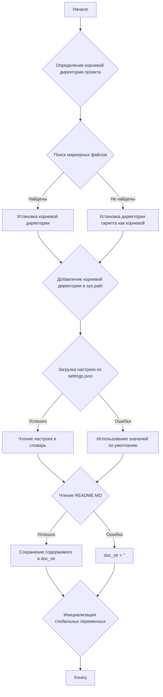
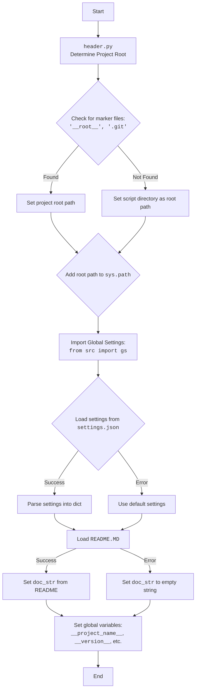
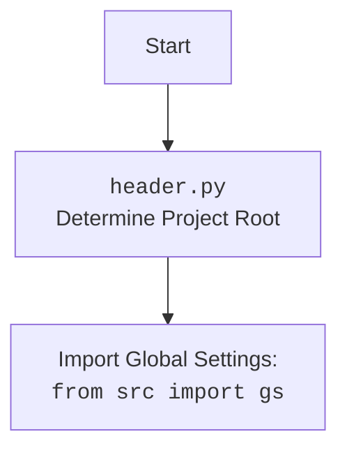

# Анализ кода `hypotez/src/suppliers/ebay/header.py`

## 1. <алгоритм>

### Общая схема работы

1.  **Определение корневой директории проекта**:
    *   Начинается с директории, в которой находится текущий файл (`header.py`).
    *   Поднимается вверх по дереву директорий, пока не найдет директорию, содержащую один из маркерных файлов (по умолчанию `__root__` или `.git`).
    *   Если маркерный файл найден, корневая директория проекта устанавливается как директория, содержащая маркерный файл.
    *   Если маркерные файлы не найдены, корневой директорией считается директория, в которой находится скрипт.
    *   Добавляет корневую директорию проекта в `sys.path`, если её там еще нет.

2.  **Загрузка настроек из `settings.json`**:
    *   Пытается открыть и прочитать файл `settings.json`, расположенный в директории `src` относительно корневой директории проекта.
    *   Использует модуль `json` для преобразования содержимого файла в словарь `settings`.
    *   Обрабатывает исключения `FileNotFoundError` и `json.JSONDecodeError`, если файл не найден или содержит некорректный JSON.

3.  **Чтение содержимого файла `README.MD`**:
    *   Пытается открыть и прочитать файл `README.MD`, расположенный в директории `src` относительно корневой директории проекта.
    *   Сохраняет содержимое файла в строку `doc_str`.
    *   Обрабатывает исключения `FileNotFoundError` и `json.JSONDecodeError`, если файл не найден или не может быть прочитан.

4.  **Инициализация глобальных переменных**:
    *   Инициализирует глобальные переменные (`__project_name__`, `__version__`, `__doc__`, `__details__`, `__author__`, `__copyright__`, `__cofee__`) на основе данных, загруженных из `settings.json`.
    *   Если файл `settings.json` не найден или не содержит необходимых данных, используются значения по умолчанию.

### Блок-схема



## 2. <mermaid>



Этот блок `mermaid` описывает процесс, который происходит в файле `header.py`.

*   `Determine Project Root`: определяет корневую директорию проекта.
*   `Import Global Settings`: импортирует глобальные настройки из `src`.
*   `Load settings from settings.json`: пытается загрузить настройки из файла `settings.json`.
*   `Set global variables`: устанавливает глобальные переменные, такие как `__project_name__` и `__version__`.

Дополнительный блок `mermaid` для `header.py`:



## 3. <объяснение>

### Импорты

*   `sys`: Используется для работы с системными параметрами и функциями, такими как добавление пути к модулю в `sys.path`.
*   `json`: Используется для работы с JSON-файлами, в частности, для загрузки настроек из `settings.json`.
*   `packaging.version.Version`: Используется для сравнения версий.
*   `pathlib.Path`: Используется для работы с путями к файлам и директориям.

### Функции

#### `set_project_root(marker_files=('__root__','.git')) -> Path`

*   **Аргументы**:
    *   `marker_files` (tuple): Список файлов или директорий, которые указывают на корень проекта. По умолчанию `('__root__', '.git')`.
*   **Возвращаемое значение**:
    *   `Path`: Путь к корневой директории проекта.
*   **Назначение**:
    *   Функция определяет корневую директорию проекта путем поиска маркерных файлов в текущей директории и её родительских директориях. Если маркерные файлы найдены, то родительская директория считается корневой. Если маркерные файлы не найдены, то текущая директория считается корневой. Корневая директория добавляется в `sys.path`.
*   **Пример**:

    ```python
    from pathlib import Path
    root_path = set_project_root()
    print(root_path)
    # Вывод: /path/to/project
    ```

### Переменные

*   `__root__`: Путь к корневой директории проекта.
*   `settings`: Словарь с настройками, загруженными из `settings.json`.
*   `doc_str`: Строка с содержимым файла `README.MD`.
*   `__project_name__`: Название проекта.
*   `__version__`: Версия проекта.
*   `__doc__`: Документация проекта (содержимое `README.MD`).
*   `__author__`: Автор проекта.
*   `__copyright__`: Информация об авторских правах.
*   `__cofee__`: Строка с предложением поддержать разработчика.

### Цепочка взаимосвязей с другими частями проекта

*   Этот файл (`header.py`) используется для определения корневой директории проекта и загрузки основных настроек. Он импортируется другими модулями проекта для доступа к глобальным переменным и настройкам.
*   `src.gs` содержит глобальные настройки.
*   `settings.json` содержит настройки проекта.
*   `README.MD` содержит документацию проекта.

### Потенциальные ошибки и области для улучшения

*   Обработка ошибок при чтении `settings.json` и `README.MD` может быть улучшена.  Сейчас ошибки просто игнорируются.  Стоит добавить логирование ошибок с использованием модуля `logger`.
*   В случае, если `settings.json` не найден, все глобальные переменные инициализируются значениями по умолчанию. Возможно, стоит добавить механизм для загрузки настроек из другого источника (например, переменные окружения).
*   Использование `...` в блоках `try...except` может скрыть важные ошибки.  Стоит заменить `...` на конкретную обработку исключений или логирование.
*   `__cofee__: str = settings.get("cofee", "Treat the developer to a cup of coffee for boosting enthusiasm in development: https://boosty.to/hypo69")  if settings  else "Treat the developer to a cup of coffee for boosting enthusiasm in development: https://boosty.to/hypo69"` - дублирование строки.