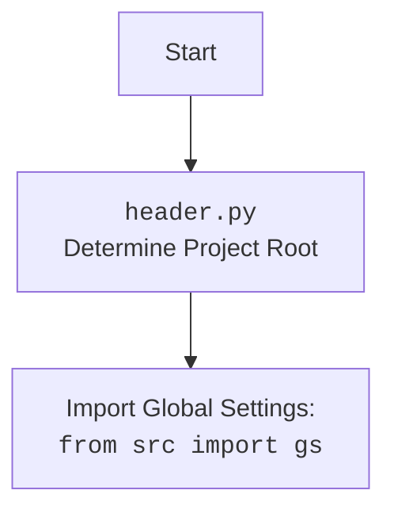

## Анализ кода

### 1. <алгоритм>

Этот код определяет класс `Graber`, который наследуется от класса `Graber` (который, судя по импорту, переименован в `Grbr`) из модуля `src.suppliers.graber`. Класс предназначен для сбора данных о товарах с сайта `etzmaleh.co.il`.

**Блок-схема:**

1.  **Инициализация:**
    *   Создается экземпляр класса `Graber` с передачей экземпляра `Driver` и индекса языка.
    *   Вызывается конструктор родительского класса `Graber` (`Grbr`) с указанием префикса поставщика (`etzmaleh`), драйвера и индекса языка.
    *   Устанавливается `Context.locator_for_decorator = None`.
        ```python
        class Graber(Grbr):
            def __init__(self, driver: Driver, lang_index):
                self.supplier_prefix = 'etzmaleh'
                super().__init__(supplier_prefix=self.supplier_prefix, driver=driver, lang_index=lang_index)
                Context.locator_for_decorator = None
        ```
        *Пример*:

        ```python
        driver = Driver()
        graber = Graber(driver, 0)
        ```

2.  **Наследование и переопределение:**
    *   Класс `Graber` наследует функциональность сбора полей товара от родительского класса `Graber` (`Grbr`).
    *   Если требуется нестандартная обработка какого-либо поля, соответствующая функция переопределяется в классе `Graber`.

3.  **Декоратор (потенциальный):**
    *   В коде присутствует закомментированный шаблон декоратора `close_pop_up`, предназначенный для закрытия всплывающих окон перед выполнением основной логики функции сбора данных.
    *   Декоратор использует `Context.locator` для определения локатора элемента, который нужно закрыть.
    *   В текущей реализации декоратор неактивен, так как закомментирован.
        ```python
        # def close_pop_up(value: Any = None) -> Callable:
        #     def decorator(func: Callable) -> Callable:
        #         @wraps(func)
        #         async def wrapper(*args, **kwargs):\
        #             try:\
        #                 ...\
        #             except ExecuteLocatorException as e:\
        #                 logger.debug(f'Ошибка выполнения локатора: {e}')\
        #             return await func(*args, **kwargs)
        #         return wrapper
        #     return decorator
        ```

4.  **Использование `Context`:**
    *   Класс использует `Context` для хранения и передачи контекстной информации, такой как локаторы для декоратора.
    *   `Context.locator_for_decorator` устанавливается в `None`, что отключает выполнение декоратора по умолчанию.

**Поток данных:**

1.  `Driver` и `lang_index` передаются в конструктор `Graber`.
2.  `Graber` вызывает конструктор родительского класса `Grbr`, передавая `supplier_prefix`, `driver` и `lang_index`.
3.  В процессе работы `Graber` может использовать `Context` для получения локаторов и другой контекстной информации.
4.  (Если декоратор активирован) Перед выполнением функции сбора данных выполняется код декоратора, который может закрывать всплывающие окна.
5.  Функции сбора данных (наследованные или переопределенные) извлекают данные со страницы товара и возвращают их.

### 2. <mermaid>

```mermaid
flowchart TD
    A[Инициализация Graber] --> B{Вызов конструктора Grbr};
    B --> C{Установка supplier_prefix};
    C --> D{Установка driver и lang_index};
    D --> E{Установка Context.locator_for_decorator = None};
    E --> F[Наследование методов Grbr];
    F --> G{Переопределение методов (опционально)};
    G --> H[Сбор данных о товаре];
    H --> I[Возврат данных];
```

**Объяснение:**

*   `A`: Инициализация класса `Graber` с передачей экземпляра `Driver` и индекса языка.
*   `B`: Вызов конструктора родительского класса `Grbr` с указанием префикса поставщика (`etzmaleh`), драйвера и индекса языка.
*   `C`: Установка атрибута `supplier_prefix` в значение `'etzmaleh'`.
*   `D`: Установка значений `driver` и `lang_index` для экземпляра класса `Graber`.
*   `E`: Установка `Context.locator_for_decorator = None`, что отключает выполнение декоратора по умолчанию.
*   `F`: Наследование методов сбора данных от родительского класса `Grbr`.
*   `G`: Переопределение методов сбора данных в классе `Graber` для нестандартной обработки полей (опционально).
*   `H`: Сбор данных о товаре с использованием унаследованных или переопределенных методов.
*   `I`: Возврат собранных данных.



**Объяснение импорта `header.py`:**

*   `Start`: Начало процесса.
*   `Header`: Модуль `header.py`, который, вероятно, определяет корень проекта.
*   `import`: Импорт глобальных настроек из модуля `src.gs`.

### 3. <объяснение>

**Импорты:**

*   `typing.Any`: Используется для аннотации типов, когда тип переменной может быть любым.
*   `header`:  Определяет корень проекта (как указано в template mermaid diagram).
*   `src.suppliers.graber.Graber as Grbr`: Импортирует базовый класс `Graber` из модуля `src.suppliers.graber` и переименовывает его в `Grbr` для краткости. Этот базовый класс, вероятно, содержит общую логику для сбора данных с сайтов поставщиков.
*   `src.suppliers.graber.Context`: Импортирует класс `Context` из того же модуля. `Context`, вероятно, используется для хранения и передачи контекстной информации между различными частями кода, например, локаторы элементов для взаимодействия с веб-страницей.
*   `src.suppliers.graber.close_pop_up`: Импортирует функцию `close_pop_up` из того же модуля. Эта функция, вероятно, используется для закрытия всплывающих окон на веб-странице.
*   `src.webdriver.driver.Driver`: Импортирует класс `Driver` из модуля `src.webdriver.driver`. Класс `Driver`, вероятно, представляет собой обертку над веб-драйвером (например, Selenium WebDriver) и предоставляет методы для управления браузером.
*   `src.logger.logger.logger`: Импортирует экземпляр логгера из модуля `src.logger.logger`. Логгер используется для записи информации о работе программы, такой как ошибки, предупреждения и отладочные сообщения.

**Класс `Graber`:**

*   **Роль:** Класс `Graber` предназначен для сбора данных о товарах с сайта `etzmaleh.co.il`. Он наследует общую логику сбора данных от базового класса `Graber` (`Grbr`) и может переопределять методы для нестандартной обработки полей.
*   **Атрибуты:**
    *   `supplier_prefix` (str): Префикс поставщика, используется для идентификации поставщика данных. В данном случае, `etzmaleh`.
*   **Методы:**
    *   `__init__(self, driver: Driver, lang_index)`: Конструктор класса. Принимает экземпляр класса `Driver` и индекс языка. Инициализирует атрибут `supplier_prefix` и вызывает конструктор родительского класса `Grbr`. Устанавливает `Context.locator_for_decorator = None`.

**Переменные:**

*   `supplier_prefix` (str): Атрибут класса `Graber`, хранит префикс поставщика.
*   `driver` (Driver): Экземпляр класса `Driver`, используемый для управления браузером.
*   `lang_index` (int): Индекс языка, используемый для локализации контента.
*   `Context.locator_for_decorator` (Any): Атрибут класса `Context`, хранит локатор элемента для закрытия всплывающего окна (используется в декораторе `close_pop_up`).

**Потенциальные ошибки и области для улучшения:**

*   **Закомментированный декоратор:** Код декоратора `close_pop_up` закомментирован, что означает, что он не используется. Если на сайте `etzmaleh.co.il` часто появляются всплывающие окна, которые мешают сбору данных, то следует раскомментировать и настроить декоратор.
*   **Отсутствие обработки исключений в конструкторе:** В конструкторе класса `Graber` не предусмотрена обработка исключений. Если при инициализации класса `Driver` или при вызове конструктора родительского класса `Grbr` произойдет ошибка, то программа может завершиться аварийно. Следует добавить обработку исключений, чтобы программа могла корректно обработать ошибки и продолжить работу.
*   **Жестко заданный префикс поставщика:** Префикс поставщика (`etzmaleh`) жестко задан в классе `Graber`. Если потребуется собирать данные с другого сайта поставщика, то придется создавать новый класс `Graber` или изменять существующий. Можно сделать префикс поставщика параметром конструктора, чтобы класс `Graber` можно было использовать для сбора данных с разных сайтов.

**Взаимосвязи с другими частями проекта:**

*   Класс `Graber` зависит от классов `Driver` и `Context`, а также от базового класса `Graber` (`Grbr`). Он использует эти классы для управления браузером, хранения контекстной информации и выполнения общей логики сбора данных.
*   Класс `Graber` может использоваться другими частями проекта для сбора данных о товарах с сайта `etzmaleh.co.il`. Например, он может использоваться скриптом, который автоматически собирает данные о товарах и сохраняет их в базу данных.