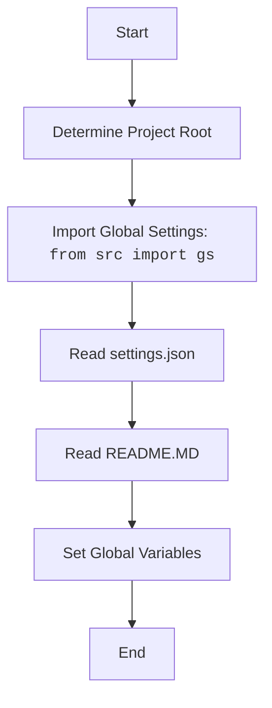

### **Алгоритм**

1.  **`set_project_root`**:
    *   Начинает с директории, где расположен текущий файл (`__file__`).
    *   Ищет вверх по дереву директорий, пока не найдет один из "маркерных" файлов или директорий (по умолчанию `__root__` или `.git`).
    *   Если маркер найден, устанавливает эту директорию как корень проекта (`__root__`).
    *   Добавляет корень проекта в `sys.path`, если его там еще нет.

    ```python
    # Пример:
    # Если файл находится в /path/to/project/src/suppliers/hb/header.py
    # и в /path/to/project есть файл .git, то __root__ будет /path/to/project
    ```

2.  **Инициализация `__root__`**:
    *   Вызывает `set_project_root()` для определения корневой директории проекта.
    *   Сохраняет результат в глобальной переменной `__root__`.

3.  **Чтение настроек из `settings.json`**:
    *   Пытается открыть и прочитать файл `settings.json`, расположенный в директории `src` относительно корня проекта.
    *   Использует `json.load()` для преобразования содержимого файла в словарь `settings`.
    *   Обрабатывает исключения `FileNotFoundError` и `json.JSONDecodeError`, если файл не найден или содержит некорректный JSON.

    ```python
    # Пример:
    # Если settings.json содержит {"project_name": "hypotez", "version": "1.0"},
    # то переменная settings будет равна этому словарю.
    ```

4.  **Чтение документации из `README.MD`**:
    *   Пытается открыть и прочитать файл `README.MD`, расположенный в директории `src` относительно корня проекта.
    *   Сохраняет содержимое файла в строке `doc_str`.
    *   Обрабатывает исключения `FileNotFoundError` и `json.JSONDecodeError`, если файл не найден или не читается.

    ```python
    # Пример:
    # Если README.MD содержит "Описание проекта",
    # то переменная doc_str будет равна этой строке.
    ```

5.  **Инициализация глобальных переменных**:
    *   Инициализирует глобальные переменные (`__project_name__`, `__version__`, `__doc__`, `__author__`, `__copyright__`, `__cofee__`) значениями из словаря `settings`, если он был успешно загружен.
    *   Если `settings` не был загружен, устанавливает значения по умолчанию.

    ```python
    # Пример:
    # Если settings = {"project_name": "hypotez", "version": "1.0"},
    # то __project_name__ будет "hypotez", а __version__ будет "1.0".
    # Если settings не был загружен, то __project_name__ будет "hypotez", а __version__ будет "".
    ```

### **Mermaid**



Диаграмма показывает следующую последовательность действий:

1.  Определение корневой директории проекта.
2.  Импорт глобальных настроек из модуля `src.gs`.
3.  Чтение настроек из файла `settings.json`.
4.  Чтение документации из файла `README.MD`.
5.  Установка глобальных переменных на основе прочитанных настроек и документации.

### **Объяснение**

*   **Импорты**:

    *   `sys`: Используется для работы с системными параметрами и функциями, такими как добавление пути к проекту в `sys.path`.
    *   `json`: Используется для чтения данных из JSON-файла (`settings.json`).
    *   `packaging.version.Version`: Используется для управления версиями пакетов.
    *   `pathlib.Path`: Используется для работы с путями к файлам и директориям.
    *   `src`: Импортирует модуль `gs` из пакета `src`, который, вероятно, содержит глобальные настройки и пути.
*   **Классы**:
    *   Нет определенных классов в этом файле.
*   **Функции**:

    *   `set_project_root(marker_files: tuple) -> Path`:
        *   Аргументы:
            *   `marker_files (tuple)`: Кортеж имен файлов или директорий, которые используются для определения корня проекта. По умолчанию `('__root__', '.git')`.
        *   Возвращаемое значение:
            *   `Path`: Путь к корневой директории проекта.
        *   Назначение:
            *   Функция определяет корневую директорию проекта путем поиска вверх по дереву директорий, пока не найдет один из маркерных файлов. Это позволяет запускать скрипт из любой поддиректории проекта.
        *   Пример:

        ```python
        # Пример использования:
        root_path = set_project_root()
        print(root_path)
        ```
*   **Переменные**:

    *   `__root__ (Path)`: Глобальная переменная, содержащая путь к корневой директории проекта.
    *   `settings (dict)`: Глобальная переменная, содержащая словарь с настройками проекта, прочитанными из файла `settings.json`.
    *   `doc_str (str)`: Глобальная переменная, содержащая строку с документацией проекта, прочитанной из файла `README.MD`.
    *   `__project_name__ (str)`: Глобальная переменная, содержащая имя проекта.
    *   `__version__ (str)`: Глобальная переменная, содержащая версию проекта.
    *   `__doc__ (str)`: Глобальная переменная, содержащая документацию проекта.
    *   `__author__ (str)`: Глобальная переменная, содержащая имя автора проекта.
    *   `__copyright__ (str)`: Глобальная переменная, содержащая информацию об авторских правах.
    *   `__cofee__ (str)`: Глобальная переменная, содержащая сообщение с предложением угостить разработчика кофе.
*   **Потенциальные ошибки и области для улучшения**:

    *   Обработка исключений `FileNotFoundError` и `json.JSONDecodeError` в блоках `try...except` просто пропускает ошибки. Было бы полезно добавить логирование ошибок с использованием `logger.error` для отслеживания проблем при чтении файлов настроек и документации.
    *   Использование `...` в блоках `except` не является хорошей практикой. Лучше явно указать, что нужно сделать в случае ошибки (например, установить значения по умолчанию для переменных).
    *   Использовать `j_loads` или `j_loads_ns` для чтения `settings.json`.

*   **Взаимосвязи с другими частями проекта**:

    *   Этот файл является частью пакета `src.suppliers.hb` и отвечает за инициализацию глобальных переменных проекта.
    *   Он использует модуль `src.gs` для получения глобальных настроек и путей.
    *   Он читает файлы `settings.json` и `README.MD`, расположенные в корневой директории проекта, для получения настроек и документации.
    *   Глобальные переменные, инициализированные в этом файле, могут использоваться другими частями проекта для получения информации о проекте (например, имя, версия, автор и т.д.).