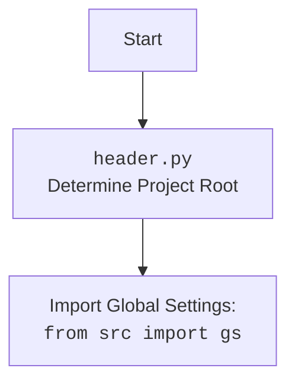

### **Анализ кода `hypotez/src/suppliers/kualastyle/graber.py`**

#### **1. Алгоритм**

1.  **Инициализация**:
    *   Создается экземпляр класса `Graber`, который наследуется от `Graber` (обозначенного как `Grbr`) из модуля `src.suppliers.graber`.
    *   Вызывается конструктор родительского класса `Graber.__init__` с указанием префикса поставщика (`supplier_prefix`), драйвера веб-браузера (`driver`) и индекса языка (`lang_index`).
    *   Инициализируется `Context.locator_for_decorator` значением `None`.

2.  **Использование декоратора (закомментировано)**:

    *   В коде присутствует закомментированный пример декоратора `close_pop_up`, предназначенного для закрытия всплывающих окон перед выполнением основной логики функции.
    *   Если `Context.locator_for_decorator` установлен, декоратор пытается выполнить локатор для закрытия всплывающего окна. В случае ошибки выполнения локатора, она логируется.

3.  **Методы класса `Graber`**:

    *   В классе `Graber` переопределяются или добавляются методы для нестандартной обработки полей на странице товара `kualastyle.co.il`.

**Блок-схема рабочего процесса:**

```mermaid
graph LR
    A[Начало: Инициализация Graber] --> B{Вызов Graber.__init__};
    B -- Установка supplier_prefix --> C(Установка self.supplier_prefix = 'kualastyle');
    B --> D(Вызов super().__init__);
    D -- Передача supplier_prefix, driver, lang_index --> E[Инициализация родительского класса Graber];
    E --> F(Установка Context.locator_for_decorator = None);
    F --> G{Проверка: Context.locator_for_decorator установлен?};
    G -- Да --> H[Выполнение локатора для закрытия pop-up (если декоратор активен)];
    H -- Успешно --> I[Продолжение выполнения основной логики];
    H -- Ошибка --> J(Логирование ошибки);
    J --> I;
    G -- Нет --> I[Продолжение выполнения основной логики];
    I --> K[Выполнение методов для обработки полей товара];
    K --> L[Конец];
```

#### **2. Mermaid**

```mermaid
flowchart TD
    A[Начало: Инициализация Graber] --> B{Вызов Graber.__init__};
    B -- Установка supplier_prefix --> C(Установка self.supplier_prefix = 'kualastyle');
    B --> D(Вызов super().__init__);
    D -- Передача supplier_prefix, driver, lang_index --> E[Инициализация родительского класса Graber];
    E --> F(Установка Context.locator_for_decorator = None);
    F --> G{Проверка: Context.locator_for_decorator установлен?};
    G -- Да --> H[Выполнение локатора для закрытия pop-up (если декоратор активен)];
    H -- Успешно --> I[Продолжение выполнения основной логики];
    H -- Ошибка --> J(Логирование ошибки);
    J --> I;
    G -- Нет --> I[Продолжение выполнения основной логики];
    I --> K[Выполнение методов для обработки полей товара];
    K --> L[Конец];
```

**Импорты и зависимости:**

*   `typing`:
    *   Используется для статической типизации.
*   `header`:
    *   Импортируется для определения местоположения корневого каталога проекта и загрузки глобальных настроек.
*   `src.suppliers.graber.Graber as Grbr`:
    *   Импортируется базовый класс `Graber` из модуля `src.suppliers.graber` и переименовывается в `Grbr`.
*   `src.suppliers.graber.Context`:
    *   Импортируется класс `Context`, который, вероятно, используется для хранения контекстной информации, такой как драйвер веб-браузера и локаторы элементов.
*   `src.suppliers.graber.close_pop_up`:
    *   Импортируется функция `close_pop_up`, которая, вероятно, используется для закрытия всплывающих окон.
*   `src.webdriver.driver.Driver`:
    *   Импортируется класс `Driver` из модуля `src.webdriver.driver`, который, вероятно, представляет собой драйвер веб-браузера, используемый для взаимодействия с веб-страницами.
*   `src.logger.logger.logger`:
    *   Импортируется объект `logger` из модуля `src.logger.logger`, который используется для логирования информации о работе программы.



#### **3. Объяснение**

**Импорты:**

*   `header`:
    *   **Назначение**: Обеспечивает определение местоположения корневого каталога проекта и импорт глобальных настроек.
    *   **Взаимосвязь**: Используется для доступа к общим параметрам и конфигурациям проекта.
*   `src.suppliers.graber`:
    *   **Назначение**: Содержит базовый класс `Graber` с общей функциональностью для сбора данных о товарах.
    *   **Взаимосвязь**: Класс `Graber` в текущем модуле наследуется от класса `Graber` из `src.suppliers.graber`, расширяя его функциональность для конкретного поставщика (`kualastyle`).
*   `src.webdriver.driver`:
    *   **Назначение**: Предоставляет класс `Driver` для управления веб-браузером.
    *   **Взаимосвязь**: Используется для взаимодействия с веб-страницами, навигации и извлечения данных.
*   `src.logger.logger`:
    *   **Назначение**: Предоставляет объект `logger` для логирования событий и ошибок.
    *   **Взаимосвязь**: Используется для записи информации о работе программы, отладки и мониторинга.

**Классы:**

*   `Graber`:
    *   **Роль**: Класс, отвечающий за сбор данных о товарах с сайта `kualastyle.co.il`.
    *   **Атрибуты**:
        *   `supplier_prefix` (str): Префикс поставщика, устанавливается в значение `'kualastyle'`.
    *   **Методы**:
        *   `__init__(self, driver: Driver, lang_index: int)`: Конструктор класса, инициализирует `supplier_prefix`, вызывает конструктор родительского класса и устанавливает `Context.locator_for_decorator` в `None`.
    *   **Взаимодействие**:
        *   Наследуется от класса `Graber` из модуля `src.suppliers.graber`, расширяя его функциональность.
        *   Использует класс `Driver` для взаимодействия с веб-страницами.
        *   Использует объект `logger` для логирования.
        *   Использует класс `Context` для хранения контекстной информации.

**Функции:**

*   `__init__(self, driver: Driver, lang_index: int)`:
    *   **Аргументы**:
        *   `driver` (Driver): Экземпляр класса `Driver` для управления веб-браузером.
        *   `lang_index` (int): Индекс языка.
    *   **Возвращаемое значение**: Отсутствует (None).
    *   **Назначение**: Инициализация экземпляра класса `Graber`, установка префикса поставщика, вызов конструктора родительского класса и установка `Context.locator_for_decorator` в `None`.
    *   **Пример**:

```python
driver = Driver()  #  Предположим, что класс Driver инициализирован
graber = Graber(driver=driver, lang_index=0)
print(graber.supplier_prefix)  #  Результат: kualastyle
```

**Переменные:**

*   `supplier_prefix` (str):
    *   **Тип**: Строка.
    *   **Использование**: Префикс поставщика, используемый для идентификации поставщика.

**Потенциальные ошибки и области для улучшения:**

*   **Закомментированный декоратор**: Код содержит закомментированный пример декоратора `close_pop_up`, который, возможно, предназначен для закрытия всплывающих окон. Если этот декоратор необходим, его следует раскомментировать и настроить.
*   **Обработка исключений**: В закомментированном декораторе есть обработка исключения `ExecuteLocatorException`, но отсутствует общая обработка исключений в классе `Graber`. Следует добавить обработку исключений для повышения надежности кода.
*   **Использование `Context.locator_for_decorator`**: Использование `Context.locator_for_decorator` для управления поведением декоратора может быть не самым явным способом. Возможно, стоит рассмотреть другие варианты, например, передачу параметров в декоратор напрямую.
*   **Отсутствие документации**: Классу `Graber` и его методам не хватает подробной документации. Следует добавить документацию, чтобы улучшить понимание кода.

**Цепочка взаимосвязей:**

1.  `header.py`:
    *   Определяет корневой каталог проекта и загружает глобальные настройки.
2.  `src.suppliers.graber.py`:
    *   Содержит базовый класс `Graber` с общей функциональностью для сбора данных о товарах.
3.  `src.webdriver.driver.py`:
    *   Предоставляет класс `Driver` для управления веб-браузером.
4.  `src.logger.logger.py`:
    *   Предоставляет объект `logger` для логирования событий и ошибок.
5.  `kualastyle/graber.py`:
    *   Наследуется от класса `Graber` из `src.suppliers.graber.py`, расширяя его функциональность для конкретного поставщика (`kualastyle`).
    *   Использует класс `Driver` из `src.webdriver.driver.py` для взаимодействия с веб-страницами.
    *   Использует объект `logger` из `src.logger.logger.py` для логирования.