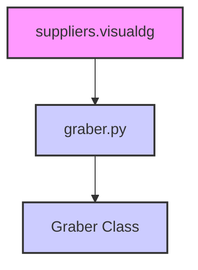

### **Анализ кода `hypotez/src/suppliers/visualdg/__init__.py`**

#### **1. <алгоритм>**:
1.  **Импорт класса `Graber`**: Импортирует класс `Graber` из модуля `.graber`. Этот класс, вероятно, отвечает за извлечение или обработку данных.
2.  **Инициализация модуля**: Файл `__init__.py` используется для указания, что каталог `visualdg` является пакетом Python. Импорт класса `Graber` делает его доступным для использования вне пакета `visualdg`.

#### **2. <mermaid>**:

**Объяснение зависимостей:**

*   `suppliers.visualdg`: Пакет, который содержит модуль `graber.py`.
*   `graber.py`: Модуль, содержащий класс `Graber`.
*   `Graber Class`: Класс, который импортируется в `__init__.py` для предоставления функциональности граббера данных.

#### **3. <объяснение>**:

**Импорты**:

*   `from .graber import Graber`: Импортирует класс `Graber` из модуля `graber.py`, находящегося в той же директории. Это позволяет использовать класс `Graber` вне пакета `visualdg`.

**Классы**:

*   `Graber`: Предположительно, класс `Graber` отвечает за извлечение или обработку данных. Подробности реализации находятся в файле `graber.py`.

**Функции**:

*   В данном коде функции отсутствуют.

**Переменные**:

*   В явном виде переменные не определены.

**Потенциальные улучшения**:

*   Необходима документация класса `Graber` в файле `graber.py` для понимания его функциональности и использования.

**Взаимосвязи с другими частями проекта**:

*   Предположительно, модуль `visualdg` является частью системы, отвечающей за работу с данными, связанными с "visualdg". Класс `Graber` может использоваться для получения или обработки этих данных.