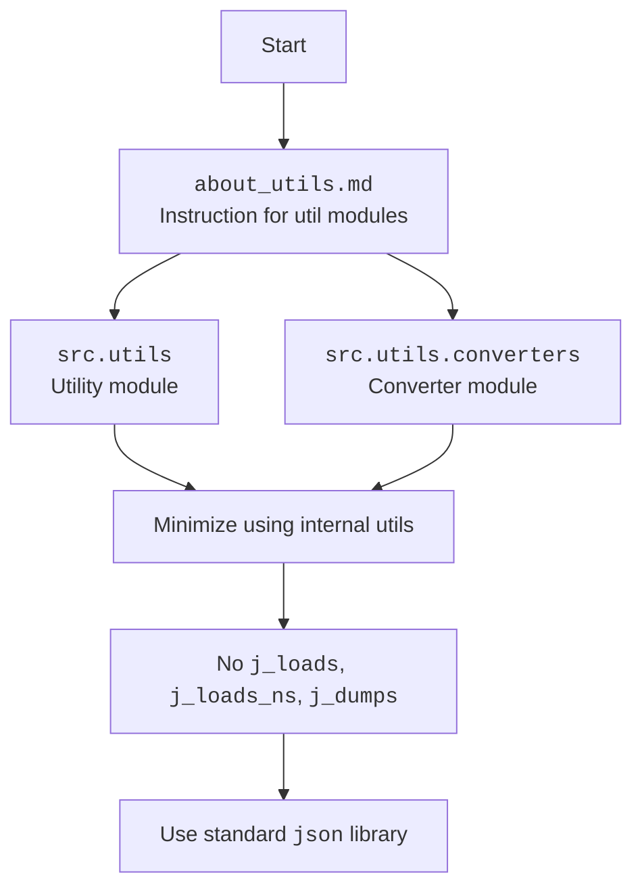

## Анализ кода `src/utils/instructions/about_utils.md`

### 1. <алгоритм>

Файл `about_utils.md` не содержит исполняемого кода, а является инструкцией в формате markdown. Поэтому, алгоритм будет описывать процесс понимания и следования этой инструкции:

1. **Начало**: Читаем файл `about_utils.md`.
2. **Изучение**: Просматриваем текст инструкции.
3. **Анализ**: Разбираем ключевые моменты:
    - `src.utils` и `src.utils.converters` - это модули с утилитами.
    - Утилиты должны минимизировать использование внутренних утилит.
    - **ЗАПРЕЩЕНО** использовать `j_loads`, `j_loads_ns` и `j_dumps`.
    - **НЕОБХОДИМО** использовать стандартную библиотеку `json`.
4. **Применение**: При разработке утилит в `src.utils` и `src.utils.converters` следуем вышеперечисленным правилам.
5. **Конец**: Завершение процесса понимания и применения инструкции.

**Примеры логических блоков**:
*   **Изучение**: Чтение строки "В этих модулях **НЕ используется** `j_loads`, `j_loads_ns` и `j_dumps`".
*   **Анализ**: Осознание, что данные функции нельзя использовать.
*   **Применение**: Код, использующий стандартную библиотеку `json` для обработки данных.

### 2. <mermaid>

**Объяснение `mermaid`:**

*   `flowchart TD`:  Определяет тип диаграммы как "flowchart" и направление "Top to Bottom".
*   `Start`: Начало процесса.
*   `Instruction`:  Представляет файл `about_utils.md` как источник инструкции.
*   `UtilsModule`: Представляет модуль `src.utils`.
*   `ConverterModule`: Представляет модуль `src.utils.converters`.
*   `NoInternalUtils`: Указывает ограничение на использование внутренних утилит.
*   `NoJumps`:  Указывает на запрет использования `j_loads`, `j_loads_ns`, `j_dumps`.
*   `UseJson`:  Указывает на необходимость использования стандартной библиотеки `json`.

Зависимости: Диаграмма показывает, что `src.utils` и `src.utils.converters`  оба следуют инструкции из `about_utils.md`.

### 3. <объяснение>

#### Импорты:

В предоставленном коде импортов нет, так как это инструкция, а не код. Однако, в тексте инструкции упоминается использование стандартной библиотеки `json`.

*   `import json`: Стандартная библиотека Python для работы с данными в формате JSON. Она предоставляет функции для сериализации (преобразования объектов Python в JSON-строку) и десериализации (преобразования JSON-строки в объекты Python).

#### Классы:

В данном фрагменте кода нет определения классов.

#### Функции:

В данном фрагменте кода нет определения функций. Однако, упоминаются функции, которые **НЕ должны** использоваться:

*   `j_loads`: Функция для загрузки данных из JSON, вероятно, собственная реализация в проекте.
*   `j_loads_ns`: Функция для загрузки данных из JSON с пространством имен (вероятно, собственная реализация).
*   `j_dumps`: Функция для преобразования данных в JSON (вероятно, собственная реализация).

Эти функции являются внутренними, и их использование в модулях `src.utils` и `src.utils.converters` запрещено.

#### Переменные:

В данном фрагменте кода переменные не используются, так как это инструкция, а не код.

#### Цепочка взаимосвязей:

Файл `about_utils.md` является инструкцией для разработчиков модулей `src.utils` и `src.utils.converters`. Он влияет на то, как эти модули взаимодействуют с данными. Запрет на использование `j_loads`, `j_loads_ns`, и `j_dumps` заставляет разработчиков использовать стандартную библиотеку `json`, что должно обеспечить большую совместимость и понятность. Эта инструкция направлена на стандартизацию обработки данных в утилитах и минимизацию зависимостей от специфических внутренних реализаций.

**Потенциальные ошибки и области для улучшения:**

1.  **Отсутствие объяснения причин запрета внутренних функций:** Инструкция не объясняет, почему запрещено использовать `j_loads`, `j_loads_ns` и `j_dumps`. Это может привести к недопониманию разработчиков. Возможно, стоит добавить пояснение, например, что использование стандартной библиотеки `json` обеспечивает большую переносимость и стандартизацию.
2.  **Недостаточная конкретика**: Инструкция говорит "минимизировать использование внутренних утилит", но не определяет, какие именно внутренние утилиты, кроме указанных `j_loads`, `j_loads_ns` и `j_dumps`, следует избегать.
3.  **Нет примеров**: Было бы полезно привести конкретные примеры использования `json.loads` и `json.dumps`, чтобы разработчики лучше поняли, как правильно использовать стандартную библиотеку.
4.  **Отсутствие указаний на обработку ошибок:** Инструкция не говорит, как обрабатывать возможные ошибки при работе с `json`.

В целом, инструкция понятна, но имеет некоторые недостатки, которые можно улучшить для более четкого и эффективного использования.