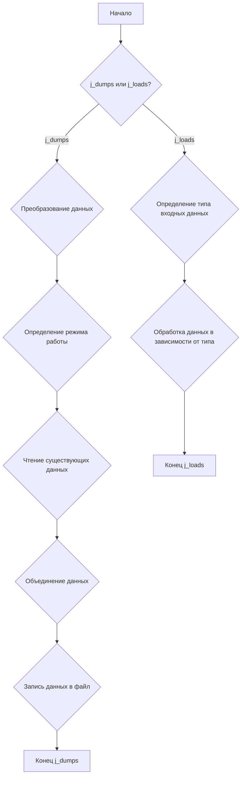
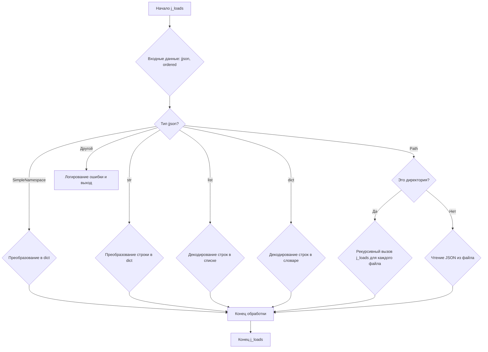

# Проект `hypotez`
# Роль `code explainer`

## Анализ кода `hypotez/src/utils/jjson.py`

### 1. <алгоритм>

#### Общая схема работы модуля `jjson.py`:


#### Подробная блок-схема для `j_dumps`:

```mermaid
graph TD
    A[Начало j_dumps] --> B{Входные данные: data, file_path, ensure_ascii, mode, exc_info};
    B --> C{Является ли data строкой?};
    C -- Да --> D{Попытка исправить JSON};
    D -- Успешно --> E{Преобразование данных в dict};
    D -- Ошибка --> F[Логирование ошибки и выход];
    C -- Нет --> E;
    E --> G{Проверка mode};
    G -- mode в ("w", "a+", "+a") --> H{file_path указан и существует? и mode в ("a+", "+a")?};
    G -- mode не в ("w", "a+", "+a") --> I{Установка mode = "w"};
    H -- Да --> J{Чтение существующих данных};
    H -- Нет --> K{Пропуск чтения существующих данных};
    J --> L{Объединение данных};
    K --> L;
    L --> M{file_path указан?};
    M -- Да --> N{Создание директорий, если нужно};
    N --> O{Запись данных в файл};
    O -- Успешно --> P[Возврат данных];
    O -- Ошибка --> Q[Логирование ошибки и выход];
    M -- Нет --> P;
    P --> R[Конец j_dumps];
    I --> H;
```

**Примеры для блоков:**

*   **Входные данные:** `data = {'key': 'value'}, file_path='output.json', mode='w'`
*   **Преобразование данных в dict:** `data` из `SimpleNamespace` преобразуется в `dict`.
*   **Чтение существующих данных:** Если `file_path` существует и `mode` - `a+`, содержимое считывается.
*   **Объединение данных:** Если `mode` - `a+`, новые данные добавляются к существующим.
*   **Запись данных в файл:** `data` записывается в `file_path` с форматированием JSON.

#### Подробная блок-схема для `j_loads`:



**Примеры для блоков:**

*   **Входные данные:** `jjson = '{"key": "value"}', ordered=True`
*   **Преобразование строки в dict:** Строка `{"key": "value"}` преобразуется в словарь `{'key': 'value'}`.
*   **Рекурсивный вызов j_loads для каждого файла:** Если `jjson` - директория, каждый JSON файл в ней обрабатывается отдельно.
*   **Чтение JSON из файла:** Если `jjson` - путь к файлу, содержимое файла считывается и парсится как JSON.

### 2. <mermaid>

```mermaid
graph TD
    A[j_dumps: Dict | SimpleNamespace | List[Dict] | List[SimpleNamespace], file_path: Optional[Path], ensure_ascii: bool, mode: str, exc_info: bool]
    B[j_loads: Union[dict, SimpleNamespace, str, Path, list], ordered: bool]
    C[_convert_to_dict: value: Any]
    D[_read_existing_data: path: Path, exc_info: bool]
    E[_merge_data: data: Dict, existing_data: Dict, mode: str]
    F[_decode_strings: data: Any]
    G[_string_to_dict: json_string: str]
    H[Config: MODE_WRITE, MODE_APPEND_START, MODE_APPEND_END]
    I[logger: from src.logger.logger]

    A --> C
    A --> D
    A --> E
    A --> H
    A --> I
    B --> F
    B --> G
    B --> I
    B --> C

    style A fill:#f9f,stroke:#333,stroke-width:2px
    style B fill:#f9f,stroke:#333,stroke-width:2px
```

#### Объяснение зависимостей:

*   **`j_dumps`**: Эта функция отвечает за запись данных в формате JSON в файл или возвращает данные JSON в виде словаря.
    *   Импортирует и использует `_convert_to_dict` для преобразования данных в формат словаря.
    *   Импортирует и использует `_read_existing_data` для чтения существующих данных из файла (если необходимо).
    *   Импортирует и использует `_merge_data` для объединения новых данных с существующими.
    *   Импортирует `Config` для определения режимов работы с файлами (запись, добавление в начало, добавление в конец).
    *   Импортирует `logger` для логирования ошибок и отладочной информации.

*   **`j_loads`**: Эта функция отвечает за загрузку данных JSON из файла, строки или объекта.
    *   Импортирует и использует `_decode_strings` для декодирования строк в данных.
    *   Импортирует и использует `_string_to_dict` для преобразования JSON-строки в словарь.
    *   Импортирует `logger` для логирования ошибок и отладочной информации.
    *   Импортирует и использует `_convert_to_dict` для преобразования данных в формат словаря.

*   **`_convert_to_dict`**: Преобразует объекты `SimpleNamespace` и списки в словари. Используется для приведения данных к единому формату перед записью.
*   **`_read_existing_data`**: Читает существующие данные JSON из файла. Используется при добавлении данных к существующим файлам.
*   **`_merge_data`**: Объединяет новые данные с существующими данными в зависимости от режима работы.
*   **`_decode_strings`**: Рекурсивно декодирует строки в структуре данных.
*   **`_string_to_dict`**: Преобразует JSON-строку в словарь, удаляя маркеры Markdown.
*   **`Config`**: Класс, содержащий константы для режимов работы с файлами.
*   **`logger`**: Модуль логирования, используемый для записи ошибок и отладочной информации.

### 3. <объяснение>

#### Импорты:

*   **`json`**: Используется для работы с JSON-данными (сериализация и десериализация).
*   **`os`**: Не используется в предоставленном коде. Возможно, остался от предыдущих версий.
*   **`re`**: Не используется в предоставленном коде. Возможно, остался от предыдущих версий.
*   **`codecs`**: Используется для кодирования и декодирования строк.
*   **`datetime`**: Не используется в предоставленном коде. Возможно, остался от предыдущих версий.
*   **`pathlib.Path`**: Используется для работы с путями к файлам и директориям.
*   **`typing`**: Используется для аннотации типов.
*   **`types.SimpleNamespace`**: Используется для создания объектов, к которым можно обращаться по атрибутам.
*   **`json_repair`**: Используется для исправления ошибок в JSON-строках.
*   **`collections.OrderedDict`**: Используется для сохранения порядка элементов в словаре.
*   **`src.logger.logger`**: Используется для логирования событий и ошибок. Обеспечивает централизованный механизм ведения журнала.
*   **`.convertors.dict.dict2ns`**: Используется для преобразования словаря в `SimpleNamespace`.

#### Классы:

*   **`Config`**:
    *   Роль: Определяет константы для режимов работы с файлами.
    *   Атрибуты:
        *   `MODE_WRITE: str = "w"`: Режим записи (перезапись файла).
        *   `MODE_APPEND_START: str = "a+"`: Режим добавления в начало файла.
        *   `MODE_APPEND_END: str = "+a"`: Режим добавления в конец файла.
    *   Взаимодействие: Используется в функциях `j_dumps` для определения режима работы с файлом.

#### Функции:

*   **`_convert_to_dict(value: Any) -> Any`**:
    *   Аргументы:
        *   `value (Any)`: Значение, которое нужно преобразовать.
    *   Возвращаемое значение: Преобразованное значение в виде словаря.
    *   Назначение: Преобразует объекты `SimpleNamespace` и списки в словари.
    *   Пример:
        ```python
        from types import SimpleNamespace
        ns = SimpleNamespace(a=1, b=2)
        result = _convert_to_dict(ns)
        print(result)  # Вывод: {'a': 1, 'b': 2}
        ```

*   **`_read_existing_data(path: Path, exc_info: bool = True) -> dict`**:
    *   Аргументы:
        *   `path (Path)`: Путь к файлу.
        *   `exc_info (bool, optional)`: Флаг, указывающий, нужно ли логировать информацию об исключении. По умолчанию `True`.
    *   Возвращаемое значение: Словарь с данными из файла.
    *   Назначение: Читает существующие данные JSON из файла.
    *   Пример:
        ```python
        from pathlib import Path
        path = Path('example.json')
        path.write_text('{"key": "value"}')
        result = _read_existing_data(path)
        print(result)  # Вывод: {'key': 'value'}
        ```

*   **`_merge_data(data: Dict, existing_data: Dict, mode: str) -> Dict`**:
    *   Аргументы:
        *   `data (Dict)`: Новые данные.
        *   `existing_data (Dict)`: Существующие данные.
        *   `mode (str)`: Режим объединения данных.
    *   Возвращаемое значение: Объединенные данные в виде словаря.
    *   Назначение: Объединяет новые данные с существующими данными в зависимости от режима работы.
    *   Пример:
        ```python
        data = {'new_key': 'new_value'}
        existing_data = {'key': 'value'}
        mode = 'a+'
        result = _merge_data(data, existing_data, mode)
        print(result)  # Вывод: {'key': 'value', 'new_key': 'new_value'}
        ```

*   **`j_dumps(data: Union[Dict, SimpleNamespace, List[Dict], List[SimpleNamespace]], file_path: Optional[Path] = None, ensure_ascii: bool = False, mode: str = Config.MODE_WRITE, exc_info: bool = True) -> Optional[Dict]`**:
    *   Аргументы:
        *   `data (Union[Dict, SimpleNamespace, List[Dict], List[SimpleNamespace]])`: Данные для записи.
        *   `file_path (Optional[Path], optional)`: Путь к файлу. По умолчанию `None`.
        *   `ensure_ascii (bool, optional)`: Флаг, указывающий, нужно ли экранировать не-ASCII символы. По умолчанию `False`.
        *   `mode (str, optional)`: Режим работы с файлом. По умолчанию `Config.MODE_WRITE`.
        *   `exc_info (bool, optional)`: Флаг, указывающий, нужно ли логировать информацию об исключении. По умолчанию `True`.
    *   Возвращаемое значение: Словарь с данными, если запись прошла успешно.
    *   Назначение: Записывает JSON-данные в файл или возвращает их в виде словаря.
    *   Пример:
        ```python
        data = {'key': 'value'}
        file_path = 'example.json'
        result = j_dumps(data, file_path)
        print(result)  # Вывод: {'key': 'value'}
        ```

*   **`_decode_strings(data: Any) -> Any`**:
    *   Аргументы:
        *   `data (Any)`: Данные для декодирования.
    *   Возвращаемое значение: Декодированные данные.
    *   Назначение: Рекурсивно декодирует строки в структуре данных.
    *   Пример:
        ```python
        data = 'строка'
        result = _decode_strings(data)
        print(result)
        ```

*   **`_string_to_dict(json_string: str) -> dict`**:
    *   Аргументы:
        *   `json_string (str)`: JSON-строка для преобразования.
    *   Возвращаемое значение: Словарь с данными из JSON-строки.
    *   Назначение: Преобразует JSON-строку в словарь, удаляя маркеры Markdown.
    *   Пример:
        ```python
        json_string = '```json\n{"key": "value"}\n```'
        result = _string_to_dict(json_string)
        print(result)  # Вывод: {'key': 'value'}
        ```

*   **`j_loads(jjson: Union[dict, SimpleNamespace, str, Path, list], ordered: bool = True) -> Union[dict, list]`**:
    *   Аргументы:
        *   `jjson (Union[dict, SimpleNamespace, str, Path, list])`: Путь к файлу, JSON-строка или JSON-объект.
        *   `ordered (bool, optional)`: Флаг, указывающий, нужно ли сохранять порядок элементов. По умолчанию `True`.
    *   Возвращаемое значение: Словарь или список словарей с данными.
    *   Назначение: Загружает JSON-данные из файла, строки или объекта.
    *   Пример:
        ```python
        jjson = '{"key": "value"}'
        result = j_loads(jjson)
        print(result)  # Вывод: {'key': 'value'}
        ```
*   **`j_loads_ns(jjson: Union[Path, SimpleNamespace, Dict, str], ordered: bool = True) -> Union[SimpleNamespace, List[SimpleNamespace], Dict]`**:
    *   Аргументы:
        *   `jjson (Union[Path, SimpleNamespace, Dict, str])`: Путь к файлу, `SimpleNamespace`, словарь или строка.
        *   `ordered (bool, optional)`: Флаг, указывающий, нужно ли сохранять порядок элементов. По умолчанию `True`.
    *   Возвращаемое значение: `SimpleNamespace`, список `SimpleNamespace` или словарь.
    *   Назначение: Загружает JSON-данные и преобразует их в `SimpleNamespace`.
    *   Пример:
        ```python
        jjson = '{"key": "value"}'
        result = j_loads_ns(jjson)
        print(result)
        ```

#### Переменные:

*   **`Config.MODE_WRITE`**: Режим записи файла.
*   **`Config.MODE_APPEND_START`**: Режим добавления в начало файла.
*   **`Config.MODE_APPEND_END`**: Режим добавления в конец файла.

#### Потенциальные ошибки и области для улучшения:

*   В функциях `_read_existing_data` и `j_loads` при возникновении исключений возвращается пустой словарь `{}`. Это может привести к неявным ошибкам, когда вызывающая сторона ожидает получить данные, но получает пустой словарь без предупреждения. Лучше возбуждать исключения или возвращать `None`.
*   В функции `j_dumps` при указании некорректного `mode` устанавливается значение по умолчанию `Config.MODE_WRITE`, но это не логируется и не сообщается вызывающей стороне.
*   Дублирование кода в блоках `if isinstance(data, list) and isinstance(existing_data, list):` и `if isinstance(data, dict) and isinstance(existing_data, dict):` функции `_merge_data`.
*   Отсутствует обработка исключений в функциях `_convert_to_dict`, `_decode_strings`.
*   Не используется `os` и `re`.

#### Взаимосвязи с другими частями проекта:

*   Модуль `jjson.py` используется для загрузки и сохранения конфигурационных файлов и других данных в формате JSON. Он используется в других модулях проекта `hypotez` для работы с данными.
*   Функции `j_loads` и `j_loads_ns` используются для загрузки данных из различных источников (файлы, строки, объекты) и преобразования их в удобный для использования формат.
*   Функция `j_dumps` используется для сохранения данных в формате JSON в файл.
*   Модуль `src.logger.logger` используется для логирования ошибок и отладочной информации.
*   Модуль `.convertors.dict.dict2ns` используется для преобразования словаря в `SimpleNamespace`.