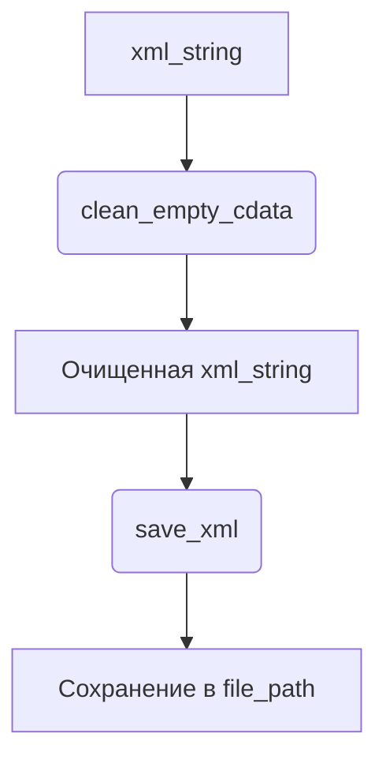

# Анализ кода `hypotez/src/utils/xml.py`

## 1. <алгоритм>

### `clean_empty_cdata`
1.  **Принимает XML строку**: Функция принимает XML строку в качестве входных данных.
    ```python
    xml_string = "<root><item>Value</item><empty></empty></root>"
    ```
2.  **Преобразует строку в ElementTree**: Преобразует XML строку в объект `ElementTree`.
    ```python
    root = ET.fromstring(xml_string)
    ```
3.  **Рекурсивно удаляет пустые элементы**: Рекурсивно проходит по всем элементам и удаляет те, у которых нет текста, атрибутов и дочерних элементов.
    ```python
    def remove_empty_elements(element):
        for child in list(element):
            remove_empty_elements(child)
            if not (child.text and child.text.strip()) and not child.attrib and not list(child):
                element.remove(child)
    ```
4.  **Преобразует ElementTree обратно в строку**: Преобразует очищенное дерево обратно в XML строку.
    ```python
    cleaned_xml = ET.tostring(root, encoding="utf-8").decode("utf-8")
    ```
5.  **Удаляет лишние пробелы**: Использует регулярное выражение для удаления лишних пробелов между тегами.
    ```python
    cleaned_xml = re.sub(r">\s+<", "><", cleaned_xml)
    ```
6.  **Возвращает очищенную XML строку**: Возвращает очищенную и отформатированную XML строку.

### `save_xml`
1.  **Принимает XML строку и путь к файлу**: Функция принимает XML строку и путь к файлу для сохранения.
    ```python
    xml_string = "<root><item>Value</item></root>"
    file_path = "output.xml"
    ```
2.  **Очищает XML строку**: Использует функцию `clean_empty_cdata` для очистки XML строки от пустых элементов.
    ```python
    cleaned_xml = clean_empty_cdata(xml_string)
    ```
3.  **Парсит XML строку**: Преобразует очищенную XML строку в объект `ElementTree`.
    ```python
    xml_tree = ET.ElementTree(ET.fromstring(cleaned_xml))
    ```
4.  **Преобразует в строку с отступами**: Преобразует `ElementTree` в строку с отступами, используя `minidom`.
    ```python
    rough_string = ET.tostring(xml_tree.getroot(), encoding="utf-8")
    parsed_xml = minidom.parseString(rough_string)
    pretty_xml = parsed_xml.toprettyxml(indent="  ")
    ```
5.  **Записывает в файл**: Записывает отформатированную XML строку в файл.
    ```python
    with open(file_path, "w", encoding="utf-8") as file:
        file.write(pretty_xml)
    ```

## 2. <mermaid>



**Объяснение зависимостей:**

*   `xml.etree.ElementTree`: Используется для парсинга и манипулирования XML.
*   `xml.dom.minidom`: Используется для форматирования XML с отступами.
*   `re`: Используется для удаления лишних пробелов в XML.

## 3. <объяснение>

### Импорты:

*   `xml.etree.ElementTree as ET`: Этот модуль предоставляет функциональность для парсинга и создания XML-документов. Он используется для создания дерева элементов из XML-строки, удаления пустых элементов и преобразования дерева обратно в строку.
*   `xml.dom.minidom`: Этот модуль используется для работы с Document Object Model (DOM) XML. В данном коде он применяется для форматирования XML-строки с отступами, что делает XML более читабельным.
*   `re`: Модуль `re` (regular expression) используется для работы с регулярными выражениями. В данном случае он используется для удаления лишних пробелов между тегами XML.

### Функции:

*   `clean_empty_cdata(xml_string: str) -> str`:
    *   **Аргументы**:
        *   `xml_string` (str): XML контент в виде строки.
    *   **Возвращаемое значение**:
        *   `str`: Очищенный и отформатированный XML контент.
    *   **Назначение**: Функция очищает XML строку от пустых CDATA секций и лишних пробелов. Сначала она преобразует XML строку в объект `ElementTree`, затем рекурсивно удаляет пустые элементы. После этого она преобразует дерево обратно в строку и удаляет лишние пробелы между тегами.
*   `save_xml(xml_string: str, file_path: str) -> None`:
    *   **Аргументы**:
        *   `xml_string` (str): XML контент в виде строки.
        *   `file_path` (str): Путь к файлу, в который будет сохранен XML контент.
    *   **Возвращаемое значение**:
        *   `None`
    *   **Назначение**: Функция сохраняет XML данные из строки в файл с отступами. Сначала она очищает XML строку с помощью функции `clean_empty_cdata`, затем парсит XML строку, преобразует её в строку с отступами с использованием `minidom` и записывает в файл.

### Переменные:

*   Внутри функций используются различные переменные для хранения промежуточных результатов, такие как `root`, `child`, `cleaned_xml`, `xml_tree`, `rough_string`, `parsed_xml`, `pretty_xml`.

### Потенциальные ошибки и области для улучшения:

*   **Обработка ошибок**: В коде отсутствует явная обработка ошибок, таких как `FileNotFoundError` при записи в файл.
*   **Производительность**: Для больших XML файлов рекурсивное удаление пустых элементов может быть неэффективным.
*   **Кодировка**: Жестко задана кодировка `utf-8`.

### Цепочка взаимосвязей с другими частями проекта:

Данный модуль `xml.py` предоставляет утилиты для работы с XML, которые могут использоваться в других частях проекта `hypotez`, где требуется обработка или сохранение XML данных. Например, он может использоваться для обработки конфигурационных файлов в формате XML или для сохранения результатов работы программы в XML.