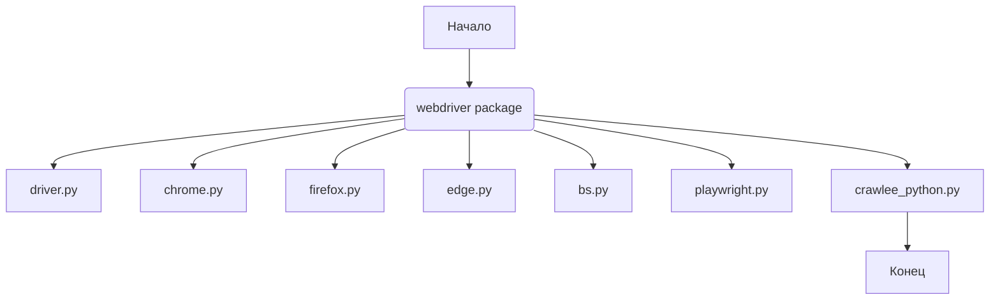

## Анализ кода `hypotez/src/webdriver/__init__.py`

### 1. <алгоритм>

Файл `__init__.py` в Python используется для обозначения директории как пакета. В данном случае, файл `hypotez/src/webdriver/__init__.py` указывает, что директория `webdriver` является пакетом, который может содержать модули, такие как `driver`, `chrome`, `firefox` и т.д.

**Блок-схема:**

```mermaid
graph TD
    A[Начало] --> B{Директория `webdriver`};
    B -- Является пакетом --> C[Файл `__init__.py`];
    C --> D{Импорт модулей (закомментировано)};
    D -- Пример: `Chrome` --> E[Модуль `chrome.py`];
    D -- Пример: `Firefox` --> F[Модуль `firefox.py`];
    D -- Пример: `Driver` --> G[Модуль `driver.py`];
    D --> H[Конец];
```

Пример для логического блока `D`:
- Если раскомментировать `from .chrome import Chrome`, то класс `Chrome` из модуля `chrome.py` будет доступен при импорте пакета `webdriver`.
- Если раскомментировать `from .firefox import Firefox`, то класс `Firefox` из модуля `firefox.py` будет доступен при импорте пакета `webdriver`.

### 2. <mermaid>

В данном коде отсутствуют явные зависимости, так как все импорты закомментированы. Если бы они были активны, то зависимости были бы следующими:



**Объяснение `mermaid`:**

Диаграмма показывает, что пакет `webdriver` зависит от нескольких модулей, таких как `driver.py`, `chrome.py`, `firefox.py` и другие. Это означает, что функциональность, предоставляемая пакетом `webdriver`, использует классы и функции, определенные в этих модулях.

### 3. <объяснение>

#### Импорты:

В данном файле импорты закомментированы, но если бы они были активны, то они бы указывали на модули, содержащиеся в пакете `webdriver`. Например:
- `from .driver import Driver`: Импортирует класс `Driver` из модуля `driver.py`. Этот класс, вероятно, предоставляет базовую функциональность для управления веб-драйвером.
- `from .chrome import Chrome`: Импортирует класс `Chrome` из модуля `chrome.py`. Этот класс, вероятно, предоставляет функциональность для управления веб-драйвером Chrome.
- `from .firefox import Firefox`: Импортирует класс `Firefox` из модуля `firefox.py`. Этот класс, вероятно, предоставляет функциональность для управления веб-драйвером Firefox.

#### Классы:

Если бы импорты были активны, то в пакете `webdriver` были бы доступны классы для управления различными веб-драйверами. Например, класс `Chrome` мог бы иметь методы для запуска Chrome, открытия URL, заполнения форм и т.д.

#### Функции:

В данном файле нет функций.

#### Переменные:

В данном файле нет переменных.

#### Потенциальные ошибки и области для улучшения:

- В данный момент файл `__init__.py` практически пустой, так как все импорты закомментированы. Это означает, что пакет `webdriver` не предоставляет никакой функциональности, пока не будут раскомментированы соответствующие импорты.
- Необходимо решить, какие модули должны быть доступны при импорте пакета `webdriver`, и раскомментировать соответствующие импорты.
- Добавить документацию для пакета `webdriver` и его модулей.

#### Взаимосвязи с другими частями проекта:

Пакет `webdriver` вероятно используется для автоматизации тестирования веб-приложений или для скрапинга веб-страниц. Он может использоваться другими частями проекта `hypotez`, которые нуждаются в автоматическом взаимодействии с веб-браузерами. Например, он может использоваться для проверки функциональности веб-интерфейса или для сбора данных с веб-сайтов.