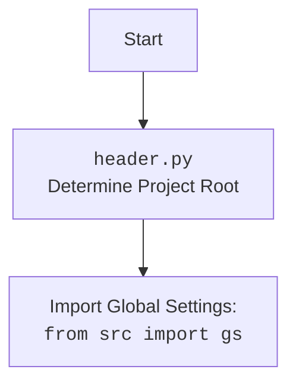

## АНАЛИЗ КОДА: `src/webdriver/_examples/_example_executor.py`

### 1. <алгоритм>

**Блок-схема:**

```mermaid
graph TD
    Start[Начало] --> WebDriverInit[Создание экземпляра WebDriver (Chrome)];
    WebDriverInit --> NavigateToWebsite[Переход на URL (https://example.com)];
    NavigateToWebsite --> ExecuteLocatorInit[Создание экземпляра ExecuteLocator];
    ExecuteLocatorInit --> SimpleLocatorExample[Простой пример локатора];
    SimpleLocatorExample --> ExecuteSimpleLocator[Выполнение простого локатора];
    ExecuteSimpleLocator --> PrintSimpleLocatorResult[Вывод результата простого локатора];
    PrintSimpleLocatorResult --> ComplexLocatorExample[Пример сложного локатора];
    ComplexLocatorExample --> ExecuteComplexLocator[Выполнение сложного локатора];
    ExecuteComplexLocator --> PrintComplexLocatorResult[Вывод результата сложного локатора];
    PrintComplexLocatorResult --> ErrorHandlingExample[Пример обработки ошибок];
    ErrorHandlingExample --> ExecuteComplexLocatorWithErrorHandling[Выполнение сложного локатора с обработкой ошибок];
    ExecuteComplexLocatorWithErrorHandling --> PrintErrorHandlingResult[Вывод результата обработки ошибок];
     PrintErrorHandlingResult --> SendMessageExample[Пример отправки сообщения];
     SendMessageExample --> SendMessageToField[Отправка сообщения в поле ввода];
     SendMessageToField --> PrintSendMessageResult[Вывод результата отправки сообщения];
     PrintSendMessageResult --> MultiLocatorExample[Пример списка локаторов];
     MultiLocatorExample --> ExecuteMultiLocator[Выполнение списка локаторов];
     ExecuteMultiLocator --> PrintMultiLocatorResult[Вывод результатов списка локаторов];
     PrintMultiLocatorResult --> EvaluateLocatorExample[Пример `evaluate_locator`];
    EvaluateLocatorExample --> EvaluateAttribute[Оценка значения атрибута];
    EvaluateAttribute --> PrintAttributeValue[Вывод значения атрибута];
    PrintAttributeValue --> ExceptionHandlingExample[Пример обработки исключений];
    ExceptionHandlingExample --> ExecuteSimpleLocatorWithExceptionHandling[Выполнение простого локатора с обработкой исключений];
    ExecuteSimpleLocatorWithExceptionHandling --> PrintExceptionHandler[Вывод результата обработки исключений];
     PrintExceptionHandler --> FullTestExample[Полный пример тестирования];
     FullTestExample --> ExecuteTestLocator[Выполнение тестового локатора];
     ExecuteTestLocator --> PrintTestLocatorResult[Вывод результата тестового локатора];
    PrintTestLocatorResult --> DriverQuit[Закрытие драйвера];
    DriverQuit --> End[Конец];

    style Start fill:#f9f,stroke:#333,stroke-width:2px
    style End fill:#f9f,stroke:#333,stroke-width:2px
```

**Примеры блоков:**

1.  **WebDriverInit:**
    *   Пример: `driver = webdriver.Chrome(executable_path=gs['chrome_driver_path'])`
    *   Описание: Создается экземпляр веб-драйвера Chrome, используя путь к драйверу из глобальных настроек `gs`.
2.  **NavigateToWebsite:**
    *   Пример: `driver.get("https://example.com")`
    *   Описание: Открывает веб-страницу по указанному URL.
3.  **ExecuteLocatorInit:**
    *   Пример: `locator = ExecuteLocator(driver)`
    *   Описание: Создается экземпляр класса `ExecuteLocator`, передавая ему веб-драйвер.
4.  **SimpleLocatorExample:**
    *   Пример:
        ```python
        simple_locator = {
            "by": "XPATH",
            "selector": "//h1",
            "attribute": "textContent",
            "timeout":0,"timeout_for_event":"presence_of_element_located","event": None,
            "if_list":"first","use_mouse": False,
            "mandatory": True,
            "locator_description": "Getting the page title"
        }
        ```
    *   Описание: Объявляет словарь `simple_locator`, содержащий параметры для поиска элемента `h1` по XPath и получения его текстового содержимого.
5. **ExecuteSimpleLocator**
   *  Пример: `result = locator.execute_locator(simple_locator)`
   * Описание: Вызывает метод `execute_locator` класса `ExecuteLocator`, передавая ему параметры `simple_locator`.
6.  **ComplexLocatorExample:**
    *   Пример: Объявляет сложный словарь `complex_locator`, содержащий вложенные локаторы для ссылок на продукты и пагинации.
    *  Описание:  Пример:
         ```python
         complex_locator = {
         "product_links": {
             "attribute": "href",
             "by": "XPATH",
             "selector": "//a[contains(@class, \'product\')]",
             "timeout":0,"timeout_for_event":"presence_of_element_located","event": None,
             "if_list":"first","use_mouse": False,
             "mandatory": True,
             "locator_description": "Getting the product link"
          },
          "pagination": {
             "ul": {
                "attribute": None,
                 "by": "XPATH",
                 "selector": "//ul[@class=\'pagination\']",
                 "timeout":0,"timeout_for_event":"presence_of_element_located","event": "click()",
                 "if_list":"first","use_mouse": False,
                 "mandatory": True,
                 "locator_description": "Click on pagination"
             },
             "->": {
                  "attribute": None,
                  "by": "XPATH",
                  "selector": "//*[@class = \'ui-pagination-navi util-left\']/a[@class=\'ui-pagination-next\']",
                  "timeout":0,"timeout_for_event":"presence_of_element_located","event": "click()",
                  "if_list":"first","use_mouse": False,
                   "mandatory": True,
                  "locator_description": "Click on the next page"
               }
            }
         }
        ```
7.  **ExecuteComplexLocator:**
    *   Пример: `result = locator.execute_locator(complex_locator)`
    *   Описание: Выполняет сложный локатор, обрабатывая вложенные структуры и события.
8.  **ErrorHandlingExample:**
    *   Пример:
        ```python
        try:
            locator.execute_locator(complex_locator, continue_on_error=True)
        except ExecuteLocatorException as ex:
            print(f"An error occurred: {ex}")
        ```
    *   Описание: Пытается выполнить сложный локатор с включенной опцией `continue_on_error`. Если возникает ошибка, она будет перехвачена, и информация об ошибке будет выведена в консоль.
9.  **SendMessageExample:**
    *   Пример: `locator.send_message(message_locator, message, typing_speed=0.05, continue_on_error=True)`
    *   Описание: Использует метод `send_message` класса `ExecuteLocator` для отправки сообщения "Buy a new phone" в текстовое поле, используя локатор `message_locator`.
10. **MultiLocatorExample:**
    *   Пример: `results = locator.execute_locator(multi_locator)`
    *   Описание: Выполняет список локаторов, каждый из которых имеет свои параметры для поиска элементов и действий.
11. **EvaluateLocatorExample:**
    *   Пример: `attribute_value = locator.evaluate_locator(attribute_locator['attribute'])`
    *   Описание: Использует метод `evaluate_locator` для оценки значения атрибута "content" элемента meta description.
12. **ExceptionHandlingExample:**
    *   Пример:
         ```python
         try:
            locator.execute_locator(simple_locator)
         except ExecuteLocatorException as ex:
            print(f"An error occurred during locator execution: {ex}")
         ```
    *    Описание: Пытается выполнить простой локатор, обрабатывая возможные исключения типа ExecuteLocatorException.
13. **FullTestExample:**
    *   Пример: `result = locator.execute_locator(test_locator)`
    *   Описание: Выполняет тестовый локатор, аналогично простому примеру локатора, для проверки работоспособности.
14. **DriverQuit:**
    *   Пример: `driver.quit()`
    *   Описание: Закрывает все открытые окна браузера и завершает сессию веб-драйвера.

```mermaid
flowchart TD
    Start[Start] --> ImportModules[Импорт модулей: <br>selenium.webdriver, <br>src.webdriver.executor, <br>src.settings, <br>src.logger.exceptions];
    ImportModules --> CreateWebDriver[Создание экземпляра вебдрайвера Chrome];
    CreateWebDriver --> NavigateToURL[Переход на https://example.com];
    NavigateToURL --> CreateExecuteLocator[Создание экземпляра ExecuteLocator];
    CreateExecuteLocator --> ExecuteSimpleLocatorCall[Вызов execute_locator с простым локатором];
     ExecuteSimpleLocatorCall --> PrintSimpleLocatorResult[Вывод результата простого локатора];
    PrintSimpleLocatorResult --> ExecuteComplexLocatorCall[Вызов execute_locator со сложным локатором];
     ExecuteComplexLocatorCall --> PrintComplexLocatorResult[Вывод результата сложного локатора];
     PrintComplexLocatorResult --> ExecuteComplexLocatorWithErrorHandlingCall[Вызов execute_locator со сложным локатором и обработкой ошибок];
     ExecuteComplexLocatorWithErrorHandlingCall --> PrintErrorHandlingResult[Вывод результата обработки ошибок];
     PrintErrorHandlingResult --> SendMessageCall[Вызов send_message];
     SendMessageCall --> PrintSendMessageResult[Вывод результата отправки сообщения];
     PrintSendMessageResult --> ExecuteMultiLocatorCall[Вызов execute_locator со списком локаторов];
     ExecuteMultiLocatorCall --> PrintMultiLocatorResult[Вывод результатов списка локаторов];
     PrintMultiLocatorResult --> EvaluateLocatorCall[Вызов evaluate_locator];
     EvaluateLocatorCall --> PrintAttributeValue[Вывод значения атрибута];
     PrintAttributeValue --> ExecuteSimpleLocatorWithExceptionHandlingCall[Вызов execute_locator с простым локатором и обработкой исключений];
     ExecuteSimpleLocatorWithExceptionHandlingCall --> PrintExceptionHandler[Вывод результата обработки исключений];
     PrintExceptionHandler --> ExecuteTestLocatorCall[Вызов execute_locator с тестовым локатором];
      ExecuteTestLocatorCall --> PrintTestLocatorResult[Вывод результата тестового локатора];
     PrintTestLocatorResult --> CloseWebDriver[Закрытие вебдрайвера];
     CloseWebDriver --> End[End];

    classDef classFill fill:#f9f,stroke:#333,stroke-width:2px;
    class Start,End classFill;
```

### 2. <mermaid>



**Зависимости импорта:**

1.  `from selenium import webdriver`:
    *   Импортирует `webdriver` из пакета `selenium`, который используется для управления браузером. В данном случае используется для создания экземпляра браузера Chrome.
2.  `from src.webdriver.executor import ExecuteLocator`:
    *   Импортирует класс `ExecuteLocator` из модуля `src.webdriver.executor`, который используется для выполнения поиска и взаимодействия с веб-элементами.
3.  `from src import gs`:
    *   Импортирует глобальные настройки `gs` из модуля `src`.  Эти настройки могут включать пути к драйверам, различные параметры конфигурации приложения.
4.  `from src.logger.exceptions import ExecuteLocatorException`:
    *   Импортирует класс `ExecuteLocatorException` из модуля `src.logger.exceptions`. Это класс исключения, который используется для обработки ошибок, возникающих при работе с локаторами.

**Диаграмма `header.py`:**



### 3. <объяснение>

**Импорты:**

*   `selenium.webdriver`: Используется для автоматизации браузера. `webdriver.Chrome` создает экземпляр браузера Chrome.
*   `src.webdriver.executor.ExecuteLocator`: Класс, предоставляющий методы для поиска веб-элементов на основе различных локаторов и выполнения с ними действий (клик, ввод текста, получение атрибутов).
*   `src.gs`: Модуль, содержащий глобальные настройки, включая пути к драйверам (`chrome_driver_path`).
*  `src.logger.exceptions.ExecuteLocatorException`: Класс исключений, используется для обработки ошибок, возникающих в `ExecuteLocator`.

**Классы:**

*   `ExecuteLocator`:
    *   **Роль**: Класс-исполнитель локаторов. Содержит логику для поиска веб-элементов и выполнения с ними действий (клик, ввод текста, получение значений).
    *   **Атрибуты**:
        *   `driver` - экземпляр веб-драйвера `webdriver`, используется для взаимодействия с браузером.
    *   **Методы**:
        *   `__init__(self, driver)` - инициализирует класс, принимая экземпляр веб-драйвера.
        *   `execute_locator(self, locator, continue_on_error=False)` - выполняет поиск элемента или списка элементов на основе предоставленного словаря `locator`.  Параметр `continue_on_error` позволяет игнорировать ошибки и продолжать выполнение.
        *   `send_message(self, locator, message, typing_speed=0.05, continue_on_error=False)` - отправляет сообщение в элемент, найденный по локатору, эмулируя ввод текста с указанной скоростью.
        *   `evaluate_locator(self, attribute)` - оценивает значение атрибута элемента, найденного по локатору.

**Функции:**

*   `main()`:
    *   **Аргументы**: нет.
    *   **Возвращаемое значение**: нет.
    *   **Назначение**: Основная функция, которая создает экземпляр веб-драйвера, экземпляр класса `ExecuteLocator` и демонстрирует использование различных методов класса `ExecuteLocator`.

**Переменные:**

*   `driver`: Экземпляр класса `webdriver.Chrome`.
*   `locator`: Экземпляр класса `ExecuteLocator`.
*   `simple_locator`: Словарь, содержащий параметры простого локатора для поиска элемента h1.
*   `complex_locator`: Словарь, содержащий параметры сложного локатора для ссылок на продукты и пагинации.
*   `message_locator`: Словарь, содержащий параметры локатора для отправки сообщения в текстовое поле.
*   `multi_locator`: Словарь, содержащий параметры для списка локаторов.
*   `attribute_locator`: Словарь, содержащий параметры для локатора атрибута.
*   `test_locator`: Словарь, содержащий параметры локатора для тестирования.
*   `result`, `results`, `attribute_value`: Переменные для хранения результатов выполнения методов класса `ExecuteLocator`.
*  `message`: Сообщение, которое отправляется в текстовое поле.

**Потенциальные ошибки и области для улучшения:**

1.  **Жестко заданные пути:** Использование `gs['chrome_driver_path']` полагается на наличие корректного пути в настройках.
2.  **Обработка ошибок:** Несмотря на использование `try-except`,  ошибка может быть неявно проигнорирована, если `continue_on_error` установлен в `True`.
3.  **Структура локаторов:** Использование словарей для определения локаторов может быть неудобным и трудночитаемым для сложных сценариев.

**Цепочка взаимосвязей:**

1.  `_example_executor.py` использует `selenium.webdriver` для управления браузером.
2.  Он также использует `src.webdriver.executor.ExecuteLocator` для поиска и взаимодействия с веб-элементами.
3.  Конфигурация, включая путь к драйверу, берется из `src.gs`.
4.  Ошибки, возникающие при выполнении локаторов, обрабатываются с помощью исключения `src.logger.exceptions.ExecuteLocatorException`.

В целом, код демонстрирует основные возможности класса `ExecuteLocator` через различные примеры, включая поиск элементов, ввод текста, обработку ошибок и использование списка локаторов.