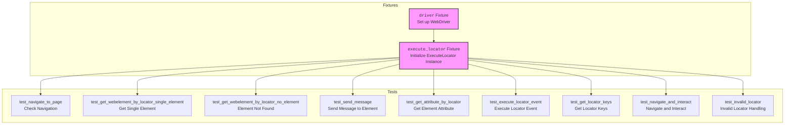

## <алгоритм>

1. **Инициализация Fixture `driver` (scope="module"):**
    - Создаются опции для Chrome (`Options`), устанавливается режим headless для выполнения тестов в фоновом режиме.
    - Задается путь к исполняемому файлу `chromedriver` с помощью `Service`.
    - Инициализируется экземпляр `webdriver.Chrome` с заданными опциями и сервисом.
    - Открывается страница `http://example.com`.
    - Этот драйвер используется всеми тестами в данном модуле.
    - После выполнения всех тестов в модуле, драйвер закрывается с помощью `driver.quit()`.
   
   ```python
   options = Options()
   options.add_argument("--headless")
   service = Service(executable_path="/path/to/chromedriver")
   driver = webdriver.Chrome(service=service, options=options)
   driver.get("http://example.com")
   ```

2.  **Инициализация Fixture `execute_locator`:**
    - Создается экземпляр класса `ExecuteLocator`, который принимает драйвер `webdriver` в качестве аргумента. Этот экземпляр используется для взаимодействия с элементами на странице через локаторы.
    ```python
        execute_locator = ExecuteLocator(driver)
    ```

3. **Тест `test_navigate_to_page`:**
    - Проверяет, что драйвер находится на странице, которую он открыл (http://example.com).
    ```python
    assert driver.current_url == "http://example.com"
    ```

4. **Тест `test_get_webelement_by_locator_single_element`:**
    - Создается локатор (`locator`) для элемента `h1` на странице (xpath).
    - Используется метод `get_webelement_by_locator` объекта `execute_locator` для получения элемента.
    - Проверяется, что полученный элемент является экземпляром `WebElement` и что текст этого элемента равен "Example Domain".
    ```python
    locator = { "by": "XPATH", "selector": "//h1" }
    element = execute_locator.get_webelement_by_locator(locator)
    assert isinstance(element, WebElement)
    assert element.text == "Example Domain"
    ```

5.  **Тест `test_get_webelement_by_locator_no_element`:**
    - Создается локатор для несуществующего элемента на странице (xpath).
    - Проверяется, что метод `get_webelement_by_locator` возвращает `False` (элемент не найден).
     ```python
    locator = { "by": "XPATH", "selector": "//div[@id=\'nonexistent\']" }
    result = execute_locator.get_webelement_by_locator(locator)
    assert result is False
    ```

6.  **Тест `test_send_message`:**
    - Создается локатор для поля ввода (xpath).
    - Используется метод `send_message` для отправки текста "Hello World" в это поле.
    - Проверяется, что метод возвращает `True`, указывая на успешную отправку.
    ```python
    locator = { "by": "XPATH", "selector": "//input[@id=\'search\']" }
    result = execute_locator.send_message(locator, "Hello World", typing_speed=0, continue_on_error=True)
    assert result is True
    ```

7.  **Тест `test_get_attribute_by_locator`:**
    - Создается локатор для ссылки (xpath).
    - С помощью метода `get_attribute_by_locator` извлекается значение атрибута `href`.
    - Проверяется, что значение `href` соответствует ожидаемому значению.
    ```python
    locator = { "by": "XPATH", "selector": "//a[@id=\'more-information\']" }
    attribute_value = execute_locator.get_attribute_by_locator(locator, message="href")
    assert attribute_value == "https://www.iana.org/domains/example"
    ```

8.  **Тест `test_execute_locator_event`:**
    - Создается локатор для ссылки (xpath).
    - Используется метод `execute_locator` для эмуляции клика по ссылке.
    - Проверяется, что метод возвращает `True`, указывая на успешное выполнение события.
     ```python
    locator = { "by": "XPATH", "selector": "//a[@id=\'more-information\']" }
    result = execute_locator.execute_locator(locator, message="click")
    assert result is True
    ```

9.  **Тест `test_get_locator_keys`:**
    - Проверяется, что метод `get_locator_keys` класса `ExecuteLocator` возвращает ожидаемый список ключей для локатора.
     ```python
     result = ExecuteLocator.get_locator_keys()
     assert set(result) == set(expected_keys)
     ```

10. **Тест `test_navigate_and_interact`:**
    - Драйвер переходит на страницу `https://www.wikipedia.org/`.
    - Находится поле ввода поиска (xpath), отправляется текст "Selenium", находится кнопка "Поиск" и эмулируется клик.
    - Проверяется заголовок страницы результатов.
    - Находится заголовок результата и проверяется его текст.
    ```python
    driver.get("https://www.wikipedia.org/")
    locator = { "by": "XPATH", "selector": "//input[@id=\'searchInput\']" }
    execute_locator.send_message(locator, "Selenium", typing_speed=0, continue_on_error=True)
    locator = { "by": "XPATH", "selector": "//button[@type=\'submit\']" }
    execute_locator.execute_locator(locator, message="click")
    assert "Selenium" in driver.title
    result_locator = { "by": "XPATH", "selector": "//h1[contains(text(), \'Selenium\')]" }
    result = execute_locator.get_webelement_by_locator(result_locator)
    assert isinstance(result, WebElement)
    assert result.text == "Selenium"
    ```

11. **Тест `test_invalid_locator`:**
    - Создается локатор с некорректным значением `by` (несуществующий метод поиска).
    - Проверяется, что при попытке выполнить действие с некорректным локатором выбрасывается исключение `ExecuteLocatorException`.
    ```python
    locator = { "by": "INVALID_BY", "selector": "//div[@id=\'test\']" }
    with pytest.raises(ExecuteLocatorException):
         execute_locator.execute_locator(locator, message="click")
    ```

## <mermaid>



### Объяснение зависимостей в `mermaid`:

-   `Fixtures`:
    -   `DriverFixture`: Отвечает за создание и настройку экземпляра `webdriver`, который будет использоваться в тестах. Он инициализирует `webdriver.Chrome` с опциями, открывает целевую страницу и обеспечивает очистку ресурсов после завершения тестов.
    -   `ExecuteLocatorFixture`: Инициализирует экземпляр класса `ExecuteLocator`, который является основным инструментом для взаимодействия с элементами на веб-странице через локаторы. Этот экземпляр передается в тесты для выполнения различных операций с элементами.

-   `Tests`:
    -   Каждый блок `test_*` представляет отдельную тестовую функцию, которая проверяет определенный аспект функциональности, связанной с `webdriver` и `ExecuteLocator`.
    -   `test_navigate`: Проверяет, что драйвер перешел на нужную страницу.
    -   `test_single_element`: Проверяет, что `get_webelement_by_locator` возвращает один корректный элемент.
    -   `test_no_element`: Проверяет, что `get_webelement_by_locator` возвращает False, если элемент не найден.
    -   `test_message`: Проверяет, что сообщение может быть отправлено в элемент.
    -   `test_attribute`: Проверяет, что атрибуты элемента могут быть извлечены.
    -   `test_event`: Проверяет, что событие (например, клик) может быть выполнено на элементе.
    -   `test_keys`: Проверяет, что корректные ключи локаторов возвращаются.
    -   `test_navigate_interact`: Проверяет комплексное взаимодействие: навигацию, ввод, клик.
    -   `test_invalid_loc`: Проверяет, что исключение возникает при использовании некорректного локатора.

-   **Связи**:
    -   `DriverFixture` -> `ExecuteLocatorFixture`: `ExecuteLocatorFixture` зависит от экземпляра `driver`, созданного `DriverFixture`.
    -   `ExecuteLocatorFixture` -> `test_*`: Каждый тест использует экземпляр `ExecuteLocator`, созданный в `ExecuteLocatorFixture`, для выполнения различных операций с элементами на странице.

## <объяснение>

### Импорты:

-   `pytest`: Фреймворк для написания и запуска тестов. Используется для определения тестовых функций и фикстур.
-   `selenium.webdriver`: Модуль для управления веб-браузером. Включает в себя:
    -   `webdriver`: Основной модуль для создания экземпляров браузеров.
    -   `chrome.service.Service`: Модуль для управления сервисом ChromeDriver.
    -   `common.by.By`: Модуль для определения типов локаторов элементов (например, ID, XPATH, CSS).
    -   `chrome.options.Options`: Модуль для настройки опций запуска браузера.
    -   `remote.webelement.WebElement`: Модуль для работы с веб-элементами на странице.
    -   `common.action_chains.ActionChains`: Модуль для выполнения сложных действий, таких как перетаскивание.
    -   `support.ui.WebDriverWait`: Модуль для ожидания появления элементов на странице.
    -   `support.expected_conditions as EC`: Модуль для определения ожидаемых условий для элементов.
-   `src.webdriver.executor.ExecuteLocator`: Класс из проекта `src`, который предоставляет методы для взаимодействия с элементами на странице через локаторы.
-    `src.logger.exceptions.ExecuteLocatorException`: Исключение, которое выбрасывается при ошибках в `ExecuteLocator`.

### Классы:

-   **`None`**: В данном файле не определены классы, но используется класс `ExecuteLocator` из модуля `src.webdriver.executor`.

### Функции:

-   `driver()`: Фикстура `pytest`, которая инициализирует и настраивает WebDriver. Она создает экземпляр `webdriver.Chrome` с headless опциями и открывает тестовую страницу (`http://example.com`). Возвращает экземпляр `webdriver`.
-   `execute_locator(driver)`: Фикстура `pytest`, которая создает и возвращает экземпляр класса `ExecuteLocator`. В качестве аргумента принимает экземпляр `webdriver`.
-   `test_navigate_to_page(execute_locator, driver)`: Тест, который проверяет, что WebDriver успешно открыл указанную страницу. Использует assert для сравнения текущего url с ожидаемым.
-   `test_get_webelement_by_locator_single_element(execute_locator, driver)`: Тест, который проверяет, что метод `get_webelement_by_locator` корректно возвращает один элемент по локатору.
-   `test_get_webelement_by_locator_no_element(execute_locator, driver)`: Тест, который проверяет, что метод `get_webelement_by_locator` возвращает `False`, если элемент не найден.
-   `test_send_message(execute_locator, driver)`: Тест, который проверяет, что сообщение может быть отправлено в элемент.
-   `test_get_attribute_by_locator(execute_locator, driver)`: Тест, который проверяет, что можно получить значение атрибута элемента с помощью `get_attribute_by_locator`.
-   `test_execute_locator_event(execute_locator, driver)`: Тест, который проверяет, что событие (например, клик) может быть выполнено на элементе.
-   `test_get_locator_keys(execute_locator, driver)`: Тест, проверяющий список допустимых ключей локатора.
-   `test_navigate_and_interact(execute_locator, driver)`: Тест, который проверяет навигацию на другую страницу, ввод текста в поле и клик на кнопку.
-   `test_invalid_locator(execute_locator, driver)`: Тест, который проверяет обработку некорректных локаторов и вызывает `ExecuteLocatorException`.

### Переменные:

-   `options`: Объект класса `selenium.webdriver.chrome.options.Options`, используется для настройки параметров браузера.
-   `service`: Объект класса `selenium.webdriver.chrome.service.Service`, используется для управления процессом `chromedriver`.
-   `driver`: Экземпляр класса `selenium.webdriver.Chrome`, используется для управления браузером.
-   `locator`: Словарь, который содержит информацию о том, как найти элемент на странице (`by` - тип локатора, `selector` - сам локатор).
-   `element`: Экземпляр класса `selenium.webdriver.remote.webelement.WebElement`, используется для работы с элементом.
-   `attribute_value`: Строка, значение атрибута элемента.
-   `message`: Строка, используется для передачи текста или названия действия в метод.
-   `result`: Булево значение, показывает успех выполнения операции.
-  `expected_keys`: Список допустимых ключей локатора
-   Все остальные переменные являются локальными и используются в рамках своих тестов.

### Потенциальные ошибки и области для улучшения:

-   **Жестко заданный путь к `chromedriver`**: Путь к `chromedriver` (`/path/to/chromedriver`) жестко закодирован и может привести к проблемам при переносе на другую систему. Необходимо сделать путь динамическим (например, через переменную окружения).
-   **Отсутствие проверок на наличие элементов перед взаимодействием:** В тестах `test_send_message` и `test_execute_locator_event`, не проверяется, существует ли элемент на странице перед выполнением операции, что может приводить к ошибкам.
-   **Упростить создание локаторов:** Дублирование создания локаторов можно вынести в отдельную функцию/метод.
-   **Отсутствие комментариев:** Некоторые тесты не имеют комментариев, что может затруднить понимание их предназначения.

### Взаимосвязь с другими частями проекта:

-   Этот файл является частью модуля `src.webdriver._pytest`, который отвечает за тестирование функциональности WebDriver.
-   Он использует класс `ExecuteLocator` из `src.webdriver.executor`, который предоставляет методы для взаимодействия с элементами на странице.
-   Исключение `ExecuteLocatorException` из `src.logger.exceptions` используется для обработки ошибок в `ExecuteLocator`.

Этот файл предназначен для тестирования возможностей `ExecuteLocator` в контексте WebDriver. Он проверяет, что `ExecuteLocator` может находить элементы по локаторам, отправлять сообщения, получать атрибуты, выполнять события и правильно обрабатывать ошибки.