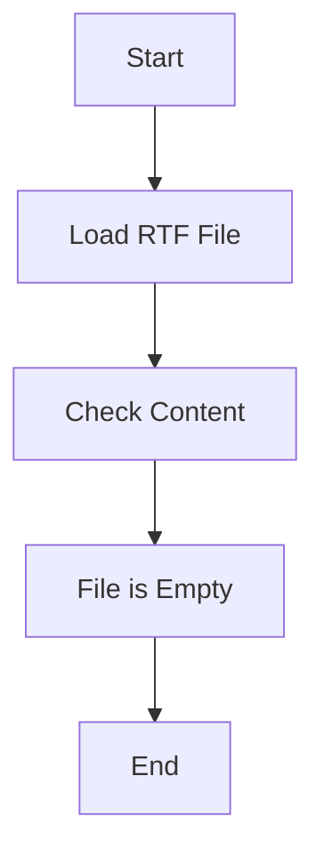

## ИНСТРУКЦИЯ:

Анализируй предоставленный код подробно и объясни его функциональность. Ответ должен включать три раздела:  

1. **<алгоритм>**: Опиши рабочий процесс в виде пошаговой блок-схемы, включая примеры для каждого логического блока, и проиллюстрируй поток данных между функциями, классами или методами.  
2. **<mermaid>**: Напиши код для диаграммы в формате `mermaid`, проанализируй и объясни все зависимости, 
    которые импортируются при создании диаграммы. 
    **ВАЖНО!** Убедитесь, что все имена переменных, используемые в диаграмме `mermaid`, 
    имеют осмысленные и описательные имена. Имена переменных вроде `A`, `B`, `C`, и т.д., не допускаются!  
    
    **Дополнительно**: Если в коде есть импорт `import header`, добавьте блок `mermaid` flowchart, объясняющий `header.py`:\
    ```mermaid
    flowchart TD
        Start --> Header[<code>header.py</code><br> Determine Project Root]
    
        Header --> import[Import Global Settings: <br><code>from src import gs</code>] 
    ```

3. **<объяснение>**: Предоставьте подробные объяснения:  
   - **Импорты**: Их назначение и взаимосвязь с другими пакетами `src.`.  
   - **Классы**: Их роль, атрибуты, методы и взаимодействие с другими компонентами проекта.  
   - **Функции**: Их аргументы, возвращаемые значения, назначение и примеры.  
   - **Переменные**: Их типы и использование.  
   - Выделите потенциальные ошибки или области для улучшения.  

Дополнительно, постройте цепочку взаимосвязей с другими частями проекта (если применимо).  

Это обеспечивает всесторонний и структурированный анализ кода.
## Формат ответа: `.md` (markdown)
**КОНЕЦ ИНСТРУКЦИИ**
```

## Анализ кода:

**Входной код:**
```
{\rtf1}
```

### 1. **<алгоритм>**:

Представленный код является пустым RTF (Rich Text Format) файлом. Это означает, что он не содержит никакой логики, и поэтому его исполнение не ведет к каким-либо действиям. Алгоритм можно описать очень просто:

1.  **Начало:** Загружается RTF-файл.
2.  **Проверка:** Проверяется содержимое файла.
3.  **Результат:** Файл пуст, не содержит ни текста, ни форматирования.
4.  **Конец:** Никакие операции не производятся.

### 2. **<mermaid>**:

Так как код не содержит логики, классов, функций или импортов, диаграмма `mermaid` будет очень простой и отражает только процесс загрузки и анализа файла.



*   **Start**: Начало процесса.
*   **LoadFile**: Загрузка RTF файла.
*   **CheckContent**: Проверка содержимого файла.
*   **EmptyResult**: Результат проверки - файл пуст.
*   **End**: Завершение процесса.

### 3. **<объяснение>**:

**Импорты:**
   - В предоставленном коде нет никаких импортов, так как это просто RTF-файл, а не код на Python или другом языке.

**Классы:**
    - В предоставленном коде нет никаких классов.

**Функции:**
    - В предоставленном коде нет никаких функций.

**Переменные:**
    - В предоставленном коде нет никаких переменных.

**Объяснение:**
   - Этот файл является примером файла в формате RTF (Rich Text Format), который используется для хранения форматированного текста. Однако данный файл является пустым, и, следовательно, не имеет никакого содержимого, кроме метаинформации RTF, которая делает файл корректным RTF-документом. 
   - Из-за того что файл пуст, не происходит никаких операций, и нету никаких импортов, классов, функций и переменных.
   - В данном случае нечего улучшать или выявлять потенциальные ошибки, так как это просто пустой файл.

**Связь с другими частями проекта:**
- Так как данный файл является документационным файлом в формате Markdown (`how_to_install_chrome_for_testing.md`) и находится в директории `hypotez/src/webdriver/chrome/_docs/`, можно предположить, что он связан с установкой и настройкой Chrome для тестирования. Однако, сам файл не является частью кода, и его основная роль - предоставить инструкцию.