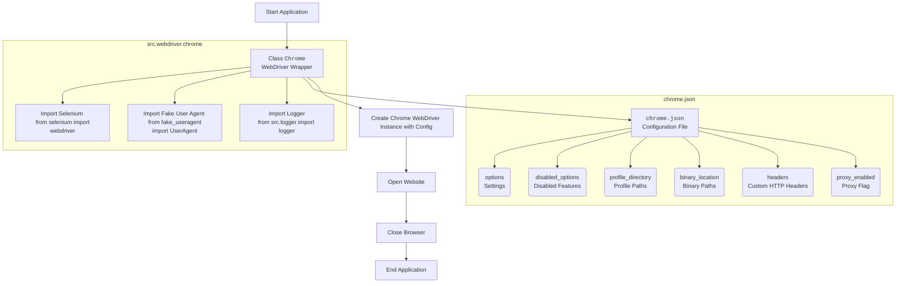

## ИНСТРУКЦИЯ:

Анализируй предоставленный код подробно и объясни его функциональность. Ответ должен включать три раздела:  

1.  **<алгоритм>**: Опиши рабочий процесс в виде пошаговой блок-схемы, включая примеры для каждого логического блока, и проиллюстрируй поток данных между функциями, классами или методами.  
2.  **<mermaid>**: Напиши код для диаграммы в формате `mermaid`, проанализируй и объясни все зависимости, 
    которые импортируются при создании диаграммы. 
    **ВАЖНО!** Убедитесь, что все имена переменных, используемые в диаграмме `mermaid`, 
    имеют осмысленные и описательные имена. Имена переменных вроде `A`, `B`, `C`, и т.д., не допускаются!  
    
    **Дополнительно**: Если в коде есть импорт `import header`, добавьте блок `mermaid` flowchart, объясняющий `header.py`:\
    ```mermaid
    flowchart TD
        Start --> Header[<code>header.py</code><br> Determine Project Root]
    
        Header --> import[Import Global Settings: <br><code>from src import gs</code>] 
    ```

3.  **<объяснение>**: Предоставьте подробные объяснения:  
    -   **Импорты**: Их назначение и взаимосвязь с другими пакетами `src.`.  
    -   **Классы**: Их роль, атрибуты, методы и взаимодействие с другими компонентами проекта.  
    -   **Функции**: Их аргументы, возвращаемые значения, назначение и примеры.  
    -   **Переменные**: Их типы и использование.  
    -   Выделите потенциальные ошибки или области для улучшения.  

Дополнительно, постройте цепочку взаимосвязей с другими частями проекта (если применимо).  

Это обеспечивает всесторонний и структурированный анализ кода.
## Формат ответа: `.md` (markdown)
**КОНЕЦ ИНСТРУКЦИИ**

## <алгоритм>

Описание файла `readme.ru.md` в контексте Python проекта, который содержит кастомную реализацию Chrome WebDriver для Selenium:

1. **Введение**:
    -   Описывает модуль `src.webdriver.chrome` как кастомную реализацию Chrome WebDriver с использованием Selenium.
    -   Указывает на интеграцию настроек из файла `chrome.json` (например, user-agent, настройки профиля браузера).
    -   Утверждает гибкость и автоматизацию взаимодействия с браузером.

2. **Ключевые особенности**:
    -   **Централизованная конфигурация**: Описание управления через файл `chrome.json`.
    -   **Множественные профили браузера**: Поддержка нескольких профилей для разных настроек тестирования.
    -   **Улучшенное логирование и обработка ошибок**: Логирование инициализации, проблем с конфигурацией и ошибок WebDriver.
    -   **Возможность передавать опции**: Поддержка пользовательских опций при инициализации WebDriver.

3. **Требования**:
    -   Указаны необходимые зависимости: Python 3.x, Selenium, Fake User Agent, WebDriver бинарник Chrome.
    -   Приведена команда для установки зависимостей: `pip install selenium fake_useragent`.
    -   Требование наличия `chromedriver` в `PATH` или указания пути в конфигурации.

4. **Конфигурация**:
    -   Конфигурация хранится в `chrome.json`.

5. **Пример конфигурации (`chrome.json`)**:
    -   Приведен пример JSON-файла:
        -   `options`: Настройки Chrome (`log-level`, `disable-dev-shm-usage`, `remote-debugging-port`, `arguments`).
            -   Пример: `{"log-level": "5", "disable-dev-shm-usage": "", "remote-debugging-port": "0", "arguments": ["--kiosk", "--disable-gpu"]}`
        -   `disabled_options`: Отключенные опции (например, `headless`).
            -   Пример: `{"headless": ""}`
        -   `profile_directory`: Пути к профилям (`os`, `internal`, `testing`).
            -   Пример: `{"os": "%LOCALAPPDATA%\\\\Google\\\\Chrome\\\\User Data", "internal": "webdriver\\\\chrome\\\\profiles\\\\default", "testing": "%LOCALAPPDATA%\\\\Google\\\\Chrome for Testing\\\\User Data"}`
        -   `binary_location`: Пути к бинарникам Chrome (`os`, `exe`, `binary`, `chromium`).
            -   Пример: `{"os": "C:\\\\Program Files\\\\Google\\\\Chrome\\\\Application\\\\chrome.exe", "exe": "bin\\\\webdrivers\\\\chrome\\\\125.0.6422.14\\\\chromedriver.exe", "binary": "bin\\\\webdrivers\\\\chrome\\\\125.0.6422.14\\\\win64-125.0.6422.14\\\\chrome-win64\\\\chrome.exe", "chromium": "bin\\\\webdrivers\\\\chromium\\\\chrome-win\\\\chrome.exe"}`
        -   `headers`: Пользовательские HTTP-заголовки.
            -   Пример: `{"User-Agent": "Mozilla/5.0 ...", "Accept": "text/html,...", ...}`
        -   `proxy_enabled`: Флаг использования прокси (по умолчанию `false`).

6. **Описание полей конфигурации**:
    -   Подробное объяснение каждого поля в `chrome.json`:
        -   `options`: `log-level`, `disable-dev-shm-usage`, `remote-debugging-port`, `arguments`.
        -   `disabled_options`: Опции, которые отключаются.
        -   `profile_directory`: Пути к профилям для разных сред.
        -   `binary_location`: Пути к различным бинарникам.
        -   `headers`: Пользовательские заголовки HTTP.
        -   `proxy_enabled`: Флаг включения прокси.

7. **Использование**:
    -   Приведен пример кода:
        -   Импорт класса `Chrome` из `src.webdriver.chrome`.
        -   Инициализация `Chrome` с пользовательским `user_agent` и `options`.
        -   Открытие веб-сайта через метод `get`.
        -   Закрытие браузера методом `quit`.
    -   Объяснение автоматической загрузки настроек из `chrome.json`.
    -   Возможность передачи пользовательских параметров при инициализации.

8. **Паттерн Singleton**:
    -   Объяснение использования паттерна Singleton для создания только одного экземпляра WebDriver.
    -   Использование того же экземпляра и открытия нового окна при повторной инициализации.

9. **Логирование и отладка**:
    -   Использование `logger` из `src.logger`.
    -   Логирование ошибок, предупреждений и общей информации.
    -   Примеры логов: ошибки инициализации и проблемы с конфигурацией.

10. **Лицензия**:
    -   Указание на лицензию MIT и ссылку на файл `LICENSE`.

## <mermaid>



**Объяснение зависимостей и импортов:**

1.  **`selenium`**:
    -   Используется для автоматизации браузера Chrome.
    -   `selenium.webdriver` предоставляет классы для управления браузером (например, `webdriver.Chrome`).
    -   Импортируется как `from selenium import webdriver`.
    -   Зависимость: `ChromeClass` использует методы из `selenium.webdriver` для создания и управления экземпляром Chrome.
2.  **`fake_useragent`**:
    -   Используется для генерации пользовательского агента (User-Agent) браузера.
    -   `fake_useragent.UserAgent` создает случайные строки `User-Agent`, чтобы имитировать реальных пользователей.
    -   Импортируется как `from fake_useragent import UserAgent`.
    -   Зависимость: `ChromeClass` использует `UserAgent` для задания заголовка User-Agent, если это необходимо.
3. **`src.logger`**
    -  Используется для логирования событий и ошибок.
    - `from src.logger import logger`.
    -  Зависимость: `ChromeClass` использует `logger` для записи ошибок, предупреждений и общей информации о процессе.

4. **`chrome.json`**:
    -   Хранит все настройки конфигурации для Chrome WebDriver (опции, пути, заголовки).
    -   Используется `ChromeClass` для настройки WebDriver перед инициализацией.
    -   Зависимость: `ChromeClass` читает конфигурацию из `chrome.json` для настройки Chrome.

## <объяснение>

**Импорты:**

*   `selenium.webdriver`:
    *   Назначение: Предоставляет API для управления браузерами, в данном случае Chrome.
    *   Взаимосвязь: Ядро функциональности, позволяет создавать экземпляры браузера, открывать страницы, взаимодействовать с элементами на странице и т.д.
*   `fake_useragent.UserAgent`:
    *   Назначение: Генерирует поддельные строки User-Agent для имитации различных браузеров и платформ.
    *   Взаимосвязь: Используется для установки заголовка User-Agent браузера, что позволяет имитировать поведение реального пользователя.
*   `src.logger.logger`:
    *   Назначение: Обеспечивает централизованное логирование.
    *   Взаимосвязь: Позволяет записывать в логи информацию о событиях, ошибках и отладочную информацию.

**Классы:**

*   `Chrome` (из `src.webdriver.chrome`):
    *   Роль: Обёртка над `selenium.webdriver.Chrome`, предоставляющая кастомизированную функциональность.
    *   Атрибуты:
        *   `_instance`: Статический атрибут для реализации паттерна Singleton (хранит единственный экземпляр драйвера).
        *   `_config`: Конфигурация, загруженная из `chrome.json`.
        *   `driver`: Объект WebDriver, управляющий браузером.
    *   Методы:
        *   `__init__`: Конструктор, реализует логику Singleton, загружает конфигурацию, настраивает опции, инициализирует драйвер.
        *   `get`: Метод открытия URL в браузере.
        *   `quit`: Метод закрытия браузера.
    *   Взаимодействие:
        *   С `selenium.webdriver` через создание и управление `driver`.
        *   С `fake_useragent` для установки User-Agent.
        *   С `src.logger` для логирования.
        *   С `chrome.json` через загрузку конфигурации.

**Функции:**

*   `__init__`:
    *   Аргументы:
        *   `user_agent` (str, optional): Пользовательский User-Agent.
        *   `options` (list, optional): Список дополнительных опций Chrome.
    *   Возвращает: Объект класса `Chrome`.
    *   Назначение: Инициализирует объект `Chrome`, загружает конфигурацию, применяет настройки, создаёт или возвращает существующий экземпляр `webdriver.Chrome`.
    *   Пример:
        ```python
        browser = Chrome(user_agent="MyCustomUserAgent", options=["--headless"])
        ```
*   `get`:
    *   Аргументы:
        *   `url` (str): URL для открытия в браузере.
    *   Возвращает: `None`.
    *   Назначение: Открывает указанный URL в браузере, управляемом WebDriver.
    *   Пример:
        ```python
        browser.get("https://www.example.com")
        ```
*   `quit`:
    *   Аргументы: Нет.
    *   Возвращает: `None`.
    *   Назначение: Закрывает текущий браузер.
    *   Пример:
        ```python
        browser.quit()
        ```

**Переменные:**

*   `_instance` (static, типа `Chrome`):
    *   Тип: Объект класса `Chrome` или `None`.
    *   Использование: Хранит единственный экземпляр драйвера, используется для реализации Singleton.
*   `_config` (dict):
    *   Тип: Словарь.
    *   Использование: Хранит конфигурацию, загруженную из `chrome.json`.
*   `driver` (объект типа `selenium.webdriver.Chrome`):
    *   Тип: Объект WebDriver.
    *   Использование: Экземпляр Chrome, которым управляет `selenium`.

**Потенциальные ошибки и области для улучшения:**

*   **Обработка ошибок в `chrome.json`**: Не предусмотрено детальной обработки ошибок, если файл `chrome.json` не найден или имеет неверный формат.
    *   Улучшение: Добавить обработку исключений при чтении `chrome.json`, например,  `FileNotFoundError` и `json.JSONDecodeError`.
*   **Зависимость от путей**: Пути в `chrome.json` могут быть зависимы от ОС, можно добавить поддержку разных ОС и путей.
    *  Улучшение: Реализовать динамическое определение путей для разных ОС.
*   **Отсутствие подробной обработки исключений**: Могут быть ошибки, связанные с инициализацией WebDriver, которые нужно обрабатывать.
    *  Улучшение: Добавить try-except блоки для обработки возможных ошибок при создании экземпляра WebDriver и инициализации.
*   **Синхронизация**: Если в приложении требуется  выполнение  каких-либо асинхронных действий, необходимо  реализовать правильную синхронизацию.
    *  Улучшение: Использовать `WebDriverWait` и другие механизмы синхронизации.

**Цепочка взаимосвязей:**

1.  **`src.webdriver.chrome.Chrome`**:
    *   Использует `selenium.webdriver` для управления браузером.
    *   Использует `fake_useragent` для установки User-Agent.
    *   Использует `src.logger` для логирования.
    *   Загружает настройки из `chrome.json`.
2. **`chrome.json`**:
    *   Предоставляет данные конфигурации для `src.webdriver.chrome.Chrome`.
3. **`src.logger`**:
    *  Используется для логирования ошибок, предупреждений и общей информации о процессе.
4.  **Внешние зависимости**:
    *   `selenium` - необходим для работы WebDriver.
    *   `fake_useragent` - для подделки user-agent.