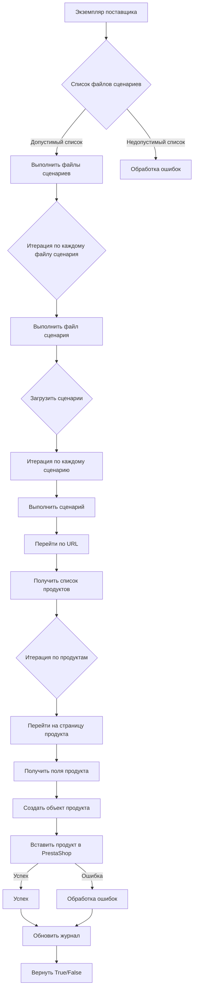

# Модуль `src.scenario`

## Обзор

Модуль `src.scenario` предназначен для автоматизации взаимодействия с поставщиками с использованием сценариев, описанных в файлах JSON. Он оптимизирует процесс извлечения и обработки данных о продуктах с веб-сайтов поставщиков и синхронизации этой информации с базой данных (например, PrestaShop). Модуль включает в себя функциональные возможности для чтения сценариев, взаимодействия с веб-сайтами, обработки данных, ведения журналов выполнения и организации всего рабочего процесса.

## Оглавление

* [Модуль `src.scenario`](#модуль-srcscenario)
* [Обзор](#обзор)
* [Основные функции модуля](#основные-функции-модуля)
* [Основные компоненты модуля](#основные-компоненты-модуля)
    * [`run_scenario_files(s, scenario_files_list)`](#run_scenario_files-s-scenario_files_list)
    * [`run_scenario_file(s, scenario_file)`](#run_scenario_file-s-scenario_file)
    * [`run_scenario(s, scenario)`](#run_scenario-s-scenario)
    * [`dump_journal(s, journal)`](#dump_journal-s-journal)
    * [`main()`](#main)
* [Пример сценария](#пример-сценария)
* [Как это работает](#как-это-работает)

## Основные функции модуля

1. **Чтение сценариев**: Загрузка сценариев из JSON-файлов, содержащих информацию о продуктах и URL-адреса на веб-сайте поставщика.
2. **Взаимодействие с веб-сайтами**: Обработка URL-адресов из сценариев для извлечения данных о продуктах.
3. **Обработка данных**: Преобразование извлеченных данных в формат, подходящий для базы данных, и их сохранение.
4. **Ведение журнала выполнения**: Ведение журналов с подробностями выполнения сценариев и результатов для отслеживания прогресса и выявления ошибок.



## Основные компоненты модуля

### `run_scenario_files(s, scenario_files_list)`

**Описание**: Принимает список файлов сценариев и последовательно выполняет их, вызывая функцию `run_scenario_file` для каждого файла.

**Параметры**:
- `s`: Объект настроек (например, для подключения к базе данных).
- `scenario_files_list` (list): Список путей к файлам сценариев.

**Возвращает**:
- None

**Вызывает исключения**:
- `FileNotFoundError`: Если файл сценария не найден.
- `JSONDecodeError`: Если файл сценария содержит недопустимый JSON.

### `run_scenario_file(s, scenario_file)`

**Описание**: Загружает сценарии из указанного файла и вызывает `run_scenario` для каждого сценария в файле.

**Параметры**:
- `s`: Объект настроек.
- `scenario_file` (str): Путь к файлу сценария.

**Возвращает**:
- None

**Вызывает исключения**:
- `FileNotFoundError`: Если файл сценария не найден.
- `JSONDecodeError`: Если файл сценария содержит недопустимый JSON.
- `Exception`: Для любых других проблем во время выполнения сценария.

### `run_scenario(s, scenario)`

**Описание**: Обрабатывает отдельный сценарий, переходя по URL-адресу, извлекая данные о продукте и сохраняя их в базу данных.

**Параметры**:
- `s`: Объект настроек.
- `scenario` (dict): Словарь, содержащий сценарий (например, с URL-адресом и категориями).

**Возвращает**:
- None

**Вызывает исключения**:
- `requests.exceptions.RequestException`: Если есть проблемы с запросом к веб-сайту.
- `Exception`: Для любых других проблем во время обработки сценария.

### `dump_journal(s, journal)`

**Описание**: Сохраняет журнал выполнения в файл для последующего анализа.

**Параметры**:
- `s`: Объект настроек.
- `journal` (list): Список записей журнала выполнения.

**Возвращает**:
- None

**Вызывает исключения**:
- `Exception`: Если есть проблемы с записью в файл.

### `main()`

**Описание**: Основная функция для запуска модуля.

**Параметры**:
- None

**Возвращает**:
- None

**Вызывает исключения**:
- `Exception`: Для любых критических ошибок во время выполнения.

## Пример сценария

Пример JSON-сценария описывает взаимодействие с категориями продуктов на веб-сайте. Он включает в себя URL-адрес, название категории и идентификаторы категорий в базе данных PrestaShop.

```json
{
    "scenarios": {
        "mineral+creams": {
            "url": "https://example.com/category/mineral-creams/",
            "name": "mineral+creams",
            "presta_categories": {
                "default_category": 12345,
                "additional_categories": [12346, 12347]
            }
        }
    }
}
```

## Как это работает

Модуль `src.scenario` работает, считывая файлы сценариев в формате JSON. Эти сценарии содержат URL-адреса веб-сайтов и другие данные, необходимые для взаимодействия с веб-сайтами поставщиков. Когда модуль выполняет сценарий, он загружает страницу веб-сайта по URL-адресу и извлекает из нее данные о продуктах. Затем он преобразует извлеченные данные в формат, подходящий для базы данных, и сохраняет их. Во время этого процесса модуль также ведет журнал выполнения, который можно использовать для отслеживания прогресса и выявления ошибок.