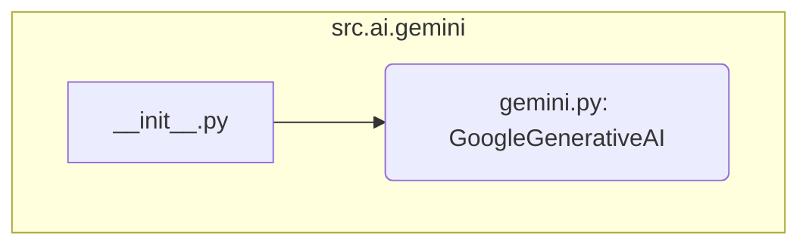

### **Анализ кода `hypotez/src/ai/gemini/__init__.py`**

#### **1. <алгоритм>**:
1. **Импорт `GoogleGenerativeAI`**: Импортирует класс `GoogleGenerativeAI` из модуля `.gemini`.
   - Пример: `from .gemini import GoogleGenerativeAI`
   - Этот шаг обеспечивает доступ к классу, который, вероятно, реализует функциональность взаимодействия с моделью Gemini.

#### **2. <mermaid>**:

**Объяснение зависимостей в `mermaid`**:
- `__init__.py`: Инициализирует пакет `src.ai.gemini`.
- `gemini.py`: Содержит класс `GoogleGenerativeAI`, который импортируется в `__init__.py` для упрощения доступа к нему извне пакета.

#### **3. <объяснение>**:

- **Расположение файла**: Файл `hypotez/src/ai/gemini/__init__.py` является частью пакета `src.ai.gemini`. Он служит для инициализации пакета и упрощения импорта модулей и классов, содержащихся в пакете.

- **Импорты**:
  - `from .gemini import GoogleGenerativeAI`: Импортирует класс `GoogleGenerativeAI` из модуля `gemini.py`, находящегося в том же пакете. Это позволяет использовать `GoogleGenerativeAI` напрямую через пакет `src.ai.gemini`.

- **Классы**:
  - `GoogleGenerativeAI`: Класс, предназначенный для взаимодействия с моделью Gemini. Он, вероятно, содержит методы для отправки запросов к модели и получения ответов. Подробная информация о его атрибутах и методах находится в файле `gemini.py`.

- **Функции**:
  - В данном файле функции отсутствуют, но `GoogleGenerativeAI` содержит методы, описанные в `gemini.py`.

- **Переменные**:
  - В данном файле переменные отсутствуют.

- **Потенциальные ошибки и области для улучшения**:
  - Необходимо обеспечить обработку возможных ошибок при взаимодействии с API Gemini, таких как сетевые сбои или некорректные запросы.
  - Важно предусмотреть возможность логирования запросов и ответов для отладки и мониторинга.

- **Взаимосвязи с другими частями проекта**:
  - `GoogleGenerativeAI` может использоваться в других частях проекта `hypotez`, где требуется взаимодействие с моделью Gemini для генерации текста, анализа данных или выполнения других задач, связанных с искусственным интеллектом.