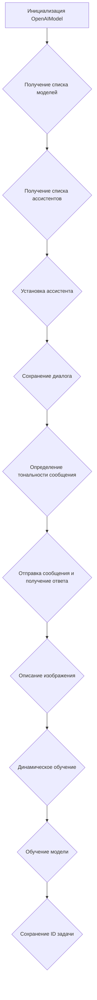
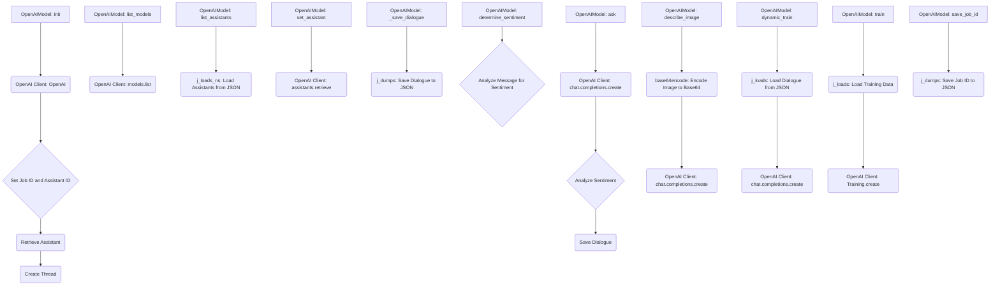

## \\file /src/ai/openai/model/training.py

# Проект `hypotez`
# Роль `code explainer`

## 1. **<алгоритм>**

### Общий алгоритм работы кода:

1.  **Инициализация `OpenAIModel`**:
    *   При инициализации класса `OpenAIModel` происходит следующее:
        *   Инициализируется клиент OpenAI с использованием API-ключа.
        *   Устанавливается ID текущей задачи и ID ассистента.
        *   Загружается ассистент и создается поток (thread) с использованием OpenAI API.
2.  **Получение списка моделей**:
    *   Метод `list_models` используется для получения списка доступных моделей из OpenAI API.
    *   Он извлекает ID каждой модели и возвращает их в виде списка.
    *   Пример:

        ```python
        models = self.client.models.list()
        model_list = [model['id'] for model in models['data']]
        ```
3.  **Получение списка ассистентов**:
    *   Метод `list_assistants` загружает список доступных ассистентов из JSON-файла.
    *   Он возвращает список имен ассистентов.
    *   Пример:

        ```python
        self.assistants = j_loads_ns(gs.path.src / 'ai' / 'openai' / 'model' / 'assistants' / 'assistants.json')
        assistant_list = [assistant.name for assistant in self.assistants]
        ```
4.  **Установка ассистента**:
    *   Метод `set_assistant` устанавливает текущего ассистента по его ID.
    *   Он извлекает ассистента из OpenAI API и обновляет атрибут `self.assistant`.
    *   Пример:

        ```python
        self.assistant_id = assistant_id
        self.assistant = self.client.beta.assistants.retrieve(assistant_id)
        ```
5.  **Сохранение диалога**:
    *   Метод `_save_dialogue` сохраняет весь диалог в JSON-файл.
    *   Он использует функцию `j_dumps` для сериализации и сохранения данных.
    *   Пример:

        ```python
        j_dumps(self.dialogue, self.dialogue_log_path)
        ```
6.  **Определение тональности сообщения**:
    *   Метод `determine_sentiment` анализирует сообщение и определяет его тональность (положительная, отрицательная или нейтральная) на основе ключевых слов.
    *   Пример:

        ```python
        if any(word in message_lower for word in positive_words):
            return "positive"
        ```
7.  **Отправка сообщения и получение ответа**:
    *   Метод `ask` отправляет сообщение в OpenAI API и возвращает ответ.
    *   Он формирует запрос с системными инструкциями и пользовательским сообщением.
    *   Анализирует тональность ответа и сохраняет диалог.
    *   Пример:

        ```python
        response = self.client.chat.completions.create(
            model=self.model,
            messages=messages,
            temperature=0,
            max_tokens=8000,
        )
        reply = response.choices[0].message.content.strip()
        ```
8.  **Описание изображения**:
    *   Метод `describe_image` отправляет изображение в OpenAI API и получает его описание.
    *   Изображение кодируется в base64 и включается в запрос.
    *   Пример:

        ```python
        base64_image = base64encode(image_path)
        messages.append(
            {
                "role": "user",
                "content": [
                    {"type": "text", "text": prompt if prompt else "What's in this image?"},
                    {
                        "type": "image_url",
                        "image_url": {"url": f"data:image/jpeg;base64,{base64_image}"},
                    },
                ],
            }
        )
        ```
9.  **Динамическое обучение**:
    *   Метод `dynamic_train` загружает предыдущий диалог и использует его для дополнительной настройки модели.
    *   Пример:

        ```python
        messages = j_loads(gs.path.google_drive / 'AI' / 'conversation' / 'dailogue.json')
        response = self.client.chat.completions.create(
            model=self.model,
            assistant=self.assistant_id,
            messages=messages,
            temperature=0,
        )
        ```
10. **Обучение модели**:
    *   Метод `train` обучает модель на основе предоставленных данных.
    *   Он принимает данные в виде строки, файла или директории.
    *   Пример:

        ```python
        documents = j_loads(data if data else data_file if data_file else data_dir)
        response = self.client.Training.create(
            model=self.model,
            documents=documents,
            labels=["positive" if positive else "negative"] * len(documents),
            show_progress=True,
        )
        ```
11. **Сохранение ID задачи**:
    *   Метод `save_job_id` сохраняет ID задачи обучения с описанием в файл.
    *   Пример:

        ```python
        job_data = {"id": job_id, "description": description, "created": time.time()}
        job_file = gs.path.google_drive / filename
        ```

### Блок-схема процесса:



## 2. **<mermaid>**



### Объяснение зависимостей:

*   `OpenAI Client: OpenAI`: Клиент для взаимодействия с OpenAI API.
*   `j_loads_ns`: Функция для загрузки данных из JSON-файла с преобразованием в пространство имен.
*   `j_dumps`: Функция для сохранения данных в JSON-файл.
*   `base64encode`: Функция для кодирования изображения в формат Base64.

### `header.py` отсутствует в коде.

## 3. **<объяснение>**

### Импорты:

*   `time`: Используется для задержек во время повторных попыток отправки сообщений.
*   `pathlib.Path`: Используется для работы с путями к файлам и директориям.
*   `typing.List, Dict, Optional`: Используется для аннотации типов.
*   `pandas as pd`: Хотя и импортирован, но не используется в предоставленном коде. Возможно, остаток от предыдущих версий.
*   `openai.OpenAI`: Используется для взаимодействия с OpenAI API.
*   `requests`: Используется для отправки HTTP-запросов к OpenAI API в методе `describe_image_by_requests`.
*   `PIL.Image`: Используется для работы с изображениями.
*   `io.BytesIO`: Используется для работы с байтовыми потоками.
*   `src.gs`: Используется для получения глобальных настроек и учетных данных.
*   `src.utils.jjson.j_loads, j_loads_ns, j_dumps`: Используется для работы с JSON-файлами.
*   `src.utils.csv.save_csv_file`: Хотя и импортирован, но не используется в предоставленном коде. Возможно, остаток от предыдущих версий.
*   `src.utils.printer.pprint`: Используется для красивой печати объектов в процессе отладки.
*   `src.utils.convertors.base64.base64encode`: Используется для кодирования изображений в формат Base64.
*   `src.utils.convertors.md.md2dict`: Используется для преобразования Markdown в словарь.
*   `src.logger.logger.logger`: Используется для логирования событий и ошибок.

### Классы:

*   `OpenAIModel`:
    *   **Роль**: Управление взаимодействием с OpenAI API, включая отправку сообщений, получение ответов, обучение моделей и управление ассистентами.
    *   **Атрибуты**:
        *   `model (str)`: Имя используемой модели OpenAI.
        *   `client (OpenAI)`: Клиент OpenAI API.
        *   `current_job_id (str)`: ID текущей задачи обучения.
        *   `assistant_id (str)`: ID ассистента.
        *   `assistant`: Объект ассистента, полученный из OpenAI API.
        *   `thread`: Объект потока, созданный через OpenAI API.
        *   `system_instruction (str)`: Системная инструкция для модели.
        *   `dialogue_log_path (str | Path)`: Путь к файлу для сохранения диалога.
        *   `dialogue (List[Dict[str, str]])`: Список сообщений в диалоге.
        *   `assistants (List[SimpleNamespace])`: Список доступных ассистентов.
        *   `models_list (List[str])`: Список доступных моделей.
    *   **Методы**:
        *   `__init__(self, api_key: str, system_instruction: str = None, model_name: str = 'gpt-4o-mini', assistant_id: str = None)`: Инициализирует объект модели.
        *   `list_models(self) -> List[str]`: Возвращает список доступных моделей из OpenAI API.
        *   `list_assistants(self) -> List[str]`: Возвращает список доступных ассистентов из JSON-файла.
        *   `set_assistant(self, assistant_id: str)`: Устанавливает ассистента по ID.
        *   `_save_dialogue(self)`: Сохраняет диалог в JSON-файл.
        *   `determine_sentiment(self, message: str) -> str`: Определяет тональность сообщения.
        *   `ask(self, message: str, system_instruction: str = None, attempts: int = 3) -> str`: Отправляет сообщение и возвращает ответ от модели.
        *   `describe_image(self, image_path: str | Path, prompt: Optional[str] = None, system_instruction: Optional[str] = None) -> str`: Описывает изображение, используя OpenAI API.
        *   `describe_image_by_requests(self, image_path: str | Path, prompt: str = None) -> str`: Описывает изображение, используя HTTP-запросы к OpenAI API.
        *   `dynamic_train(self)`: Выполняет динамическое обучение на основе предыдущего диалога.
        *   `train(self, data: str = None, data_dir: Path | str = None, data_file: Path | str = None, positive: bool = True) -> str | None`: Обучает модель на основе предоставленных данных.
        *   `save_job_id(self, job_id: str, description: str, filename: str = "job_ids.json")`: Сохраняет ID задачи обучения в файл.

### Функции:

*   `main()`:
    *   **Аргументы**: Нет.
    *   **Возвращаемое значение**: Нет.
    *   **Назначение**: Инициализация `OpenAIModel`, демонстрация использования методов, таких как получение списка моделей и ассистентов, отправка сообщений, динамическое обучение, обучение модели и сохранение ID задачи.

### Переменные:

*   `model (str)`: Имя используемой модели OpenAI.
*   `client (OpenAI)`: Клиент OpenAI API.
*   `current_job_id (str)`: ID текущей задачи обучения.
*   `assistant_id (str)`: ID ассистента.
*   `assistant`: Объект ассистента, полученный из OpenAI API.
*   `thread`: Объект потока, созданный через OpenAI API.
*   `system_instruction (str)`: Системная инструкция для модели.
*   `dialogue_log_path (str | Path)`: Путь к файлу для сохранения диалога.
*   `dialogue (List[Dict[str, str]])`: Список сообщений в диалоге.
*   `assistants (List[SimpleNamespace])`: Список доступных ассистентов.
*   `models_list (List[str])`: Список доступных моделей.

### Потенциальные ошибки и области для улучшения:

*   **Обработка ошибок**: В некоторых методах (`describe_image`, `describe_image_by_requests`) обработка ошибок неполная. Следует добавить более детальное логирование и обработку исключений.
*   **Использование `pandas`**: Импорт `pandas` отсутствует в коде, что может указывать на неполную реализацию или остатки предыдущей версии.
*   **Дублирование функциональности**: Методы `describe_image` и `describe_image_by_requests` выполняют схожие задачи. Следует рассмотреть возможность их объединения или рефакторинга для устранения дублирования.
*   **Жёстко закодированные значения**: В коде присутствуют жёстко закодированные значения, такие как ID ассистента и пути к файлам. Рекомендуется вынести их в конфигурационные файлы или переменные окружения.
*   **Отсутствие документации**: Некоторые методы (`describe_image`) не имеют документации.

### Взаимосвязи с другими частями проекта:

*   `src.gs`: Используется для получения глобальных настроек, таких как пути к файлам и учетные данные OpenAI.
*   `src.utils.jjson`: Используется для работы с JSON-файлами, что позволяет загружать и сохранять данные конфигурации и диалоги.
*   `src.logger.logger`: Используется для логирования событий и ошибок, что помогает в отладке и мониторинге работы модели.
*   `src.utils.convertors.base64`: Используется для кодирования изображений в формат Base64, что позволяет отправлять их в OpenAI API.