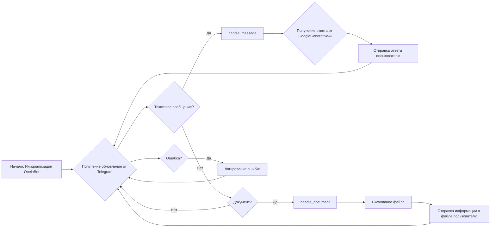
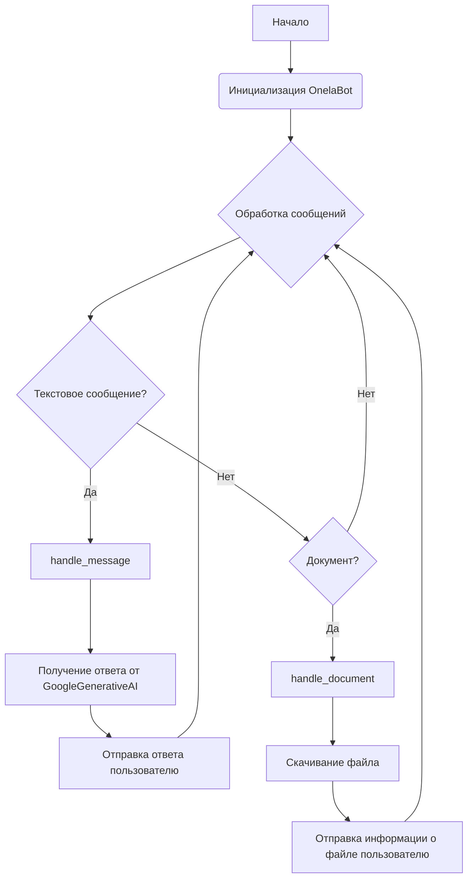
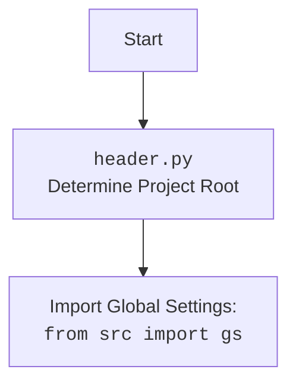

## Анализ кода `hypotez/src/endpoints/hypo69/code_assistant/onela_bot.py`

### 1. <алгоритм>

#### Общая схема работы `OnelaBot`:
1.  **Инициализация**: Создается экземпляр класса `OnelaBot`. При этом инициализируется родительский класс `TelegramBot` с использованием учетных данных Telegram бота, а также модель `GoogleGenerativeAI`.
2.  **Обработка сообщений**: Бот получает обновления от Telegram.
3.  **Текстовые сообщения**:
    *   При получении текстового сообщения вызывается метод `handle_message`.
    *   Извлекается текст сообщения и ID пользователя.
    *   Текст передается в модель `GoogleGenerativeAI` для получения ответа.
    *   Ответ отправляется пользователю.
    *   В случае ошибки, она логируется.
4.  **Документы**:
    *   При получении документа вызывается метод `handle_document`.
    *   Файл скачивается локально.
    *   Информация о файле отправляется пользователю.
    *   В случае ошибки, она логируется.
5.  **Запуск бота**: В `if __name__ == '__main__':` создается экземпляр `OnelaBot` и запускается процесс получения обновлений (`run_polling`).

### 2. <mermaid>

**Зависимости:**

*   `telegram`: Используется для взаимодействия с API Telegram. Предоставляет классы и методы для получения обновлений, отправки сообщений и обработки различных типов данных (текст, документы и т.д.).
*   `src.ai.openai`: OpenAIModel class используется для интеграции с OpenAI.
*   `src.ai.gemini`: GoogleGenerativeAI class используется для интеграции с Gemini.
*   `src.endpoints.bots.telegram`: TelegramBot class обеспечивает основу для создания телеграм-ботов, обрабатывающих обновления и команды.
*   `src.logger.logger`: Модуль логирования для записи информации о работе бота и ошибок.
*   `src.gs`: Глобальные настройки, содержащие учетные данные и другие параметры конфигурации.

### 3. <объяснение>

#### Импорты:

*   `header`: Предположительно, содержит общие настройки или функции, необходимые для работы модуля.
*   `asyncio`: Используется для асинхронного программирования.
*   `Path` (из `pathlib`): Класс для работы с путями к файлам и директориям.
*   `List, Optional, Dict` (из `typing`): Используются для аннотации типов.
*   `SimpleNamespace` (из `types`): Класс, позволяющий создавать объекты с атрибутами, доступными через точку.
*   `Update, Application, CommandHandler, MessageHandler, filters, CallbackContext` (из `telegram.ext`): Классы и функции для работы с Telegram Bot API.
*   `src.gs`: Глобальные настройки проекта, содержащие различные параметры конфигурации, такие как учетные данные.
*   `src.ai.openai.OpenAIModel`: Класс для взаимодействия с моделью OpenAI.
*   `src.ai.gemini.GoogleGenerativeAI`: Класс для взаимодействия с моделью Gemini от Google.
*   `src.endpoints.bots.telegram.TelegramBot`: Базовый класс для создания Telegram-ботов.
*   `src.logger.logger`: Модуль для логирования событий и ошибок.

#### Классы:

*   `OnelaBot(TelegramBot)`:
    *   **Роль**: Класс для взаимодействия с моделью ассистента программиста через Telegram.
    *   **Атрибуты**:
        *   `model (GoogleGenerativeAI)`: Экземпляр класса `GoogleGenerativeAI`, используемый для обработки текстовых сообщений.
    *   **Методы**:
        *   `__init__(self)`: Инициализирует объект `OnelaBot`, вызывая конструктор родительского класса `TelegramBot` и передавая ему токен бота из глобальных настроек.
        *   `handle_message(self, update: Update, context: CallbackContext)`: Обрабатывает текстовые сообщения, отправляя их в модель `GoogleGenerativeAI` и отправляя ответ пользователю.
        *   `handle_document(self, update: Update, context: CallbackContext)`: Обрабатывает загруженные документы, скачивая их локально и отправляя информацию о файле пользователю.

#### Функции:

*   `handle_message(self, update: Update, context: CallbackContext) -> None`:
    *   **Аргументы**:
        *   `update (Update)`: Объект, содержащий информацию об обновлении от Telegram.
        *   `context (CallbackContext)`: Объект, содержащий контекст выполнения.
    *   **Возвращаемое значение**: `None`.
    *   **Назначение**: Обрабатывает текстовые сообщения, отправляя их в модель `GoogleGenerativeAI` и отправляя ответ пользователю.
*   `handle_document(self, update: Update, context: CallbackContext) -> None`:
    *   **Аргументы**:
        *   `update (Update)`: Объект, содержащий информацию об обновлении от Telegram.
        *   `context (CallbackContext)`: Объект, содержащий контекст выполнения.
    *   **Возвращаемое значение**: `None`.
    *   **Назначение**: Обрабатывает загруженные документы, скачивая их локально и отправляя информацию о файле пользователю.

#### Переменные:

*   `bot (OnelaBot)`: Экземпляр класса `OnelaBot`, создается в блоке `if __name__ == '__main__':`.
*   `gs`: Объект, содержащий глобальные настройки проекта.

#### Потенциальные ошибки и области для улучшения:

*   В методе `handle_document` после скачивания файла, бот отправляет пользователю `file` вместо обработки содержимого файла. Это может быть не совсем то, что ожидается.
*   В обоих методах `handle_message` и `handle_document` используется `try...except` с логированием ошибки, но без какой-либо обработки ошибки для пользователя. Было бы полезно отправлять пользователю сообщение об ошибке.

#### Взаимосвязи с другими частями проекта:

*   Модуль `onela_bot.py` использует `src.ai.gemini.GoogleGenerativeAI` для обработки текстовых сообщений.
*   Использует `src.endpoints.bots.telegram.TelegramBot` в качестве базового класса, что позволяет интегрироваться с Telegram API.
*   Использует `src.logger.logger` для логирования ошибок и событий.
*   Использует `src.gs` для получения учетных данных и других параметров конфигурации.