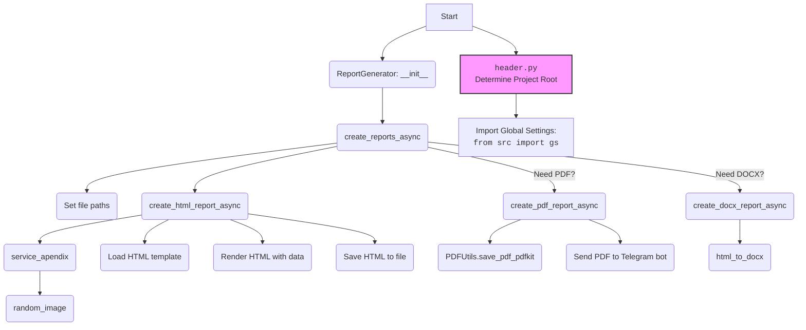

## Проект `hypotez`
# Роль `code explainer`
## ИНСТРУКЦИЯ  :

Анализируй предоставленный код подробно и объясни его функциональность. Ответ должен включать три раздела:  

1. **<алгоритм>**: Опиши рабочий процесс в виде пошаговой блок-схемы, включая примеры для каждого логического блока, и проиллюстрируй поток данных между функциями, классами или методами.  
2. **<mermaid>**: Напиши код для диаграммы в формате `mermaid`, проанализируй и объясни все зависимости, 
    которые импортируются при создании диаграммы. 
    **ВАЖНО!** Убедитесь, что все имена переменных, используемые в диаграмме `mermaid`, 
    имеют осмысленные и описательные имена. Имена переменных вроде `A`, `B`, `C`, и т.д., не допускаются!  
    
    **Дополнительно**: Если в коде есть импорт `import header`, добавьте блок `mermaid` flowchart, объясняющий `header.py`:\
    ```mermaid\
    flowchart TD\
        Start --> Header[<code>header.py</code><br> Determine Project Root]\
    \
        Header --> import[Import Global Settings: <br><code>from src import gs</code>] \
    ```

3. **<объяснение>**: Предоставь подробные объяснения:  
   - **Импорты**: Их назначение и взаимосвязь с другими пакетами `src.`.  
   - **Классы**: Их роль, атрибуты, методы и взаимодействие с другими компонентами проекта.  
   - **Функции**: Их аргументы, возвращаемые значения, назначение и примеры.  
   - **Переменные**: Их типы и использование.  
   - Выдели потенциальные ошибки или области для улучшения.  

Дополнительно, постройте цепочку взаимосвязей с другими частями проекта (если применимо).  

Это обеспечивает всесторонний и структурированный анализ кода.
## Формат ответа: `.md` (markdown)


## Твое поведение при анализе кода:
- всегда смотри системную инструкцию для обработки кода проекта `hypotez`;
- анализируй расположение файла в проекте. Это поможет понять его назначение и взаимосвязь с другими файлами. Расположение файла ты найдешь в самой первой строке кода, начинающейся с `## \\file /...`;
- запоминай предоставленный код и анализируй его связь с другими частями проекта `hypotez`;

**КОНЕЦ ИНСТРУКЦИИ**
```

## \\file /src/endpoints/kazarinov/react/report_generator.py

### **1. <алгоритм>**:

1.  **Инициализация `ReportGenerator`**:
    *   При создании экземпляра класса `ReportGenerator` определяются флаги `if_need_pdf` и `if_need_docx`, указывающие, какие форматы отчетов необходимо генерировать.

2.  **`create_reports_async`**:
    *   Определяет пути для сохранения HTML, PDF и DOCX файлов на основе `mexiron_name` и языка.
    *   Вызывает `create_html_report_async` для генерации HTML-контента.
    *   Если HTML-контент успешно создан, вызывает `create_pdf_report_async` и `create_docx_report_async` для генерации PDF и DOCX отчетов соответственно (если соответствующие флаги установлены).

3.  **`service_apendix`**:
    *   Создаёт словарь, содержащий информацию о сервисе, включая `product_id`, `product_name`, `specification` (считанное из HTML-шаблона) и путь к случайному изображению.

4.  **`create_html_report_async`**:
    *   Получает данные о сервисе, добавляет их к данным о продуктах.
    *   Определяет путь к HTML-шаблону в зависимости от языка.
    *   Загружает шаблон и генерирует HTML-контент с использованием Jinja2.
    *   Сохраняет HTML-контент в файл.

5.  **`create_pdf_report_async`**:
    *   Использует `PDFUtils` для сохранения HTML-контента в PDF файл.
    *   Отправляет PDF файл в Telegram чат, если бот определен.

6.  **`create_docx_report_async`**:
    *   Использует `html_to_docx` для конвертации HTML файла в DOCX файл.

7.  **`main`**:
    *   Определяет пути к JSON, HTML, PDF и DOCX файлам на основе `maxiron_name` и языка.
    *   Загружает данные из JSON файла.
    *   Создает экземпляр класса `ReportGenerator`.
    *   Запускает асинхронную генерацию отчетов.

**Примеры:**

*   **Инициализация `ReportGenerator`**:

    ```python
    report_generator = ReportGenerator(if_need_pdf=True, if_need_docx=True)
    ```

*   **Вызов `create_reports_async`**:

    ```python
    await report_generator.create_reports_async(bot, chat_id, data, lang, mexiron_name)
    ```

*   **Создание HTML-отчета**:

    ```python
    html_content = await report_generator.create_html_report_async(data, lang, html_path)
    ```

*   **Создание PDF-отчета**:

    ```python
    await report_generator.create_pdf_report_async(html_content, lang, pdf_path)
    ```

*   **Создание DOCX-отчета**:

    ```python
    await report_generator.create_docx_report_async(html_path, docx_path)
    ```

### **2. <mermaid>**:



**Объяснение зависимостей:**

*   `header`: Определяет корень проекта и используется для доступа к глобальным настройкам.
*   `src.gs`: Глобальные настройки проекта, такие как пути к различным ресурсам.
*   `src.utils.jjson`: Модуль для загрузки JSON-данных.
*   `src.utils.file`: Модуль для чтения и записи текстовых файлов.
*   `src.utils.convertors.html2pdf`: Модуль для конвертации HTML в PDF.
*   `src.utils.convertors.html2docx`: Модуль для конвертации HTML в DOCX.
*   `src.utils.image`: Модуль для работы с изображениями, в частности, для получения случайного изображения.
*   `src.utils.printer`: Модуль для "красивой" печати данных.
*   `src.logger.logger`: Модуль для логирования событий.
*   `telebot`: Используется для взаимодействия с Telegram Bot API.
*   `jinja2`: Используется для создания HTML отчетов на основе шаблонов.
*   `pdfkit`:  Используется для конвертации HTML в PDF.
*   `asyncio`: Используется для асинхронного выполнения операций.
*   `dataclasses`: Используется для определения классов данных.
*   `itertools`: Используется для работы с итераторами.
*   `pathlib`: Используется для работы с путями к файлам и каталогам.
*   `typing`: Используется для аннотации типов.

### **3. <объяснение>**:

**Импорты:**

*   `from argparse import OPTIONAL`: Импортирует `OPTIONAL` из модуля `argparse`. Однако, в коде этот импорт не используется.
*   `import asyncio`: Используется для асинхронного программирования.
*   `from dataclasses import dataclass, field`: Используется для создания классов данных.
*   `import telebot`: Используется для работы с Telegram Bot API.
*   `from itertools import filterfalse`: Импортирует `filterfalse` из модуля `itertools`. Однако, в коде этот импорт не используется.
*   `from types import SimpleNamespace`: Импортирует `SimpleNamespace` из модуля `types`. Однако, в коде этот импорт не используется.
*   `from typing import Optional`: Используется для указания необязательных типов.
*   `import json`: Используется для работы с JSON-данными.
*   `from pathlib import Path`: Используется для работы с путями к файлам и каталогам.
*   `from jinja2 import Environment, FileSystemLoader`: Используется для работы с шаблонизатором Jinja2.
*   `import pdfkit`: Используется для конвертации HTML в PDF.
*   `import header`: Импортирует модуль `header`, который, вероятно, содержит общие функции и переменные для проекта.
*   `from header import __root__`: Импортирует переменную `__root__` из модуля `header`, которая, вероятно, представляет собой корень проекта.
*   `from src import gs`: Импортирует модуль `gs` из пакета `src`, который, вероятно, содержит глобальные настройки проекта.
*   `from src.utils.jjson import j_loads`: Импортирует функцию `j_loads` из модуля `src.utils.jjson`, которая, вероятно, используется для загрузки JSON-данных.
*   `from src.utils.file import read_text_file, save_text_file`: Импортирует функции `read_text_file` и `save_text_file` из модуля `src.utils.file`, которые используются для чтения и записи текстовых файлов.
*   `from src.utils.convertors.html2pdf import html2pdf`: Импортирует функцию `html2pdf` из модуля `src.utils.convertors.html2pdf`, которая используется для конвертации HTML в PDF.
*   `from src.utils.convertors.html2docx import html_to_docx`: Импортирует функцию `html_to_docx` из модуля `src.utils.convertors.html2docx`, которая используется для конвертации HTML в DOCX.
*   `from src.utils.image import random_image`: Импортирует функцию `random_image` из модуля `src.utils.image`, которая используется для получения случайного изображения.
*   `from src.utils.printer import pprint`: Импортирует функцию `pprint` из модуля `src.utils.printer`, которая используется для "красивой" печати данных.
*   `from src.logger.logger import logger`: Импортирует модуль `logger` из пакета `src.logger`, который используется для логирования событий.

**Классы:**

*   `ReportGenerator`:
    *   Роль: Класс для генерации HTML- и PDF-отчётов на основе данных из JSON.
    *   Атрибуты:
        *   `if_need_html`: Флаг, указывающий, нужно ли генерировать HTML-отчет.
        *   `if_need_pdf`: Флаг, указывающий, нужно ли генерировать PDF-отчет.
        *   `if_need_docx`: Флаг, указывающий, нужно ли генерировать DOCX-отчет.
        *   `storage_path`: Путь к каталогу, в котором будут сохранены отчеты.
        *   `html_path`: Путь к HTML-файлу.
        *   `pdf_path`: Путь к PDF-файлу.
        *   `docx_path`: Путь к DOCX-файлу.
        *   `html_content`: HTML-контент отчета.
        *   `data`: Данные для отчета.
        *   `lang`: Язык отчета.
        *   `mexiron_name`: Имя "мехирона".
        *   `env`: Объект `Environment` из библиотеки `jinja2`, используемый для загрузки и рендеринга шаблонов.
    *   Методы:
        *   `__init__`: Конструктор класса.
        *   `create_reports_async`: Создает HTML, PDF и DOCX отчеты асинхронно.
        *   `service_apendix`:  Формирует словарь с информацией о сервисе для добавления в отчет.
        *   `create_html_report_async`: Генерирует HTML-контент на основе шаблона и данных.
        *   `create_pdf_report_async`: Генерирует PDF-отчет на основе HTML-контента.
        *   `create_docx_report_async`: Генерирует DOCX-отчет на основе HTML-контента.

**Функции:**

*   `main(maxiron_name: str, lang: str) -> bool`:
    *   Аргументы:
        *   `maxiron_name`: Имя "мехирона".
        *   `lang`: Язык отчета.
    *   Возвращаемое значение:
        *   `bool`: Успешность выполнения операции.
    *   Назначение:
        *   Определяет пути к JSON, HTML, PDF и DOCX файлам на основе `maxiron_name` и языка.
        *   Загружает данные из JSON файла.
        *   Создает экземпляр класса `ReportGenerator`.
        *   Запускает асинхронную генерацию отчетов.
    *   Пример:

        ```python
        main(maxiron_name='250127221657987', lang='ru')
        ```

**Переменные:**

*   `ENDPOINT`: Константа, определяющая имя подкаталога для хранения отчетов.

**Потенциальные ошибки и области для улучшения:**

*   Обработка ошибок при создании PDF и DOCX отчетов.
*   Использование `OPTIONAL` и `filterfalse` без необходимости.
*   Дублирование кода при создании PDF и DOCX отчетов (оба метода вызывают `create_pdf_report_async`).
*   Отсутствие обработки ошибок при чтении данных из JSON-файла в функции `main`.
*   Не используется переменная `if_need_html` в `main`, хотя она передается в конструктор `ReportGenerator`.

**Взаимосвязи с другими частями проекта:**

*   Использует модуль `header` для определения корня проекта и глобальных настроек.
*   Использует модуль `src.gs` для доступа к глобальным настройкам проекта.
*   Использует модули из пакета `src.utils` для работы с файлами, JSON-данными, конвертации форматов и логирования.

```mermaid
flowchart TD
    style Header fill:#f9f,stroke:#333,stroke-width:2px
    Start --> Header[<code>header.py</code><br> Determine Project Root]

    Header --> import[Import Global Settings: <br><code>from src import gs</code>]