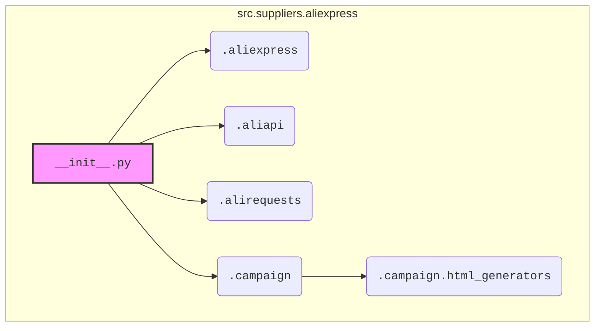

### **Анализ кода `hypotez/src/suppliers/aliexpress/__init__.py`**

#### **1. <алгоритм>**:

1.  **Импорт `Aliexpress`**: Импортируется класс `Aliexpress` из модуля `.aliexpress`. Этот класс, вероятно, содержит основную логику взаимодействия с AliExpress, такую как парсинг страниц, обработка данных о товарах и т. д.
    *   Пример: Создание экземпляра класса `aliexpress = Aliexpress()`.
2.  **Импорт `AliApi`**: Импортируется класс `AliApi` из модуля `.aliapi`. Этот класс, вероятно, отвечает за взаимодействие с API AliExpress, включая отправку запросов и обработку ответов.
    *   Пример: Использование API для получения данных о товарах: `api = AliApi(); data = api.get_product_data(product_id)`.
3.  **Импорт `AliRequests`**: Импортируется класс `AliRequests` из модуля `.alirequests`. Этот класс, вероятно, предоставляет функциональность для отправки HTTP-запросов к AliExpress.
    *   Пример: Отправка запроса на страницу товара: `request = AliRequests(); response = request.get(url)`.
4.  **Импорт `AliCampaignEditor`**: Импортируется класс `AliCampaignEditor` из модуля `.campaign`. Этот класс, вероятно, предоставляет функциональность для редактирования рекламных кампаний на AliExpress.
    *   Пример: Создание или обновление кампании: `campaign_editor = AliCampaignEditor(); campaign_editor.update_campaign(campaign_data)`.
5.  **Импорт HTML-генераторов**: Импортируются классы `ProductHTMLGenerator`, `CategoryHTMLGenerator` и `CampaignHTMLGenerator` из модуля `.campaign.html_generators`. Эти классы, вероятно, отвечают за генерацию HTML-кода для отображения информации о товарах, категориях и кампаниях.
    *   Пример: Генерация HTML для товара: `generator = ProductHTMLGenerator(); html = generator.generate_html(product_data)`.

#### **2. <mermaid>**:

**Объяснение зависимостей:**

*   `__init__.py` импортирует модули из того же пакета `src.suppliers.aliexpress`:
    *   `.aliexpress`: Содержит класс `Aliexpress` для основной логики работы с AliExpress.
    *   `.aliapi`: Содержит класс `AliApi` для взаимодействия с API AliExpress.
    *   `.alirequests`: Содержит класс `AliRequests` для отправки HTTP-запросов.
    *   `.campaign`: Содержит класс `AliCampaignEditor` для редактирования рекламных кампаний.
    *   `.campaign.html_generators`: Содержит классы для генерации HTML-кода.

#### **3. <объяснение>**:

**Импорты**:

*   `.aliexpress`:
    *   Назначение: Предоставляет класс `Aliexpress`, который, вероятно, инкапсулирует логику взаимодействия с платформой AliExpress.
    *   Взаимосвязь: Может использовать `AliApi` и `AliRequests` для получения данных и отправки запросов.
*   `.aliapi`:
    *   Назначение: Предоставляет класс `AliApi` для работы с API AliExpress.
    *   Взаимосвязь: Используется для получения данных о товарах, категориях и т. д. Может использовать `AliRequests` для отправки запросов к API.
*   `.alirequests`:
    *   Назначение: Предоставляет класс `AliRequests` для отправки HTTP-запросов к AliExpress.
    *   Взаимосвязь: Используется классами `Aliexpress` и `AliApi` для получения данных с платформы.
*   `.campaign`:
    *   Назначение: Предоставляет класс `AliCampaignEditor` для редактирования рекламных кампаний на AliExpress.
    *   Взаимосвязь: Может использовать `AliApi` для получения данных о кампаниях и `AliRequests` для отправки изменений.
*   `.campaign.html_generators`:
    *   Назначение: Предоставляет классы для генерации HTML-кода для отображения информации о товарах, категориях и кампаниях.
    *   Взаимосвязь: Используется для создания HTML-представлений данных, полученных из AliExpress.

**Классы**:

*   `Aliexpress`:
    *   Роль: Инкапсулирует логику взаимодействия с платформой AliExpress.
    *   Атрибуты: Вероятно, содержит атрибуты для хранения настроек, данных и т. д.
    *   Методы: Вероятно, содержит методы для парсинга страниц, обработки данных и т. д.
    *   Взаимодействие: Может использовать `AliApi` и `AliRequests` для получения данных.
*   `AliApi`:
    *   Роль: Предоставляет интерфейс для работы с API AliExpress.
    *   Атрибуты: Вероятно, содержит атрибуты для хранения ключей API, настроек и т. д.
    *   Методы: Вероятно, содержит методы для отправки запросов к API и обработки ответов.
    *   Взаимодействие: Используется классами `Aliexpress` и `AliCampaignEditor` для получения данных.
*   `AliRequests`:
    *   Роль: Предоставляет функциональность для отправки HTTP-запросов к AliExpress.
    *   Атрибуты: Вероятно, содержит атрибуты для хранения настроек прокси, заголовков и т. д.
    *   Методы: Вероятно, содержит методы для отправки GET, POST и других типов запросов.
    *   Взаимодействие: Используется классами `Aliexpress` и `AliApi` для получения данных.
*   `AliCampaignEditor`:
    *   Роль: Предоставляет функциональность для редактирования рекламных кампаний на AliExpress.
    *   Атрибуты: Вероятно, содержит атрибуты для хранения данных о кампаниях, настроек и т. д.
    *   Методы: Вероятно, содержит методы для создания, обновления и удаления кампаний.
    *   Взаимодействие: Может использовать `AliApi` для получения данных о кампаниях.
*   `ProductHTMLGenerator`, `CategoryHTMLGenerator`, `CampaignHTMLGenerator`:
    *   Роль: Предоставляют функциональность для генерации HTML-кода для отображения информации о товарах, категориях и кампаниях.
    *   Атрибуты: Вероятно, содержат атрибуты для хранения шаблонов HTML, настроек и т. д.
    *   Методы: Вероятно, содержат методы для генерации HTML-кода на основе данных.
    *   Взаимодействие: Используются для создания HTML-представлений данных, полученных из AliExpress.

**Переменные**:

*   Переменные, создаваемые при импорте модулей, являются экземплярами соответствующих классов.

**Потенциальные ошибки или области для улучшения**:

*   Отсутствие обработки исключений при работе с API и HTTP-запросами.
*   Недостаточная документация классов и методов.
*   Возможная избыточность функциональности в классах `Aliexpress`, `AliApi` и `AliRequests`.

**Цепочка взаимосвязей с другими частями проекта**:

*   Модуль `src.suppliers.aliexpress` является частью пакета `src.suppliers`, который, вероятно, отвечает за интеграцию с различными поставщиками.
*   Данные, полученные из AliExpress, могут использоваться другими частями проекта, например, для анализа рынка, мониторинга цен и т. д.
*   HTML-код, сгенерированный с помощью `HTMLGenerator`, используется для отображения информации на веб-страницах или в других приложениях.