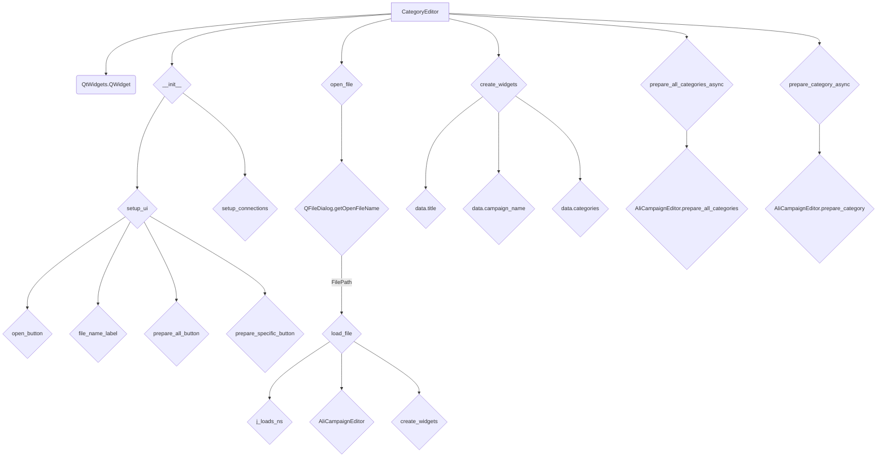
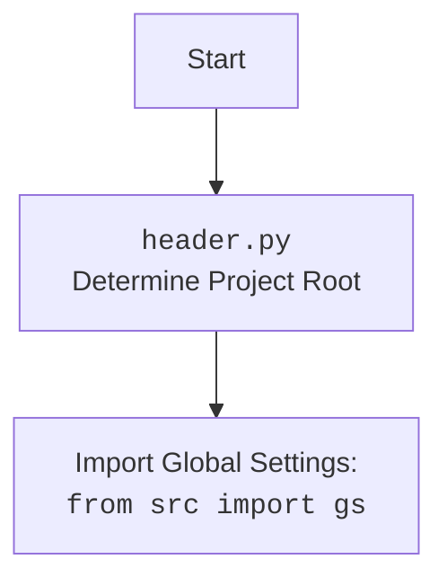

## Анализ кода: `hypotez/src/suppliers/aliexpress/gui/category.py`

### 1. <алгоритм>

1.  **Инициализация CategoryEditor**:

    *   Создается экземпляр класса `CategoryEditor`, при этом сохраняется ссылка на главное приложение (`main_app`).
    *   Вызываются методы `setup_ui()` и `setup_connections()` для настройки интерфейса и связей.
2.  **Настройка UI (setup\_ui)**:

    *   Создаются и настраиваются элементы интерфейса, такие как кнопки ("Open JSON File", "Prepare All Categories", "Prepare Category"), метки (для имени файла) и размещение их на форме.
    *   К кнопкам назначаются обработчики событий (слоты) для открытия файла (`open_file`), подготовки всех категорий (`prepare_all_categories_async`) и подготовки определенной категории (`prepare_category_async`).
3.  **Открытие файла (open\_file)**:

    *   Открывается диалоговое окно выбора файла (`QFileDialog`).
    *   Если файл выбран, вызывается метод `load_file()` для загрузки содержимого файла.
4.  **Загрузка файла (load\_file)**:

    *   Используется функция `j_loads_ns` для загрузки JSON-файла в пространство имен `SimpleNamespace`.
    *   Извлекаются данные из загруженного файла: имя кампании (`campaign_name`), язык (`language`) из имени файла и создается экземпляр `AliCampaignEditor`.
    *   Вызывается метод `create_widgets()` для создания виджетов на основе загруженных данных.
    *   В случае ошибки отображается диалоговое окно с сообщением об ошибке (`QMessageBox`).
5.  **Создание виджетов (create\_widgets)**:

    *   Удаляются старые виджеты (кроме кнопок "Open JSON File", метки имени файла, кнопок "Prepare All Categories", "Prepare Category").
    *   Создаются метки для отображения заголовка (`title`) и имени кампании (`campaign_name`).
    *   Для каждой категории создается метка с именем категории (`category.name`).
6.  **Подготовка категорий (prepare\_all\_categories\_async, prepare\_category\_async)**:

    *   Асинхронные методы, вызываемые при нажатии на кнопки "Prepare All Categories" и "Prepare Category" соответственно.
    *   Вызывают соответствующие методы (`prepare_all_categories()` или `prepare_category()`) экземпляра `AliCampaignEditor`.
    *   Отображают сообщения об успехе или ошибке через `QMessageBox`.

```mermaid
graph TD
    A[Инициализация CategoryEditor] --> B{setup_ui()};
    B --> C{open_file()};
    C --> D{load_file()};
    D --> E{create_widgets()};
    E --> F{prepare_all_categories_async()};
    E --> G{prepare_category_async()};
    F --> H{AliCampaignEditor.prepare_all_categories()};
    G --> I{AliCampaignEditor.prepare_category()};
    H --> J{QMessageBox.information()};
    I --> J;
    C -- No file selected --> K[return];
    D -- Error --> L{QMessageBox.critical()};
    F -- Error --> L;
    G -- Error --> L;
```

### 2. <mermaid>



**Объяснение `mermaid`:**

*   `CategoryEditor` наследуется от `QtWidgets.QWidget`.
*   В методе `__init__` вызываются `setup_ui` и `setup_connections`.
*   `setup_ui` создает основные элементы интерфейса, такие как кнопки (`open_button`, `prepare_all_button`, `prepare_specific_button`) и метку (`file_name_label`).
*   `open_file` использует `QFileDialog.getOpenFileName` для выбора файла.
*   `load_file` загружает JSON с помощью `j_loads_ns`, создает экземпляр `AliCampaignEditor` и вызывает `create_widgets`.
*   `create_widgets` создает виджеты на основе данных JSON (`data.title`, `data.campaign_name`, `data.categories`).
*   `prepare_all_categories_async` и `prepare_category_async` вызывают соответствующие методы `AliCampaignEditor`.



### 3. <объяснение>

**Импорты:**

*   `header`: Предположительно, содержит информацию о заголовках проекта и, возможно, определяет корень проекта.
*   `sys`: Предоставляет доступ к некоторым переменным и функциям, взаимодействующим с интерпретатором Python.
*   `asyncio`: Используется для асинхронного программирования.
*   `pathlib.Path`: Предоставляет способ работы с путями к файлам и каталогам.
*   `types.SimpleNamespace`: Простой класс для создания объектов, к атрибутам которых можно обращаться как к атрибутам объекта.
*   `PyQt6.QtWidgets`: Содержит классы для создания элементов графического интерфейса, таких как окна, кнопки, метки и т.д.
*   `PyQt6.QtGui`: Содержит классы, связанные с графическим интерфейсом, такие как шрифты, изображения и т.д.
*   `PyQt6.QtCore`: Содержит основные не-GUI функциональности, такие как сигналы и слоты, таймеры и т.д.
*   `qasync.QEventLoop`: Интегрирует цикл событий Qt с циклом событий asyncio.
*   `qasync.asyncSlot`: Декоратор для создания асинхронных слотов Qt.
*   `src.utils.jjson.j_loads_ns`: Функция для загрузки JSON-файла в пространство имен `SimpleNamespace`.
*   `src.utils.jjson.j_dumps`: Функция для сохранения JSON-файла.
*   `src.suppliers.aliexpress.campaign.AliCampaignEditor`: Класс для редактирования кампаний AliExpress.

**Класс `CategoryEditor`:**

*   **Роль**: Предоставляет графический интерфейс для подготовки рекламных кампаний AliExpress на основе категорий.
*   **Атрибуты**:
    *   `campaign_name` (str): Имя кампании.
    *   `data` (SimpleNamespace): Данные, загруженные из JSON-файла.
    *   `language` (str): Язык кампании.
    *   `currency` (str): Валюта кампании.
    *   `file_path` (str): Путь к файлу кампании.
    *   `editor` (AliCampaignEditor): Экземпляр редактора кампаний.
    *   `main_app`: Ссылка на главное приложение.
*   **Методы**:
    *   `__init__`: Инициализирует окно, настраивает UI и соединения.
    *   `setup_ui`: Создает и размещает элементы интерфейса.
    *   `setup_connections`: Устанавливает связи между сигналами и слотами. В текущей версии этот метод пуст.
    *   `open_file`: Открывает диалоговое окно для выбора JSON-файла.
    *   `load_file`: Загружает JSON-файл, извлекает данные и создает виджеты.
    *   `create_widgets`: Создает виджеты на основе данных из JSON-файла.
    *   `prepare_all_categories_async`: Асинхронно подготавливает все категории.
    *   `prepare_category_async`: Асинхронно подготавливает определенную категорию.
*   **Взаимодействие**:
    *   Использует `AliCampaignEditor` для подготовки кампаний.
    *   Использует `j_loads_ns` для загрузки JSON-файлов.
    *   Использует `QMessageBox` для отображения сообщений об ошибках и успехах.

**Функции:**

*   `setup_ui`: Создает элементы пользовательского интерфейса, такие как кнопки и метки, и добавляет их в макет.
*   `open_file`: Открывает диалоговое окно выбора файла и вызывает `load_file` для загрузки выбранного файла.
*   `load_file`: Загружает JSON-файл с использованием `j_loads_ns`, устанавливает имя файла, язык и создает экземпляр `AliCampaignEditor`.
*   `create_widgets`: Создает виджеты (метки) для отображения данных из загруженного JSON-файла.
*   `prepare_all_categories_async`: Асинхронно вызывает метод `prepare_all_categories` редактора кампаний и отображает сообщение о результате.
*   `prepare_category_async`: Асинхронно вызывает метод `prepare_category` редактора кампаний и отображает сообщение о результате.

**Переменные:**

*   `campaign_name` (str): Имя кампании, извлеченное из данных JSON.
*   `data` (SimpleNamespace): Данные, загруженные из JSON-файла.
*   `language` (str): Язык, извлеченный из имени файла.
*   `currency` (str): Валюта кампании (по умолчанию 'USD').
*   `file_path` (str): Путь к файлу кампании.
*   `editor` (AliCampaignEditor): Экземпляр редактора кампаний.
*   `main_app`: Ссылка на главное приложение.

**Потенциальные ошибки и области для улучшения:**

*   **Обработка ошибок**: Обработка ошибок в `load_file`, `prepare_all_categories_async` и `prepare_category_async` использует `QMessageBox.critical` для отображения ошибок, что хорошо для отображения пользователю, но было бы полезно также логировать ошибки с использованием `logger.error` для дальнейшего анализа.
*   **Отсутствие обработки ошибок при открытии файла**: В методе `open_file` отсутствует обработка исключений, которые могут возникнуть при открытии файла.
*   **Жестко заданный путь**: В `open_file` жестко задан путь `"c:/user/documents/repos/hypotez/data/aliexpress/campaigns"`. Желательно сделать его более гибким.

**Цепочка взаимосвязей с другими частями проекта:**

*   `CategoryEditor` использует `AliCampaignEditor` из `src.suppliers.aliexpress.campaign`, что указывает на зависимость от логики редактирования кампаний AliExpress.
*   Использует `j_loads_ns` из `src.utils.jjson` для загрузки JSON, что указывает на зависимость от утилит для работы с JSON.
*   Использует классы из `PyQt6` для создания графического интерфейса.