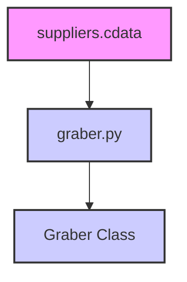

### **Анализ кода `hypotez/src/suppliers/cdata/__init__.py`**

#### **1. <алгоритм>**:

1.  **Импорт класса `Graber`**:
    *   Импортируется класс `Graber` из модуля `.graber`.
    *   Пример: `from .graber import Graber`

2.  **Использование класса `Graber`**:
    *   Предполагается, что класс `Graber` используется для выполнения каких-либо операций, связанных со сбором данных (grabbbing).

#### **2. <mermaid>**:

**Объяснение `mermaid`**:

*   `suppliers.cdata`:  Представляет модуль `cdata` в пакете `suppliers`.
*   `graber.py`:  Представляет модуль `graber.py`, содержащий класс `Graber`.
*   `Graber Class`: Класс `Graber`, который предположительно содержит логику для сбора данных.

#### **3. <объяснение>**:

**Импорты**:

*   `from .graber import Graber`: Импортирует класс `Graber` из модуля `graber.py`, находящегося в той же директории. Это позволяет использовать функциональность класса `Graber` в текущем пакете `cdata`.

**Классы**:

*   `Graber`: Класс, предназначенный для сбора данных.  Детали реализации класса находятся в файле `graber.py`.

**Функции**:

*   В данном файле функции отсутствуют, однако класс `Graber` вероятно содержит методы для выполнения операций сбора данных.

**Переменные**:

*   В данном файле переменные отсутствуют.

**Потенциальные ошибки или области для улучшения**:

*   Отсутствуют комментарии, объясняющие назначение и функциональность класса `Graber`.
*   Отсутствует информация о том, как класс `Graber` используется в других частях проекта.

**Взаимосвязи с другими частями проекта**:

*   Модуль `cdata` вероятно является частью подсистемы, отвечающей за получение данных от поставщиков.  Класс `Graber` может быть использован для взаимодействия с различными источниками данных.