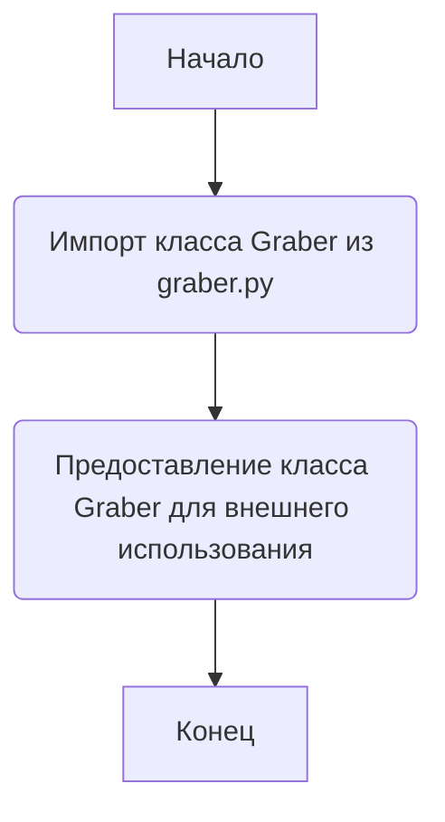
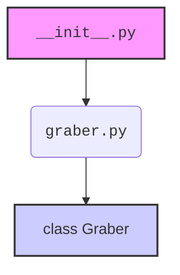

### **Анализ кода `hypotez/src/suppliers/hb/__init__.py`**

#### **1. <алгоритм>**:
Файл `__init__.py` в пакете `src.suppliers.hb` предназначен для инициализации пакета `hb`. Он импортирует класс `Graber` из модуля `graber.py`, делая его доступным для использования вне пакета `hb`. Это позволяет другим модулям импортировать `Graber` непосредственно из пакета `hb`, упрощая структуру импортов.

#### **2. <mermaid>**:

Объяснение зависимостей:
- `__init__.py` импортирует `Graber` из `graber.py`. Это означает, что для работы `__init__.py` необходим модуль `graber.py`. Класс `Graber` становится доступным для других модулей через `__init__.py`.

#### **3. <объяснение>**:

- **Импорты**:
  - `from .graber import Graber`: Импортирует класс `Graber` из модуля `graber.py`, находящегося в той же директории. Это позволяет использовать `Graber` напрямую через пакет `hb`.

- **Классы**:
  - `Graber`: Класс, предположительно, предназначен для сбора данных (вероятно, веб-скрапинга), но без предоставленного кода `graber.py` это остается предположением.

- **Функции**:
  - В явном виде функции отсутствуют. `__init__.py` выполняет роль инициализатора пакета, а не содержит исполняемый код.

- **Переменные**:
  - Отсутствуют.

Потенциальные области для улучшения:
- Добавить документацию в `__init__.py`, описывающую назначение пакета `hb` и класса `Graber`.

Связи с другими частями проекта:
- Пакет `hb` является частью структуры `src.suppliers`, что указывает на его роль в предоставлении данных из определенных источников (в данном случае, возможно, "HB" - сокращение от названия поставщика).