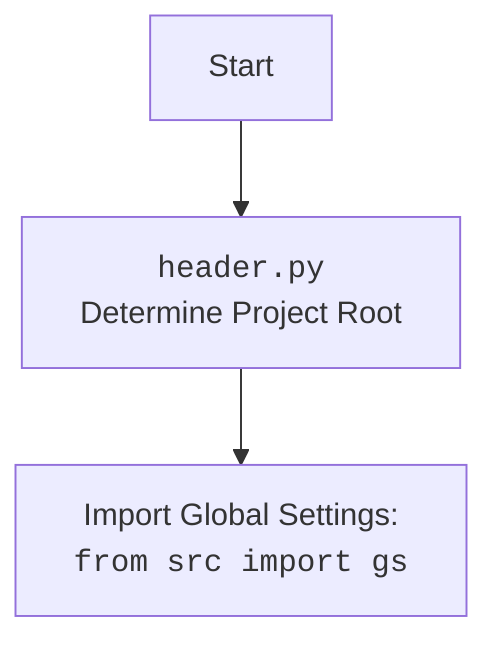

# Анализ кода `hypotez/src/suppliers/wallashop/graber.py`

## 1. Алгоритм

1.  **Инициализация**:
    *   Импортируются необходимые модули и классы (`header`, `Graber` из `src.suppliers.graber`, `Context`, `close_pop_up`, `Driver` из `src.webdriver.driver`, `logger` из `src.logger.logger`).
    *   Определяется класс `Graber`, наследующийся от `Graber` (переименованного в `Grbr`) из `src.suppliers.graber`.
    *   В конструкторе `__init__` устанавливается префикс поставщика (`supplier_prefix`) как `'wallashop'`.
    *   Вызывается конструктор родительского класса `Graber` (из `src.suppliers.graber`) с указанием префикса поставщика, драйвера и индекса языка.
    *   Инициализируется `Context.locator_for_decorator` в `None`.

2.  **Наследование и переопределение**:
    *   Класс `Graber` наследует функциональность сбора данных о товарах от родительского класса `Graber` из `src.suppliers.graber`.
    *   Он может переопределять методы родительского класса для нестандартной обработки полей товара, если это необходимо.

3.  **Декораторы (условно)**:
    *   В коде предусмотрена возможность использования декоратора `@close_pop_up` для выполнения предварительных действий перед отправкой запроса к веб-драйверу.
    *   Для активации декоратора необходимо установить значение в `Context.locator_for_decorator`.
    *   Также предусмотрена возможность переопределения декоратора, если требуется собственная логика.

**Примеры:**

*   **Инициализация**:

    ```python
    graber = Graber(driver, lang_index)
    # Создается экземпляр класса Graber с указанным драйвером и индексом языка.
    ```

*   **Наследование**:

    ```python
    class Graber(Grbr):
        # Graber наследует методы и атрибуты из Grbr (src.suppliers.graber.Graber)
        pass
    ```

*   **Переопределение**:

    ```python
    class Graber(Grbr):
        def process_price(self, element):
            # Переопределяет метод process_price из родительского класса для обработки цены нестандартным способом.
            pass
    ```

## 2. Mermaid

```mermaid
flowchart TD
    Start --> GraberClass[Graber Class <br> (wallashop.graber.py)]
    GraberClass --> Inherits[Inherits from Graber <br> (src.suppliers.graber)]
    GraberClass --> InitMethod[__init__ method]
    InitMethod --> SetPrefix["Set supplier_prefix = 'wallashop'"]
    InitMethod --> CallSuper["Call super().__init__(...)"]
    CallSuper --> GrbrInit["Graber.__init__ <br> (src.suppliers.graber)"]
    InitMethod --> SetContextLocator["Context.locator_for_decorator = None"]
    GraberClass --> close_pop_up["@close_pop_up <br> (src.suppliers.graber)"]
    close_pop_up --> ContextLocator["if Context.locator_for_decorator is not None"]
    
    style GraberClass fill:#f9f,stroke:#333,stroke-width:2px
```

### Объяснение зависимостей (`mermaid`):

*   **`GraberClass`**: Основной класс, определенный в `wallashop/graber.py`, который наследует функциональность от класса `Graber` из `src.suppliers.graber`.
*   **`Inherits from Graber (src.suppliers.graber)`**: Указывает на наследование от родительского класса, где определена основная логика граббера.
*   **`__init__ method`**: Конструктор класса, который инициализирует префикс поставщика и вызывает конструктор родительского класса.
*   **`Set supplier_prefix = 'wallashop'`**: Установка префикса поставщика для дальнейшего использования.
*   **`Call super().__init__(...)`**: Вызов конструктора родительского класса для инициализации общих параметров.
*   **`Graber.__init__ (src.suppliers.graber)`**: Конструктор родительского класса, выполняющий основную инициализацию граббера.
*   **`Context.locator_for_decorator = None`**: Инициализация переменной для управления декоратором `@close_pop_up`.
*   **`@close_pop_up (src.suppliers.graber)`**: Декоратор, который может быть использован для выполнения действий перед запросом к веб-драйверу.
*   **`if Context.locator_for_decorator is not None`**: Условие, проверяющее, установлен ли локатор для выполнения действий декоратором.



## 3. Объяснение

### Импорты:

*   `from typing import Any`: Импортируется `Any` для обозначения типа, который может быть любым.
*   `import header`: Импортируется модуль `header`, который, вероятно, содержит общие настройки или функции.
*   `from src.suppliers.graber import Graber as Grbr, Context, close_pop_up`:
    *   `Graber as Grbr`: Импортируется класс `Graber` из `src.suppliers.graber` и переименовывается в `Grbr` для краткости. Этот класс, вероятно, содержит общую логику для грабберов поставщиков.
    *   `Context`: Импортируется класс `Context`, который, вероятно, используется для хранения контекстной информации, например, для декораторов.
    *   `close_pop_up`: Импортируется декоратор `close_pop_up`, который, вероятно, используется для закрытия всплывающих окон перед выполнением каких-либо действий.
*   `from src.webdriver.driver import Driver`: Импортируется класс `Driver` из `src.webdriver.driver`, который, вероятно, является оберткой для управления веб-драйвером (например, Selenium).
*   `from src.logger.logger import logger`: Импортируется объект `logger` из `src.logger.logger` для логирования событий и ошибок.

### Классы:

*   `class Graber(Grbr)`:
    *   **Роль**: Класс `Graber` предназначен для сбора данных о товарах с сайта `wallashop.co.il`. Он наследуется от класса `Graber` (переименованного в `Grbr`) из `src.suppliers.graber`, что позволяет повторно использовать общую логику грабберов.
    *   **Атрибуты**:
        *   `supplier_prefix` (str): Префикс поставщика, устанавливается в `'wallashop'`.
    *   **Методы**:
        *   `__init__(self, driver: Driver, lang_index: int)`: Конструктор класса, который инициализирует префикс поставщика, вызывает конструктор родительского класса и инициализирует `Context.locator_for_decorator`.
    *   **Взаимодействие**:
        *   Взаимодействует с классами `Driver` (для управления веб-драйвером) и `Graber` (из `src.suppliers.graber`) через наследование.
        *   Использует `Context` для хранения контекстной информации о текущем сеансе сбора данных.

### Функции:

*   `__init__(self, driver: Driver, lang_index: int)`:
    *   **Аргументы**:
        *   `driver` (Driver): Экземпляр класса `Driver` для управления веб-драйвером.
        *   `lang_index` (int): Индекс языка, используемый для локализации.
    *   **Возвращаемое значение**: `None`
    *   **Назначение**: Инициализирует экземпляр класса `Graber`, устанавливая префикс поставщика, вызывая конструктор родительского класса и инициализируя `Context.locator_for_decorator`.

### Переменные:

*   `supplier_prefix` (str): Префикс поставщика, используется для идентификации поставщика при сборе данных.
*   `Context.locator_for_decorator` (Any): Переменная, используемая для передачи локатора декоратору `@close_pop_up`.

### Потенциальные ошибки и области для улучшения:

*   **Обработка исключений**: В коде не предусмотрена обработка исключений. Следует добавить блоки `try...except` для обработки возможных ошибок, таких как ошибки сети, ошибки парсинга HTML и т.д.
*   **Логирование**: В коде не используется логирование. Следует добавить логирование для отслеживания процесса сбора данных, записи ошибок и предупреждений.
*   **Конфигурация**: Параметры, такие как префикс поставщика, следует вынести в конфигурационный файл, чтобы их можно было легко изменять без изменения кода.
*   **Декораторы**: Использование декораторов выглядит недоработанным.  Необходимо или полностью реализовать механизм декораторов, или удалить неиспользуемый код.
*   **Context**:  Использование `Context` выглядит глобальной переменной. Рассмотрение альтернативных способов передачи контекста, таких как передача контекста через аргументы функций, может повысить читаемость и поддерживаемость кода.

### Цепочка взаимосвязей:

1.  `wallashop/graber.py` наследуется от `src/suppliers/graber.py`, расширяя его функциональность для конкретного поставщика (`wallashop`).
2.  `wallashop/graber.py` использует `src/webdriver/driver.py` для управления веб-драйвером и взаимодействия с веб-страницами.
3.  `wallashop/graber.py` использует `src/logger/logger.py` для логирования событий и ошибок.
4.  `wallashop/graber.py` может использовать декоратор `@close_pop_up` из `src/suppliers/graber.py` для выполнения действий перед отправкой запроса к веб-драйверу.

```python
#example for error logging
try:
    result = 10 / 0  # This will cause a ZeroDivisionError
except ZeroDivisionError as e:
    logger.error('Division by zero occurred', exc_info=True)